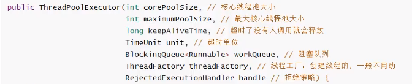
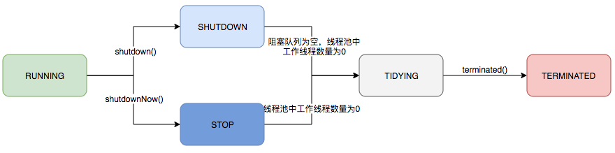
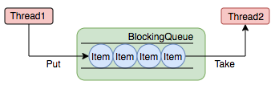
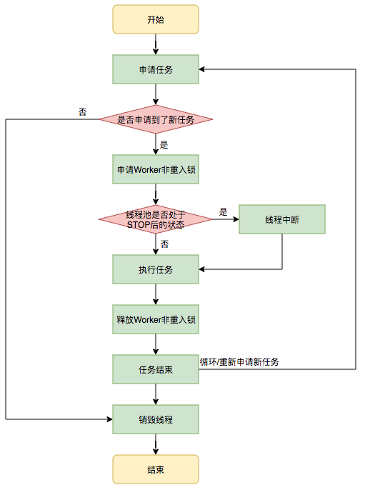

# 1. 什么是JUC

java.util.concurrent工具包

# 2. 线程和进程

进程: 一个程序, QQ.exe Music.exe 程序的集合;
一个进程往往可以包含多个线程, 至少包含一个!
Java默认有几个线程?  2个：mian、GC

## 并发和并行

并发编程: 并发、并行

**并发(多线程操作向-个资源)**

- CPU一核,模拟出来多条线程,天下武功,唯快不破,快速交替

**并行(多个人一起行走)**

- CPU多核,多个线程可以同时执行;

并发编程的本质: 充分利用CPU的资源

## 线程的状态

```java
public enum State {
    /**
     * 新生
     */
    NEW,

    /**
     * 运行态
     */
    RUNNABLE,

    /**
     * 阻塞
     */
    BLOCKED,

    /**
     * 等待，死等
     */
    WAITING,

    /**
     * 超时等待
     */
    TIMED_WAITING,

    /**
     * 终止
     */
    TERMINATED;
}
```

## wait/sleep区别

1. **来自不同的类**

wait -> Object

sleep -> Thread

2. **关于锁的释放**

wait会释放锁, sleep睡觉了,抱着锁睡觉,不会释放!

3. **使用的范围不同**

wait 必须在同步代码块中使用，sleep可以在任意地方使用

4. **是否需要捕获异常**

wait不需要捕获异常，sleep需要

# 3. Lock

## synchronized

本质：队列，锁

## Lock


公平锁：先来后到。

非公平锁：可以插队（默认）

```java
// Lock三部曲
// 1、new ReentrantLock();
// 2、lock.Lock(); //加锁
// 3、finally=> lock. unlock(); //解锁
class Ticket2 {
    //属性、方法
    private int number = 30;
    Lock lock = new ReentrantLock();
    public void sale() {
        lock.lock(); //加锁
        try {
            //业务代码
        } catch (Exception e) {
            e.printStackTrace();
        } finally {
            lock.unlock(); //解锁 
        }
    }
}
```

## lock 和 synchronized区别

1、Synchronized 内置的Java关键字 ，Lock 是一个ava类

2、Synchronized 无法判断获取锁的状态, Lock可以判断是否获取到了锁

3、Synchronized 会自动释放锁, lock必须要手动释放锁!如果不释放锁,死锁

4、Synchronized 线程1 (获得锁,阻塞)、线程2 (等待,傻傻的等) ; Lock锁就不一定会等待下去;

5、Synchronized 可重入锁 ,不可以中断的,非公平; Lock , 可重入锁,可以判断锁,非公平(可以自己设置) ;

6、Synchronized 适合锁少量的代码同步问题, Lock适合锁大量的同步代码!

## 锁是什么，如何判断锁

**synchronized 锁的对象是方法的调用者!**

如果两个方法带有synchronized 关键字修饰的**成员方法**由同一个对象调用，则这两个方法用的是同一个锁，谁先拿到谁执行!

如果是**静态方法**，synchronized 锁的是该类加载后生产的Class对象

生产者消费者模式


问题在于if只会判断一次。而判断过后就wait了, 它醒了之后也不会再判断了.


```java
package com.heaven;

import javax.swing.plaf.synth.SynthOptionPaneUI;
import java.util.concurrent.locks.Condition;
import java.util.concurrent.locks.Lock;
import java.util.concurrent.locks.ReentrantLock;

//JUC版本的生产者消费者模式
public class B {
    public static void main(String[] args) {
        final Data data = new Data();

        new Thread(()->{
            for (int i=0;i<10;i++) {
                try {
                    data.increment();
                } catch (Exception e) {
                    e.printStackTrace();
                }
            }
        },"A").start();
        new Thread(()->{
            for (int i=0;i<10;i++) {
                try {
                    data.decrement();
                } catch (Exception e) {
                    e.printStackTrace();
                }
            }
        },"B").start();
        new Thread(()->{
            for (int i=0;i<10;i++) {
                try {
                    data.increment();
                } catch (Exception e) {
                    e.printStackTrace();
                }
            }
        },"C").start();
        new Thread(()->{
            for (int i=0;i<10;i++) {
                try {
                    data.decrement();
                } catch (Exception e) {
                    e.printStackTrace();
                }
            }
        },"D").start();
    }
}
class Data{
    private int num = 0;
    private Lock lock = new ReentrantLock();
    private Condition condition=lock.newCondition();


    public void increment() throws InterruptedException {
        lock.lock();
        try {
            while(num!=0){
                //等待
                condition.await();
            }
            num++;
            System.out.println(Thread.currentThread().getName()+"=>"+num);
            //唤醒
            condition.signalAll();
        }catch (Exception e){
            e.printStackTrace();
        }finally {
            lock.unlock();
        }

    }
    public void decrement(){
        lock.lock();
        try {
            while (num==0){
                //等待
                condition.await();
            }
            num--;
            System.out.println(Thread.currentThread().getName()+"=>"+num);
            //唤醒
            condition.signalAll();
        }catch (Exception e){
            e.printStackTrace();
        }finally {
            lock.unlock();
        }

    }
}
```

## Condition

**精准的通知和唤醒线程**

```java
package com.heaven;

import java.util.concurrent.locks.Condition;
import java.util.concurrent.locks.Lock;
import java.util.concurrent.locks.ReentrantLock;

//A执行完调用B，B执行完调用C，C执行完调用A
public class C {
    public static void main(String[] args) {
        DataC dataC = new DataC();
        new Thread(()->{
            for (int i = 0; i < 10; i++) {
                dataC.printA();
            }
        },"A").start();
        new Thread(()->{
            for (int i = 0; i < 10; i++) {
                dataC.printB();
            }
        },"B").start();
        new Thread(()->{
            for (int i = 0; i < 10; i++) {
                dataC.printC();
            }
        },"C").start();
    }

}
class DataC{
    private Lock lock=new ReentrantLock();
    private Condition conditionA=lock.newCondition();
    private Condition conditionB=lock.newCondition();
    private Condition conditionC=lock.newCondition();

    private int num=1; //1A,2B,3C

    public void printA(){
        lock.lock();
        try {
            while(num!=1){
                //等待
                conditionA.await();
            }
            System.out.println(Thread.currentThread().getName()+"=>AAAAAAAAAAAAAAAAAA");
            num=2;
            conditionB.signal();
        }catch (Exception e){
            e.printStackTrace();
        }finally {
            lock.unlock();
        }
    }
    public void printB(){
        lock.lock();
        try {
            //业务
            while(num!=2){
                //等待
                conditionB.await();
            }
            System.out.println(Thread.currentThread().getName()+"=>BBBBBBBBBBBBBBBBBB");
            num=3;
            conditionC.signal();
        }catch (Exception e){
            e.printStackTrace();
        }finally {
            lock.unlock();
        }
    }
    public void printC(){
        lock.lock();
        try {
            while(num!=3){
                //等待
                conditionC.await();
            }
            System.out.println(Thread.currentThread().getName()+"=>CCCCCCCCCCCCCCCCCC");
            num=1;
            conditionA.signal();
        }catch (Exception e){
            e.printStackTrace();
        }finally {
            lock.unlock();
        }
    }
}
```

# 4. 集合不安全问题

解决方案：

```java
// List<String> list=new Vector<>();
// List<String> list= Collections.synchronizedList(new ArrayList<>());
List<String> list=new CopyOnWriteArrayList<>();
```

CopyOnWrite  写入时复制，COW，计算机程序设计领域的一种优化策略;

简单来说，就是平时查询的时候，都不需要加锁，随便访问，只有在更新的时候，才会从原来的数据复制一个副本出来，然后修改这个副本，最后把原数据替换成当前的副本。修改操作的同时，读操作不会被阻塞，而是继续读取旧的数据。这点要跟读写锁区分一下。

**1.优点**

对于一些读多写少的数据，写入时复制的做法就很不错，例如配置、黑名单、物流地址等变化非常少的数据，这是一种无锁的实现。可以帮我们实现程序更高的并发。

CopyOnWriteArrayList 并发安全且性能比 Vector 好。Vector 是增删改查方法都加了synchronized 来保证同步，但是每个方法执行的时候都要去获得锁，性能就会大大下降，而 CopyOnWriteArrayList 只是在增删改上加锁，但是读不加锁，在读方面的性能就好于 Vector。

**2.缺点**

数据一致性问题。这种实现只是保证数据的最终一致性，在添加到拷贝数据而还没进行替换的时候，读到的仍然是旧数据。

内存占用问题。如果对象比较大，频繁地进行替换会消耗内存，从而引发 Java 的 GC 问题，这个时候，我们应该考虑其他的容器，例如 ConcurrentHashMap。


# 5. Map不安全的问题


# 6.Callable

```java
package com.heaven;

import java.util.concurrent.*;

public class Test1 {
    public static void main(String[] args) throws ExecutionException, InterruptedException {
        // new Thread(new Runnable()).start();
        // new Thread(new FutureTask<>()).start();
        // new Thread(new FutureTask<>(Callable)).start();
        MyThread thread = new MyThread();
        FutureTask task = new FutureTask(thread);  //适配器类
        new Thread(task,"A");
        Integer o =(Integer) task.get();  //获取callable的返回结果  //会阻塞
        System.out.println(o);

    }
}
//方法返回值就是泛型的值
class MyThread implements Callable<Integer>{

    @Override
    public Integer call() throws Exception {
        System.out.println("11111");
        return 0;
    }
}
```

# 7. 常用的辅助类（必记住）

## 7.1 CountDownLatch（减法计数）


```java
package com.heaven;

import java.util.concurrent.CountDownLatch;

public class CountDownLatchDemo {
    public static void main(String[] args) throws InterruptedException {
        CountDownLatch countDownLatch = new CountDownLatch(6);//6个线程
        for (int i = 0; i < 6; i++) {
            new Thread(()->{
                System.out.println(Thread.currentThread().getName()+" Go out");
                countDownLatch.countDown();  //数量-1
            },String.valueOf(i)).start();
        }
        countDownLatch.await();  //等待计数器归零，然后再向下执行

        System.out.println("Close Door");
    }
}
```

原理：

`countDownLatch.countDown(); `  数量 -1

`countDownLatch.await();`  //等待计数器归零，然后再向下执行

## 7.2 CyclicBarrier（加法计数）


```java
package com.heaven;

import java.util.concurrent.BrokenBarrierException;
import java.util.concurrent.CyclicBarrier;

public class CyclicBarrierDemo {
    /*
    集齐龙珠召唤神龙
     */
    public static void main(String[] args){
        CyclicBarrier cyclicBarrier= new CyclicBarrier(7,()->{
            System.out.println("召唤神龙！");
        });
        for (int i = 1; i <= 7; i++) {
            final int temp=i;
            new Thread(()->{
                System.out.println(Thread.currentThread().getName()+"收集了"+temp+"颗龙珠");
                try {
                    cyclicBarrier.await();
                } catch (InterruptedException e) {
                    e.printStackTrace();
                } catch (BrokenBarrierException e) {
                    e.printStackTrace();
                }
            }).start();
        }
    }
}
```

## 7.3 Semaphore(信号量)


抢车位 6车---3个车位

```java
public class SemaphoreDemo {
    public static void main(String[] args) {
        //线程数量：停车位
        Semaphore semaphore = new Semaphore(3);

        for (int i = 1; i <= 6; i++) {
            new Thread(()->{
                //acquire() 得到
                try {
                    semaphore.acquire();
                    System.out.println(Thread.currentThread().getName()+"抢到车位");
                    TimeUnit.SECONDS.sleep(2); //停两秒
                    System.out.println(Thread.currentThread().getName()+"离开车位");
                } catch (InterruptedException e) {
                    e.printStackTrace();
                }finally {
                    semaphore.release();//release() 释放
                }

            },String.valueOf(i)).start();
        }
    }
}
```

# 8. 读写锁


```java
package com.heaven;

import java.util.HashMap;
import java.util.Map;
import java.util.concurrent.locks.Lock;
import java.util.concurrent.locks.ReadWriteLock;
import java.util.concurrent.locks.ReentrantReadWriteLock;

public class ReadWriteLockDemo {
    public static void main(String[] args) {
        Mycache mycache = new Mycache();

        for (int i = 1; i <= 5 ; i++) {
            final int tmep=i;
            new Thread(()->{
                mycache.put(tmep+"",tmep+"");
            },String.valueOf(i)).start();
        }
        for (int i = 1; i <= 5 ; i++) {
            final int tmep=i;
            new Thread(()->{
                mycache.get(tmep+"");
            },String.valueOf(i)).start();
        }
    }
}
class Mycache{
    private volatile Map<String,Object>  map = new HashMap<>();
    private ReadWriteLock lock=new ReentrantReadWriteLock();

    public void put(String key,Object value){
        lock.writeLock().lock();
        try{
            System.out.println(Thread.currentThread().getName()+"写入"+key);
            map.put(key,value);
            System.out.println(Thread.currentThread().getName()+"写入OK");
        }catch (Exception e){
            e.printStackTrace();
        }finally {
            lock.writeLock().unlock();
        }

    }
    public void get(String key){
        lock.readLock().lock();
        try {
            System.out.println(Thread.currentThread().getName()+"读取"+key);
            map.get(key);
            System.out.println(Thread.currentThread().getName()+"读取OK");
        }catch (Exception e){
            e.printStackTrace();
        }finally {
            lock.readLock().unlock();
        }
    }
}
```

# 9. 阻塞队列


阻塞队列：BlockingQueue


多线程和线程池中会使用。


**四组API ：**

| 方式     | 抛出异常  | 有返回值 | 阻塞等待           | 超时等待                    |
| -------- | --------- | -------- | ------------------ | --------------------------- |
| 添加     | add()     | offer()  | put() //一直阻塞   | offer(元素，时间，时间单位) |
| 删除     | remove()  | poll()   | take()  //一直阻塞 | poll(时间，时间单位)        |
| 返回队首 | element() | peek()   |                    |                             |

## 同步队列

SynchronousQueue 同步队列，没有容量，只有取出来了才能继续放东西

# 10. 线程池（重点）

线程池：三大方法，7大参数、4种拒绝策略

程序的运行, 本质: 占用系统的资源! 优化资源的使用! =>池化技术
线程池、连接池、内存池、对象池/.....创建和销毁十分浪费资源
**池化技术：**事先准备好一 些资源，有人要用,就来我这里拿,用完之后还给我。

**线程池的好处：**

1、降低资源的消耗：通过池化技术重复利用已创建的线程，降低线程创建和销毁造成的损耗。

2、提高响应的速度：任务到达时，无需等待线程创建即可立即执行。

3、方便管理：线程是稀缺资源，如果无限制创建，不仅会消耗系统资源，还会因为线程的不合理分布导致资源调度失衡，降低系统的稳定性。使用线程池可以进行统一的分配、调优和监控。

**线程复用、可以控制最大并发数、管理线程**

## 三大方法


底层




创建线程池

```java
package com.heaven;

import java.util.concurrent.*;

/**
 * new ThreadPoolExecutor.AbortPolicy()   //满了之后，还有人进来，不处理，抛出异常
 * new ThreadPoolExecutor.CallerRunsPolicy()  //哪里来的去哪里执行
 * new ThreadPoolExecutor.DiscardPolicy()  //不会抛出异常，丢掉任务
 * new ThreadPoolExecutor.DiscardOldestPolicy() //尝试竞争第一个，丢弃任务，不会抛出任务
 */
public class Test1 {
    public static void main(String[] args) throws ExecutionException, InterruptedException {
        ExecutorService executorService= new ThreadPoolExecutor(
                2,
                Runtime.getRuntime().availableProcessors(),
                3,
                TimeUnit.SECONDS,
                new LinkedBlockingDeque<>(3),
                Executors.defaultThreadFactory(),
                new ThreadPoolExecutor.DiscardOldestPolicy());
        try {
            //最大承载队列+最大值
            for (int i = 0; i <=10; i++) {
                executorService.execute(() -> {
                    System.out.println(Thread.currentThread().getName() + "OK");
                });
            }
        }catch (Exception e){
            e.printStackTrace();
        }finally {
            executorService.shutdown();
        }

    }
}
```

## JAVA线程池设计

### 总体设计

Java中的线程池核心实现类是ThreadPoolExecutor


（1）顶层接口Executor提供了一种思想：将任务提交和任务执行进行解耦。用户无需关注如何创建线程，如何调度线程来执行任务，用户只需提供Runnable对象，将任务的运行逻辑提交到执行器(Executor)中，由Executor框架完成线程的调配和任务的执行部分。

（2）ExecutorService接口增加了一些能力：扩充执行任务的能力，补充可以为一个或一批异步任务生成Future的方法；提供了管控线程池的方法，比如停止线程池的运行。

（3）AbstractExecutorService则是上层的抽象类，将执行任务的流程串联了起来，保证下层的实现只需关注一个执行任务的方法

（4）实现类ThreadPoolExecutor实现最复杂的运行部分，ThreadPoolExecutor将会一方面维护自身的生命周期，另一方面同时管理线程和任务，使两者良好的结合从而执行并行任务。


线程池在内部实际上构建了一个生产者消费者模型，将线程和任务两者解耦，并不直接关联，从而良好的缓冲任务，复用线程。线程池的运行主要分成两部分：**任务管理、线程管理**。**任务管理部分**充当生产者的角色，当任务提交后，线程池会判断该任务后续的流转：（1）直接申请线程执行该任务；（2）缓冲到队列中等待线程执行；（3）拒绝该任务。**线程管理部分**是消费者，它们被统一维护在线程池内，根据任务请求进行线程的分配，当线程执行完任务后则会继续获取新的任务去执行，最终当线程获取不到任务的时候，线程就会被回收。

### 生命周期管理

线程池运行的状态，并不是用户显式设置的，而是伴随着线程池的运行，由内部来维护。线程池内部使用一个变量维护两个值：运行状态(runState)和线程数量 (workerCount)，在具体实现中，线程池将运行状态(runState)、线程数量 (workerCount)两个关键参数的维护放在了一起，如下代码所示：

```java
private final AtomicInteger ctl = new AtomicInteger(ctlOf(RUNNING, 0));
```

`ctl`这个AtomicInteger类型，是对线程池的运行状态和线程池中有效线程的数量进行控制的一个字段， 它同时包含两部分的信息：线程池的运行状态 (runState) 和线程池内有效线程的数量 (workerCount)，高3位保存runState，低29位保存workerCount，两个变量之间互不干扰。用一个变量去存储两个值，可避免在做相关决策时，出现不一致的情况，不必为了维护两者的一致，而占用锁资源。通过阅读线程池源代码也可以发现，经常出现要同时判断线程池运行状态和线程数量的情况。线程池也提供了若干方法去供用户获得线程池当前的运行状态、线程个数。这里都使用的是位运算的方式，相比于基本运算，速度也会快很多。

关于内部封装的获取生命周期状态、获取线程池线程数量的计算方法如以下代码所示：

```java
private static int runStateOf(int c)     { return c & ~CAPACITY; } //计算当前运行状态
private static int workerCountOf(int c)  { return c & CAPACITY; }  //计算当前线程数量
private static int ctlOf(int rs, int wc) { return rs | wc; }   //通过状态和线程数生成ctl
```

ThreadPoolExecutor的运行状态有5种，分别为：

| 运行状态   | 状态描述                                                     |
| ---------- | ------------------------------------------------------------ |
| RUNNING    | 能接受新提交的任务，并且也能处理阻塞队列中的任务。           |
| SHUTDOWN   | 关闭状态，不再接受新提交的任务，但却可以继续处理阻塞队列中已保存的任务。不能接受新任务，也不处理 |
| STOP       | 队列中的任务，会中断正在处理任务的线程。                     |
| TIDYING    | 所有的任务都已终止了，workerCount(有效线程数)为0。           |
| TERMINATED | 在terminated()方法执行完后进入该状态。                       |



### 任务执行机制

<font color=red>**任务调度**</font>

任务调度是线程池的主要入口，当用户提交了一个任务，接下来这个任务将如何执行都是由这个阶段决定的。了解这部分就相当于了解了线程池的核心运行机制。

首先，所有任务的调度都是由execute方法完成的，这部分完成的工作是：检查现在线程池的运行状态、运行线程数、运行策略，决定接下来执行的流程，是直接申请线程执行，或是缓冲到队列中执行，亦或是直接拒绝该任务。其执行过程如下：

1. 首先检测线程池运行状态，如果不是RUNNING，则直接拒绝，线程池要保证在RUNNING的状态下执行任务。
2. 如果workerCount < corePoolSize，则创建并启动一个线程来执行新提交的任务。
3. 如果workerCount >= corePoolSize，且线程池内的阻塞队列未满，则将任务添加到该阻塞队列中。
4. 如果workerCount >= corePoolSize && workerCount < maximumPoolSize，且线程池内的阻塞队列已满，则创建并启动一个线程来执行新提交的任务。
5. 如果workerCount >= maximumPoolSize，并且线程池内的阻塞队列已满, 则根据拒绝策略来处理该任务, 默认的处理方式是直接抛异常。


<font color=red>**任务缓冲**</font>

任务缓冲模块是线程池能够管理任务的核心部分。线程池的本质是对任务和线程的管理，而做到这一点最关键的思想就是将任务和线程两者解耦，不让两者直接关联，才可以做后续的分配工作。线程池中是以生产者消费者模式，通过一个阻塞队列来实现的。阻塞队列缓存任务，工作线程从阻塞队列中获取任务。

阻塞队列(BlockingQueue)是一个支持两个附加操作的队列。这两个附加的操作是：在队列为空时，获取元素的线程会等待队列变为非空。当队列满时，存储元素的线程会等待队列可用。阻塞队列常用于生产者和消费者的场景，生产者是往队列里添加元素的线程，消费者是从队列里拿元素的线程。阻塞队列就是生产者存放元素的容器，而消费者也只从容器里拿元素。



使用不同的队列可以实现不一样的任务存取策略。在这里，我们可以再介绍下阻塞队列的成员：

| 名称                  | 描述                                                         |
| --------------------- | ------------------------------------------------------------ |
| ArrayBlockingQueue    | 用数组实现的有界阻塞队列，遵循先进先出原则，支持公平锁和非公平锁 |
| LinkedBlockingQueue   | 用链表实现的有界阻塞队列，遵循先进先出原则，默认长度为Integer最大值，支持公平锁和非公平锁 |
| PriorityBlockingQueue | 一个支持线程优先级排序的无界队列，默认自然序进行排序，也可以自定义实现compareTo()方法来指定元素排序规则，不能保证同优先级元素的顺序。 |
| DelayBlockingQueue    | 一个实现PriorityBlockingQueue实现延迟获取的无界队列，在创建元素时，可以指定多久才能从队列中获取当前元素。只有延时期满后才能从队列中获取元素。 |
| SynchronousQueue      | 一个不存储元素的阻塞队列，每一个put操作必须等待take操作，否则不能添加元素。支持公平锁和非公平锁。SynchronousQueue的一个使用场景是在线程池里。Executors.newCachedThreadPool()就使用了SynchronousQueue，这个线程池根据需要（新任务到来时）创建新的线程，如果有空闲线程则会重复使用，线程空闲了6O秒后会被回收。 |
| LinkedTransferQueue   | 一个由链表结构组成的无界阻塞队列，相当于其它队列,LinkedTransferQueue队列多了transfer和tryTransfer方法。 |
| LinkedBlockingDeque   | 一个由链表结构组成的双向阻塞队列。队列头部和尾部都可以添加和移除元素，多线程并发时，可以将锁的竞争最多降到一半。 |

<font color=red>**任务申请**</font>

由上文的任务分配部分可知，任务的执行有两种可能：一种是任务直接由新创建的线程执行。另一种是线程从任务队列中获取任务然后执行，执行完任务的空闲线程会再次去从队列中申请任务再去执行。第一种情况仅出现在线程初始创建的时候，第二种是线程获取任务绝大多数的情况。

线程需要从任务缓存模块中不断地取任务执行，帮助线程从阻塞队列中获取任务，实现线程管理模块和任务管理模块之间的通信。这部分策略由getTask方法实现，其执行流程如下图所示：

getTask这部分进行了多次判断，为的是控制线程的数量，使其符合线程池的状态。如果线程池现在不应该持有那么多线程，则会返回null值。工作线程Worker会不断接收新任务去执行，而当工作线程Worker接收不到任务的时候，就会开始被回收

<font color=red>**任务拒绝**</font>

任务拒绝模块是线程池的保护部分，线程池有一个最大的容量，当线程池的任务缓存队列已满，并且线程池中的线程数目达到maximumPoolSize时，就需要拒绝掉该任务，采取任务拒绝策略，保护线程池。

拒绝策略是一个接口，其设计如下：

```java
public interface RejectedExecutionHandler {
    void rejectedExecution(Runnable r, ThreadPoolExecutor executor);
}
```

用户可以通过实现这个接口去定制拒绝策略，也可以选择JDK提供的四种已有拒绝策略，其特点如下：

| 名称                                  | 描述                                                         |
| ------------------------------------- | ------------------------------------------------------------ |
| TreadPoolExecutor.AbortPolicy         | 丢弃任务并抛出RejectedExecutionException异常。这是**线程池默认的拒绝策略**，在任务不能再提交的时候，抛出异常，及时反馈程序运行状态。如果是比较关键的业务，推荐使用此拒绝策略，这样子在系统不能承载更大的并发量的时候，能够及时的通过异常发现。 |
| TreadPoolExecutor.DiscardPolicy       | 丢弃任务，但是不抛出异常。使用此策略，可能会使我们无法发现系统的异常状态。建议是一些无关紧要的业务采用此策略。 |
| TreadPoolExecutor.DiscardOldestPolicy | 丢弃队列最前面的任务，然后重新提交被拒绝的任务。是否要采用此种拒绝策略，还得根据实际业务是否允许丢弃老任务来认真衡量。 |
| TreadPoolExecutor.CallerRunsPolicy    | 由调用线程（提交任务的线程）处理该任务。这种情况是需要让所有任务都执行完毕,那么就适合大量计算的任务类型去执行，多线程仅仅是增大吞吐量的手段，最终必须要让每个任务都执行完毕。 |

### Worker线程管理

<font color=red>**Worker线程**</font>

线程池为了掌握线程的状态并维护线程的生命周期，设计了线程池内的工作线程Worker。我们来看一下它的部分代码：

```java
private final class Worker extends AbstractQueuedSynchronizer implements Runnable{
    final Thread thread; //Worker持有的线程
    Runnable firstTask;  //初始化的任务，可以为null
}
```

Worker这个工作线程，实现了Runnable接口，并持有一个线程thread，一个初始化的任务firstTask。thread是在调用构造方法时通过ThreadFactory来创建的线程，可以用来执行任务；firstTask用它来保存传入的第一个任务，这个任务可以有也可以为null。如果这个值是非空的，那么线程就会在启动初期立即执行这个任务，也就对应核心线程创建时的情况；如果这个值是null，那么就需要创建一个线程去执行任务列表（workQueue）中的任务，也就是非核心线程的创建。


线程池需要管理线程的生命周期，需要在线程长时间不运行的时候进行回收。**线程池使用一张Hash表去持有线程的引用**，这样可以通过添加引用、移除引用这样的操作来控制线程的生命周期。这个时候重要的就是如何判断线程是否在运行。

Worker是通过继承AQS，使用AQS来实现独占锁这个功能。没有使用可重入锁ReentrantLock，而是使用AQS，为的就是实现不可重入的特性去反应线程现在的执行状态。

1. lock方法一旦获取了独占锁，表示当前线程正在执行任务中。 
2. 如果正在执行任务，则不应该中断线程。
3. 如果该线程现在不是独占锁的状态，也就是空闲的状态，说明它没有在处理任务，这时可以对该线程进行中断。
4. 线程池在执行shutdown方法或tryTerminate方法时会调用interruptIdleWorkers方法来中断空闲的线程，interruptIdleWorkers方法会使用tryLock方法来判断线程池中的线程是否是空闲状态；如果线程是空闲状态则可以安全回收。

在线程回收过程中就使用到了这种特性，回收过程如下图所示：


<font color=red>**Worker线程增加**</font>

增加线程是通过线程池中的addWorker方法，该方法的功能就是增加一个线程，该方法不考虑线程池是在哪个阶段增加的该线程，这个分配线程的策略是在上个步骤完成的，该步骤仅仅完成增加线程，并使它运行，最后返回是否成功这个结果。addWorker方法有两个参数：firstTask、core。firstTask参数用于指定新增的线程执行的第一个任务，该参数可以为空；core参数为true表示在新增线程时会判断当前活动线程数是否少于corePoolSize，false表示新增线程前需要判断当前活动线程数是否少于maximumPoolSize，其执行流程如下图所示：


<font color=red>**Worker线程回收**</font>

线程池中线程的销毁依赖JVM自动的回收，线程池做的工作是根据当前线程池的状态维护一定数量的线程引用，防止这部分线程被JVM回收，当线程池决定哪些线程需要回收时，只需要将其引用消除即可。Worker被创建出来后，就会不断地进行轮询，然后获取任务去执行，**核心线程可以无限等待获取任务，非核心线程要限时获取任务**。当Worker无法获取到任务，也就是获取的任务为空时，循环会结束，Worker会主动消除自身在线程池内的引用。

```java
try {
  while (task != null || (task = getTask()) != null) {
    //执行任务
  }
} finally {
  processWorkerExit(w, completedAbruptly);//获取不到任务时，主动回收自己
}
```

线程回收的工作是在processWorkerExit方法完成的。


事实上，在这个方法中，将线程引用移出线程池就已经结束了线程销毁的部分。但由于引起线程销毁的可能性有很多，线程池还要判断是什么引发了这次销毁，是否要改变线程池的现阶段状态，是否要根据新状态，重新分配线程。

<font color=red>**Worker线程执行任务**</font>

在Worker类中的run方法调用了runWorker方法来执行任务，runWorker方法的执行过程如下：

1. while循环不断地通过getTask()方法获取任务。 
2. getTask()方法从阻塞队列中取任务。 
3. 如果线程池正在停止，那么要保证当前线程是中断状态，否则要保证当前线程不是中断状态。 
4. 执行任务。 
5. 如果getTask结果为null则跳出循环，执行processWorkerExit()方法，销毁线程。



## 最大的线程数量应该怎么定义

### CPU 密集型

CPU是几核的就定义为几，可以保持CPU的最高效率。

`Runtime.getRuntime().availableProcessors()`获取CPU的核数

### IO密集型

判断程序中有多少十分消耗IO资源的线程，要求大于这个IO线程的数量]b

# 11. 四大函数式接口（必须）

新时代程序员：lambda表达式、链式编程、函数式接口、Stream流式计算

函数式接口：只有一个方法的接口

```java
@FunctionalInterface
public interface Runnable {

    public abstract void run();
}
//超级多FunctionalInterface
//简化编程模型，在新版本的框架底层大量应用!

```


> Function：函数型接口


> Predicate: 断定型接口


> Consumer：消费型接口


> supplier: 供给型接口


# 12 Stream流式计算

> 什么是流式计算

大数据：存储+计算

集合、MySql本质就是存东西。

计算都应该交给流来操作


# 13 ForkJoin

分支合并，Forkjoin在JDK 1.7. 并行执行任务!提高效率。大数据量!


特点：工作窃取

工作窃取: 执行更快的子任务可以去拿执行得慢的子任务去执行，因为维护的都是双端队列


# 异步回调

Future设计的初衷: 对将来的某个事件的结果进行建模

```java
package com.heaven;

import java.util.concurrent.CompletableFuture;
import java.util.concurrent.ExecutionException;
import java.util.concurrent.TimeUnit;

/**
 * 异步调用：Ajax,CompletableFuture
 * 异步执行
 * 成功回调
 * 失败回调
 */
public class AsynDemo {
    public static void main(String[] args) throws ExecutionException, InterruptedException {
        // 没有返回的 runAsync 回调
        // CompletableFuture<Void> completableFuture = CompletableFuture.runAsync(()->{
        //     try {
        //         TimeUnit.SECONDS.sleep(2);
        //     } catch (InterruptedException e) {
        //         e.printStackTrace();
        //     }
        //     System.out.println(Thread.currentThread().getName()+"runAsync=>Void");
        // });
        // System.out.println("1111111111111111");
        // System.out.println(completableFuture.get());

        //有返回值的
        //ajax 成功和失败的回调
        CompletableFuture<Integer> completableFuture = CompletableFuture.supplyAsync(()->{
            System.out.println(Thread.currentThread().getName()+"supplyAsync=>Integer");
            int i=1/0;
            return 1024;
        });
        System.out.println(completableFuture.whenComplete((t, u) -> {
            System.out.println("t=>" + t);  //返回结果
            System.out.println("u=>" + u);  //错误信息 java.util.concurrent.CompletionException: java.lang.ArithmeticException: / by zero
        }).exceptionally((e) -> {
            System.out.println(e.getMessage());
            return 233;  //可以获取到错误的返回结果
        }).get());
    }
}

```

# JMM

**JMM**：用于屏蔽掉各种硬件和操作系统的内存访问差异，以实现让Java程序在各种平台下都能达到一致的并发效果，**JMM规范了Java虚拟机与计算机内存是如何协同工作的**：规定了一个线程如何和何时可以看到由其他线程修改过后的共享变量的值，以及在必须时如何同步的访问共享变量。

**JMM中规定**所有的变量都存储在主内存（Main Memory）中，每条线程都有自己的工作内存（Work Memory），线程的工作内存中保存了该线程所使用的变量的从主内存中拷贝的副本。线程对于变量的读、写都必须在工作内存中进行，而不能直接读、写主内存中的变量。同时，本线程的工作内存的变量也无法被其他线程直接访问，必须通过主内存完成。

JMM详解：**https://zhuanlan.zhihu.com/p/29881777**

总线嗅探机制：线程和主存之间有一条总线。加入关键字后开启协议，监听线程a中的共享变量（MESI协议是一个基于失效的缓存一致性协议）

**关于JMM的一些同步的约定:**

1、线程解锁前,必须把共享变量**立刻刷回主存**。

2、线程加锁前,必须读取主存中的最新值到工作内存中!

3、加锁和解锁是同一把锁

**8种操作**：


**read（读取）**：作用于主内存变量，把一个变量值从主内存传输到线程的工作内存中，以便随后的load动作使用

**load（载入）**：作用于工作内存的变量，它把read操作从主内存中得到的变量值放入工作内存的变量副本中。

**use（使用）**：作用于工作内存的变量，把工作内存中的一个变量值传递给执行引擎，每当虚拟机遇到一个需要使用变量的值的字节码指令时将会执行这个操作。

**assign（赋值）**：作用于工作内存的变量，它把一个从执行引擎接收到的值赋值给工作内存的变量，每当虚拟机遇到一个给变量赋值的字节码指令时执行这个操作。

**store（存储）**：作用于工作内存的变量，把工作内存中的一个变量的值传送到主内存中，以便随后的write的操作。

**write（写入）**：作用于主内存的变量，它把store操作从工作内存中一个变量的值传送到主内存的变量中。

**lock（锁定）**：作用于主内存的变量，把一个变量标识为一条线程独占状态。

**unlock（解锁）**：作用于主内存变量，把一个处于锁定状态的变量释放出来，释放后的变量才可以被其他线程锁定。

# volatile

volatile是Java虚拟机提供轻量级的同步机制

- 当对volatile变量执行写操作后，JMM会把工作内存中的最新变量值强制刷新到主内存
- 写操作会导致其他线程中的缓存无效、

这样，其他线程使用缓存时，发现本地工作内存中此变量无效，便从主内存中获取，这样获取到的变量便是最新的值，实现了线程的可见性。

1、保证可见性 (JMM)

**2、不保证原子性**（使用原子类 AtomicInteger）

3、禁止指令重排

-----------------------------------------------------------

**禁止指令重排**：计算机并不是按源代码的顺序执行，因为存在编译器优化，指令并行重排，内存系统重排。前提是符合数据之间的依赖性。

`volatile`是通过编译器在生成字节码时，在指令序列中添加“**内存屏障**”来禁止指令重排序的。

**硬件层面的内存屏障。**

- **sfence**：即写屏障(Store Barrier)，在写指令之后插入写屏障，能让写入缓存的最新数据写回到主内存，以保证写入的数据立刻对其他线程可见
- **lfence**：即读屏障(Load Barrier)，在读指令前插入读屏障，可以让高速缓存中的数据失效，重新从主内存加载数据，以保证读取的是最新的数据。
- **mfence**：即全能屏障(modify/mix Barrier )，兼具sfence和lfence的功能
- **lock 前缀**：lock不是内存屏障，而是一种锁。执行时会锁住内存子系统来确保执行顺序，甚至跨多个CPU。

JMM层面的“**内存屏障**”：

- **LoadLoad屏障**： 对于这样的语句Load1; LoadLoad; Load2，在Load2及后续读取操作要读取的数据被访问前，保证Load1要读取的数据被读取完毕。
- **StoreStore屏障**：对于这样的语句Store1; StoreStore; Store2，在Store2及后续写入操作执行前，保证Store1的写入操作对其它处理器可见。
- **LoadStore屏障**：对于这样的语句Load1; LoadStore; Store2，在Store2及后续写入操作被刷出前，保证Load1要读取的数据被读取完毕。
- **StoreLoad屏障**： 对于这样的语句Store1; StoreLoad; Load2，在Load2及后续所有读取操作执行前，保证Store1的写入对所有处理器可见。


# CAS(Compare and Swap)


CAS :比较当前工作内存中的值（期望值）和主内存中的值,如果这个值是期望的,那么则执行操作!如果不是就一 直循环!

ABA问题：


**原子引用`AtomicReference`（解决ABA）：**带版本号的原子操作


# 各种锁

## 公平锁、非公平锁

公平锁: 非常公平，不能够插队,必须先来后到!

非公平锁: 非常不公平, 可以插队(默认都是非公平)

## 可重入锁

递归锁

## 自旋锁（spinlock）


