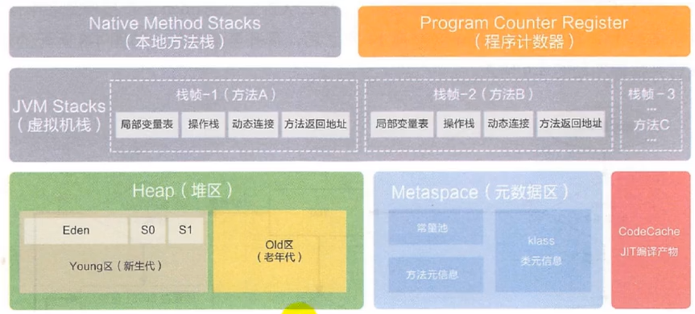
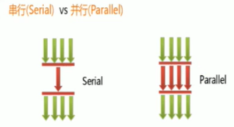

# 1. JVM 与Java体系结构

## 1.1 JVM整体结构


  **Java代码执行过程: **


**执行引擎**：由 **解释器** 模块和 **JIT编译器*** 组成，**JIT编译器**（Just-In-Time Compiler）将一些热点代码（经常用于执行的代码）编译为机器语言，并存在**方法区**，从而提升执行速度。

--------

**指令集架构**

Java编译器输入的指令流基本上是一种基于**栈的指令集架构**，另外一种指令集架构则是基于**寄存器的指令集架构**。

具体来说: 这两种架构之间的区别：

- <font color=red>**基于栈式架构的特点**</font>
	- 设计和实现更简单，适用于资源受限的系统;
	- 避开了寄存器的分配难题: 使用零地址指令方式分配。
	- 指令流中的指令大部分是零地址指令，其执行过程依赖于操作栈。指令集更小，
		编译器容易实现。
	- 不需要硬件支持，可移植性更好，更好实现跨平台

- <font color=red>**基于寄存器架构的特点**</font>
	- 典型的应用是x86的二进制指令集:比如传统的PC以及Android的Davlik虚拟机。
	- 指令集架构则完全依赖硬件，可移植性差性能优秀和执行更高效;
	- 花费更少的指令去完成一项操作。
	- 在大部分情况下，基于寄存器架构的指令集往往都以一地址指令、二地址指令和三地址指令为主，而基于栈式架构的指令集却是以零地址指令为主。

## 1.2 JVM生命周期

**虚拟机的启动**
Java虚拟机的启动是通过**引导类加载器**(bootstrap class loader)创建一个初始类(initial class)来完成的，这个类是由虚拟机的具体实现指定的。

**虚拟机的执行**

- 一个运行中的Java虚拟机有着一个清晰的任务:执行Java程序。
- 程序开始执行时他才运行，程序结束时他就停止。
- 执行一个所谓的Java程序的时候，真真正正在执行的是一个叫做Java虚拟
	机的进程。

**虚拟机的退出**

有如下的几种情况:·

- 程序正常执行结束
- 程序在执行过程中遇到了异常或错误而异常终止
- 由于操作系统出现错误而导致Java虚拟机进程终止
- 某线程调用Runtime类或system类的exit方法，或 Runtime类的halt方法，并且Java安全管理器也允许这次exit或halt操作。
- 除此之外，JNI ( Java Native Interface)规范描述了用JNI Invocation API来加载或卸载Java虚拟机时，Java虚拟机的退出情况。

## 1.3 JVM发展史

1. SUN VM : 没有JIT编译器

2. Exact VM: 

3. **oracle的HotSpot VM**: 

	当前使用的虚拟机 称霸武林

	市场定位，服务器端、桌面应用、嵌入式等多用途VM

	名称中的HotSpot指的就是它的**热点代码探测技术**。

	- 通过计数器找到最具编译价值代码，触发即时编译或栈上替换
	- 通过**编译器**与**解释器**协同工作，在最优化的程序响应时间与最佳执行性能中取得平衡

4. **BEA的 JRockit**

	专注于服务器端，**不包含解释器的实现**，全部代码都靠即时编译其编译后执行。当前最快的虚拟机，没有之一

5. **IBM的J9**

	全称: IBM Technology for Java virtual Machine，简称IT4J，内部代号:J9

	市场定位与HotSpot接近，服务器端、桌面应用、嵌入式等多用途VM

6. KVM和CDC/CLDC Hotspot

	Oracle在Java ME产品线上的两款虚拟机为: CDC/CLDC Hotspot Implementation VM

7. Azul VM

	这里Azul VM和BEA Liquid VM是与特定硬件平台绑定、软硬件配合的专有虚拟机

8. Liquid VM

9. Apache Harmony

10. Microsoft JVM

11. Taobao JVM
	- 由AliJVM团队发布。阿里，国内使用Java最强大的公司，覆盖云计算、金融、物流、电商等众多领域，需要解决高并发、高可用、分布式的复合问题。有大量的开源产品。
	- **基于openJDK开发了自己的定制版本AlibabaJDK，简称AJDK**。是整个阿里Java体系的基石。
	- 基于openJDK Hotspot VM发布的国内第一个优化、**深度定制且开源的高性能服务器版Java虚拟机**。
		- 创新的GCIH (GC invisible heap ）技术实现了off-heap ，**即将生命周期较长的Java对象从heap中移到heap之外，并且GC不能管理GCIH内部的Java对象，以此达到降低GC的回收频率和提升GC 的回收效率的目的**。
		- GCIH中的**对象还能够在多个Java虚拟机进程中实现共享**
		- 使用crc32指令实现JVM intrinsic降低JNI的调用开销
		- PMU hardware 的Java profiling tool 和诊断协助功能
		- 针对大数据场景的ZenGC
	- taobao vm应用在阿里产品上性能高，硬件严重依赖intel的cpu，损失了兼容性，但提高了性能
		- 目前已经在淘宝、天猫上线，把oracle 官方JVM版本全部替换了。

12. Graal VM

	- 2018年4月，oracle Labs公开了Graal VM，号称"Run Programs Faster Anywhere"，勃勃野心。

	- Graal VM在HotSpot VM基础上增强而成的**跨语言全栈虚拟机，可以作为“任何语言”的运行平台使用**。语言包括:Java、scala、Groovy、Kotlin; c、C+＋、Javascript、Ruby、Python、R等

	- **如果说HotSpot有一天真的被取代，Graal VM希望最大**。

# 2. 类加载器子系统


## 2.1 类加载器子系统作用

- 类加载器子系统负责从文件系统或者网络中加载class文件，**class文件在文件开头(CA FA BA BE)有特定的文件标识**。
- ClassLoader只负责class文件的加载，至于它是否可以运行，则由ExecutionEngine决定。
- 加载的类信息存放于一块称为**方法区的内存空间**。除了类的信息外，**方法区中还会存放运行时常量池信息**，可能还包括**字符串字面量和数字常量**（这部分常量信息是Class文件中常量池部分的内存映射）


## 2.2 类加载过程(重点)

https://blog.csdn.net/zuodaoyong/article/details/113781840

> 加载

1．通过一个类的全限定名获取定义此类的二进制字节流
2．将这个字节流所代表的静态存储结构转化为方法区的运行时数据结构（java类模型）
3．**在内存中生成一个代表这个类的java.lang.Class对象**，作为方法区这个类的各种数据的访问入口

​	(1) 类模型存储在方法区

​	(2) class文件加载到元空间后，会在堆中创建一个Class对象，用来封装类位于方法区内的数据结构。每一个类都对应一个Class对象

​	(3) 数组加载：如果数组的元素类型是引用类型，那么遵循定义的加载过程递归加载和创建数组A的元素类型，jvm使用指定的元素类型和数组维度类创建新的数组类。


> 链接

1. 验证（Verify）

  - 目的在于确保class文件的字节流中包含信息符合当前虚拟机要求，保证被加载类的正确性，不会危害虚拟机自身安全。
  - 主要包括四种验证，文件格式验证，元数据验证，字节码验证，符号引用验证。

  

2. 准备（Prepare）

	- <font color=red>**为类变量(用static修饰的静态变量)分配内存并且设置该类变量的默认初始值，即零值。**</font>

	- **这里不包含用final修饰的static，因为final在编译的时候就会分配了，准备阶段会显式初始化;**

	- **这里不会为实例变量分配初始化**，<font color=red>**类变量会分配在方法区中，而实例变量是会随着对象一起分配到Java堆中。**</font>

3. 解析（Resolve）
	- <font color=red>**将常量池内的符号引用转换为直接引用的过程**。</font>为每一个类都准备一张方法表，将其所有的方法列在其中，当需要调用一个类的方法时，只要知道这个方法在方法表的偏移量（通过解析操作，符号引用转换为直接引用类中的方法表中的位置）
	- 事实上，**解析操作往往会伴随着JVM在执行完初始化之后再执行。**
	- **符号引用就是一组符号来描述所引用的目标。直接引用就是直接指向目标的指针、相对偏移量或一个间接定位到目标的句柄**。
	- 解析动作主要针对类或接口、字段、类方法、接口方法、方法类型等。对应常量池中的CONSTANT_class_info、CONSTANT_Fieldref_info、CONSTANT_Methodref_info等

> 初始化

- 初始化阶段就是执行**类构造器方法<clinit>()**的过程。<font color=red>**(就是执行哪些被static字段修饰了的字段赋值操作，和静态代码块的操作)**</font>
- 此方法不需定义，是javac编译器自动收集类中的所有**类变量**的赋值动作和**静态代码块**中的语句合并而来。
- 构造器方法中指令按语句在源文件中出现的顺序执行。
- <clinit>()不同于类的构造器。(关联: 构造器是虚拟机视角下的<init>() )
- **该类具有父类，JVM会保证子类的<clinit>()执行前，父类的<clinit> ()己经执行完毕。**
- 虚拟机必须保证一个类的<clinit> ()方法在多线程下被同步加锁。

## 2.3 类加载器的分类

- JVM支持两种类型的类加载器，分别为<font color=red>**引导类加载器（Bootstrap ClassLoader）**</font>和<font color=red>**自定义类加载器(User-Defined classLoader)**</font>。
- 将所有派生于抽象类ClassLoader的类加载器都划分为**自定义类加载器**。
- 无论类加载器的类型如何划分，在程序中我们最常见的类加载器始终只有3个，如下所示:
	

Bootstrap Class Loader是由非Java语言编写的，其他的统一继承自**ClassLoader抽象类**。

```java
package com.heaven.cl;

public class ClassLoaderDemoTest {
    public static void main(String[] args) {

        //获取系统类加载器
        ClassLoader systemClassLoader = ClassLoader.getSystemClassLoader();
        System.out.println(systemClassLoader); //sun.misc.Launcher$AppClassLoader@18b4aac2

        //获取其上层：扩展类加载器
        ClassLoader extClassLoader = systemClassLoader.getParent();
        System.out.println(extClassLoader);  //sun.misc.Launcher$ExtClassLoader@12a3a380

        ClassLoader bootstrapClassLoader = extClassLoader.getParent();
        System.out.println(bootstrapClassLoader); //null

        //对于用户自定义类来说，使用系统类加载器进行加载
        ClassLoader classLoader = ClassLoaderDemoTest.class.getClassLoader();
        System.out.println(classLoader);//sun.misc.Launcher$AppClassLoader@18b4aac2
        
        //String类使用引导类加载器加载，Java的核心类库都是使用引导类加载器
        ClassLoader classLoader1 = String.class.getClassLoader();
        System.out.println(classLoader);//null

    }
}

```

-----------------------

<font color=red>**常见的ClassLoader**</font>

> 启动类加载器（虚拟机自带）

- 这个类加载使用C/C++语言实现的，嵌套在JVM内部。
- 它用来加载Java的核心库（JAVA_HOME/jre/lib/rt.jar、resources.jar或sun.boot.class.path路径下的内容），用于提供JVM自身需要的类
- 并不继承自java.lang.ClassLoader，没有父加载器。
- 加载扩展类和应用程序类加载器，并指定为他们的父类加载器。
- 出于安全考虑，Bootstrap启动类加载器只加载包名为java、javax、sun等开头的类

> 扩展类加载器（虚拟机自带）ExtClassLoader

- Java语言编写，由sun.misc.Launcher$ExtClassLoader实现。<font color=red>**sun.misc.Launcher他是一个Java虚拟机的入口应用**</font>
- 派生于ClassLoader类
- 父类加载器为启动类加载器
- 从java.ext.dirs系统属性所指定的目录中加载类库，或从JDK的安装目录的jre/lib/ext子目录（扩展目录）下加载类库。**如果用户创建的JAR放在此目录下，也会自动由扩展类加载器加载。**

> 系统类加载器（虚拟机自带）AppClassLoader

- java语言编写，由sun.misc.Launcher$AppclassLoader实现派生于ClassLoader类
- 父类加载器为扩展类加载器
- 它负责加载环境变量classpath或系统属性java.class.path指定路径下的类库
- **该类加载是程序中默认的类加载器**，一般来说，Java应用的类都是由它来完成加载
- 通过ClassLoader#getSystemclassLoader ()方法可以获取到该类加载器

--------------------------------

<font color=red>**几种获取ClassLoader的方式**</font>


## 2.4 双亲委派机制（重点）

Java虚拟机对class文件采用的是**按需加载的方式**，也就是说当需要使用该类时才会将它的class文件加载到内存生成Class对象。而且加载某个类的class文件时，Java虚拟机采用的是**双亲委派模式**，即把请求交由父类处理,它是一种任务委派模式。

<font color=red>**工作原理：**</font>

1) 如果一个类加载器收到了类加载请求，它并不会自己先去加载，而是把这个请求委托给父类的加载器去执行;

2) 如果父类加载器还存在其父类加载器，则进一步向上委托，依次递归,请求最终将到达顶层的启动类加载器;

3) 如果父类加载器可以完成类加载任务，就成功返回，倘若父类加载器无法完成此加载任务，子加载器才会尝试自己去加载，这就是双亲委派模式。

4）代码体现：

双亲委派机制在java.lang.ClassLoader.loadClass(String,boolean)接口中体现。该接口的逻辑如下:

(1)先在当前加载器的缓存中查找有无目标类，如果有，直接返回。

(2)判断当前加载器的父加载器是否为空，如果不为空，则调用parent.loadClass(name，false)接口进行加载。

(3)反之，如果当前加载器的父类加载器为空，则调用findBootstrapClassOrNull(name)接口，让引导类加载器进行加载。

(4)如果通过以上3条路径都没能成功加载，则调用findClalss(name)接口进行加载。该接口最终会调用java.lang.classLoader接口的defineClass系列的native接口加载目标Java类。

**preDefineClass接口提供了对核心API的保护**


<font color=red>**优势：**</font>

- 避免类的重复加载
- 保护程序安全，防止核心API被随意篡改(沙箱安全机制)
	- 自定义类:java. lang. String
	- 自定义类: java.lang.ShkStart

<font color=red>**弊端：**</font>

父类加载器加载的类无法访问到子类加载器加载的类的实例，比如，一个核心类库定义的接口，其实现由应用类加载器加载。

Tomcat中首先由子类加载器加载，不能加载的再由父类加载。

<font color=red>**破坏双亲委派的方法：**</font>

1. 1.2之后引入了双亲委派机制，为了兼容已有代码，无法在以技术手段避免重写loadClass方法 ，因此，可以通过重写loadClass来破坏双亲委派机制，推荐重写findClass方法（该方法在loadClass中被调用）

2. 线程上下文加载器：属于应用程序加载器，将一些核心API交给线程上下文加载器加载


3. 追求程序的动态性导致的，如**代码热替换、模块热部署**

	

-----------------------------------------------------------------

<font color=red>**如何判断两个Class对象来自同一个类**</font>

* 全限包名 类名一样
* 使用的类加载器也一样

如果一个类使用的不是启动类加载器加载，则需要在Class对象中保存类加载器的信息。

-----------------------------------------------------------------

<font color=red>**类的主动使用和被动使用：**</font>

- 主动使用，又分为七种情况:
	- 创建类的实例
	- 访问某个类或接口的静态变量，或者对该静态变量赋值
	- 调用类的静态方法
	- 反射（比如:Class.forName ( "com.atguigu.Test") )
	- 初始化一个类的子类
	- Java虚拟机启动时被标明为启动类的类
	- JDK 7 开始提供的动态语言支持: java.lang.invoke.MethodHandle实例的解析结果
		REF_getStatic、REF_putStatic、REF_invokeStatic句柄对应的类没有初始化，则初始化

- 除了以上七种情况，其他使用Java类的方式都被看作是对**类的被动使用，都不会导致类的初始化。**

	

# 3. 运行时数据区


阿里手册图：



- 每个线程:独立包括程序计数器、栈、本地栈。
- 线程间共享:堆、堆外内存（永久代或元空间、代码缓存)

## 3.1 线程

- 线程是一个程序里的运行单元。JVM允许一个应用有多个线程并行的执行。
- 在Hotspot JVM里，每个线程都与操作系统的本地线程直接映射。
	- **当一个Java线程准备好执行以后，此时一个操作系统的本地线程也同时创建**。Java线程执行终止后，本地线程也会回收。
- 操作系统负责所有线程的安排调度到任何一个可用的CPU上。**一旦本地线程初始化成功，它就会调用Java线程中的run ()方法。**

JVM线程系统：

- 虚拟机线程∶这种线程的操作是需要JVM达到安全点才会出现。这些操作必须在不同的线程中发生的原因是他们都需要JVM达到安全点，这样堆才不会变化。**这种线程的执行类型包括"stop-the-world"的垃圾收集，线程栈收集，线程挂起以及偏向锁撤销。**
- 周期任务线程: 这种线程是时间周期事件的体现(比如中断)，他们一般用于周期性操作的调度执行。
- GC线程: 这种线程对在JVM里不同种类的垃圾收集行为提供了支持。
- 编译线程: 这种线程在运行时会将字节码编译成到本地代码。
- 信号调度线程∶这种线程接收信号并发送给JVM，在它内部通过调用适当的方法进行处理。

## 3.2 程序计数寄存器

**作用：**PC寄存器用来存储指向下一条指令的地址, 也即将要执行的指令代码。由执行引擎读取下一条指令。


- 它是一块很小的内存空间，几乎可以忽略不记。也是运行速度最快的存储区域。
- 在JVM规范中，每个线程都有它自己的程序许数器，是线程私有的，生命周期与线程的生命周期保持一致。
- 任何时间一个线程都只有一个方法在执行，也就是所谓的当前方法。程序计数器会存储当前线程正在执行的Java方法的JVM指令地址;或者，**如果是在执行native方法，则是未指定值(undefned） 。**
- 它是程序控制流的指示器，分支、循环、跳转、异常处理、线程恢复等基础功能都需要依赖这个计数器来完成。
- 字节码解释器工作时就是通过改变这个计数器的值来选取下一条需要执行的字节码指令。
- 它是唯一一个在Java虚拟机规范中没有规定任何outOtMemoryError情况的区域。

## 3.3 <font color=red>虚拟机栈（重点）</font>

- 栈是运行时的单位，堆是存储的单位
- Java虚拟机栈（Java virtual Machine stack)，早期也叫Java栈。每个线程在创建时都会创建一个虚拟机栈，其内部保存一个个的栈帧(stack Frame)，对应着一次次的Java方法调用。**是线程私有的。生命周期和线程一致。主管Java程序的运行，它保存方法的局部变量（8种基本类型，对象的引用）、部分结果，并参与方法的调用和返回。**

<font color=red>**栈中可能存在的异常**</font>

- Java虚拟机规范允许**Java栈的大小是动态的或者是固定不变的。**
	- 如果采用固定大小的Java虚拟机栈，那每一个线程的Java虚拟机栈容量可以在线程创建的时候独立选定。如果线程请求分配的栈容量超过Java虚拟机栈允许的最大容量，Java虚拟机将会抛出一个<font color=red>StackOverFlowError异常。</font>
	- 如果Java虚拟机栈可以动态扩展，并且在尝试扩展的时候无法申请到足够的内存，或者在创建新的线程时没有足够的内存去创建对应的虚拟机栈，那Java虚拟机将会抛出一个<font color=red>OutOfMemoryError异常。</font>

```shell
# 设置栈的大小为256k  
-Xss256k 
```

 

<font color=red>**栈的存储单位（栈帧）**</font>

- 每个线程都有自己的栈，栈中的数据都是以**栈帧(stack Frame)**的格式存在。
- 在这个线程上正在执行的每个方法都各自对应一个栈帧(stack Frame）。
- 栈帧是一个内存区块，是一个数据集，维系着方法执行过程中的各种数据信息。


<font color=red>**栈帧的内部结构**</font>

- <font color=red>局部变量表(Local variables)</font>
- <font color=red>操作数栈（(operand stack)(或表达式栈)</font>
- 动态链接(Dynamic Linking)（或指向运行时常量池的方法引用)
- 方法返回地址(Return Address）(或方法正常退出或者异常退出的定义)
- 一些附加信息


### 3.3.1 局部变量表（主要）

- 局部变量表也被称之为局部变量数组或本地变量表
- **定义为一个<font color=red>数字数组</font>，主要用于存储<font color=red>方法参数和定义在方法体内的局部变量</font>,这些数据类型包括各类基本数据类型、对象引用（reference)，以及returnAddress类型。**
- 由于局部变量表是建立在线程的栈上，是线程的私有数据，因此不存在数据安全问题
- 局部变量表所需的容量大小是在编译期确定下来的，并保存在方法的Code属性的maximum local variables数据项中。在方法运行期间是不会改变局部变量表的大小的。

- **方法嵌套调用的次数由栈的大小决定。**一般来说，栈越大，方法嵌套调用次数越多。对一个函数而言，它的**参数和局部变量越多，使得局部变量表膨胀，它的栈帧就越大**，以满足方法调用所需传递的信息增大的需求。进而函数调用就会占用更多的栈空间，导致其嵌套调用次数就会减少。
- **局部变量表中的变量只在当前方法调用中有效**。在方法执行时，虚拟机通过使用局部变量表完成参数值到参数变量列表的传递过程。当方法调用结束后，随着方法栈帧的销毁，局部变量表也会随之销毁。
- 在栈帧中，与性能调优关系最为密切的部分就是前面提到的局部变量表。在方法执行时，虚拟机使用局部变量表完成方法的传递。
- <font color=red>局部变量表中的变量也是重要的垃圾回收根节点，只要被局部变量表中直接或间接引用的对象都不会被回收。</font>


<font color=red>**变量槽（slot）**</font>


- 参数值的存放总是在局部变量数组的index0开始，到数组长度-1的索引结束。
- <font color=red>局部变量表，最基本的存储单元是**slot(变量槽)**</font>
- 在局部变量表里，32位以内的类型只占用一个slot(包括returnAddress类型，64位的类型（long和double)占用两个slot。
	- byte 、 short . char在存储前被转换为int，boolean也被转换为int，0表示false，非0 表示true。
	- long和double 则占据两个slot。

- JVM会为局部变量表中的每一个Slot都分配一个访问索引，通过这个索引即可成功访问到局部变量表中指定的局部变量值

- 当一个实例方法被调用的时候，它的方法参数和方法体内部定义的局部变量将会**按照顺序被复制到局部变量表**中的每一个slot上

- 如果需要访问局部变量表中一个64bit的局部变量值时，只需要使用起始索引即可。(比如:访问long或double类型变量)

- 如果当前帧是由**构造方法**或者**实例方法创建**的,那么<font color=red>**该对象引用this将会存放在index为0的Slot处**</font>，其余的参数按照参数表顺序继续排列。

> > 为什么静态方法中不能使用this指针，因为静态方法创建的栈帧的局部变量表里面不存在this引用。

<font color=red>**变量分类**</font>

按照数据类型：基本数据类型，引用数据类型

按照在类中声明的位置分：1. 成员变量：使用前，都经历过默认初始化赋值

​														类变量：linking 的prepare阶段，给类变量默认赋值，initial阶段：给类变量显示赋值

​														实例变量：随着对象的创建，在堆空间中分配实例变量空间，并进行默认赋值

​												2. 局部变量：在使用前，必须显示赋值


### 3.3.2 操作数栈

- 操作数栈用**数组**实现，但只能通过出栈入栈访问
- 操作数栈，<font color=red>**主要用于保存计算过程的中间结果，同时作为计算过程中变量临时的存储空间。**</font>
- 操作数栈就是JVM执行引擎的一个工作区，当一个方法刚开始执行的时候，一个新的栈帧也会随之被创建出来，**这个方法的操作数栈是空的。**
- 每一个操作数栈都会拥有一个明确的栈深度用于存储数值，其所需的最大深度在编译期就定义好了，保存在方法的code属性中，为max_stack的值。
- 栈中的任何一个元素可以是任意的Java数据类型。
	- 32bit的类型占用一个栈单位深度
	- 64bit的类型占用两个栈单位深度

- 如果被调用的方法带有返回值的话，其返回值将会被压入当前栈帧的操作数栈中,并更新PC寄存器中下一条需要执行的字节码指令。
- 操作数栈中元素的数据类型必须与字节码指令的序列严格匹配，这由编译器在编译器期间进行验证，同时在类加载过程中的类检验阶段的数据流分析阶段要再次验证。
- 另外，**Java虚拟机的解释引擎是基于栈的执行引擎，其中的栈指的就是操作数栈。**

**栈顶缓存技术：将栈顶的元素全部缓存在物理CPU的寄存器中，一次降低对内存的访问次数**


### 3.3.3 动态链接


为什么需要常量池(字节码文件中专门有一个区域叫做常量池)，常量池的作用，就是为了提供一些符号和常量，便于指令的识别

<font color=red>**动态链接（指向运行时常量池的方法的引用）存储的是一个引用，该引用指向运行时常量池，表明该栈帧是哪个方法的栈帧(多态中指向子类的方法，实现多态的特性)**</font>

- 每一个栈帧内部都包含一个指向**运行时常量池中该栈帧所属方法的引用**。包含这个引用的目的就是为了支持当前方法的代码能够实现动态链接( Dynamic Linking)。比如: invokedynamic指令
- 在Java源文件被编译到字节码文件中时，所有的**变量和方法引用都作为符号引用( symbolic Reference）保存在class文件的常量池里**。比如:描述一个方法调用了另外的其他方法时，就是通过常量池中指向方法的符号引用来表示的，那么**动态链接的作用就是为了将这些符号引用转换为调用方法的直接引用。**<font color=red>**（多态的特性源于动态链接）**</font>

### 3.3.4 方法的调用（重要 多态）

在JVM中，将符号引用转换为调用方法的直接引用与方法的绑定机制相关。

- <font color=red>**静态链接**</font>

	当一个字节码文件被装载进JVM内部时，如果被调用的**目标方法在编译期可知，且运行期保持不变时**。这种情况下将调用方法的符号引用转换为直接引用的过程称之为静态链接。

- <font color=red>**动态链接**</font>

	如果被调用的方法在**编译期无法被确定下来**，也就是说，只能够在程序运行期将调用方法的符号引用转换为直接引用，由于这种引用转换过程具备动态性，因此也就被称之为动态链接。

Java中任何一个普通的方法其实都具备虚函数的特征，它们相当于C++语言中的虚函数（相当于该函数具有多态性）（C++中则需要使用关键字virtual来显式定义）。如果在Java程序中不希望某个方法拥有虚函数的特征时，则可以使用关键字final来标记这个方法。

--------

<font color=red>**虚方法和非虚方法**</font>

**非虚方法**：静态方法、私有方法、final方法、实例构造器、父类方法都是非虚方法。如果方法在编译期就确定了具体的调用版本，这个版本在运行时是不可变的。这样的方法称为非虚方法。

**子类对象的多态性的使用前提：1. 类的继承关系，2. 方法的重写**

虚拟机中提供了以下几条方法调用指令:

- 普通调用指令:

1. <font color=blue>invokestatic: 调用静态方法，解析阶段确定唯一方法版本</font>
2. <font color=blue>invokespecial:调用<init>方法、私有及父类方法，解析阶段确定唯一方法版本</font>
3. invokevirtual: 调用所有虚方法
4. invokeinterface: 调用接口方法
- 动态调用指令:

5. invokedynamic: 动态解析出需要调用的方法，然后执行，lambda表达式会产生invokedynamic指令

前四条指令固化在虚拟机内部，方法的调用执行不可人为干预，而invokedynamic指令则支持由用户确定方法版本。**其中invokestatic指令和invokespecial指令调用的方法称为非虚方法，其余的（final修饰(通过invokevirtual调用)的除外）称为虚方法。**

----------

<font color=red>**动态类型语言和静态类型语言**</font>

动态类型语言和静态类型语言两者的区别就在于对**类型的检查是在编译期还是在运行期**，满足前者就是静态类型语言，反之是动态类型语言。（JAVA是静态语言）

说的再直白一点就是，**静态类型语言是判断变量自身的类型信息;动态类型语言是判断变量值的类型信息，变量没有类型信息，变量值才有类型信息**，这是动态语言的一个重要特征。

--------------------------------------

<font color=red>**Java语言中方法重写的本质：**</font>

1．找到操作数栈顶的第一个元素所执行的对象的实际类型，记作C。（调用一个对象的方法时，需要先将该对象压入操作数栈）

2．如果在类型C中找到与运行时常量池中的**描述符**和**简单名称**都相符的方法，则进行访问权限校验，如果通过则返回这个方法的**直接引用**，查找过程结束;如果不通过，则返回java.lang.IllegalAccessError异常。

3．否则，按照继承关系从下往上依次对c的各个父类进行第2步的搜索和验证过程。

4．如果始终没有找到合适的方法，则抛出java.lang.AbstractMethodError异常。

----------

<font color=red>**虚方法表**</font>

- 在面向对象的编程中，会很频繁的使用到动态分派，如果在每次动态分派的过程中都要重新在类的方法元数据中搜索合适的目标的话就可能影响到执行效率。**因此，为了提高性能，JVM采用在类的方法区建立一个虚方法表( virtual method table）(非虚方法不会出现在表中)来实现。使用索引表来代替查找。**

- 每个类中都有一个虚方法表，表中存放着各个方法的实际入口。

- 那么虚方法表什么时候被创建?

	虚方法表会在类加载的**链接阶段（解析子阶段）**被创建并开始初始化，类的变量初始值准备完成之后，JVM会把该类的方法表也初始化完毕。

### 3.3.5 方法返回地址

- <font color=red>存放**调用该方法的pc寄存器的值**。</font>
- 2 一个方法的结束，有两种方式
	- 正常执行完成
	- 出现未处理的异常，非正常退出
- 无论通过哪种方式退出，在方法退出后都**返回到该方法被调用的位置**。方法正常退出时，**调用者的pc计数器的值作为返回地址，即调用该方法的指令的下一条指令的地址。**而通过异常退出的，返回地址是要通过异常表来确定，栈帧中一般不会保存这部分信息。

	- 执行引擎遇到任意一个方法返回的字节码指令(return)，会有返回值传递给上层的方法调用者，简称**正常完成出口**; 一个方法在正常调用完成之后究竟需要使用哪一个返回指令还需要根据方法返回值的实际数据类型而定。在字节码指令中，返回指令包含ireturn（当返回值是boolean、byte、char、short和int类型时使用）、lreturn（long）、freturn（float）、dreturn（double）以及areturn（引用类型），另外还有一个return指令供声明为void的方法、实例初始化方法、类和接口的初始化方法使用。
	- 在方法执行的过程中遇到了异常（Exception），并且这个异常没有在方法内进行处理，也就是只要在本方法的异常表中没有搜索到匹配的异常处理器，就会导致方法退出。简称**异常完成出口**。方法执行过程中抛出异常时的异常处理，存储在一个**异常处理表**，方便在发生异常的时候找到处理异常的代码。

### 3.3.6 一些附加信息

和虚拟机实现相关。

## 3.4 本地方法栈

HotSpot将本地方法栈和虚拟机栈合二为一了


## 3.5 <font color=red>堆（重要）</font>

```shell
-Xms10m #设置堆空间初始内存大小为10m
# -X是JVM的运行时参数
# ms是memory start
-Xmx20m #设置堆空间最大内存大小为10m
# 默认情况下初始大小为内存的1/64，  最大为内存大小的1/4
# 开发时建议将初始内存和最大内存设置为一样的。频繁的扩容和释放会对系统造成压力
# 查看设置的参数
			#方法一：命令行jps / jstat -gc 进程号
			#方法二：-XX:+PrintGCDetails
```

- 一个JVM实例只存在一个堆内存，堆也是Java内存管理的核心区域。
- Java堆区在JVM启动的时候即被创建，其空间大小也就确定了。是JVM管理的最大一块内存空间。
	- 堆内存的大小是可以调节的。
- 《Java虚拟机规范》规定，堆可以处于**物理上不连续的内存空间**中，但在**逻辑上它应该被视为连续的**。
- 所有的线程共享Java堆，在这里还可以划分线程私有的缓冲区( ThreadLocal Allocation Buffer,TLAB)。
- **数组**和**对象**可能永远不会存储在栈上，因为栈帧中保存引用，这个引用指向对象或者数组在堆中的位置。


------------------------

现代垃圾收集器大部分都基于分代收集理论设计，堆空间细分为:

- 新生代
	- 分为Eden区, Survivor 0（from）区和Survivor 1（to）区
- 老年代
- 永久代（元空间）

### 3.5.1 新生代和老年代

- 存储在JVM中的Java对象可以被划分为两类:
	- 一类是生命周期较短的瞬时对象，这类对象的创建和消亡都非常迅速
	- 另外一类对象的生命周期却非常长，在某些极端的情况下还能够与JVM的生命周期保持一致。
- Java堆区进一步细分的话，可以划分为年轻代(YoungGen）和老年代（oldGen)
- 其中年轻代又可以划分为Eden空间、Survivor0空间和survivor1空间(有时也叫做from区、to区）。


(这里一般不考虑方法区的内容)

```shell
-XX:NewRatio=2 #设置新生代和老年代的比例，默认为1:2 
-XX:-UseAdaptiveSizePolicy #关闭自适应的内存分配策略，暂时不用
-XX:SurvivorRatio=8 #设置Eden区和Survivor区大小 默认值为8
-Xmn #设置新生代的空间大小（一般不设置）
```

### 3.5.2 为新对象分配空间


```shell
-XX:MaxTenuringThreshold=<N>  # 设置最大晋升到老年代的阈值
```

- 针对幸存者s0,s1区的总结:复制之后有交换，谁空谁是to.
- 关于垃圾回收:频繁在新生区收集，很少在养老区收集，几乎不在永久区/元空间收集。


### 3.5.3 Minor GC、Major GC与Full GC

- JVM在进行GC时，并非每次都对上面三个内存(新生代、老年代;方法区)区域一起回收的，大部分时候回收的都是指新生代。
- 针对HotSpot VM的实现，它里面的GC按照回收区域又分为两大种类型: 一种是部分收集(Partial GC），一种是整堆收集（ Full GC)
- 部分收集: 不是完整收集整个Java堆的垃圾收集。其中又分为:
	- 新生代收集（Minor GC / Young GC): 只是新生代(Eden/S0,S1)的垃圾收集
	- 老年代收集（Major GC / Old GC): 只是老年代的垃圾收集。
		- 目前，只有MCS GC会有单独收集老年代的行为。
		- 注意，很多时候Major GC会和Full GC混淆使用，需要具体分辨是老年代回收还是整堆回收。
	- 混合收集（Mixed GC): 收集整个新生代以及部分老年代的垃圾收集。
		- 目前,只有G1 GC会有这种行为
- 整堆收集（Fu1l GC): 收集整个java堆和方法区的垃圾收集。

----------------------

<font color=red>**年轻代GC触发机制**</font>

- 当年轻代空间不足时，就会触发Minor GC，这里的**年轻代满指的是Eden代满，Survivor满不会引发GC。**(每次Minor GC会清理年轻代的内存。)
- 因为Java对象大多都具备朝生夕灭的特性，所以 Minor GC非常频繁，一般回收速度也比较快。这一定义既清晰又易于理解。
- Minor GC会引发STW，暂停其它用户的线程,I等垃圾回收结束，用户线程才恢复运行。

-----------------

<font color=red>**老年代GC触发机制**</font>

- 指发生在老年代的GC，对象从老年代消失时，我们说“Major GC”或“Full GC”发生了。
- 出现了Major GC，经常会伴随至少一次的Minor GC（但非绝对的，在ParallelScavenge收集器的收集策略里就有直接进行Major GC的策略选择过程）。
	- 也就是在老年代空间不足时，会先尝试触发Minor GC。如果之后空间还不足，则触发Major GC
- Major GC的速度一般会比Minor GC慢10倍以上，STW的时间更长。
- 如果Major GC后，内存还不足，就报OOM了。

----------------------------------------------

<font color=red>**Full GC触发机制**</font>

触发Full GC执行的情况有如下五种:

(1）调用system.gc()时，系统建议执行Full GC，但是不必然执行

(2）老年代空间不足

(3）方法区空间不足

(4）通过Minor GC后进入老年代的平均大小大于老年代的可用内存

(5）由Eden区、survivor space0 (From Space）区向survivor space1 (To Space）区复制时，对象大小大于To Space可用内存，则把该对象转存到老年代，且老年代的可用内存小于该对象大小

说明: Full GC是开发或调优中尽量要避免的。这样暂停时间会短一些。

--------------------------

<font color=red>**Full GC触发机制**</font>

针对不同年龄段的对象分配原则如下所示:

- 优先分配到Eden
- 大对象直接分配到老年代
	- 尽量避免程序中出现过多的大对象
- 长期存活的对象分配到老年代
- 动态对象年龄判断
	- 如果survivor区中相同年龄的所有对象大小的总和大于survivor空间的一半，年龄大于或等于该年龄的对象可以直接进入老年代，无须等到MaxTenuringThreshold 中要求的年龄。
- 空间分配担保
	- -Xx : HandlePromotionFailure

--------------------

<font color=red>**对象分配过程：TLAB**</font>

Thread lecal Allocation Buffer(TLAB) 

* 从内存模型而不是垃圾收集的角度，对Eden区域继续进行划分，**JVM为每个线程分配了一个私有缓存区域**,它包含在Eden空间内。
* 多线程同时分配内存时，使用TLAB可以避免一系列的非线程安全问题，同时还能够提升内存分配的吞吐量，因此我们可以将这种内存分配方式称之为**快速分配策略。**
* 据我所知所有openJDK衍生出来的JVM都提供了TLAB的设计。
* 尽管不是所有的对象实例都能够在TLAB中成功分配内存，但JVM确实是将TLAB作为内存分配的首选。
* 在程序中，开发人员可以通过选项```-XX:UseTLAB```设置是否开启TLAB空间。默认情况下，TLAB空间的内存非常小，仅占有整个Eden空间的1%，当然我们可以通过选项```-XX:TLABWasteTargetPercent```设置TLAB空间所占用Eden空间的百分比大小。
* 一旦对象在TLAB空间分配内存失败时，JVM就会尝试着通过使用加锁机制确保数据操作的原子性，从而直接在Eden空间中分配内存。


-----------------

<font color=red>**堆空间参数设置**</font>

```shell
#官网说明:
https://docs.oracle.com/javase/8/docs/technotes/tools/unix/java.html
-XX:+PrintFlagsInitial #查看所有的参数的默认初始值
-XX:+PrintFlagsFinal #查看所有的参数的最终值（可能会存在修改，不再是初始值)
-Xms<N> #初始堆空间内存（默认为物理内存的1/64)
-Xmx<N> #最大堆空间内存（默认为物理内存的1/4)
-xmn<N> #设置新生代的大小。(初始值及最大值)
-XX:NewRatio #配置新生代与老年代在堆结构的占比
-XX:SurvivorRatio #设置新生代中Eden和s0/s1空间的比例
-XX:MaxTenuringThreshold #设置新生代垃圾的最大年龄
-XX:+PrintGcDetails #输出详细的GC处理日志
#打印gc简要信息:
-XX:+PrintGc
-verbose:gc
-XX:HandlePromotionFailure #是否设置空间分配担保

```

**空间分配担保**

在发生Minor GC之前，虚拟机会**检查老年代最大可用的连续空间是否大于新生代所有对象的总空间**。

- 如果大于，则此次Minor GC是安全的
- 如果小于，则虚拟机会查看```-XX :HandlePromotionFailure```设置值是否允许担保失败。
	- 如果HandlePromotionFailure=true，那么会继续**检查老年代最大可用连续空间是否大于历次晋升到老年代的对象的平均大小**。
		- 如果大于，则尝试进行一次Minor GC，但这次Minor GC依然是有风险的;
		- 如果小于，则改为进行一次Full GC。
	- 如果HandlePromotionFailure=false，则改为进行一次Full GC。

在JDK6 Update24(JDK7)之后，HandlePromotionFailure参数不会再影响到虚拟机的空间分配担保策略，观察openJDK中的源码变化，虽然源码中还定义了HandlePromotionFailure参数，但是在代码中已经不会再使用它。JDK6 Update24之后的规则变为只要**老年代的连续空间大于新生代对象总大小或者历次晋升的平均大小就会进行Minor GC，否则将进行Full GC。**

### 3.5.4 堆是分配对象的唯一选择吗？

随着JIT编译期的发展与**逃逸分析技术**逐渐成熟，**栈上分配、标量替换优化技术**将会导致一些微妙的变化，所有的对象都分配到堆上也渐渐变得不那么“绝对”了。

在Java虚拟机中，对象是在Java堆中分配内存的，这是一个普遍的常识。但是，有一种特殊情况，那就是如果经过**逃逸分析(Escape Analysis)后发现，一个对象并没有逃逸出方法的话，那么就可能被优化成栈上分配**。这样就无需在堆上分配内存，也无须进行垃圾回收了。这也是最常见的堆外存储技术。

此外，前面提到的基于openJDK深度定制的TaoBaoVM，其中创新的GCIH (GC invisible heap）技术实现off-heap，将生命周期较长的Java对象从heap中移至heap外，并且GC不能管理GCIH内部的Java对象，以此达到降低GC的回收频率和提升GC的回收效率的目的。

--------------------------------

<font color=red>**逃逸分析**</font>

```shell
-XX:+DoEscapeAnalysis #开启逃逸分析
-XX:-DoEscapeAnalysis #关闭逃逸分析
-XX:+PrintEscapeAnalysis #显示分析结果
```

- 如何将堆上的对象分配到栈，需要使用逃逸分析手段。

- 这是一种可以有效减少Java程序中同步负载和内存堆分配压力的跨函数全局数据流分析算法。

- 通过逃逸分析，Java Hotspot编译器能够分析出一个新的对象的引用的使用范围从而决定是否要将这个对象分配到堆上。

- 逃逸分析的基本行为就是分析对象动态作用域:

	- 当一个对象在方法中被定义后，对象只在方法内部使用，则认为没有发生逃逸。

	- 当一个对象在方法中被定义后，它被外部方法所引用，则认为发生逃逸。例如作为调用参数传递到其他地方中。

```java
//没有逃逸，可以分配到栈上，随着方法执行的结束，栈空间就被移除。
public void my_method(){
	V v=new V();
  // use v
  //............
  v=null;
}

//StringBuffer对象经过返回在外部存在引用。发生了逃逸
public static StringBuffer createStringBuffer (String s1,String s2){
	StringBuffer sb = new StringBuffer();
	sb.append (s1);
	sb.append (s2);
  return sb;
}
//修改为栈上分配
public static String createstringBuffer (String s1,String s2){
	StringBuffer sb = new StringBuffer () ;
	sb.append (s1) ;
	sb.append (s2);
	return sb.tostring();
}

```

--------------------------

<font color=red>**逃逸分析优化**</font>

1)  **栈上分配**

当对象没有发生逃逸时，该对象就可以通过标量替换分解成成员标量分配在栈内存中，和方法的生命周期一致，随着栈帧出栈时销毁，减少了 GC 压力，提高了应用程序性能。

2) **锁消除**

```shell
-XX:+EliminateLocks #开启锁消除
-XX:-EliminateLocks #关闭锁消除
```

线程同步锁是非常牺牲性能的，当JIT编译器确定当前对象只有当前线程使用，那么就会移除该对象的同步锁。

例如，StringBuffer 和 Vector 都是用 synchronized 修饰线程安全的，但大部分情况下，它们都只是在当前线程中用到，这样编译器就会优化移除掉这些锁操作。

锁消除在 JDK8 中都是默认开启的，并且锁消除都要建立在逃逸分析的基础上。

3)  **标量替换**

```shell
-XX:+EliminateAllocations #开启标量替换
-XX:-EliminateAllocations #关闭标量替换
-XX:+PrintEliminateAllocations #显示标量替换详情
```

首先要明白**标量**和**聚合量**，基础类型和对象的引用可以理解为标量，它们不能被进一步分解。而能被进一步分解的量就是聚合量，比如：对象。

**对象是聚合量，JIT阶段它又可以被进一步分解成标量，将其成员变量分解为分散的变量，这就叫做标量替换。**

如果一个对象没有发生逃逸，那压根就不用创建它，只会在栈或者寄存器上创建它用到的成员标量，节省了内存空间，也提升了应用程序性能。

标量替换同样在 JDK8 中都是默认开启的，并且都要建立在逃逸分析的基础上。

--------------

总结：

- 关于逃逸分析的论文在1999年就已经发表了，但直到JDK 1.6才有实现，而且这项技术到如今也并不是十分成熟的。
- 其根本原因就是无法保证逃逸分析的性能消耗一定能高于他的消耗。虽然经过逃逸分析可以做标量替换、栈上分配、和锁消除。但是逃逸分析自身也是需要进行一系列复杂的分析的，这其实也是一个相对耗时的过程。
- 一个极端的例子，就是经过逃逸分析之后，发现没有一个对象是不逃逸的。那这个逃逸分析的过程就白白浪费掉了。
- 虽然这项技术并不十分成熟，但是它也是**即时编译器优化技术中一个十分重要的手段。**
- 注意到有一些观点，认为通过逃逸分析，JVM会在栈上分配那些不会逃逸的对象，这在理论上是可行的，但是取决于JVM设计者的选择。据我所知，oracle Hotspot JVM中并未这么做，这一点在逃逸分析相关的文档里已经说明，所以可以明确所有的对象实例都是创建在堆上。
- 目前很多书籍还是基于JDK 7以前的版本，JDK已经发生了很大变化，intern字符串的**缓存和静态变量**曾经都被分配在永久代上，而永久代已经被元数据区取代。但是，**intern字符串缓存和静态变量并不是被转移到元数据区，而是直接在堆上分配**，所以这一点同样符合前面一点的结论: 对象实例都是分配在堆上。

## 3.6 <font color=red>方法区（重点）</font>

具体实现：JDK1.8之前永久代, JDK1.8之后的元空间

《深入理解Java 虚拟机》书中对方法区(Method Area）存储内容描述如下:
它用于存储已被虚拟机加载的**类型信息、常量、静态变量、即时编译器编译后的代码缓存等**。


```shell
#jdk7及以前:
-xx:PermSize #设置永久代初始分配空间。默认值是20.75M
-XX:MaxPermSize #设定永久代最大可分配空间。32位机器默认是64M，64位机器模式是82M

#jdk8
#默认值依赖于平台。windows下，
-XX:Metaspacesize #为21M，
-XX:MaxMetaspacesize #为-1，即没有限制。

```

- 与永久代不同，如果不指定大小，默认情况下，虚拟机会耗尽所有的可用系统内存。如果元数据区发生溢出，虚拟机一样会抛出异常outOfMemoryError: Metaspace
- ```-XX:MetaspaceSize```:设置初始的元空间大小。对于一个64位的服务器端JVM来说,其默认的-XX:MetaspaceSize值为21MB。这就是初始的**高水位线**，一旦触及这个水位线，Full GC将会被触发并卸载没用的类(即这些类对应的类加载器不再存活), 然后这个高水位线将会重置。新的高水位线的值取决于GC后释放了多少元空间。如果释放的空间不足，那么在不超过MaxMetaspaceSize时，适当提高该值。如果释放空间过多，则适当降低该值。
- 如果初始化的高水位线设置过低，上述高水位线调整情况会发生很多次。通过垃圾回收器的日志可以观察到Full GC多次调用。为了避免频繁地GC ，建议将-XX: Metaspacesize设置为一个相对较高的值。


- 方法区(Method Area）与Java堆一样，是各个线程共享的内存区域。
- 方法区在JVM启动的时候被创建，并且它的实际的物理内存空间中和Java堆区一样都可以是不连续的。
- 方法区的大小，跟堆空间一样，可以选择固定大小或者可扩展。
- 方法区的大小决定了系统可以保存多少个类，如果系统定义了太多的类，导致方法区溢出，虚拟机同样会抛出内存溢出错误: java.lang. outofMemoryError: **PermGen space** (JDK1.8之前) 或者java. lang. outofMemoryError: **Metaspace**
	- 加载大量的第三方的jar包; 
	- Tomcat部署的工程过多（30-50个）;
	- 大量动态的生成反射类
- 关闭JVM就会释放这个区域的内存。

### 3.6.1 <font color=red>**栈、堆、方法区的交互关系**</font>


---------------------------

**类型信息**

对每个加载的类型（类class、接口interface、枚举enum、注解annotation) ，JVM必须在方法区中存储以下类型信息:

- 这个类型的完整有效名称（全名=包名.类名)
- 这个类型直接父类的完整有效名(对于interface或是java.lang.0bject，都没有父类)
- 这个类型的修饰符(public, abstract,final的某个子集)
- 这个类型实现的接口的一个有序列表

（加载之后还会记录类加载器的信息， 类加载器也会记录都加载了哪些类）

**域(Field)信息**

- JVM必须在方法区中保存类型的所有域的相关信息以及域的声明顺序。
- 域的相关信息包括: 域名称、域类型、域修饰符(public, private,protected,static,final, volatile, transient的某个子集)

**方法(Method)信息**

JVM必须保存所有方法的以下信息，同域信息一样包括声明顺序:

- 方法名称
- 方法的返回类型(或void) 
- 方法参数的数量和类型 (按顺序)
- 方法的修饰符(public,private,protected, static, final,synchronized, native,abstract的一个子集)
- 方法的字节码(bytecodes)、操作数栈、局部变量表及大小(abstract和native方法除外)
- 异常表(abstract和native方法除外)
	- 每个异常处理的开始位置、结束位置、代码处理在程序计数器中的偏移地址、被捕获的异常类的常量池索引

### 3.6.2 运行时常量池

class字节码文件的叫常量池，加载到方法区之后叫运行时常量池

一个有效的**字节码文件**中除了包含类的版本信息、字段、方法以及接口等描述信息外，还包含一项信息那就是**常量池表(Constant Pool Table)**，包括各种**<font color=red>字面量</font>和对类型、域和方法的<font color=red>符号引用。</font>**


- 运行时常量池（Runtime Constant Pool）是方法区的一部分。
- 常量池表(Constant Pool Table)是class文件的一部分，用于存放编译期生成的各种**字面量与符号引用**，这部分内容将在类加载后存放到方法区的运行时常量池中。
- 运行时常量池，在加载类和接口到虚拟机后，就会创建对应的运行时常量池。
- JVM为每个已加载的类型（类或接口）都维护一个常量池。池中的数据项像数组项一样，是通过索引访问的。
- 运行时常量池中包含多种不同的常量，包括编译期就已经明确的数值字面量，也包括到运行期解析后才能够获得的方法或者字段引用。此时不再是常量池中的符号地址了，这里换为真实地址。
	- 运行时常量池，相对于class文件常量池的另一重要特征是:具备动态性。
		- String . intern ()
- 运行时常量池类似于传统编程语言中的符号表( symbol table)，但是它所包含的数据却比符号表要更加丰富一些。
- 当创建类或接口的运行时常量池时，如果构造运行时常量池所需的内存空间超过了方法区所能提供的最大值，则JVM会抛OutOfMemoryError异常。

### 3.6.3 方法区的演进

只有HotSpot才有永久代

| JDK1.6及以前 | 有永久代(permanent generation)，静态变量存放在永久代上       |
| :----------- | :----------------------------------------------------------- |
| JDK1.7       | 有永久代，但己经逐步“去永久代”，字符串常量池、静态变量移除, 保存在堆中 |
| JDK1.8及以后 | 无永久代，类型信息、字段、方法、常量保存在本地内存的元空间，但字符串常量池、静态变量仍在堆 |


----------------------------

<font color=red>**StringTable为什么要调整?**</font>

jdk7中将stringTable放到了堆空间中。因为永久代的回收效率很低，在full gc的时候才会触发。而full gc是老年代的空间不足、永久代不足时才会触发。这就导致stringTable回收效率不高。而我们开发中会有大量的字符串被创建，回收效率低，导致永久代内存不足。放到堆里，能及时回收内存。

---------------------------------------

### 3.6.4 方法区的垃圾回收

<font color=red>**回收字面量和符号引用**</font>

- 方法区内常量池之中主要存放的两大类常量: **字面量和符号引用。** **字面量**比较接近Java语言层次的常量概念，如文本字符串、被声明为final的常量值等。而**符号引用**则属于编译原理方面的概念，包括下面三类常量: 

	- 1、类和接口的全限定名

	- 2、字段的名称和描述符

	- 3、方法的名称和描述符
- HotSpot虚拟机对常量池的回收策略是很明确的，**只要常量池中的常量没有被任何地方引用，就可以被回收**。
- 回收废弃常量与回收Java堆中的对象非常类似。

------------------------

<font color=red>**回收类**</font>

- 判定一个常量是否“废弃”还是相对简单，而要判定一个类型是否属于“不再被使用的类”的条件就比较苛刻了。需要同时满足下面三个条件:
	- 该类所有的实例都已经被回收，也就是Java堆中不存在该类及其任何派生子类的实例。
	- 加载该类的类加载器已经被回收，这个条件除非是经过精心设计的可替换类加载器的场景，如OSGi、JSP的重加载等，否则通常是很难达成的。
	- 该类对应的java.lang.Class对象没有在任何地方被引用，无法在任何地方通过反射访问该类的方法。

- Java虚拟机被允许对满足上述三个条件的无用类进行回收，这里说的仅仅是“被允许”，而并不是和对象一样，没有引用了就必然会回收。关于是否要对类型进行回收, HotSpot虚拟机提供了-Xnoclassgc参数进行控制，还可以使用-verbose:class以及-XX:+Traceclass-Loading、-XX:+TraceclassUnLoading查看类加载和卸载信息
- 在大量使用反射、动态代理、CGLib等字节码框架，动态生成JSP以及OSGi这类频繁自定义类加载器的场景中，通常都需要Java虚拟机具备类型卸载的能力，以保证不会对方法区造成过大的内存压力。


# 4. 实例化对象

## 4.1 创建对象的方式

- new
	- 最常见的方式
	- 变形1 :Xxx的静态方法
	- 变形2:XxxBuilder / XxxFactory的静态方法
- Class的newInstance(): 反射的方式，只能调用空参的构造器，权限必须是public
- Constructor的newInstance(Xxx):反射的方式，可以调用空参、带参的构造器，权限没有要求
- 使用clone(): 不调用任何构造器，当前类需要实现Cloneable接口，实现clone()
- 使用反序列化: 从文件中、从网络中获取一个对象的二进制流
- 第三方库Objenesis

## 4.2 创建对象的过程

1. **判断对象对应的类是否加载，链接，初始化**

	虚拟机遇到一条new指令，首先去检查这个指令的参数能否在Metaspace的常量池中定位到一个类的符号引用，并且检查这个符号引用代表的类是否已经被加载、解析和初始化。(即判断类元信息是否存在)。如果没有，那么在双亲委派模式下，使用当前类加载器以ClassLoader+包名+类名为Key进行查找对应的.class文件。如果没有找到文件，则抛出ClassNotFoundException异常，如果找到，则进行类加载，并生成对应的Class类对象。

2. **为对象分配内存**

	首先计算对象占用空间大小，接着在堆中划分一块内存给新对象。如果实例成员变量是引用变量，仅分配引用变量空间即可，即4个字节大小。①**如果内存是规整的**，那么虚拟机将采用的是**指针碰撞法**（ Bump The Pointer )来为对象分配内存。意思是所有用过的内存在一边，空闲的内存在另外一边，中间放着一个指针作为分界点的指示器，分配内存就仅仅是把指针向空闲那边挪动一段与对象大小相等的距离罢了。如果垃圾收集器选择的是Serial、ParNew这种基于压缩算法的，虚拟机采用这种分配方式。一般使用带有Compact( 整理)过程的收集器时,使用指针碰撞。②**如果内存不是规整的**，已使用的内存和未使用的内存相互交错，那么虚拟机将采用的是**空闲列表法**来为对象分配内存。意思是虚拟机维护了一个列表，记录上哪些内存块是可用的，再分配的时候从列表中找到一块足够大的空间划分给对象实例，并更新列表上的内容。这种分配方式成为**空闲列表(Free List ) **

3. **处理并发安全问题**

	① 采用CAS失败重试、区域加锁保证更新的原子性

	② 每个线程预先分配一块TLAB—通过-XX:+/-UseTLAB参数来设定

4. **将分配到的空间初始化为默认值**

	所有属性设置默认值，保证对象实例字段在不赋值时可以直接使用

5. **设置对象头**

	将对象的所属类（即类的元数据信息）、对象的HashCode和对象的GC信息、锁信息等数据存储在对象的对象头中。这个过程的具体设置方式取决于JVM实现。

6. **执行init方法进行初始化**

	在Java程序的视角看来，初始化才正式开始。**初始化成员变量，执行实例化代码块，调用类的构造方法，并把堆内对象的首地址赋值给引用变量**。因此一般来说（由字节码中是否跟随有invokespecial指令所决定），new指令之后会接着就是执行方法，把对象按照程序员的意愿进行初始化，这样一个真正可用的对象才算完全创建出来。

## 4.3 内存布局

**对象头（Header）**

1. **运行时元数据**：哈希值、GC分代年龄、锁状态标志、线程持有的锁、偏向线程ID、偏向时间戳
2. **类型指针**：指向类元数据InstanceClass，确定该对象所属的类型

3. **如果是数组还需要记录数组的长度**

**实例数据**

它是对象真正存储的有效信息，包括程序代码中定义的各种类型的字段(包括从父类继承下来的和本身拥有的字段)。相同宽度的字段总是被分配在一起父类中定义的变量会出现在子类之前如果CompactFields参数为true(默认为true): **子类的窄变量可能插入到父类变量的空隙。**

**对齐填充**

```java
public class Customer{
	int id = 1001;
	String name;
  Account acct;
	{
		name ="著名客户";
	}
	public customer(){
		acct = new Account();
	}
}

class Account{
}

public class CustomerTest {
	public static void main(string[] args){
		Customer cust = new Customer();
  }
}
//对应的内存分配显示下图所示
```


## 4.4 对象访问定位

**句柄访问**


优点：reference中存储稳定句柄地址，对象被移动(垃圾收集时移动对象很普遍）时只会改变句柄中实例数据指针即可,reference本身不需要被修改。

缺点：比直接访问多一次寻址

**直接访问**：HostSpot采用的方式


优点：访问方便

缺点：需要改变reference的指针


# 5. 直接内存

IO: byte[]/char[]   Stream

NIO: Buffer    Channel

- 不是虚拟机运行时数据区的一部分，也不是《Java虚拟机规范》中定义的内存区域。
- 直接内存是在Java堆外的、直接向系统申请的内存区间,  使用```allocateMemory```分配直接内存。
- 来源于NIO，通过存在堆中的DirectByteBuffer操作Native内存
- 通常，访问直接内存的速度会优于Java堆。即读写性能高。
	- 因此出于性能考虑，读写频繁的场合可能会考虑使用直接内存。
	- Java的NIO库允许Java程序使用直接内存，用于数据缓冲区
- 也可能导致outofMemoryError异常
- 由于直接内存在Java堆外，因此它的大小不会直接受限于-Xmx指定的最大堆大小，但是系统内存是有限的，Java堆和直接内存的总和依然受限于操作系统能给出的最大内存。
- 缺点

	- 分配回收成本较高
	- 不受JVM内存回收管理
- 直接内存大小可以通过MaxDirectMemorysize设置
- 如果不指定，默认与堆的最大值-Xmx参数值一致

-------------------------------

读写文件，需要与磁盘交互，需要由用户态切换到内核态。在内核态时，需要内存如右图的操作。
使用IO,见右图。这里需要两份内存存储重复数据，效率低。


使用NIO时，如右图。操作系统划出的**直接缓存区**可以被java代码直接访问，只有一份。NIO适合对大文件的读写操作。


# 6.执行引擎


当虚拟机启动的时候，**解释器可以首先发挥作用**，而不必等待即时编译器全部编译完成再执行，这样可以**省去许多不必要的编译时间**。并且随着程序运行时间的推移，即时编译器逐渐发挥作用，根据**热点探测功能，将有价值的字节码编译为本地机器指令**，以换取更高的程序执行效率。

-------------------

## 6.1 **JIT编译器**

- Java语言的“编译期”其实是一段“不确定”的操作过程，因为它可能是指一个前端编译器（其实叫“编译器的前端”更准确一些)把 .java文件转变
	成.class文件的过程;
- 也可能是指虚拟机的**后端运行期编译器**(JIT编译器，Just In Time Compiler)把字节码转变成机器码的过程。
- 还可能是指使用**静态提前编译器**(AOT编译器，Ahead of Time Compiler)直接把.java文件编译成本地机器代码的过程。

> 前端编译器: sun 的 Javac、Eclipse JDT中的增量式编译器（ECJ）。
>
> JIT编译器: HotSpot VM的Cl、C2编译器。
>
> AOT 编译器: GNU Compiler for the Java (GCJ）、Excelsior JET。

--------------------------------------

**热点代码及探测方式**

当然是否需要启动JIT编译器将字节码直接编译为对应平台的本地机器指令，则需要根据代码**被调用执行的频率**而定。关于那些需要被编译为本地代码的字节码，也被称之为“**热点代码**”，JIT编译器在运行时会针对那些频繁被调用的“热点代码”做出深度优化，将其直接编译为对应平台的本地机器指令，以此提升Java程序的执行性能。

- 一个被多次调用的方法，或者是一个方法体内部循环次数较多的循环体都可以被称之为“热点代码”，因此都可以通过JIT编译器编译为本地机器指令。由于这种编译方式发生在方法的执行过程中，因此也被称之为栈上替换，或简称为OSR (on StackReplacement）编译。
- 一个方法究竟要被调用多少次，或者一个循环体究竟需要执行多少次循环才可以达到这个标准?必然需要一个明确的阈值，JIT编译器才会将这些“热点代码”编译为本地机器指令执行。这里主要依靠热点探测功能。
- 目前HotSpot VM所采用的热点探测方式是基于计数器的热点探测。
- 采用基于计数器的热点探测，HotSpot VM将会为每一个方法都建立2个不同类型的计数器，分别为方法调用计数器(Invocation Counter）和回边计数器(Back Edge Counter) 。
	- 方法调用计数器用于统计方法的调用次数。Client模式下1500次，Server模式下10000次。```-XX:CompileThreshold```设置阈值。**热度衰减：**超过一定时间没有调用方法，那么方法计数器会减半，这个一定时间称为半衰期。
	- 回边计数器则用于统计循环体执行的循环次数


```shell
-Xint  #完全采用解释器模式执行
-Xcomp  #完全采用即时编译器模式执行，如果JIT出现问题，解释器会介入执行
-Xmixed  #采用解释器和编译器混合模式
```

-------------------------

在HotSpot VM中内嵌有两个JIT编译器，分别为Client Compiler和Server
Compiler，但大多数情况下我们简称为C1编译器和C2编译器。开发人员可以通过如下命令显式指定Java虚拟机在运行时到底使用哪一种即时编译器，如下所示:
```-client```: 指定Java虚拟机运行在client模式下，并使用C1编译器;

- C1编译器会对字节码进行**简单和可靠的优化，耗时短**。以达到更快的编译速度。

```-server```: 指定Java虚拟机运行在server模式下，并使用C2编译器。

- C2进行**耗时较长的优化，以及激进优化。但优化的代码执行效率更高**。

在不同的编译器上有不同的优化策略，c1编译器上主要有方法内联，去虚拟化、冗余消除。
>C1编译器上主要有方法内联，去虚拟化、冗余消除。
>
>​	方法内联: 将引用的函数代码编译到引用点处，这样可以减少栈帧的生成，减少参数传递以及跳转过程
>
>​	去虚拟化: 对唯一的实现类进行内联
>
>​	冗余消除: 在运行期间把一些不会执行的代码折叠掉
>
>C2的优化主要是在全局层面，逃逸分析是优化的基础。基于逃逸分析在C2上有如下几种优化:
>
>​	标量替换: 用标量值代替聚合对象的属性值
>
>​	栈上分配: 对于未逃逸的对象分配对象在栈而不是堆
>
>​	同步消除: 清除同步操作，通常指synchronized

---------------

**Graal编译器**

- 自JDK10起，HotSpot又加入一个全新的即时编译器: Graal编译器。

- 编译效果短短几年时间就追评了C2编译器。未来可期。
- 目前，带着“实验状态"标签，需要使用开关参数
	```-XX:+UnlockExperimentalVMoptions -XX:+UseJVMCICompiler```去激活，才可以使用。

-----------------------

**AOT编译器**

- jdk9引入了AOT编译器 (静态提前编译器，Ahead of Time Compiler)
- Java 9 引入了实验性AOT编译工具jaotc。它借助了Graal 编译器，将所输入的Java类文件转换为机器码，并存放至生成的动态共享库之中。
- 所谓AOT 编译，是与即时编译相对立的一个概念。我们知道，即时编译指的是在程序的运行过程中，将字节码转换为可在硬件上直接运行的机器码，并部署至托管环境中的过程。而AOT 编译指的则是，在程序运行之前，便将字节码转换为机器码的过程。


# 7 String

- String 字符串，使用“”引用表示

	```java
	String s1="13545";//字面量的定义方式
	String s2=new String("123")
	```

- String声明为final的，不可被继承

- String实现了serializable接口: 表示字符串是支持序列化的。实现了comparable接口: 表示String可以比较大小

- **String在jdk8及以前内部定义了final char[] value用于存储字符串数据。jdk9时改为byte[]**

	Latin-1/ISO-8859-1占一个字节，UTF-16占两个字节

- String:代表不可变的字符序列。简称:不可变性。
	- 当对字符串重新赋值时，需要重写指定内存区域赋值，不能使用原有的value进行赋值。
	- 当对现有的字符串进行连接操作时，也需要重新指定内存区域赋值，不能使用原有的value进行赋值。
	- 当调用String的replace ()方法修改指定字符或字符串时，也需要重新指定内存区域赋值，不能使用原有的value进行赋值。
- 通过字面量的方式(区别于new）给一个字符串赋值，此时的字符串值声明在字符串常量池中。

- String的String Pool是一个固定大小的Hashtable，默认值大小长度是1009。如果放进string Pool的string非常多，就会造成Hash冲突严重，从而导致链表会很长，而链表长了后直接会造成的影响就是当调用string.intern时性能会大幅下降。
- 使用```-XX :stringTablesize```可设置StringTable的长度
- 在jdk6中StringTable是固定的，就是1009的长度，所以如果常量池中的字符串过多就会导致效率下降很快。StringTablesize设置没有要求
- 在jdk7中，StringTable的长度默认值是60013，
- jdk8开始，设置StringTable，1009是可设置的最小值。
- Java语言规范里要求完全相同的字符串字面量，应该包含同样的Unicode字符序列(包含同一份码点序列的常量)，并且必须是指向同一个String类实例。


**拼接字符串**

```java
String s1="a";
String s2="b";
String s=s1+s2
/*
变量 s1+s2的细节
StringBuilder s=new StringBuilder();
s.append("a")
s.append("b")
s.toString()  --->约等于new String("ab")

在jdk5.0之后使用的是StringBuilder,之前使用的是StringBuffer
*/
  
/*
1. 字符串拼接操作，不一定使用StringBuilder
	如果拼接符号左右两边都是字符串常量或常量引用，则仍然使用编译期优化，即非StringBuilder的方式
2. 针对于final修饰类、方法、基本数据类型、引用数据类型的量的结构时，能使用上final的时候建议使用上。
*/
  

```

体会执行效率: 通过stringBuilder的append()的方式添加字符串的效率要远高于使用string的字符串拼接方式!

详情: 

- StringBuilder的append()的方式: 自始至终中只创建过一个StringBuilder的对象使用String的字符串拼接方式: 创建过多个StringBuilder和String的对象
- 使用String的字符串拼接方式: 内存中由于创建了较多的StringBuilder和String的对象，内存占用更大; 如果进行GC需要花费额外的时间

改进空间：在实际开发中，如果确定字符串的长度不会超过某个阈值，可以直接传入阈值避免多次扩容。

## 7.1 intern() 重要

如果不是用双引号声明的String对象，可以使用String提供的intern方法: intern方法会从字符串常量池中查询当前字符串是否存在，若不存在就会将当前字符串放入常量池中。

```JAVA
String myInfo = new String("I love atguigu").intern();
```


也就是说，如果在任意字符串上调用String.intern方法，那么其返回结果所指向的那个类实例，必须和直接以常量形式出现的字符串实例完全相同。因此，下列表达式的值必定是true:

```java
( "a" +"b" + "c" ) .intern () == " abc"
```


通俗点讲，Interned String就是确保字符串在内存里只有一份拷贝，这样可以节约内存空间，加快字符串操作任务的执行速度。注意，这个值会被存放在字符串内部池( string Intern Pool) 。

```java
如何保证变量s指向的是字符串常量池中的数据？

//方法一：
  String s = "sfafsafdsf";  //字面量定义

//方法二：
  String s = new String( "sfafsafdsf").intern();

	String s = new StringBuilder( "sfafsafdsf").toString().intern();
```

**题目: new String ( "ab")会创建几个对象?**

一个对象是: new关键字在堆空间创建的

另一个对象是:字符串常量池中的对象。字节码指令：ldc

**题目: new String ( "a")+new String ( "b")会创建几个对象?**

对象1: new StringBuilder

对象2: new String(“a”)

对象3: 常量池中的“a”

对象4: new String(“b”)

对象5: 常量池中的“b”

深入：StringBuilder的toString() 方法：

​	对象6：new String(“ab”)

​	强调一下， toString()的调用，在字符串常量池中，没有生成"ab"

```java
public class StringIntern {
    public static void main(String[] args) {
        String s = new String("1");
        s.intern();//调用此方法之前，字符串常量池中已经存在了"1"
        String s1 = "1";
        System.out.println(s==s1); //jdk6: false  jdk7/8: false

        //s2变量记录的地址为new String("11")
        String s2 = new String("1") + new String("1");
        //执行完上一行代码以后，字符串常量池中不存在"11"
        s2.intern();//在字符串常量池中生成"11"。如何理解：jdk6: 创建了一个新的对象"11"
                                      //jdk7/8: 此时常量池中没有创建"11"，而是将对象的引用放入常量池中。
        String s3 = "11"; //s3变量记录的地址：使用的是上一行代码执行时，在常量池中生成的"11"的地址。
        System.out.println(s2==s3); //jdk6: false   jdk7/8: true
    }
}
```

String的 intern()方法：

- jdk1.6中，将这个字符串对象尝试放入串池。
	- 如果串池中有，则并不会放入。返回已有的串池中的对象的地址
	- 如果没有，会把此**对象复制一份**，放入串池，并返回串池中的对象地址

- Jdk1.7起，将这个字符串对象尝试放入串池。
	- 如果串池中有，则并不会放入。返回已有的串池中的对象的地址
	- 如果没有，则会把**对象的引用地址**复制一份，放入串池，并返回串池中的引用地址


# 8. 垃圾回收

## 8.1 标记阶段-引用计数器

引用计数算法(Reference Counting) 比较简单，对每个对象保存一个 整型的引用计数器属性。用于记录对象被引用的情况。

优点: 实现简单，垃圾对象便于辨识;判定效率高，回收没有延迟性。
缺点:
➢ 它需要单独的字段存储计数器，这样的做法增加了**存储空间的开销**。
➢ 每次赋值都需要更新计数器，伴随着加法和减法操作，这增加了**时间开销。**
➢ 引用计数器有一个严重的问题，即无法处理**循环引用**的情况。这是一条致命缺陷导致在Java的垃圾回收器中没有使用这类算法。

Python使用的是这种垃圾回收算法

## 8.2 标记阶段-可达性分析

在Java语言中, GC Roots 包括以下几类元素:

- 虚拟机栈中引用的对象

	​	➢ 比如:各个线程被调用的方法中使用到的参数、局部变量等。

- 本地方法栈内JNI (通常说的本地方法)引用的对象

- 方法区中类静态属性引用的对象

	​	➢ 比如: Java类的引用类型静态变量

- 方法区中常量引用的对象

  ​	➢比如: 字符串常量池(String Table)里的引用

- 所有被同步锁synchroni zed持有的对象

- Java虛拟机内部的引用。
  	➢基本数据类型对应的Class对象，一些常驻的异常对象(如:NullPointerException、OutOfMemoryError)，系统类加载器。
  
- 反映java虛拟机内部情况的 JMXBean、JVMTI中注册 的回调、本地代码缓存等。

- 除了这些固定的GC Roots集合以外，根据用户所选用的垃圾收集器以及当前回收的内存区域不同，还可以有其他对象“临时性”地加入，共同构成完整GC Roots集合。比如: 分代收集和局部回收(Partial GC)

	​	➢**如果只针对Java堆中的某一块区域进行垃圾回收(比如: 典型的只针对新生代)，必须考虑到内存区域是虚拟机自己的实现细节，更不是孤立封闭的，这个区域的对象完全有可能被其他区域的对象所引用，这时候就需要一并将关联的区域对象也加入GC Roots集合中去考虑，才能保证可达性分析的准确性。**
	
	> 跨代引用：
	>
	> 所谓跨代引用就是老年代的对象引用了新生代的对象，或者新生代的对象引用了老年代的对象。那对于这种情况我们的GC在进行扫描的时候不可能直接把我们的整个堆都扫描完，那这样效率也太低了。**所以这时候就需要开辟了一小块空间，维护这种引用，而不必让GC扫描整个堆区域。**
	>
	> 记忆集：
	>
	> 记忆集是一种用于记录从**非收集区域**指向**收集区域**的指针集合的抽象数据结构。对于记忆集来说，我们可以理解为他是一个抽象类，那么具体实现它的方法将由子类去完成。这里简单列举一下一些可供选择的**记录精度**：
	>
	> 1.字长精度： 每个记录精确到一个机器字长，该字包含跨代指针。
	>
	> 2.对象精度 ：每个记录精确到一个对象，该对象里有字段含有跨代指针。
	>
	> 3.卡精度（卡表）：每个记录精确到一块内存区域，该区域内有对象含有跨代指针。
	>
	> 卡表（重要）：
	>
	> 卡表(Card Table)是一种对记忆集的具体实现。主要定义了记忆集的**记录精度、与堆内存的映射关系**等。**卡表最简单的形式可以只是一个字节数组，而HotSpot虚拟机确实也是这样做的**。卡表中的每一个元素都对应着一块特定大小的内存块，这个内存块我们称之为卡页（card page）。一般来说，卡页大小都是以2的N次幂的字节数，通过上面代码可以看出HotSpot中使用的卡页是2的9次幂，即512字节（地址右移9位，相当于用地址除以512）。那如果卡表标识内存区域的起始地址是0x0000的话，数组CARD_TABLE的第0、1、2号元素，分别对应了地址范围为0x0000～0x01FF、0x0200～0x03FF、0x0400～0x05FF的卡页内存块。一个卡页的内存中通常包含不止一个对象，只要卡页内有一个（或更多）对象的字段存在着跨代指针，那就将对应卡表的数组元素的值标识为1，称为这个元素变脏（Dirty），没有则标识为0。在垃圾收集发生时，只要筛选出卡表中变脏的元素，就能轻易得出哪些卡页内存块中包含跨代指针，把它们加入GC Roots中一并扫描。
	>
	> 写屏障：
	>
	> 在HotSpot虚拟机里是通过**写屏障**`（Write Barrier）`技术维护卡表状态的。写屏障可以看作在虚拟机层面对“引用类型字段赋值”这个动作的AOP切面，在引用对象赋值时会产生一个环形（Around）通知，供程序执行额外的动作，也就是说赋值的前后都在写屏障的覆盖范畴内。
	>
	> 除了写屏障的开销外，卡表在高并发场景下还面临着“伪共享”`（False Sharing）`问题。
	>
	> 伪共享的非标准定义为：缓存系统中是以缓存行（cache line）为单位存储的，当多线程修改互相独立的变量时，如果这些变量共享同一个缓存行，就会无意中影响彼此的性能，这就是伪共享。
	>
	> 相关知识：https://www.cnblogs.com/cyfonly/p/5800758.html
	>
	> 

## 8.3 finalization机制

- Java语言提供了对象终止(finalization)机制来允许开发人员提供对象被销毁之前的自定义处理逻辑。

- 当垃圾回收器发现没有引用指向一个对象，即:垃圾回收此对象之前，总会先调用这个对象的finalize ()方法。

- finalize()方法允许在子类中被重写，用于在对象被回收时进行资源释放。通常在这个方法中进行一些资源释放和清理的工作，比如关闭文件、套接字和数据库连接等。

- 永远不要主动调用某个对象的finalize()方法，应该交给垃圾回收机制调用。理由包括下面三点:

	​	➢在finalize() 时可能会导致对象复活。
	​	➢finalize() 方法的执行时间是没有保障的，它完全由GC线程决定，极端情况下，若不发生GC，则finalize() 方法将没有执行机会。
	​	➢一个糟糕的finalize ()会严重影响GC的性能。

- 从功能上来说，finalize()方法与C++中的析构函数比较相似，但是Java采用的是基于垃圾回收器的自动内存管理机制，所以finalize ()方法在本质上不同于C+ +中的析构函数。

- 由于finalize ()方法的存在，**虚拟机中的对象一般处于三种可能的状态**。

	​	➢**可触及的**: 从根节点开始，可以到达这个对象。
	​	➢**可复活的**: 对象的所有引用都被释放，但是对象有可能在finalize ()中复活。
	​	➢**不可触及的**: 对象的finalize()被调用，并且没有复活，那么就会进入不可触及状态。不可触及的对象不可能被复活，因为**finalize()只会被调用一次。**

- 判定一个对象objA是否可回收，至少要经历**两次标记过程**:

	1. 如果对象objA到GC Roots没有引用链，则进行**第一次标记**。

	2. 进行筛选，判断此对象是否有必要执行finalize()方法

		① 如果对象objA没有重写finalize()方法，或者finalize ()方法已经被虛拟机调用过，则虚拟机视为“没有必要执行”，objA被判定为不可触及的。

		② **如果对象objA重写 了finalize()方法，且还未执行过，那么objA会被插入到F-Queue队列中，由一个虚拟机自动创建的、低优先级的Finalizer线程触发其finalize()方法执行。**
		③ finalize() 方法是对象逃脱死亡的最后机会，稍后GC会对F-Queue队列中的对象进行**第二次标记**。如果objA在finalize()方法中与引用链上的任何一个对象建立了联系，那么在第二次标记时，objA会被移出“即将回收”集合。之后，对象会再次出现没有引用存在的情况。在这个情况下，finalize方法不会被再次调用，对象会直接变成不可触及的状态，也就是说，一个对象的finalize方法只会被调用一次。

## 8.4 清除阶段-清除（Mark-Sweep）

**执行过程**:
当堆中的有效内存空间(available memory) 被耗尽的时候，就会停止整个程序(也被称为stop the world) ，然后进行两项工作，第一项则是标记，第二项则是清除。

- 标记: Collector从**引用根节点**开始遍历，标记所有**被引用的对象**。一般是在**对象的Header**中记录为可达对象。
- 清除: **Collector对堆内存从头到尾进行线性的遍历**，如果发现某个对象在其Header中没有标记为可达对象，则将其回收。

缺点:

​	➢ 效率不算高
​	➢ 在进行GC的时候，需要停止整个应用程序，导致用户体验差
​	➢ 这种方式清理出来的空闲内存是不连续的，产生内存碎片。**需要维护一个空闲列表**

何为清除？将要清除的地方的地址放在空闲列表里。

## 8.5 清除阶段-复制（Mark-Copying）

将活着的内存空间**分为两块**，每次只使用其中一块，在垃圾回收时将正在使用的内存中的存活对象复制到未被使用的内存块中，之后清除正在使用的内存块中的所有对象，交换两个内存的角色，最后完成垃圾回收。

**优点:**

- 没有标记和清除过程，实现简单，运行高效

- 复制过去以后保证空间的连续性，不会出现“碎片”问题

**缺点:**

- 此算法的缺点也是很明显的，就是需要两倍的内存空间。

- 对于G1这种分拆成为大量region的GC，复制而不是移动，意味着GC需要维护region之间对象引用关系，不管是内存占用或者时间开销也不小。

**特别的:**

- 如果系统中的存活对象比较少，垃圾对象比较多，标记复制算法优势较大。比如新生代采用标记复制算法

## 8.6 清除阶段-压缩（整理）（Mark-Compact）

执行过程:

- 第一阶段和标记-清除算法一样，从根节点开始标记所有被引用对象
- 第二阶段将所有的存活对象压缩到内存的一端，按顺序排放。
- 之后，清理边界外所有的空间。

**优点:**
- 消除了标记-清除算法当中，内存区域分散的缺点，我们需要给新对象分配内存时，JVM只需要持有一个内存的起始地址即可。
- 消除了复制算法当中，内存减半的高额代价。

**缺点: **

- 从效率上来说，标记-整理算法要低于复制算法。
- 移动对象的同时，如果对象被其他对象引用，则还需要调整引用的地址。
- 移动过程中，需要全程暂停用户应用程序。即: STW

## 8.7 增量收集算法

**基本思想**

- 如果一次性将所有的垃圾进行处理，需要造成系统长时间的停顿，那么就可以让**垃圾收集线程和应用程序线程交替执行**。每次，垃圾收集线程只收集一小片区域的内存空间，接着切换到应用程序线程。依次反复，直到垃圾收集完成。

- 总的来说，**增量收集算法的基础仍是传统的标记-清除和复制算法**。增量收集算法通过对线程间冲突的妥善处理，允许垃圾收集线程以分阶段的方式完成标记、清理或复制工作。

**缺点:**

使用这种方式，由于在垃圾回收过程中，间断性地还执行了应用程序代码，所以能减少系统的停顿时间。但是，因为**线程切换和上下文转换的消耗，会使得垃圾回收的总体成本上升，造成系统吞吐量的下降**。

## 8.8 分区算法G1

- 一般来说，在相同条件下，堆空间越大，一次GC时所需要的时间就越长，有关GC产生的停顿也越长。为了更好地控制GC产生的停顿时间，**将一块大的内存区域分割成多个小块，根据目标的停顿时间，每次合理地回收若千个小区间，而不是整个堆空间，从而减少一次GC所产生的停顿。**
- **分代算法将按照对象的生命周期长短划分成两个部分**，**分区算法将整个堆空间划分成连续的不同小区间region。**
- 每一个小区间都独立使用，独立回收。这种算法的好处是可以控制一次回收多少个小区间。

## 8.9 GC相关概念（重要）

### 8.9.1 System.gc()

- 在默认情况下，通过System. gc()或者Runtime. getRuntime() .gc()的调用，会**显式触发Full GC**, 同时对老年代和新生代进行回收，尝试释放被丢弃对象占用的内存。

- 然而System. gc ()调用附带一个免责声明，无法保证对垃圾收集器的调用。(提醒虚拟机需要进行一次垃圾回收)
- JVM实现者可以通过System. gc ()调用来决定JVM的GC行为。而一般情况下，垃圾回收应该是自动进行的，无须手动触发，否则就太过于麻烦了。在一些特殊情况下，如我们正在编写一个性能基准，我们可以在运行之间调用System.gc()。

### 8.9.2 内存溢出（OOM）

- javadoc中对OutOfMemoryError的解释是，**没有空闲内存，并且垃圾收集器也无法提供更多内存。**

- 这里面隐含着一层意思是，在抛出outofMemoryError之前，通常垃圾收集器会被触发，尽其所能去清理出空间。

	➢ 例如:在引用机制分析中，涉及到JVM会去尝试回收**软引用指向的对象**等。

	➢ 在java.nio.BIts.reserveMemory()方法中，我们能清楚的看到，System.gc()会被调用，以清理空间。

- 当然，也不是在任何情况下垃圾收集器都会被触发的:
	➢ 比如，我们去分配一个超大对象，类似一个超大数组超过堆的最大值，JVM可以判断出垃圾收集并不能解决这个问题，所以直接抛出outOfMemoryError。

### 8.9.3 内存泄漏（Memory Leak）

- 也称作“存储渗漏”。严格来说，只有对象不会再被程序用到了，但是Gc又不能回收他们的情况，才叫内存泄漏。

例子：

1、单例模式
单例的生命周期和应用程序是一样长的，所以单例程序中，如果持有对外部对象的引用的话，那么这个外部对象是不能被回收的，则会导致内存泄漏的产生。
2、一些提供close的资源未关闭导致内存泄漏
数据库连接(dataSourse.getConnection()），网络连接(socket)和io连接必须手动close，否则是不能被回收的。

### 8.9.4 垃圾回收的并发和并行



并发和并行，在谈论垃圾收集器的上下文语境中，它们可以解释如下:

- 并行（Parallel): 指多条垃圾收集线程并行工作，但此时用户线程仍处于等待状态。
	➢ 如ParNew、Parallel Scav enge、Parallel old;
- 串行(Serial)
	➢ 相较于并行的概念，单线程执行。
	➢ 如果内存不够，则程序暂停，启动JVM垃圾回收器进行垃圾回收。回收完，再启动程序的线程。

### 8.9.5 安全点

程序执行时并非在所有地方都能停顿下来开始Gc，只有在特定的位置才能停顿下来开始Gc，这些位置称为“安全点(Safepoint)”。

Safe Point的选择很重要，**如果太少可能导致Gc等待的时间太长，如果太频繁可能导致运行时的性能问题。**大部分指令的执行时间都非常短暂，通常会根据“是否具有让程序长时间执行的特征”为标准。比如: **选择一些执行时间较长的指令作为Safe Point，如方法调用、循环跳转和异常跳转等。**

如何在Gc发生时，检查所有线程都跑到最近的安全点停顿下来呢?

- 抢先式中断:（目前没有虚拟机采用了)

	首先中断所有线程。如果还有线程不在安全点，就恢复线程，让线程跑到安全点。

- 主动式中断:

	JVM设置一个全局中断标志，各个线程主动轮询这个标志，如果检测到safe Point，则将自己进行中断挂起。

**安全区域**

安全点完美的解决了如何进入GC问题，实际情况可能比这个更复杂，但是如果程序长时间不执行，比如线程调用的sleep方法，这时候程序无法响应JVM中断请求这时候线程无法到达安全点，显然JVM也不可能等待程序唤醒，这时候就需要**安全区域**了。

安全区域是指一段代码片中，引用关系不会发生变化，在这个区域任何地方GC都是安全的，安全区域可以看做是安全点的一个扩展。**线程执行到安全区域的代码时，首先标识自己进入了安全区域，这样GC时就不用管进入安全区域的线层了**，线层要离开安全区域时就检查JVM是否完成了GC Roots枚举，如果完成就继续执行，如果没有完成就等待直到收到可以安全离开的信号。

### 8.9.6 引用

- 强引用(StrongReference): 最传统的“引用”的定义，是指在程序代码之中普遍存在的引用赋值，即类似“object obj=new object()”这种引用关系。**无论任何情况下，只要强引用关系还存在，垃圾收集器就永远不会回收掉被引用的对象。**（可达）
- 软引用(SoftReference):在系统将要发生内存溢出之前，将会把这些对象列入回收范围之中进行第二次回收。如果这次回收后还没有足够的内存，才会抛出内存溢出异常。通常用来实现内存敏感的缓存，**高速缓存**（可达）垃圾回收器在某个时刻决定回收软可达的对象的时候，会清理软引用，并可选地把引用存放到一个**引用队列**(Reference Queue) 。
- 弱引用(weakReference): 被弱引用关联的对象只能生存到下一次垃圾收集之前。当垃圾收集器工作时，无论内存空间是否足够，都会回收掉被弱引用关联的对象。
- 虚引用(PhantomReference): 一个对象是否有虚引用的存在，完全不会对其生存时间构成影响，也**无法通过虚引用来获得一个对象的实例**。为一个对象设置虚引用关联的**唯一目的就是能在这个对象被收集器回收时收到一个系统通知。**创建时必须提供一个引用队列

## 8.10 垃圾回收器（重要）

### 8.10.1 GC分类和性能指标

- <font color=red>**吞吐量: 运行用户代码的时间占总运行时间的比例 (总运行时间:程序的运行时间＋内存回收的时间)**</font>

- 垃圾收集开销: 吞吐量的补数，垃圾收集所用时间与总运行时间的比例。

- <font color=red>**暂停时间: 执行垃圾收集时，程序的工作线程被暂停的时间。**</font>

- 收集频率: 相对于应用程序的执行，收集操作发生的频率。

- **内存占用: Java堆区所占的内存大小。**

- 快速: 一个对象从诞生到被回收所经历的时间。

	

### 8.10.2 垃圾回收器发展史

有了虚拟机，就一定需要收集垃圾的机制，这就是Garbage collection，对应的产品我们称为Garbage Collector.

- 1999年随JDK1.3.1一起来的是串行方式的Serial GC，它是第一款GC。ParNew垃圾收集器是serial收集器的多线程版本
- 2002年2月26日，Parallel GC 和Concurrent Mark Sweep GC(CMS)跟随JDK1.4.2一起发布
- Parallel GC在JDK6之后成为HotSpot默认GC。搭配Parallel Old GC用于老年代
- 2012年，在JDK1.7u4版本中，G1可用。
- 2017年，JDK9中G1变成默认的垃圾收集器，以替代CMS。
- 2018年3月，JDK10中G1垃圾回收器的并行完整垃圾回收，实现并行性来改善最坏情况下的延迟。
- --------------------------------------------------分水岭
- 2018年9月，JDK11发布。引入Epsilon垃圾回收器，又被称为"No-Op(无操作）"回收器。同时，引入**ZGC**:可伸缩的低延迟垃圾回收器(Experimental)。
- 2019年3月，JDK12发布。增强G1，自动返回未用堆内存给操作系统。同时，引入**Shenandoah** GC:低停顿时间的GC (Experimental)。
- 2019年9月，JDK13发布。增强zGc，自动返回未用堆内存给操作系统。
- 2020年3月，JDK14发布。删除CMS垃圾回收器。扩展ZGC在macos和windows上的应用


1. 两个收集器间有连线，表明它们可以搭配使用:
	Seria1/serial old、Seria1/CMS、ParNew/Serial old、ParNew/CMS、Parallel Scavenge/Serial 0ld、Parallel Scavenge/Parallel old、G1;

2. 其中serial old作为CMS出现"concurrent Mode Failure"失败的后备预案。

3. (红色虚线) 由于维护和兼容性测试的成本，在JDK 8时将Serial+CMS、ParNew+Serial old这两个组合声明为废弃（JEP 173)，并在JDK 9中完全取消了这些组合的支持（JEP214)，即:移除。

4. (绿色虚线)JDK 14中: 弃用Parallel Scavenge和SerialoldGc组合(JEP366)

5. (青色虚线)JDK 14中:删除cMS垃圾回收器(JEP 363)

	GC底层的代码有部分共用，由于Parallel Scavenge和Serial不是用的一套框架，所以不能配合使用。

<font color=red>**7款经典的垃圾回收器**</font>

**串行回收器: serial、serial old**

**并行回收器: ParNew、Parallel scavenge、Parallel old **

**并发回收器:CMS、G1**

### 8.10.3 Serial 垃圾回收器

- serial收集器是最基本、历史最悠久的垃圾收集器了。JDK1.3之前回收新生代唯一的选择。
- serial收集器作为HotSpot中**client模式下的默认新生代垃圾收集器**
- **serial 收集器采用复制算法、串行回收和"stop-the-world"机制的方式执行内存回收。**
- 除了年轻代之外，serial收集器还提供用于执行老年代垃圾收集的serial old收集器。**Serial old**收集器同样也采用了串行回收
	和"stop the world"机制，只不过内存回收算法使用的是**标记-压缩**算法。
	➢ Serial old是运行在client模式下默认的老年代的垃圾回收器
	➢ Serial old在server模式下主要有两个用途:①与新生代的Parallel scavenge配合使用 ②作为老年代CMS收集器的后备垃圾收集方案


### 8.10.3 ParNew 垃圾回收器

- 如果说serial cc是年轻代中的单线程垃圾收集器，那么ParNew收集器则是serial收集器的多线程版本。
	➢ Par是Parallel的缩写，New: 只能处理的是新生代
- ParNew收集器除了采用并行回收的方式执行内存回收外，两款垃圾收集器之间几乎没有任何区别。ParNew收集器在年轻代中同样也是采用复制算法、"Stop-the-world"机制。
- ParNew是很多JVM运行在server模式下新生代的默认垃圾收集器


### 8.10.4 Parallel 垃圾回收器：吞吐量优先

- HotSpot的年轻代中除了拥有ParNew收集器是基于并行回收的以外，Parallel Scavenge收集器同样也采用了**复制算法**、并行回收和"Stopthe world"机制。
- 那么Parallel收集器的出现是否多此一举?
	➢ 和ParNew收集器不同，Parallel Scavenge收集器的目标则是达到一个**可控制的吞吐量**( Throughput），它也被称为**吞吐量优先的垃圾收集器。**
	➢ **自适应调节策略也是Parallel scavenge与ParNew一个重要区别。**(基于性能监控的)

- 高吞吐量则可以高效率地利用CPU时间，尽快完成程序的运算任务，主要适合在后台运算而不需要太多交互的任务。因此，常见在服务器环境中使用。例如，那些执行批量处理、订单处理、工资支付、科学计算的应用程序。
- Parallel 收集器在JDK1.6时提供了用于执行老年代垃圾收集的Parallel old收集器，用来代替老年代的serial old收集器。
- Parallel old收集器采用了**标记-压缩**算法，但同样也是基于并行回收和"stop-the-world"机制。


### 8.10.5 CMS 垃圾回收器：低延迟

- CMs（Concurrent Mark Sweep）的垃圾收集算法采用标记-清除算法，并且也会"stop-the-world"


CMS整个过程比之前的收集器要复杂,整个过程分为**4个主要阶段**，即**初始标记阶段**、**并发标记阶段**、**重新标记阶段**和**并发清除阶段**。

- 初始标记（Initial-Mark)阶段: 在这个阶段中，程序中所有的工作线程都将会因为“stop-the-world”机制而出现短暂的暂停，这个阶段的主要任务仅仅只是**标记出GC Roots能直接关联到的对象**。一旦标记完成之后就会恢复之前被暂停的所有应用线程。由于直接关联对象比较少，所以这里的**速度非常快**。
- 并发标记（Concurrent-Mark)阶段: 从GC Roots的直接关联对象开始遍历整个对象图的过程，这个过程**耗时较长**但是不需要停顿用户线程，可以与垃圾收集线程一起并发运行。

- 重新标记（Remark）阶段: 由于在并发标记阶段中，程序的工作线程会和垃圾收集线程同时运行或者交叉运行，因此为了**修正并发标记期间，因用户程序继续运作而导致标记产生变动的那一部分对象的标记记录**，这个阶段的停顿时间通常会比初始标记阶段稍长一些，但也远比并发标记阶段的时间短。（确认并发标记过程可能一些垃圾变成了非垃圾）（三色标记和增量更新解决漏标问题）

	> 三色标记：
	>
	> 黑色：表示对象已经被垃圾回收机制访问过或者对象引用的对象都被扫描到了，这个对象就会变成黑色。
	> 灰色：可能至少存在一个引用还没有被扫描到。
	> 白色：还没有被扫描到就是白色或者没有被GC ROOT引用的对象也会被定义为白色。
	>
	> 增量更新与写屏障：
	>
	> 所谓增量更新就是在并发标记过程中，把赋值的这种新增的引用，做一个集合存起来。在重新标记的时候会找到集合里面的引用然后重新去扫描，再把源头标记为灰色。在把我们新增的引用放到集合的时候，会实现一种写屏障的方式。写屏障我们可以理解为在赋值操作的前面加一个方法，赋值的后面做一些操作，也可以理解为AOP。

- 并发清除(Concurrent-Sweep）阶段: 此阶段**清理删除掉标记阶段判断的已经死亡的对象，释放内存空间**。由于不需要移动存活对象，所以这个阶段也是可以与用户线程同时并发的

**浮动垃圾：并发标记阶段新产生的垃圾，在重新标记阶段不处理，因为标记这些垃圾需要从新遍历GC Root.**

**有人会觉得既然Mark Sweep会造成内存碎片,那么为什么不把算法换成Mark Compact呢?**

答：因为当并发清除的时候，用Compact整理内存的话，原来的用户线程使用的内存还怎么用呢? 要保证用户线程能继续执行，前提的它运行的资源不受影响嘛。Mark Compact更适合“stop the World”这种场景下使用

### 8.10.6 G1 垃圾回收器：区域化分代式

**官方给G1设定的目标是在<font color=red>延迟可控的情况</font>下获得尽可能高的吞吐量，所以才担当起“全功能收集器”的重任与期望。**

- G1是一个并行回收器，它把堆内存分割为很多不相关的区域（Region)(物理上不连续的）。使用不同的Region来表示Eden、幸存者0区，幸存者1区，老年代等。
- G1 GC有计划地避免在整个Java 堆中进行全区域的垃圾收集。G1跟踪各个Region里面的垃圾堆积的价值大小(回收所获得的空间大小以及回收所需时间）。**在后台维护一个优先列表，每次根据允许的收集时间，优先回收价值最大的Region。**
- 由于这种方式的侧重点在于回收垃圾最大量的区间（Region)，所以我们给G1一个名字: 垃圾优先（Garbage First) 。

- G1 ( Garbage-First）是一款面向**服务端应用**的垃圾收集器，主要针对配备多核CPU及大容量内存的机器，以极高概率满足Gc停顿时间的同时，还兼具高吞吐量的性能特征。

- 在JDK1.7版本正式启用，移除了Experimental的标识，是JDK 以后的默认垃圾回收器，取代了CMS回收器以及Parallel + Parallel old组合。被oracle官方称为“全功能的垃圾收集器”。

- CMS已经在JDK 9中被标记为废弃(deprecated)。G1在jdk8中还不是默认的垃圾回收器，需要使用-XX:+UseG1GC来启用。

**与其他GC收集器相比，G1使用了全新的分区算法，其特点如下所示:**

- 并行与并发
	➢并行性: G1在回收期间，可以有多个GC线程同时工作，有效利用多核计算能力。此时用户线程STW
	➢并发性: G1拥有与应用程序交替执行的能力，部分工作可以和应用程序同时执行，因此，一般来说，不会在整个回收阶段发生完全阻塞应用程序的情况

- 分代收集

	➢从分代上看，**G1依然属于分代型垃圾回收器**，它会区分年轻代和老年代，年轻代然有Eden区和survivor区。但从堆的结构上看，它不要求整个Eden区、年轻代或者老年代都是连续的，也不再坚持固定大小和固定数量。
	➢将**堆空间分为若干个区域(Region)，这些区域中包含了逻辑上的年轻代和老年代。**

	➢和之前的各类回收器不同，它同时兼顾年轻代和老年代。

- 空间整合
	➢CMS: “标记-清除”算法、内存碎片、若干次GC后进行一次碎片整理
	➢G1将内存划分为一个个的region。内存的回收是以region作为基本单位的。**Region之间是复制算法**，但整体上实际可看作是**标记-压缩(Mark-Compact)算法**，两种算法都可以避免内存碎片。这种特性有利于程序长时间运行，分配大对象时不会因为无法找到连续内存空间而提前触发下一次GC。尤其是当Java堆非常大的时候，G1的优势更加明显。

- 可预测的停顿时间模型 (即: 软实时soft real-time)
	这是G1相对于CMS 的另一大优势，G1除了追求低停顿外，还能建立可预测的停顿时间模型，能让使用者明确指定在一个长度为M毫秒的时间片段内，消耗在垃圾收集上的时间不得超过N毫秒。

	➢由于分区的原因，G1可以只选取部分区域进行内存回收，这样缩小了回收的范围，因此对于全局停顿情况的发生也能得到较好的控制。
	➢G1 跟踪各个 Region里面的垃圾堆积的价值大小（回收所获得的空间大小以及回收所需时间），在后台维护一个优先列表，每次根据允许的收集时间，优先回收价值最大的Region。保证了G1收集器在有限的时间内可以获取尽可能高的收集效率。
	➢相比于CMs Gc，G1未必能做到CMs在最好情况下的延时停顿，但是最差情况要好很多。

- HotSpot垃圾收集器里，除了G1以外，其他的垃圾收集器使用内置的VM线程执行6c的多线程操作，而G1 GC可以采用应用线程承担后台运行的Gc工作，即当JVM的GC线程处理速度慢时，系统会调用应用程序线程帮助加速垃圾回收过程。


设置H的原因:
对于堆中的大对象，默认直接会被分配到老年代，但是如果它是一个短期存在的大对象就会对垃圾收集器造成负面影响。为了解决这个问题，G1划分了一个Humongous区，它用来专门存放大对象。如果一个H区装不下一个大对象，那么G1会寻找连续的H区来存储。为了能找到连续的H区，有时候不得不启动Full GC。G1的大多数行为都把H区作为老年代的一部分来看待。

**Region示意图：**


G1 GC的垃圾回收过程主要包括如下三个环节:

- 年轻代Gc(Young GC)
- 老年代并发标记过程(concurrent Marking)
- 混合回收(Mixed GC）
- (如果需要，单线程、独占式、高强度的Full GC还是继续存在的。它针对GC的评估失败提供了一种失败保护机制，即强力回收。)


- 应用程序分配内存，当年轻代的Eden区用尽时开始年轻代回收过程; G1的年轻代收集阶段是一个**并行的独占式收集器**。在年轻代回收期，G1 GC暂停所有应用程序线程，启动多线程执行年轻代回收。然后从年轻代区间移动存活对象到survivor区间或者老年区间，也有可能是两个区间都会涉及。
- 当堆内存使用达到一定值（默认45%）时，开始老年代并发标记过程。
- 标记完成马上开始混合回收过程。对于一个混合回收期，G1 GC从老年区间移动存活对象到空闲区间，这些空闲区间也就成为了老年代的一部分。和年轻代不同，老年代的G1回收器和其他GC不同，**G1的老年代回收器不需要整个老年代被回收，一次只需要扫描/回收一小部分老年代的Region就可以了**。同时，这个老年代Region是和年轻代一起被回收的。
- 举个例子: 一个web服务器，Java进程最大堆内存为4G，每分钟响应1500个请求，每45秒钟会新分配大约2G的内存。G1会每45秒钟进行一次年轻代回收，每31个小时整个堆的使用率会达到45%，会开始老年代并发标记过程，标记完成后开始四到五次的混合回收。

**Remembered Set**

- 一个对象被不同区域引用的问题
- 一个Region不可能是孤立的，一个Region中的对象可能被其他任意Region中对象引用
- 无论G1还是其他分代收集器，JVM都是使用Remembered Set来避免全局扫描
- 每个Region都有一个对应的Remembered set;
- 每次Reference类型数据写操作时，都会产生一个**write Barrier**暂时中断操作;
- 然后检查将要写入的引用指向的对象是否和该Reference类型数据在不同的Region(其他收集器: 检查老年代对象是否引用了新生代对象)
- 如果不同，通过**cardTable**把相关引用信息记录到引用指向对象的所在Region对应的Remembered set中;
- 当进行垃圾收集时，在GC根节点的枚举范围加入Remembered Set; 就可以保证不进行全局扫描，也不会有遗漏。


                                                                                                                                                                                                                                                                                                                                                                                                            


## <font color=red>**G1回收具体的过程**</font>

**年轻代GC**


**第一阶段，扫描根。**
根是指static变量指向的对象，正在执行的方法调用链条上的局部变量等。根引用连同RSet记录的外部引用作为扫描存活对象的入口。

**第二阶段，更新RSet。**
处理dirty card queue(见备注)中的card，更新RSet。此阶段完成后，RSet可以准确的反映老年代对所在的内存分段中对象的引用。

**第三阶段，处理RSet。**
识别被老年代对象指向的Eden中的对象，这些被指向的Eden中的对象被认为是存活的对象。

**第四阶段，复制对象。**
此阶段，对象树被遍历，Eden区内存段中存活的对象会被复制到survivor区中空的内存分段,survivor区内存段中存活的对象如果年龄未达阈值，年龄会加1，达到阀值会被会被复制到old区中空的内存分段。**如果survivor空间不够，Eden空间的部分数据会直接晋升到老年代空间。**

**第五阶段，处理引用。**
处理Soft，Weak，Phantom，Final，JNI Weak等引用。最终Eden空间的数据为空，Gc停止工作，而目标内存中的对象都是连续存储的，没有碎片，所以复制过程可以达到内存整理的效果，减少碎片。

**并发标记过程**

1. **初始标记阶段**:标记从根节点直接可达的对象。这个阶段是STw的，并且会触发一次年轻代Gc。

2. **根区域扫描**（Root Region scanning) : G1 Gc扫描survivor区直接可达的老年代区域对象，并标记被引用的对象。这一过程必须在young GC之前完成。

3. **并发标记**(Concurrent Marking):在整个堆中进行并发标记(和应用程序并发执行)，此过程可能被young GC中断。在并发标记阶段，若发现区域对象中的所有对象都是垃圾，那这个区域会被立即回收。同时，并发标记过程中，会计算每个区域的对象活性(区域中存活对象的比例)。
4. **再次标记**(Remark):由于应用程序持续进行，需要修正上一次的标记结果。是STw的。G1中采用了比CMS更快的初始快照算法:snapshot-at-the-beginning (SATB)。
5. **独占清理**(cleanup,STw): 计算各个区域的存活对象和GC回收比例，并进行排序，识别可以混合回收的区域。为下阶段做铺垫。是STw的。这个阶段并不会实际上去做垃圾的收集
6. 并发清理阶段:识别并清理完全空闲的区域。

**混合回收**

当越来越多的对象晋升到老年代old region时，为了避免堆内存被耗尽, 虚拟机会触发一个混合的垃圾收集器,即Mixed Gc，该算法并不是一个oldGC，除了回收**整个Young Region，还会回收一部分的old Region**。这里需要注意: 是一部分老年代，而不是全部老年代。可以选择哪些oldRegion进行收集，从而可以对垃圾回收的耗时时间进行控制。也要注意的是Mixed cc并不是Full GC。
