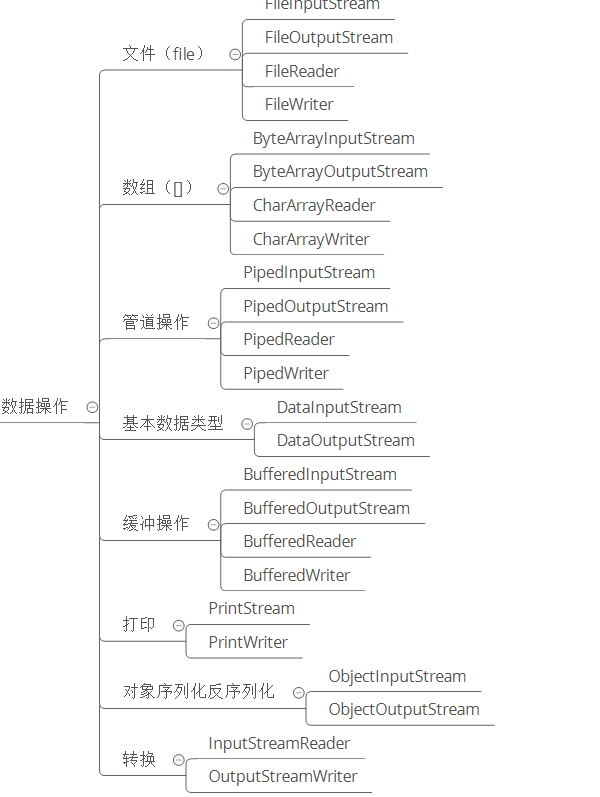
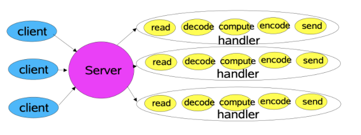
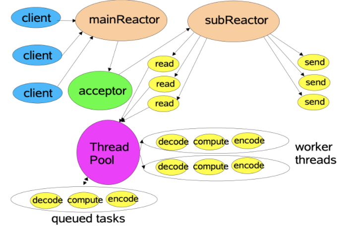
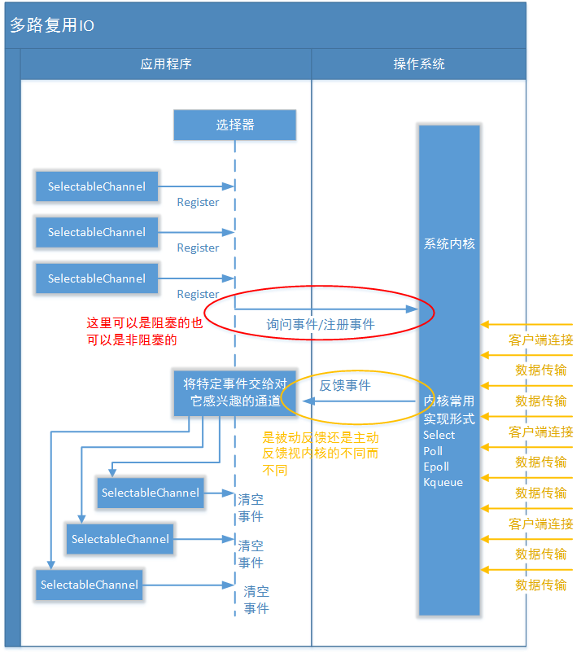
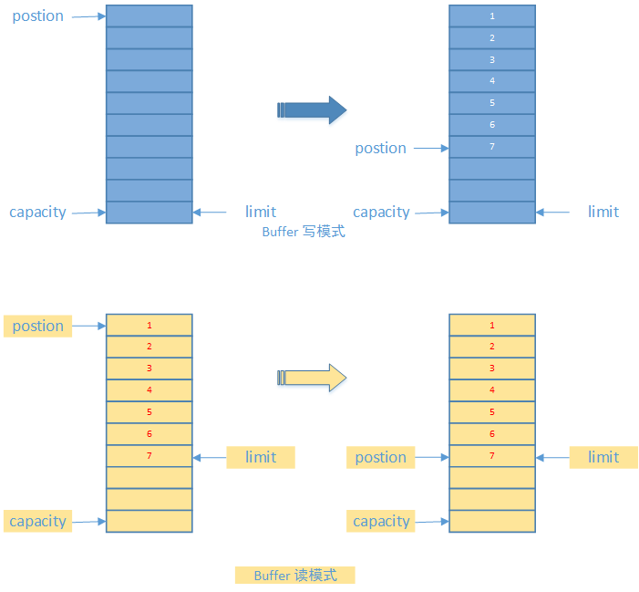

HashMap源码解析：https://crossoverjie.top/2018/07/23/java-senior/ConcurrentHashMap/

# Java IO/NIO/AIO

重要参考链接：https://www.pdai.tech/


## Java IO 分类

### **IO理解分类 - 从传输方式上**

- 字节流


- 字符流


**字节流和字符流的区别**：

- 字节流读取单个字节，字符流读取单个字符(一个字符根据编码的不同，对应的字节也不同，如 UTF-8 编码是 3 个字节，中文编码是 2 个字节。)
- 字节流用来处理二进制文件(图片、MP3、视频文件)，字符流用来处理文本文件(可以看做是特殊的二进制文件，使用了某种编码，人可以阅读)。
- 

**字节转字符Input/OutputStream  Reader/Writer**

编码就是把字符转换为字节，而解码是把字节重新组合成字符。

如果编码和解码过程使用不同的编码方式那么就出现了乱码。

- GBK 编码中，中文字符占 2 个字节，英文字符占 1 个字节；
- UTF-8 编码中，中文字符占 3 个字节，英文字符占 1 个字节；
- UTF-16be 编码中，中文字符和英文字符都占 2 个字节。

Java 使用双字节编码 UTF-16be，这不是指 Java 只支持这一种编码方式，而是说 char 这种类型使用 UTF-16be 进行编码。char 类型占 16 位，也就是两个字节，Java 使用这种双字节编码是为了让一个中文或者一个英文都能使用一个 char 来存储。


### IO理解分类 - 从数据操作上

从数据来源或者说是操作对象角度看，IO 类可以分为:



## Java IO 设计模式（装饰者模式）

装饰者(Decorator)和具体组件(ConcreteComponent)都继承自组件(Component)，具体组件的方法实现不需要依赖于其它对象，而**装饰者组合了一个组件，这样它可以装饰其它装饰者或者具体组件**。所谓装饰，就是把这个装饰者套在被装饰者之上，从而**动态扩展被装饰者的功能**。装饰者的方法有一部分是自己的，这属于它的功能，然后调用被装饰者的方法实现，从而也保留了被装饰者的功能。 


IO的装饰者模式：

以 InputStream 为例，

- InputStream 是抽象组件；
- **File**InputStream 是 InputStream 的子类，属于具体组件，提供了字节流的输入操作；
- **Filter**InputStream 属于抽象装饰者，装饰者用于装饰组件，为组件提供额外的功能。例如 **Buffered**InputStream 为 FileInputStream 提供缓存的功能。


## Java IO 常见类使用

Java 的 I/O 大概可以分成以下几类:

- 磁盘操作: File
- 字节操作: InputStream 和 OutputStream
- 字符操作: Reader 和 Writer
- 对象操作: Serializable
- 网络操作: Socket

Java中的网络支持：

- InetAddress: 用于表示网络上的硬件资源，即 IP 地址；

- URL: 统一资源定位符；

- Sockets: 使用 TCP 协议实现网络通信；

- Datagram: 使用 UDP 协议实现网络通信

## IO模型-Unix IO模型

### Unix IO模型简介

一个输入操作通常包括两个阶段:

- 等待数据准备好
- 从内核向进程复制数据

对于一个套接字上的输入操作，第一步通常涉及等待数据从网络中到达。当所等待分组到达时，它被复制到内核中的某个缓冲区。第二步就是把数据从内核缓冲区复制到应用进程缓冲区。

- `阻塞IO` 和 `非阻塞IO`

这两个概念是`程序级别`的。主要描述的是程序请求操作系统IO操作后，如果IO资源没有准备好，那么程序该如何处理的问题: 前者等待；后者继续执行(并且使用线程一直轮询，直到有IO资源准备好了)

- `同步IO` 和 `非同步IO`

这两个概念是`操作系统级别`的。主要描述的是操作系统在收到程序请求IO操作后，如果IO资源没有准备好，该如何响应程序的问题: 前者不响应，直到IO资源准备好以后；后者返回一个标记(好让程序和自己知道以后的数据往哪里通知)，当IO资源准备好以后，再用事件机制返回给程序

<font color=red>**阻塞式I/O**</font>

应用进程被阻塞，直到数据复制到应用进程缓冲区中才返回。

应该注意到，在阻塞的过程中，其它程序还可以执行，因此阻塞不意味着整个操作系统都被阻塞。因为其他程序还可以执行，因此不消耗 CPU 时间，这种模型的执行效率会比较高。


<font color=red>**非阻塞式I/O**</font>

应用进程执行系统调用之后，内核返回一个错误码。应用进程可以继续执行，但是需要不断的执行系统调用来获知 I/O 是否完成，这种方式称为轮询(polling)。由于 CPU 要处理更多的系统调用，因此这种模型是比较低效的。


<font color=red>**I/O复用**</font>

使用 select 或者 poll 等待数据，**并且可以等待多个套接字中的任何一个变为可读**，**这一过程会被阻塞**，当某一个套接字可读时返回。之后再使用 recvfrom 把数据从内核复制到进程中。

**它可以让单个进程具有处理多个 I/O 事件的能力。又被称为 Event Driven I/O，即事件驱动 I/O。**

如果一个 Web 服务器没有 I/O 复用，那么每一个 Socket 连接都需要创建一个线程去处理。如果同时有几万个连接，那么就需要创建相同数量的线程。并且相比于多进程和多线程技术，I/O 复用不需要进程线程创建和切换的开销，系统开销更小。


<font color=red>**信号驱动I/O**</font>

应用进程使用 sigaction 系统调用，内核立即返回，应用进程可以继续执行，也就是说等待数据阶段应用进程是非阻塞的。内核在数据到达时向应用进程发送 SIGIO 信号，应用进程收到之后在信号处理程序中调用 recvfrom 将数据从内核复制到应用进程中。

相比于非阻塞式 I/O 的轮询方式，信号驱动 I/O 的 CPU 利用率更高。


<font color=red>**异步I/O**</font>

进行 aio_read 系统调用会立即返回，应用进程继续执行，不会被阻塞，内核会在所有操作完成之后向应用进程发送信号。

异步 I/O 与信号驱动 I/O 的区别在于，异步 I/O 的信号是通知应用进程 I/O 完成，而信号驱动 I/O 的信号是通知应用进程可以开始 I/O。


### I/O模型比较


<font color=red>**传统读操作**</font>

1. 用户进程通过 read() 函数向内核（kernel）发起系统调用，上下文从用户态（user space）切换为内核态（kernel space）。

2. CPU利用DMA控制器将数据从主存或硬盘拷贝到内核空间（kernel space）的读缓冲区（read buffer）。

3. CPU将读缓冲区（read buffer）中的数据拷贝到用户空间（user space）的用户缓冲区（user buffer）。

4. 上下文从内核态（kernel space）切换回用户态（user space），read 调用执行返回。

<font color=red>**传统写操作**</font>

1. 用户进程通过 write() 函数向内核（kernel）发起系统调用，上下文从用户态（user space）切换为内核态（kernel space）。

2. CPU 将用户缓冲区（user buffer）中的数据拷贝到内核空间（kernel space）的网络缓冲区（socket buffer）。

3. CPU 利用 DMA 控制器将数据从网络缓冲区（socket buffer）拷贝到网卡进行数据传输。

4. 上下文从内核态（kernel space）切换回用户态（user space），write 系统调用执行返回。

## 零拷贝方式

在 Linux 中零拷贝技术主要有 3 个实现思路：用户态直接 I/O、减少数据拷贝次数、写时复制技术。

- 用户态直接 I/O：应用程序可以直接访问硬件存储，操作系统内核只是辅助数据传输。这种方式依旧存在用户空间和内核空间的上下文切换，硬件上的数据直接拷贝至了用户空间，不经过内核空间。因此，直接 I/O 不存在内核空间缓冲区和用户空间缓冲区之间的数据拷贝。
- 减少数据拷贝次数：在数据传输过程中，避免数据在用户空间缓冲区和系统内核空间缓冲区之间的CPU拷贝，以及数据在系统内核空间内的CPU拷贝，这也是当前主流零拷贝技术的实现思路。
- 写时复制技术：写时复制指的是当多个进程共享同一块数据时，如果其中一个进程需要对这份数据进行修改，那么将其拷贝到自己的进程地址空间中，如果只是数据读取操作则不需要进行拷贝操作。

### 用户态直接IO

用户态直接 I/O 使得应用进程或运行在用户态（user space）下的库函数直接访问硬件设备，数据直接跨过内核进行传输，内核在数据传输过程除了进行必要的虚拟存储配置工作之外，不参与任何其他工作，这种方式能够直接绕过内核，极大提高了性能。


用户态直接 I/O 只能适用于不需要内核缓冲区处理的应用程序，这些应用程序通常在进程地址空间有自己的数据缓存机制，称为自缓存应用程序，如数据库管理系统就是一个代表。其次，这种零拷贝机制会直接操作磁盘 I/O，由于 CPU 和磁盘 I/O 之间的执行时间差距，会造成大量资源的浪费，解决方案是配合异步 I/O 使用。

### 减少数据拷贝次数(mmap + write)

一种零拷贝方式是使用 mmap + write 代替原来的 read + write 方式，减少了 1 次 CPU 拷贝操作。mmap 是 Linux 提供的一种内存映射文件方法，即将一个进程的地址空间中的一段虚拟地址映射到磁盘文件地址。

```shell
tmp_buf = mmap(file_fd, len);
write(socket_fd, tmp_buf, len);
```

使用 mmap 的目的是将内核中读缓冲区（read buffer）的地址与用户空间的缓冲区（user buffer）进行映射，从而实现内核缓冲区与应用程序内存的共享，**省去了将数据从内核读缓冲区（read buffer）拷贝到用户缓冲区（user buffer）的过程**，然而内核读缓冲区（read buffer）仍需将数据拷贝到内核写缓冲区（socket buffer），大致的流程如下图所示：


基于 mmap + write 系统调用的零拷贝方式，整个拷贝过程会发生 4 次上下文切换，1 次 CPU 拷贝和 2 次 DMA 拷贝

1. 用户进程通过 mmap() 函数向内核（kernel）发起系统调用，上下文从用户态（user space）切换为内核态（kernel space）。
2. 将用户进程的内核空间的读缓冲区（read buffer）与用户空间的缓存区（user buffer）进行内存地址映射。
3. CPU利用DMA控制器将数据从主存或硬盘拷贝到内核空间（kernel space）的读缓冲区（read buffer）。
4. 上下文从内核态（kernel space）切换回用户态（user space），mmap 系统调用执行返回。
5. 用户进程通过 write() 函数向内核（kernel）发起系统调用，上下文从用户态（user space）切换为内核态（kernel space）。
6. CPU将读缓冲区（read buffer）中的数据拷贝到的网络缓冲区（socket buffer）。
7. CPU利用DMA控制器将数据从网络缓冲区（socket buffer）拷贝到网卡进行数据传输。
8. 上下文从内核态（kernel space）切换回用户态（user space），write 系统调用执行返回。

mmap 主要的用处是提高 I/O 性能，特别是针对大文件。对于小文件，内存映射文件反而会导致碎片空间的浪费，因为内存映射总是要对齐页边界，最小单位是 4 KB，一个 5 KB 的文件将会映射占用 8 KB 内存，也就会浪费 3 KB 内存。mmap 的拷贝虽然减少了 1 次CPU拷贝，提升了效率，但也存在一些隐藏的问题。当 mmap 一个文件时，如果这个文件被另一个进程所截获，那么 write 系统调用会因为访问非法地址被 SIGBUS 信号终止，SIGBUS 默认会杀死进程并产生一个 coredump，服务器可能因此被终止。

### 减少数据拷贝次数(sendfile)

sendfile 系统调用在 Linux 内核版本 2.1 中被引入，目的是简化通过网络在两个通道之间进行的数据传输过程。sendfile 系统调用的引入，不仅减少了 CPU 拷贝的次数，还减少了上下文切换的次数

```shell
sendfile(socket_fd, file_fd, len);
```

通过 sendfile 系统调用，数据可以直接在内核空间内部进行 I/O 传输，从而省去了数据在用户空间和内核空间之间的来回拷贝。与 mmap 内存映射方式不同的是， sendfile 调用中 I/O 数据对用户空间是完全不可见的。也就是说，这是一次完全意义上的数据传输过程。


基于 sendfile 系统调用的零拷贝方式，整个拷贝过程会发生 2 次上下文切换，1 次 CPU 拷贝和 2 次 DMA 拷贝

1. 用户进程通过 sendfile() 函数向内核（kernel）发起系统调用，上下文从用户态（user space）切换为内核态（kernel space）。
2. CPU 利用 DMA 控制器将数据从主存或硬盘拷贝到内核空间（kernel space）的读缓冲区（read buffer）。
3. CPU 将读缓冲区（read buffer）中的数据拷贝到的网络缓冲区（socket buffer）。
4. CPU 利用 DMA 控制器将数据从网络缓冲区（socket buffer）拷贝到网卡进行数据传输。
5. 上下文从内核态（kernel space）切换回用户态（user space），sendfile 系统调用执行返回。

### 减少数据拷贝次数(sendfile + DMA gather copy)

Linux 2.4 版本的内核对 sendfile 系统调用进行修改，为 DMA 拷贝引入了 gather 操作。它将内核空间（kernel space）的读缓冲区（read buffer）中对应的数据描述信息（内存地址、地址偏移量）记录到相应的网络缓冲区（ socket buffer）中，由 DMA 根据内存地址、地址偏移量将数据批量地从读缓冲区（read buffer）拷贝到网卡设备中，这样就省去了内核空间中仅剩的 1 次 CPU 拷贝操作


基于 sendfile + DMA gather copy 系统调用的零拷贝方式，整个拷贝过程会发生 2 次上下文切换、0 次 CPU 拷贝以及 2 次 DMA 拷贝

1. 用户进程通过 sendfile() 函数向内核（kernel）发起系统调用，上下文从用户态（user space）切换为内核态（kernel space）。
2. CPU 利用 DMA 控制器将数据从主存或硬盘拷贝到内核空间（kernel space）的读缓冲区（read buffer）。
3. CPU 把读缓冲区（read buffer）的文件描述符（file descriptor）和数据长度拷贝到网络缓冲区（socket buffer）。
4. 基于已拷贝的文件描述符（file descriptor）和数据长度，CPU 利用 DMA 控制器的 gather/scatter 操作直接批量地将数据从内核的读缓冲区（read buffer）拷贝到网卡进行数据传输。
5. 上下文从内核态（kernel space）切换回用户态（user space），sendfile 系统调用执行返回。

sendfile + DMA gather copy 拷贝方式同样存在用户程序不能对数据进行修改的问题，而且本身需要硬件的支持，它只适用于将数据从文件拷贝到 socket 套接字上的传输过程。

### 减少数据拷贝次数(splice)

sendfile 只适用于将数据从文件拷贝到 socket 套接字上，同时需要硬件的支持，这也限定了它的使用范围。Linux 在 2.6.17 版本引入 splice 系统调用，不仅不需要硬件支持，还实现了两个文件描述符之间的数据零拷贝。

```shell
splice(fd_in, off_in, fd_out, off_out, len, flags);
```

splice 系统调用可以在内核空间的读缓冲区（read buffer）和网络缓冲区（socket buffer）之间建立管道（pipeline），从而避免了两者之间的 CPU 拷贝操作


1. 用户进程通过 splice() 函数向内核（kernel）发起系统调用，上下文从用户态（user space）切换为内核态（kernel space）。
2. CPU 利用 DMA 控制器将数据从主存或硬盘拷贝到内核空间（kernel space）的读缓冲区（read buffer）。
3. CPU 在内核空间的读缓冲区（read buffer）和网络缓冲区（socket buffer）之间建立管道（pipeline）。
4. CPU 利用 DMA 控制器将数据从网络缓冲区（socket buffer）拷贝到网卡进行数据传输。
5. 上下文从内核态（kernel space）切换回用户态（user space），splice 系统调用执行返回。

splice 拷贝方式也同样存在用户程序不能对数据进行修改的问题。除此之外，它使用了 Linux 的管道缓冲机制，可以用于任意两个文件描述符中传输数据，但是它的两个文件描述符参数中有一个必须是管道设备。

## NIO基础

<font color=red>**流与块**</font>

I/O 与 NIO 最重要的区别是数据打包和传输的方式，I/O 以流的方式处理数据，而 NIO 以块的方式处理数据。

面向流的 I/O 一次处理一个字节数据: 一个输入流产生一个字节数据，一个输出流消费一个字节数据。为流式数据创建过滤器非常容易，链接几个过滤器，以便每个过滤器只负责复杂处理机制的一部分。不利的一面是，面向流的 I/O 通常相当慢。

面向块的 I/O 一次处理一个数据块，按块处理数据比按流处理数据要快得多。但是面向块的 I/O 缺少一些面向流的 I/O 所具有的优雅性和简单性。

I/O 包和 NIO 已经很好地集成了，java.io.* 已经以 NIO 为基础重新实现了，所以现在它可以利用 NIO 的一些特性。例如，java.io.* 包中的一些类包含以块的形式读写数据的方法，这使得即使在面向流的系统中，处理速度也会更快。

<font color=red>**管道与缓冲区**</font>

1.通道

通道 Channel 是对原 I/O 包中的流的模拟，可以通过它读取和写入数据。

通道与流的不同之处在于，流只能在一个方向上移动(一个流必须是 InputStream 或者 OutputStream 的子类)，而通道是双向的，可以用于读、写或者同时用于读写。

通道包括以下类型:

- FileChannel: 从文件中读写数据；

- DatagramChannel: 通过 UDP 读写网络中数据；

- SocketChannel: 通过 TCP 读写网络中数据；

- ServerSocketChannel: 可以监听新进来的 TCP 连接，对每一个新进来的连接都会创建一个 SocketChannel

2.缓冲区

**发送给一个通道的所有数据都必须首先放到缓冲区中**，同样地，从通道中读取的任何数据都要先读到缓冲区中。也就是说，不会直接对通道进行读写数据，而是要先经过缓冲区。

缓冲区实质上是一个数组，但它不仅仅是一个数组。缓冲区提供了对数据的结构化访问，而且还可以跟踪系统的读/写进程。

缓冲区包括以下类型:

- ByteBuffer
- CharBuffer
- ShortBuffer
- IntBuffer
- LongBuffer
- FloatBuffer
- DoubleBuffer

状态变量：capacity(最大容量)，position(当前已经读写的字节数)，limit(还可以读写的字节数)

<font color=red>**选择器**</font>

NIO 实现了 IO 多路复用中的 Reactor 模型，**一个线程 Thread 使用一个选择器 Selector 通过轮询的方式去监听多个通道 Channel 上的事件，从而让一个线程就可以处理多个事件。**

通过配置监听的通道 Channel 为非阻塞，那么当 Channel 上的 IO 事件还未到达时，就不会进入阻塞状态一直等待，而是继续轮询其它 Channel，找到 IO 事件已经到达的 Channel 执行。

因为创建和切换线程的开销很大，因此使用一个线程来处理多个事件而不是一个线程处理一个事件具有更好的性能。

应该注意的是，只有套接字 Channel 才能配置为非阻塞，而 FileChannel 不能，为 FileChannel 配置非阻塞也没有意义。


```java
//1.创建选择器
Selector selector = Selector.open();

//2.将通道注册到选择器上
ServerSocketChannel ssChannel = ServerSocketChannel.open();
ssChannel.configureBlocking(false);
ssChannel.register(selector, SelectionKey.OP_ACCEPT);

//3.监听事件：使用 select() 来监听到达的事件，它会一直阻塞直到有至少一个事件到达。
int num = selector.select();

//4.获取到达的事件
Set<SelectionKey> keys = selector.selectedKeys();
Iterator<SelectionKey> keyIterator = keys.iterator();
while (keyIterator.hasNext()) {
    SelectionKey key = keyIterator.next();
    if (key.isAcceptable()) {
        // ...
    } else if (key.isReadable()) {
        // ...
    }
    keyIterator.remove();
}

//5.事件循环：因为一次 select() 调用不能处理完所有的事件，并且服务器端有可能需要一直监听事件，因此服务器端处理事件的代码一般会放在一个死循环内。
while (true) {
    int num = selector.select();
    Set<SelectionKey> keys = selector.selectedKeys();
    Iterator<SelectionKey> keyIterator = keys.iterator();
    while (keyIterator.hasNext()) {
        SelectionKey key = keyIterator.next();
        if (key.isAcceptable()) {
            // ...
        } else if (key.isReadable()) {
            // ...
        }
        keyIterator.remove();
    }
}
```

<font color=red>**套接字NIO实例**</font>

```java
//服务器
public class NIOServer {

    public static void main(String[] args) throws IOException {

        Selector selector = Selector.open();

        ServerSocketChannel ssChannel = ServerSocketChannel.open();
        ssChannel.configureBlocking(false);
        ssChannel.register(selector, SelectionKey.OP_ACCEPT);

        ServerSocket serverSocket = ssChannel.socket();
        InetSocketAddress address = new InetSocketAddress("127.0.0.1", 8888);
        serverSocket.bind(address);

        while (true) {

            selector.select();
            Set<SelectionKey> keys = selector.selectedKeys();
            Iterator<SelectionKey> keyIterator = keys.iterator();

            while (keyIterator.hasNext()) {

                SelectionKey key = keyIterator.next();

                if (key.isAcceptable()) {

                    ServerSocketChannel ssChannel1 = (ServerSocketChannel) key.channel();

                    // 服务器会为每个新连接创建一个 SocketChannel
                    SocketChannel sChannel = ssChannel1.accept();
                    sChannel.configureBlocking(false);

                    // 这个新连接主要用于从客户端读取数据
                    sChannel.register(selector, SelectionKey.OP_READ);

                } else if (key.isReadable()) {

                    SocketChannel sChannel = (SocketChannel) key.channel();
                    System.out.println(readDataFromSocketChannel(sChannel));
                    sChannel.close();
                }

                keyIterator.remove();
            }
        }
    }

    private static String readDataFromSocketChannel(SocketChannel sChannel) throws IOException {

        ByteBuffer buffer = ByteBuffer.allocate(1024);
        StringBuilder data = new StringBuilder();

        while (true) {

            buffer.clear();
            int n = sChannel.read(buffer);
            if (n == -1) {
                break;
            }
            buffer.flip();
            int limit = buffer.limit();
            char[] dst = new char[limit];
            for (int i = 0; i < limit; i++) {
                dst[i] = (char) buffer.get(i);
            }
            data.append(dst);
            buffer.clear();
        }
        return data.toString();
    }
}
//客户端
public class NIOClient {

    public static void main(String[] args) throws IOException {
        Socket socket = new Socket("127.0.0.1", 8888);
        OutputStream out = socket.getOutputStream();
        String s = "hello world";
        out.write(s.getBytes());
        out.close();
    }
}
```

## NIO内存映射

mmap是一种内存映射文件的方法，即将一个文件或者其它对象映射到进程的地址空间，实现文件磁盘地址和进程虚拟地址空间中一段虚拟地址的一一对映关系。


mmap内存映射原理：

**（一）进程启动映射过程，并在虚拟地址空间中为映射创建虚拟映射区域**

1、进程在用户空间调用库函数mmap，原型：void *mmap(void *start, size_t length, int prot, int flags, int fd, off_t offset);

2、在当前进程的虚拟地址空间中，寻找一段空闲的满足要求的连续的虚拟地址

3、为此虚拟区分配一个vm_area_struct（PCB中地址空间管理的一个数据结构）结构，接着对这个结构的各个域进行了初始化

4、将新建的虚拟区结构（vm_area_struct）插入进程的虚拟地址区域链表或树中

**（二）调用内核空间的系统调用函数mmap（不同于用户空间函数），实现文件物理地址和进程虚拟地址的一一映射关系**

5、为映射分配了新的虚拟地址区域后，通过待映射的文件指针，在文件描述符表中找到对应的文件描述符，通过文件描述符，链接到内核“已打开文件集”中该文件的文件结构体（struct file），每个文件结构体维护着和这个已打开文件相关各项信息。

6、通过该文件的文件结构体，链接到file_operations模块，调用内核函数mmap，其原型为：int mmap(struct file *filp, struct vm_area_struct *vma)，不同于用户空间库函数。

7、内核mmap函数通过虚拟文件系统inode模块定位到文件磁盘物理地址。

8、通过remap_pfn_range函数建立页表，即实现了文件地址和虚拟地址区域的映射关系。此时，这片虚拟地址并没有任何数据关联到主存中。

**（三）进程发起对这片映射空间的访问，引发缺页异常，实现文件内容到物理内存（主存）的拷贝**

注：前两个阶段仅在于创建虚拟区间并完成地址映射，但是并没有将任何文件数据的拷贝至主存。真正的文件读取是当进程发起读或写操作时。

9、进程的读或写操作访问虚拟地址空间这一段映射地址，通过查询页表，发现这一段地址并不在物理页面上。因为目前只建立了地址映射，真正的硬盘数据还没有拷贝到内存中，因此引发缺页异常。

10、缺页异常进行一系列判断，确定无非法操作后，内核发起请求调页过程。

11、调页过程先在交换缓存空间（swap cache）中寻找需要访问的内存页，如果没有则调用nopage函数把所缺的页从磁盘装入到主存中。

12、之后进程即可对这片主存进行读或者写的操作，如果写操作改变了其内容，一定时间后系统会自动回写脏页面到对应磁盘地址，也即完成了写入到文件的过程。

注：修改过的脏页面并不会立即更新回文件中，而是有一段时间的延迟，可以调用msync()来强制同步, 这样所写的内容就能立即保存到文件里了。

## I/O多路复用

目前流程的多路复用IO实现主要包括四种: `select`、`poll`、`epoll`、`kqueue`。下表是他们的一些重要特性的比较:

| **IO模型** | **相对性能** | **关键思路**     | **操作系统**  | **JAVA支持情况**                                             |
| ---------- | ------------ | ---------------- | ------------- | ------------------------------------------------------------ |
| select     | 较高         | Reactor          | windows/Linux | 支持,Reactor模式(反应器设计模式)。Linux操作系统的 kernels 2.4内核版本之前，默认使用select；而目前windows下对同步IO的支持，都是select模型 |
| poll       | 较高         | Reactor          | Linux         | Linux下的JAVA NIO框架，Linux kernels 2.6内核版本之前使用poll进行支持。也是使用的Reactor模式 |
| epoll      | 高           | Reactor/Proactor | Linux         | Linux kernels 2.6内核版本及以后使用epoll进行支持；Linux kernels 2.6内核版本之前使用poll进行支持；另外一定注意，由于Linux下没有Windows下的IOCP技术提供真正的 异步IO 支持，所以Linux下使用epoll模拟异步IO |
| kqueue     | 高           | Proactor         | Linux         | 目前JAVA的版本不支持                                         |

**多路复用IO技术最适用的是“高并发”场景，所谓高并发是指1毫秒内至少同时有上千个连接请求准备好。**

epoll 的描述符事件有两种触发模式: LT(level trigger)和 ET(edge trigger)。

- **LT:** 当 epoll_wait() 检测到描述符事件到达时，将此事件通知进程，进程可以不立即处理该事件，下次调用 epoll_wait() 会再次通知进程。是默认的一种模式，并且同时支持 Blocking 和 No-Blocking。
- **et:** 和 LT 模式不同的是，通知之后进程必须立即处理事件，下次再调用 epoll_wait() 时不会再得到事件到达的通知。很大程度上减少了 epoll 事件被重复触发的次数，因此效率要比 LT 模式高。只支持 No-Blocking，以避免由于一个文件句柄的阻塞读/阻塞写操作把处理多个文件描述符的任务饿死

**select应用场景：**

select 的 timeout 参数精度为 1ns，而 poll 和 epoll 为 1ms，因此 select 更加适用于实时要求更高的场景，比如核反应堆的控制。select 可移植性更好，几乎被所有主流平台所支持。

**poll应用场景：**

poll 没有最大描述符数量的限制，如果平台支持并且对实时性要求不高，应该使用 poll 而不是 select。需要同时监控小于 1000 个描述符，就没有必要使用 epoll，因为这个应用场景下并不能体现 epoll 的优势。

需要监控的描述符状态变化多，而且都是非常短暂的，也没有必要使用 epoll。因为 epoll 中的所有描述符都存储在内核中，造成每次需要对描述符的状态改变都需要通过 epoll_ctl() 进行系统调用，频繁系统调用降低效率。并且epoll 的描述符存储在内核，不容易调试

**epoll应用场景：**

只需要运行在 Linux 平台上，并且有非常大量的描述符需要同时轮询，而且这些连接最好是长连接.

<font color=red>**Reactor模型和Proactor模型**</font>

**传统IO模型**

对于传统IO模型，其主要是一个Server对接N个客户端，在客户端连接之后，为每个客户端都分配一个执行线程。如下图是该模型的一个演示：



这种模式主要存在的问题有如下几点：

- 服务器的**并发量对服务端能够创建的线程数有很大的依赖关系**，但是服务器线程却是不能无限增长的；
- 服务端**每个线程不仅要进行IO读写操作，而且还需要进行业务计算**；
- 服务端在获取客户端连接，读取数据，以及写入数据的过程都是**阻塞类型的**，在网络状况不好的情况下，这将极大的降低服务器每个线程的利用率，从而降低服务器吞吐量

**Reactor事件驱动模型**

在传统IO模型中，由于线程在等待连接以及进行IO操作时都会阻塞当前线程，这部分损耗是非常大的。因而jdk 1.4中就提供了一套非阻塞IO的API。该API本质上是以**事件驱动来处理网络事件**的，而**Reactor是基于该API提出的一套IO模型**。如下是Reactor事件驱动模型的示意图：


在Reactor模型中，主要有四个角色：**客户端连接，Reactor，Acceptor和Handler**。这里**Acceptor会不断地接收客户端的连接，然后将接收到的连接交由Reactor进行分发，最后有具体的Handler进行处理**。改进后的Reactor模型相对于传统的IO模型主要有如下优点：

- 从模型上来讲，如果仅仅还是只使用一个线程池来处理客户端连接的网络读写，以及业务计算，那么Reactor模型与传统IO模型在效率上并没有什么提升。但是**Reactor模型是以事件进行驱动**的，其能够将接收客户端连接，网络读和网络写，以及业务计算进行拆分，从而极大的提升处理效率；
- Reactor模型是**异步非阻塞模型**，工作线程在没有网络事件时可以处理其他的任务，而不用像传统IO那样必须阻塞等待。

-------------------

**Reactor事件驱动模型---业务处理与IO分离**

在上面的Reactor模型中，由于网络读写和业务操作都在同一个线程中，在高并发情况下，这里的系统瓶颈主要在两方面：

- 高频率的网络读写事件处理；
- 大量的业务操作处理；

基于上述两个问题，这里在单线程Reactor模型的基础上提出了使用线程池的方式处理业务操作的模型。


- 使用**一个线程进行客户端连接的接收以及网络读写事件的处理**；
- 在接收到客户端连接之后，将该连接交由线程池进行数据的编解码以及业务计算。

这种模式相较于前面的模式性能有了很大的提升，主要在于在进行网络读写的同时，也进行了业务计算，从而大大提升了系统的吞吐量。不足点在于：

- 网络读写是一个比较消耗CPU的操作，在高并发的情况下，将会有大量的客户端数据需要进行网络读写，此时一个线程将不足以处理这么多请求。

--------------------------------

**Reactor事件驱动模型---并发读写**

对于使用线程池处理业务操作的模型，由于网络读写在高并发情况下会成为系统的一个瓶颈，因而针对该模型这里提出了一种改进后的模型，即使用线程池进行网络读写，而仅仅只使用一个线程专门接收客户端连接。



改进后的Reactor模型将Reactor拆分为了mainReactor和subReactor。这里**mainReactor主要进行客户端连接的处理**，处理完成之后将**该连接交由subReactor以处理客户端的网络读写**。这里的**subReactor则是使用一个线程池来支撑的**，其读写能力将会随着线程数的增多而大大增加。对于业务操作，这里也是使用一个线程池，而每个业务请求都只需要进行编解码和业务计算。通过这种方式，服务器的性能将会大大提升，在可见情况下，其基本上可以支持百万连接。

<font color=red>**Java对多路复用的支持**</font>



**重要概念：通道channel**

通道，被建立的一个应用程序和操作系统交互事件、传递内容的渠道(注意是连接到操作系统)。一个通道会有一个专属的文件状态描述符。那么既然是和操作系统进行内容的传递，那么说明**应用程序可以通过通道读取数据，也可以通过通道向操作系统写数据。**

被Selector(选择器)注册的通道，只能是继承了SelectableChannel类的子类.

- ServerSocketChannel: 应用服务器程序的监听通道。只有通过这个通道，应用程序才能向操作系统注册支持“多路复用IO”的端口监听。同时支持UDP协议和TCP协议。

- ScoketChannel: TCP Socket套接字的监听通道，一个Socket套接字对应了一个客户端IP: 端口 到 服务器IP: 端口的通信连接。

- DatagramChannel: UDP 数据报文的监听通道。

**重要概念：缓冲Buffer**

数据缓存区: 在JAVA NIO 框架中，为了保证每个通道的数据读写速度JAVA NIO 框架为每一种需要支持数据读写的通道集成了Buffer的支持。

 例如ServerSocketChannel通道它只支持对OP_ACCEPT事件的监听，所以它是不能直接进行网络数据内容的读写的。所以ServerSocketChannel是没有集成Buffer的。

Buffer有两种工作模式: 写模式和读模式。在读模式下，应用程序只能从Buffer中读取数据，不能进行写操作。但是在写模式下，应用程序是可以进行读操作的，这就表示可能会出现脏读的情况。所以一旦您决定要从Buffer中读取数据，一定要将Buffer的状态改为读模式。



- position: 缓存区目前这在操作的数据块位置

- limit: 缓存区最大可以进行操作的位置。缓存区的读写状态正式由这个属性控制的。

- capacity: 缓存区的最大容量。这个容量是在缓存区创建时进行指定的。由于高并发时通道数量往往会很庞大，所以每一个缓存区的容量最好不要过大。

**重要概念：选择器Selector**

Selector的英文含义是“选择器”，不过根据我们详细介绍的Selector的岗位职责，您可以把它称之为“轮询代理器”、“事件订阅器”、“channel容器管理机”都行。

- 事件订阅和Channel管理

应用程序将向Selector对象注册需要它关注的Channel，以及具体的某一个Channel会对哪些IO事件感兴趣。Selector中也会维护一个“已经注册的Channel”的容器

- 轮询代理

应用层不再通过阻塞模式或者非阻塞模式直接询问操作系统“事件有没有发生”，而是由Selector代其询问。


