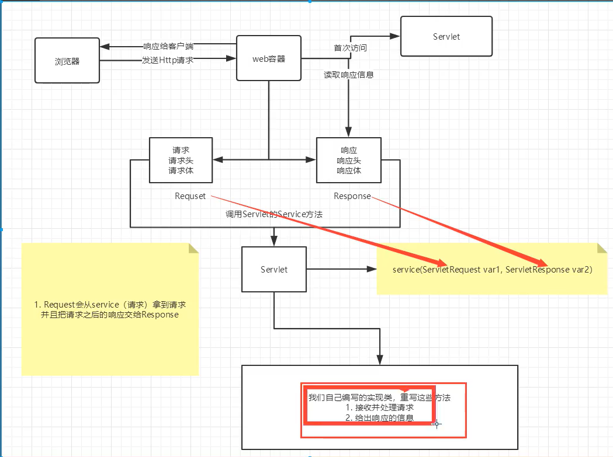
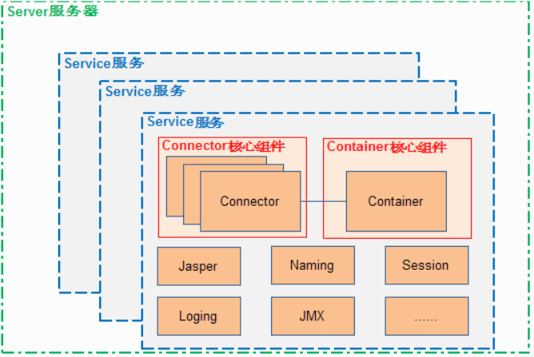
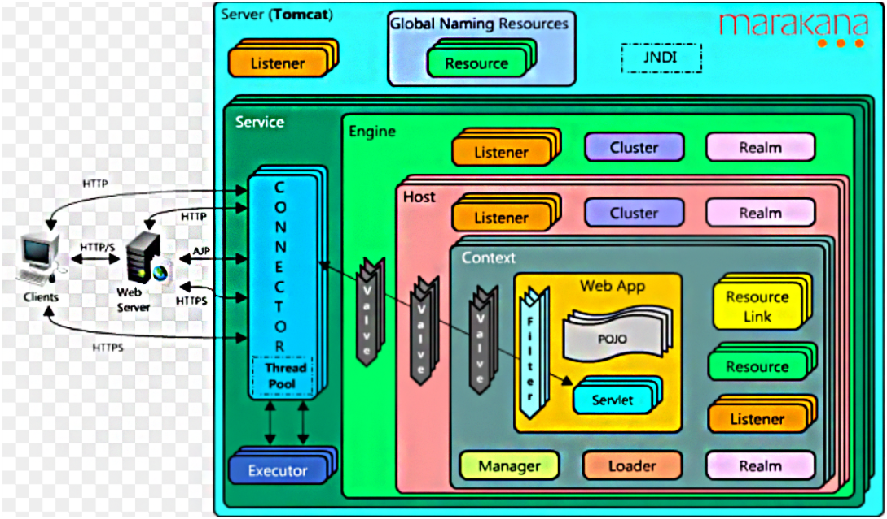

# 1.Web 服务器

## 1.1 技术

ASP：

PHP:

JSP/Servlet:

## 1.2  web 服务器 

服务器是一种被动的操作，用来处理用户的请求和给用户一些响应信息

**IIS：**

微软的，ASP，window中自带的

## **Tomcat：**

是一个免费的开源web服务器，属于轻量级应用服务器，在中小型系统和并发访问用户不是很多的场合普遍使用

Tomcat实际上运行JSP页面和Servlet

> 所谓Servlet，其实就是Sun为了让Java能实现动态可交互的网页，从而进入Web编程领域而制定的一套标准！

一个Servlet主要做下面三件事情：

1. 创建并填充Request对象，包括：URI、参数、method、请求头信息、请求体信息等
2. 创建Response对象
3. 执行业务逻辑，将结果通过Response的输出流输出到客户端

**Servlet没有main方法，所以，如果要执行，则需要在一个`容器`里面才能执行，这个容器就是为了支持Servlet的功能而存在，Tomcat其实就是一个Servlet容器的实现。**

最核心的两个组件–**连接器**（Connector）和**容器**（Container）起到`心脏`的作用，他们至关重要！下面我们逐一来分析其功能：

1. `Server`表示服务器，提供了一种优雅的方式来启动和停止整个系统，不必单独启停连接器和容器，它是Tomcat构成的顶级构成元素，所有一切均包含在Server中；
2. `Service`表示服务，`Server`可以运行多个服务。比如一个Tomcat里面可运行订单服务、支付服务、用户服务等等，Server的实现类StandardServer可以包含一个到多个Services, Service的实现类为StandardService调用了容器(Container)接口，其实是调用了Servlet Engine(引擎)，而且StandardService类中也指明了该Service归属的Server;
3. 每个`Service`可包含`多个Connector`和`一个Container`。因为每个服务允许同时支持多种协议，但是每种协议最终执行的Servlet却是相同的，
4. `Connector`表示连接器，比如一个服务可以同时支持AJP协议、Http协议和Https协议，每种协议可使用一种连接器来支持，**它将Service和Container连接起来**，首先它需要注册到一个Service，它的作用就是把来自客户端的请求转发到Container(容器)。

5. `Container`表示容器，可以看做Servlet容器
	- `Engine` – 引擎: Servlet 的顶层容器，包含一 个或多个 Host 子容器
	- `Host` – 主机:虚拟主机，负责 web 应用的部 署和 Context 的创建；
	- `Context` – 上下文：Web 应用上下文，包含多个 Wrapper，负责 web 配置的解析、管 理所有的 Web 资源；
	- `Wrapper` – 包装器：最底层的容器，是对 Servlet 的封装，负责 Servlet 实例的创 建、执行和销毁。

6. Service服务之下还有各种`支撑组件`，下面简单罗列一下这些组件
	- `Manager` – 管理器，用于管理会话Session
	- `Logger` – 日志器，用于管理日志
	- `Loader` – 加载器，和类加载有关，只会开放给Context所使用
	- `Pipeline` – **管道组件，配合Valve实现过滤器功能**
	- `Valve` – **阀门组件，配合Pipeline实现过滤器功能**
	- `Realm` – 认证授权组件

> 在增强组件的灵活性和可扩展性方面，职责链模式是一种比较好的选择。Tomcat即采用该模 式来实现客户端请求的处理——请求处理也是职责链模式典型的应用场景之一。换句话说，在 Tomcat中每个Container组件通过执行一个职责链来完成具体的请求处理。Tomcat定义了Pipeline （管道）和Valve （阀）两个接口。前者用于构造职责链，后者代表职 责链上的每个处理器。来自客户端的请求就像是流经管道的水一般，经过每个阀进行处理。Pipeline作为一个管道，我们可以简单认为是一个Valve的集合，内部会对这个集合进行遍历，调用每个元素的业务逻辑方法invoke()
>
> Pipeline中维护了一个基础的Valve,它始终位于Pipeline的末端（即最后执行），封装了具体 的请求处理和输出响应的过程。通过addValve（）方法，我们可以为Pipeline添加其他的Valve 0 后添加的Valve位于基础Valve之前,并按照添加顺序执行。

**Tomcat 工作流程**

假设来自客户的请求为：http://localhost:8080/test/index.jsp 请求被发送到本机端口8080，被在那里侦听的Coyote HTTP/1.1 Connector，然后：

- Connector把该请求交给它所在的Service的Engine来处理，并等待Engine的回应
- Engine获得请求localhost:8080/test/index.jsp，匹配它所有虚拟主机Host
- Engine匹配到名为localhost的Host(即使匹配不到也把请求交给该Host处理，因为该Host被定义为该Engine的默认主机)
- localhost Host获得请求/test/index.jsp，匹配它所拥有的所有Context
- Host匹配到路径为/test的Context(如果匹配不到就把该请求交给路径名为""的Context去处理)
- path="/test"的Context获得请求/index.jsp，在它的mapping table中寻找对应的servlet
- Context匹配到URL PATTERN为*.jsp的servlet，对应于JspServlet类，构造HttpServletRequest对象和HttpServletResponse对象，作为参数调用JspServlet的doGet或doPost方法
- Context把执行完了之后的HttpServletResponse对象返回给Host
- Host把HttpServletResponse对象返回给Engine
- Engine把HttpServletResponse对象返回给Connector
- Connector把HttpServletResponse对象返回给客户browser

**Tomcat 源码设计**

从功能的角度将Tomcat源代码分成5个子模块，分别是:

- **Jsper模**: 这个子模块负责jsp页面的解析、jsp属性的验证，同时也负责将jsp页面动态转换为java代码并编译成class文件。在Tomcat源代码中，凡是属于org.apache.jasper包及其子包中的源代码都属于这个子模块;
- **Servlet和Jsp模块**: 这个子模块的源代码属于javax.servlet包及其子包，如我们非常熟悉的javax.servlet.Servlet接口、javax.servet.http.HttpServlet类及javax.servlet.jsp.HttpJspPage就位于这个子模块中;
- **Catalina模块**: 这个子模块包含了所有以org.apache.catalina开头的java源代码。该子模块的任务是规范了Tomcat的总体架构，定义了Server、Service、Host、Connector、Context、Session及Cluster等关键组件及这些组件的实现，这个子模块大量运用了Composite设计模式。同时也规范了Catalina的启动及停止等事件的执行流程。从代码阅读的角度看，这个子模块应该是我们阅读和学习的重点。
- **Connector模块**: 如果说上面三个子模块实现了Tomcat应用服务器的话，那么这个子模块就是Web服务器的实现。所谓连接器(Connector)就是一个连接客户和应用服务器的桥梁，它接收用户的请求，并把用户请求包装成标准的Http请求(包含协议名称，请求头Head，请求方法是Get还是Post等等)。同时，这个子模块还按照标准的Http协议，负责给客户端发送响应页面，比如在请求页面未发现时，connector就会给客户端浏览器发送标准的Http 404错误响应页面。
- **Resource模块**: 这个子模块包含一些资源文件，如Server.xml及Web.xml配置文件。严格说来，这个子模块不包含java源代码，但是它还是Tomcat编译运行所必需的。

相关资料：https://www.cnblogs.com/pengdai/p/14553561.html

