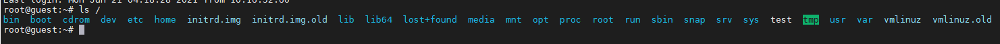
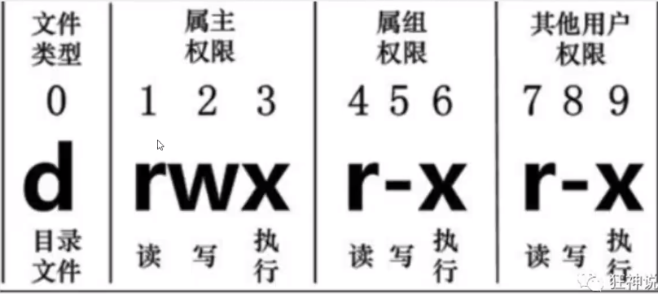

Java开发之路：JavaSE、MySQL、前端（HTML、Css、JS )、JavaWeb、SSM框架（很多人就开始找工作了! ) 、SpringBoot,Vue、SpringCloud~、(MP Git )

Linux ( CentOs 7）操作系统: Window 、Mac

消息队列( Kafka、RabbitMQ、RockeetMQ )，缓存（Redis )，搜索引擎（ES )

Linux一切皆文件: 文件就读、写、（权限)

# Linux命令

## 基本命令

> 关机

```shell
syns  # 将数据由内存同步到硬盘中
shutdown #关机指令，你可以man shutdown来看一下帮助文档。例如你可以运行如下命令关机:
shutdown -h 10 # 这个命令告诉大家，计算机将在10分钟后关机
shutdown -h now #立马关机
shutdown -h 20:25 # 系统会在今天20:25关机
shutdown -h +10 # 十分钟后关机
shutdown -r now #系统立马重启
shutdown -r +10 #系统十分钟后重启
reboot #就是重启，等同于 shutdown -r now
halt #关闭系统，等同于shutdown -h now和 poweroff
```

最后总结一下，不管是重启系统还是关闭系统，首先要运行sync命令，把内存中的数据写到磁盘中。

> 系统目录结构

1. 一切皆文件
2. 根目录/，所有的文件都挂载在这个节点下

```shell
ls /
```




- /bin : bin是Binary的缩写,这个目录存放着最经常使用的命令。
- /boot:这里存放的是启动Linux时使用的一些核心文件，包括一些连接文件以及镜像文件。
- /dev : dev是Device(设备)的缩写,存放的是Linux的外部设备，在Linux中访问设备的方式和访问文件的方式是相同的。
- **/etc : 这个目录用来存放所有的系统管理所需要的配置文件和子目录。**
- **/home:用户的主目录，在Linux中，每个用户都有一个自己的目录，一般该目录名是以用户的账号命名的。**
- /lib:这个目录里存放着系统最基本的动态连接共享库，其作用类似于Windows里的DLL文件。
- /lost+found :这个目录一般情况下是空的，当系统非法关机后，这里就存放了一些文件。
- /media : linux系统会自动识别一些设备，例如U盘、光驱等等，当识别后，linux会把识别的设备挂载到这个目录下。
- /mnt:系统提供该目录是为了让用户临时挂载别的文件系统的，我们可以将光驱挂载在/mnt/上，然后进入该目录就可以查看光驱里的内容了。
- **/opt:这是给主机额外安装软件所摆放的目录。比如你安装一个ORACLE数据库则就可以放到这个目录下。默认是空的。**
- /proc : 这个目录是一个虚拟的目录，它是系统内存的映射，我们可以通过直接访问这个目录来获取系统信息。
- **/root :该目录为系统管理员，也称作超级权限者的用户主目录。**
- /sbin : s就是Super User的意思，这里存放的是系统管理员使用的系统管理程序。. /srv:该目录存放一些服务启动之后需要提取的数据。
- /sys :这是linux2.6内核的一个很大的变化。该目录下安装了2.6内核中新出现的一个文件系统sysfs。
- **/tmp:这个目录是用来存放一些临时文件的。**
- **/usr: 这是一个非常重要的目录，用户的很多应用程序和文件都放在这个目录下，类似于windows下的program files目录。**

- /usr/bin :系统用户使用的应用程序。
- /usr/sbin :超级用户使用的比较高级的管理程序和系统守护程序。Super 
- /usr/src :内核源代码默认的放置目录。
- /var:这个目录中存放着在不断扩充着的东西，我们习惯将那些经常被修改的目录放在这个目录下。包括各种日志文件。
- /run:是一个临时文件系统，存储系统启动以来的信息。当系统重启时，这个目录下的文件应该被删掉或清除。
- **/www: 存放服务器网站相关的环境**

> 目录管理

**绝对路径都是以/开头**

```shell
ls #查看目录信息
ls -a #查看全部文件,包含隐藏文件
ls -l #列出所有的文件，包含文件的属性和权限，没有隐藏文件
ls -al #前两个的组合

cd #切换目录
cd ~ #回到当前用户目录
cd home #相对路径
cd /home #绝对路径
cd
cd .. #切换到上一级目录
./ #表示当前目录

pwd #显示当前所在的目录

mkdir # 创建目录
mkdir test1 #创建一个名为test1的目录
mkdir -p test1/test2/test3  #递归地创建多级目录

rmdir test1 #删除目录，仅能删除空的目录，如果下面存在文件，需要先删除文件，递归删除多个目录-p参数即可

cp 文件名 新的地方 #拷贝文件

rm #移除文件或目录
rm -f #忽略不存在的文件，不会出现警告，强制删除!
rm -r #递归删除目录!
rm -i #互动，删除询问是否删除
rm -rf #-r和-f的组合 

mv #移动文件
mv -f #强制
mv -u #只替换已经更新过的文件
mv 旧文件名 新文件名 #更改文件名
```

## 文件属性和权限

十个字母：第一个表示文件类型，

- 当为[d]则是目录
- 当为[-]则是文件;
- 若是[l]则表示为链接文档( link file ) ;
- 若是[b]则表示为装置文件里面的可供储存的接口设备(可随机存取装置);
- 若是[c]则表示为装置文件里面的串行端口设备，例如键盘、鼠标(—次性读取装置)。

接下来的字符中，以三个为一组，且均为『rwx』的三个参数的组合。其中，[r]代表可读(read)、[ w ]代表可写(write)、[×]代表可执行(execute)。没有权限的情况下由【-】代替



> 修改文件属性

```shell
chgrp # 更改文件属组
chgrp [-R] 属组名 文件名
#-R:递归更改文件属组，就是在更改某个目录文件的属组时，如果加上-R的参数，那么该目录下的所有文件的属组都会更改。

chown # 更改文件属主，也可以同时更改文件属组
chown [-R] 属主名 文件名
chown [-R] 属主名:属组名 文件名

chmod #更改文件9个属性 数字或符号
chmod [-R] xyz 文件或目录 #r:4 w:2 x:1
chmod 777 文件名 #更改为最高权限。
```

## 文件内容查看

```shell
cat #由第一行开始显示文件内容 读文章，读配置使用。
tac #从最后一行开始显示，可以看出tac是cat的倒着写!
nl  #显示的时候，顺道输出行号! 看代码的时候
more #一页一页的显示文件内容（空格代表翻页，回车向下翻）
less #与 more类似，但是比 more更好的是，他可以往前翻页!（空格代表翻页，上下键翻,q退出 查找字符串:/要查找的字符向下查询，?要查找的字符串向上查询，n继续查找下一个，N向上查找）
head -n 几行 #只看头几行
tail -n 几行 #只看尾巴几行

ifconfig #查看网络配置
```

## **解压文件**

```shell
tar -zxvf 文件
```


# Linux链接

Linux的链接分为两种:硬链接、软链接!

硬链接∶A--B，假设B是A的硬链接，那么他们两个指向了同一个文件!允许一个文件拥有多个路径，用户可以通过这种机制建立硬链接到一些重要文件上，防止误删!

软链接︰类似Window下的快捷方式，删除的源文件，快捷方式也访问不了!

> 创建链接 ln命令

```shell
touch f1 #创建一个f1文件
ln f1 f2 #创建一个硬链接
ln -s f1 f3 #创建一个软链接
echo "i love kuangshen" >>f1 #给f1文件中写入

```

# vim编辑器

Vim是从 vi发展出来的一个文本编辑器。代码补完、编译及错误跳转等方便编程的功能特别丰富，在程序员中被广泛使用。尤其是Linux中，必须要会使用Vim(查看内容，编辑内容，保存内容!)

基本上vi/vim 共分为三种模式，分别是**命令模式(Command mode )**，**输入模式( Ilnsert mode)**和**底线命令模式**( Last line mode )。这三种模式的作用分别是∶

```shell
vim 文件名 #如果文件存在就修改该文件，不存在就创建一个文件
```

**命令模式∶**

用户刚刚启动vi/vim，便进入了**命令模式**。

此状态下敲击键盘动作会被Vim识别为命令，而非输入字符。比如我们此时按下`i`，并不会输入一个字符，`i`被当作了一个命令。以下是常用的几个命令∶

- `i`切换到输入模式，以输入字符。
- `x`删除当前光标所在处的字符。
- `:`切换到底线命令模式，以在最底一行输入命令。如果是编辑模式，需要先退出编辑模式!`ESC`

若想要编辑文本∶启动Vim，进入了命令模式，按下`i`，切换到输入模式。命令模式只有一些最基本的命令，因此仍要依靠底线命令模式输入更多命令。

**输入模式**

ESC: 回到命令模式

**底线命令模式**

****

# 账号管理

```shell
useradd -选项 用户名
-m #自动创建这个用户的主目录/home/用户名
-g #给用户分配组

userdel -r 用户名 #删除用户，并清空用户目录

usermod -选项 修改的内容，修改哪个用户

su 用户名

hostname 主机名 #修改主机名,修改完后重新连接

passwd 用户名 #给用户设置密码
passwd #更改当前用户的密码
passwd -l 用户名 #冻结用户
passwd -d 用户名 #没有密码的用户也不能登录
```


# 用户组管理

每个用户都有一个用户组，系统可以对一个用户组中的所有用户进行集中管理(开发、测试、运维、rogt )。不同Linux系统对用户组的规定有所不同，如Linux下的用户属于与它同名的用户组，这个用户组在创建用户时同时创建。

用户组的管理涉及用户组的添加、删除和修改。组的增加、删除和修改实际上就是对/etc/group文件的更新。

> 创建用户组 groupadd

```shell
groupadd 组名 
# 创建完用户组后可以得到一个组的`id`，这个`id`是可以指定的! -g 520，若果不指定就是自增1
groupdel 组名
group -g 66 -n new组名 old组名 

# 登录当前用户
newgrp 新组
```

# 磁盘管理

```shell
df # 列出文件系统整体磁盘的使用量，
df -h

du # 查看当前磁盘使用量
du -a 

mount /dev/外部设备名 /mnt/外部设备名
umount -f 【挂在位置】 #强制卸载
```

# 进程管理

1、在Linux中，每一个程序都是有自己的一个进程，每一个进程都有一个id号!

2、每一个进程呢，都会有一个父进程!

3、进程可以有两种存在方式:前台!后台运行!

4、一般的话服务都是后台运行的，基本的程序都是前台运行的!

> ps 查看当前系统中正在执行的各种进程的信息 ps -xx

`|`在linux中是管道符，例如`A|B` 会将`A`命令的输出作为`B`命令的输入

`grep` 查找文件中符合条件的字符串

```shell
ps -a #显示当前终端运行的当前的进程信息
ps -u #以用户的信息显示进程
ps -x #显示后台运行进程的参数!

ps -aux|grep mysql #查看有关mysql相关的进程

ps -ef|grep mysql #看父进程我们一般可以通过目录树结构来查看!

pstree -pu #查看父进程
			-p #显示父进程ID
			-u #显示用户组
			
kill -9 进程ID #强行结束进程
```

# 环境安装

安装软件一般有三种方式: rpm ( Jdk )、解压缩( tomcat ) 、 yum在线安装( docker ) !

