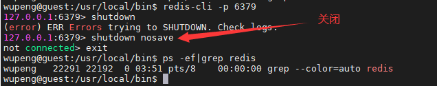
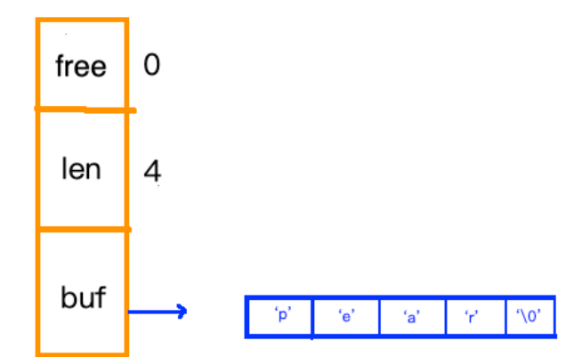
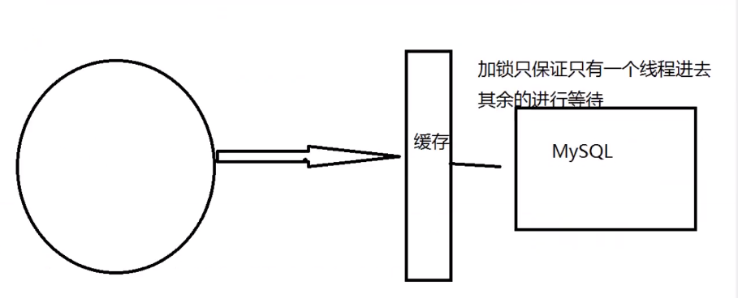

# NoSql

## 为什么要用NoSql

Not Only SQL 非关系型数据库。很多的数据类型用户的个人信息，社交网络，地理位置。这些数据类型的存储不需要一个固定的格式!不需要多余的操作就可以横向扩展的!Map<String,Object>使用键值对来控制!

> NoSql的特点（）：

1. 方便扩展（数据之间没有关系），

2. 大数据量高性能（Redis 一秒写8W次，读11W次，NoSQL的缓存记录级，是一种细粒度的缓存，性能会比较高!）

3. 数据类型是多样的，（不需要事先设计数据库，随取随用）

4. 传统 RDBMS和NoSQL的区别

5. > 传统的 RDBMS
	>
	> - 结构化组织
	> - SQL
	>
	> - 数据和关系都存在单独的表中
	> - 操作操作，数据定义语言
	> - 严格的一致性
	> - 基础的事务
	>
	> Nosql
	>
	> - 不仅仅是数据
	> - 没有固定的查询语言
	> - 键值对存储，列存储，文档存储，图形数据库（社交关系)
	> - 最终一致性，
	>
	> - CAP定理和BASE(异地多活)
	> - 高性能，高可用，高可扩

```bash
# 1、商品的基本信息
	名称、价格、商家信息;
	关系型数据库就可以解决了! MysQL / oracle
	淘宝内部的MysQL不是大家用的MysQL
#2、商品的描述、评论（文字比较多)
	文档型数据库中，MongoDB
#3、图片
	分布式文件系统FastDFS
	- 淘宝自己的 TFS
	- Google的 GFS
	- Hadoop  HDFS
	- 阿里云的  oss
#4、商品的关键字(搜索)
	- 搜索引擎 solr elasticsearch
	- ISearch: 多隆
#5、商品热门的波段信息
	- 内存数据库
	- Redis Tair、Memache. . .
#6、商品的交易，外部的支付接口
	- 三方应用
```

## NoSQL的四大分类

**KV键值对：**

- 新浪：Redis
- 美团：Redis+Tair
- 阿里百度：Redis+memecache

**文档型数据库( bson格式 和 json一样):**

- MongoDB （一般必须要掌握)

	- MongoDB是一个基于分布式文件存储的数据库，C++编写，主要用来处理大量的文档!

	- MongoDB是一个介于关系型数据库和非关系型数据中中间的产品!MongoD B是非关系型数据库中功能最丰富，最像关系型数据库的!

- ConthDB

**列存储数据库**

- HBase
- 分布式文件系统

**图关系数据库**

- 他不是存图形，放的是关系，比如∶朋友圈社交网络，广告推荐!
- Neo4j ,InfoGrid ;


# Redis

Redis ( **Re**mote **Di**ctionary **S**erver )，即**远程字典服务**!是一个开源的使用ANSlC语言编写、支持网络、可基于内存亦可持久化的日志型、Key-value数据库，并提供多种语言的API。

> Redis的作用

1. 内存存储、持久化（rdb、aof）
2. 效率高，可以用于高速缓存
3. 发布订阅系统
4. 地图信息分析
5. 计时器、计数器（浏览量!)

> 特性

1、多样的数据类型

2、持久化

3、集群

4、事务


 

性能测试

```shell
redis-benchmark -h localhost -p 6379 -c 100 -n 100000 #测试100个并发连接，每个连接10W个请求
```

## 基础知识


Redis默认有16个数据库，默认使用第0个数据库，通过`select `进行数据库切换，默认端口6379

```shell
select 3 #切换数据库
keys * #查看数据库所有的key
flushdb #清空当前数据库
flushall #清空全部数据库
```

> Redis是单线程

明白Redis是很快的，官方表示，Redis是基于内存操作，**CPU不是Redis性能瓶颈，Redis的瓶颈是根据机器的内存和网络带宽**，既然可以使用单线程来实现，就使用单线程了!所有就使用了单线程了!

**Redis为什么单线程还这么快**

核心: redis,是将所有的数据全部放在内存中的，所以说使用单线程去操作效率就是最高的，多线程(**CPU上下文会切换︰耗时的操作!!!** )，对于**内存系统来说，如果没有上下文切换效率就是最高的**!多次读写都是在一个CPU上的，在内存情况下，这个就是最佳的方案!

# Redis数据类型底层原理

- **单线程。Redis的性能瓶颈不在于CPU资源，而在于内存访问和网络IO**。而采用单线程的设计带来的好处是，极大简化了数据结构和算法的实现。相反，Redis通过异步IO和pipelining等机制来实现高速的并发访问。显然，单线程的设计，对于单个请求的快速响应时间也提出了更高的要求。

从Redis内部实现的角度来看，database内的这个映射关系是用一个dict来维护的。dict的key固定用一种数据结构来表达就够了，这就是动态字符串sds。而value则比较复杂**，为了在同一个dict内能够存储不同类型的value，这就需要一个通用的数据结构，这个通用的数据结构就是robj，全名是redisObject**

一个robj包含如下5个字段：

- type: 对象的数据类型。占4个bit。可能的取值有5种：OBJ_STRING, OBJ_LIST, OBJ_SET, OBJ_ZSET, OBJ_HASH，分别对应Redis对外暴露的5种数据结构
- encoding: 对象的内部表示方式（也可以称为编码）。占4个bit。可能的取值有10种，即前面代码中的10个OBJ_ENCODING_XXX常量。
- lru: 做LRU替换算法用，占24个bit。这个不是我们这里讨论的重点，暂时忽略。
- refcount: 引用计数。它允许robj对象在某些情况下被共享。
- ptr: 数据指针。指向真正的数据。比如，一个代表string的robj，它的ptr可能指向一个sds结构；一个代表list的robj，它的ptr可能指向一个quicklist。

> - redisObject就是Redis对外暴露的第一层面的数据结构：string, list, hash, set, sorted set，而每一种数据结构的底层实现所对应的是哪些第二层面的数据结构（dict, sds, ziplist, quicklist, skiplist等），则通过不同的encoding来区分。可以说，robj是联结两个层面的数据结构的桥梁。
> - 为多种数据类型提供一种统一的表示方式。
> - 允许同一类型的数据采用不同的内部表示，从而在某些情况下尽量节省内存。
> - 支持对象共享和引用计数。当对象被共享的时候，只占用一份内存拷贝，进一步节省内存。


## 动态字符串SDS

SDS是”simple dynamic string”的缩写。redis中所有场景中出现的字符串，基本都是由SDS来实现的

- 所有非数字的key。例如`set msg "hello world"` 中的key msg.
- 字符串数据类型的值。例如`` set msg “hello world”中的msg的值”hello wolrd”
- 非字符串数据类型中的“字符串值”。例如`RPUSH fruits "apple" "banana" "cherry"`中的”apple” “banana” “cherry”

**SDS长这样：**free:还剩多少空间   len:字符串长度  buf:存放的字符数组。



**空间分配原则：**为减少修改字符串带来的内存重分配次数，sds采用了“一次管够”的策略：

- 若修改之后sds长度小于1MB,则多分配现有len长度的空间
- 若修改之后sds长度大于等于1MB，则扩充除了满足修改之后的长度外，额外多1MB空间

## int

就是redis中存放的各种数字 包括一下这种，故意加引号“”的


## 双向链表

大概长这样：


分两部分，一部分是“统筹部分”：橘黄色，一部分是“具体实施方“：蓝色。

主体”统筹部分“：

- `head`指向具体双向链表的头
- `tail`指向具体双向链表的尾
- `len`双向链表的长度

具体”实施方”：一目了然的双向链表结构，有前驱`pre`有后继`next`，由`list`和`listNode`两个数据结构构成。

## ziplist

压缩列表。redis的**列表键**和**哈希键**的底层实现之一。此数据结构是为了节约内存而开发的。和各种语言的数组类似，它是由连续的内存块组成的，这样一来，由于内存是连续的，就减少了很多内存碎片和指针的内存占用，进而节约了内存。


然后文中的`entry`的结构是这样的：


## 哈希表

哈希表略微有点复杂。哈希表的制作方法一般有两种，一种是：`开放寻址法`，一种是`拉链法`。redis的哈希表的制作使用的是`拉链法`。


也是分为两部分：左边橘黄色部分和右边蓝色部分，同样，也是”统筹“和”实施“的关系。

## intset

整数集合是**集合键**的底层实现方式之一。


## 跳表

跳表这种数据结构长这样：


# 五大数据类型

Redis 是一种开源（BSD 许可）、内存中数据结构存储，用作**数据库**、**缓存**和**消息中间件MQ**。Redis 提供了诸如字符串、散列、列表、集合、有序集合与范围查询、位图、超级日志、地理空间索引和流等数据结构。Redis 内置复制、Lua 脚本、LRU 驱逐、事务和不同级别的磁盘持久化，并通过 Redis Sentinel 和 Redis Cluster 自动分区提供高可用性。

## Redis-Key

```shell
exists key #查看指定的key是否存在
move key 1 #移除指定的key 1代表当前的数据库
expire key 10 #使指定的key 10s后过期 用户的cookie，热点数据，做缓存，单点登录
```

**expire key 时间 使指定的key 多少秒后过期 用户的cookie，热点数据，做缓存，单点登录** 

## **String**


```shell
127.0.0.1:6379> set key1 v1 #设置值
OK
127.0.0.1:6379> get key1 #获得值
"v1"
127.0.0.1:6379> APPEND key1 hello #追加值
(integer) 7
127.0.0.1:6379> get key1
"v1hello"
127.0.0.1:6379> strlen key1 #值的长度
(integer) 7
127.0.0.1:6379>
###################################################

127.0.0.1:6379> keys *
1) "key1"
127.0.0.1:6379> set views 0
OK
127.0.0.1:6379> incr views #自增1
(integer) 1
127.0.0.1:6379> incr views	
(integer) 2
127.0.0.1:6379> get views
"2"
127.0.0.1:6379> decr views	#自减1
(integer) 1
127.0.0.1:6379> incrby views 10 #自增10
(integer) 11
127.0.0.1:6379>
#################################################

127.0.0.1:6379> set key hello,xiaowu 
OK
127.0.0.1:6379> get key
"hello,xiaowu"
127.0.0.1:6379> GETRANGE key 0 3  #获取区间值
"hell"
127.0.0.1:6379> GETRANGE key 0 -1   #获取全部字符串
"hello,xiaowu"
###################################################

127.0.0.1:6379> set key2 abcdefg
OK
127.0.0.1:6379> get key2
"abcdefg"
127.0.0.1:6379> SETRANGE key2 1 xx #替换字符串
(integer) 7
127.0.0.1:6379> get key2
"axxdefg"

###################################################

127.0.0.1:6379> setex key1 30 "hello" #这是带有过期时间的key 30s后过期
OK
127.0.0.1:6379> ttl key1
(integer) 20
127.0.0.1:6379> setnx mykey "redis"  # 设置key之前检查是否存在key,用于多线程环境下
(integer) 1
127.0.0.1:6379> setnx mykey "mogodb"
(integer) 0
############################################
127.0.0.1:6379> mset k1 v1 k2 v2 k3 v3  #同时设置多个值
OK
127.0.0.1:6379> keys *
1) "k1"
2) "k3"
3) "k2"
127.0.0.1:6379> mget k1 k2 k3 #同时获取多个值
1) "v1"
2) "v2"
3) "v3"
127.0.0.1:6379> msetnx k1 v1 k4 v4 #原子操作 设置不成功
(integer) 0
##########################################################

# 这里的key是一个巧妙的设计: user:{id}:{filed} ，如此设计在Redis中是完全OK了!
127.0.0.1:6379> mset user:1:name xiaowu user:1:age 19 #设置对象
OK
127.0.0.1:6379> keys *
1) "user:1:age"
2) "user:1:name"
127.0.0.1:6379> mget user:1:name user:1:age
1) "xiaowu"
2) "19"
#############################################################
127.0.0.1:6379> getset db redis  #如果不存在值,则返回ni1
(nil)
127.0.0.1:6379> get db
"redis"
127.0.0.1:6379> getset db mongodb  #如果存在值，获取原来的值，并设置新的值
"redis"
127.0.0.1:6379> get db
"mongodb"
```

## **List**

所有的list命令都是以`l`开头的


```bash

127.0.0.1:6379> lpush list one # 将一个值或者多个值，插入到列表头部（左)
(integer) 1
127.0.0.1:6379> lpush list two
(integer) 2
127.0.0.1:6379> lpush list three
(integer) 3
127.0.0.1:6379> LRANGE list  0 -1 #获取1ist中值!
1) "three"
2) "two"
3) "one"
127.0.0.1:6379> LRANGE list  0 1 #通过区间获取具体的值!
1) "three"
2) "two"
127.0.0.1:6379> rpush list 1234  #将一个值或者多个值，插入到列表头部（右)
(integer) 4
127.0.0.1:6379> LRANGE list  0 -1
1) "three"
2) "two"
3) "one"
4) "1234"
##################################################

127.0.0.1:6379> lpop list #移除左边的元素
"three"
127.0.0.1:6379> rpop list	#移除右边的元素
"1234"
127.0.0.1:6379> LRANGE list  0 -1
1) "two"
2) "one"
###############################################

127.0.0.1:6379> lindex list 0 #获取队列的第一个值
"two"
127.0.0.1:6379> lindex list 1
"one"
################################################
127.0.0.1:6379> llen list #获取list的长度
(integer) 2
127.0.0.1:6379> lpush list two
(integer) 3
127.0.0.1:6379> lrem list 1 two  #移除指定的1个值 精确匹配
(integer) 1
127.0.0.1:6379> lrange list 0 -1
1) "two"
2) "one"
####################################################

127.0.0.1:6379> lrange list 0 -1
1) "five"
2) "four"
3) "three"
4) "two"
5) "one"
127.0.0.1:6379> ltrim list 1 3 #截断，这个list已经被改变了，截断了只剩下截取的元素
OK
127.0.0.1:6379> lrange list 0 -1 
1) "four"
2) "three"
3) "two"
#####################################################
127.0.0.1:6379> lrange list 0 -1
1) "four"
2) "three"
3) "two"
127.0.0.1:6379> rpoplpush list mylist #组合命令
"two"
127.0.0.1:6379> lrange mylist 0 -1
1) "two"
127.0.0.1:6379> lrange list 0 -1
1) "four"
2) "three"
########################################################
127.0.0.1:6379> lset list 0 item1  #不存在时，不可用
(error) ERR no such key
127.0.0.1:6379> lpush list value1  
(integer) 1
127.0.0.1:6379> lrange list 0 -1
1) "value1"
127.0.0.1:6379> lset list 0 item1  #替换指定下标位置的值
OK
127.0.0.1:6379> lrange list 0 -1
1) "item1"
#######################################################

127.0.0.1:6379> linsert list before item1 item2  #将指定的value插入到指定的value前后
(integer) 2
127.0.0.1:6379> lrange list 0 -1
1) "item2"
2) "item1"
127.0.0.1:6379> linsert list after item1 item3
(integer) 3
127.0.0.1:6379> lrange list 0 -1
1) "item2"
2) "item1"
3) "item3"

```

## Set


```bash

127.0.0.1:6379> sadd set hello #集合中添加内容
(integer) 1
127.0.0.1:6379> sadd set xiaowu 
(integer) 1
127.0.0.1:6379> sadd set xiaowang
(integer) 1
127.0.0.1:6379> smembers set  #查看集合中的所有值
1) "xiaowang"
2) "xiaowu"
3) "hello"
127.0.0.1:6379> SISMEMBER set hello #查看集合中是否存在某些值
(integer) 1
127.0.0.1:6379> SISMEMBER set world
(integer) 0
#################################################################
127.0.0.1:6379> srem set hello #移除set中的元素
(integer) 1
127.0.0.1:6379> scard set  #查看set中元素的个数
(integer) 2
##########################################################
127.0.0.1:6379> SRANDMEMBER set  #随机抽选元素
"xiaowu"
127.0.0.1:6379> SRANDMEMBER set
"xiaowu"
127.0.0.1:6379> SRANDMEMBER set
"xiaowang"
127.0.0.1:6379> SRANDMEMBER set 2 #随机抽选2个元素
1) "xiaowang"
2) "xiaowu"
##########################################################
127.0.0.1:6379> spop set #随机删除一个元素
"xiaowang"
#######################################################

127.0.0.1:6379> sadd set xiaowang
(integer) 1
127.0.0.1:6379> sadd set hello
(integer) 1
127.0.0.1:6379> sadd set world
(integer) 1
127.0.0.1:6379> sadd myset xiaoli
(integer) 1
127.0.0.1:6379> smove set myset xiaowu #移动元素
(integer) 1
127.0.0.1:6379> smembers myset
1) "xiaowu"
2) "xiaoli"
#########################################################
127.0.0.1:6379> sadd key1 a
(integer) 1
127.0.0.1:6379> sadd key1 b
(integer) 1
127.0.0.1:6379> sadd key1 c
(integer) 1
127.0.0.1:6379> sadd key1 d
(integer) 1
127.0.0.1:6379> sadd key2 c
(integer) 1
127.0.0.1:6379> sadd key2 d
(integer) 1
127.0.0.1:6379> sadd key2 e
(integer) 1
127.0.0.1:6379> sdiff key1 key2  #差集
1) "b"
2) "a"
127.0.0.1:6379> sinter key1 key2  #交集  #共同好友
1) "c"
2) "d"
127.0.0.1:6379> sunion key1 key2  #并集
1) "a"
2) "d"
3) "b"
4) "e"
5) "c"

```

## Hash


key-Map

```bash
127.0.0.1:6379> hset hash field1 xiaowu # 创建hash表
(integer) 1
127.0.0.1:6379> hget hash field1		#获取
"xiaowu"
127.0.0.1:6379> hmset hash field1 hello field2 world  #创建多个
OK
127.0.0.1:6379> hmget hash field1 field2
1) "hello"
2) "world"
127.0.0.1:6379> hgetall hash
1) "field1"
2) "hello"
3) "field2"
4) "world"
############################################################

127.0.0.1:6379> hdel hash field1  #删除
(integer) 1
127.0.0.1:6379> hgetall hash
1) "field2"
2) "world"
#####################################
127.0.0.1:6379> hlen hash #获取长度
(integer) 1
127.0.0.1:6379> hgetall hash
1) "field2"
2) "world"
127.0.0.1:6379> hmset hash field1 xiaowu field3 xiaowang field xiaoli
OK
127.0.0.1:6379> hlen hash
(integer) 4
######################################
127.0.0.1:6379> hexists hash field1  #判断指定的键是否存在
(integer) 1
127.0.0.1:6379> hexists hash field10
(integer) 0
##################################################################
127.0.0.1:6379> hkeys hash   #获得所有的键
1) "field2"
2) "field1"
3) "field3"
4) "field"
127.0.0.1:6379> hvals hash    #获得所有的值
1) "world"
2) "xiaowu"
3) "xiaowang"
4) "xiaoli"
####################################################################
127.0.0.1:6379> hset hash field1 5  
(integer) 1
127.0.0.1:6379> hincrby hash field 1  #增加1
(integer) 1
127.0.0.1:6379> hsetnx hash field1 6   #如果键就设置失败
(integer) 0
127.0.0.1:6379> hsetnx hash field2 6   #如果不存在就设置成功
(integer) 1
127.0.0.1:6379> hgetall hash
1) "field1"
2) "5"
3) "field"
4) "1"
5) "field2"
6) "6"
```

## Zset


在set的基础上，增加了一个值，

```bash
127.0.0.1:6379> zadd zset 1 one  #添加一个值
(integer) 1
127.0.0.1:6379> zadd zset 2 two 3 three  #添加多个值
(integer) 2
127.0.0.1:6379> zrange zset 0 -1  #查看
1) "one"
2) "two"
3) "three"
##################################################################
127.0.0.1:6379> zadd salary 2500 xiaowang
(integer) 1
127.0.0.1:6379> zadd salary 3500 xiaowu
(integer) 1
127.0.0.1:6379> zadd salary 3000 xiaohe
(integer) 1
127.0.0.1:6379> zrangebyscore salary -inf +inf  #排序
1) "xiaowang"
2) "xiaohe"
3) "xiaowu"
127.0.0.1:6379> zrangebyscore salary -inf +inf withscores  #排序并显示权值
1) "xiaowang"
2) "2500"
3) "xiaohe"
4) "3000"
5) "xiaowu"
6) "3500"
127.0.0.1:6379> zrangebyscore salary -inf 3000 withscores
1) "xiaowang"
2) "2500"
3) "xiaohe"
4) "3000"
127.0.0.1:6379> ZREVRANGE salary 0 -1   #降序排列
1) "xiaowu"  
2) "xiaowang"

#########################################################################
127.0.0.1:6379> zrange salary  0 -1
1) "xiaowang"
2) "xiaohe"
3) "xiaowu"
127.0.0.1:6379> zrem salary xiaohe  #删除
(integer) 1
127.0.0.1:6379> zrange salary  0 -1
1) "xiaowang"
2) "xiaowu"
##########################################################################
127.0.0.1:6379> zcard salary  #统计集合里元素的个数
(integer) 2
######################################################################
127.0.0.1:6379> zadd zset 1 hello
(integer) 1
127.0.0.1:6379> zadd zset 2 xiaowang
(integer) 1
127.0.0.1:6379> zadd zset 3 xiaoli
(integer) 1
127.0.0.1:6379> zadd zset 4 xiaohe
(integer) 1
127.0.0.1:6379> zcount zset 1 3   #获取指定范围内的成员数量
(integer) 3

```

案例思路: set排序存储班级成绩表，工资表排序!
普通消息，1，重要消息 2，带权重进行判断!
排行榜应用实现

# 三种特殊数据类型

## geospatial

朋友定位，附近的人，打车距离计算。

Redis的Geo在Redis3.2版本就推出了!这个功能可以推算地理位置的信息，两地之间的距离，方圆几里的人 !、


```bash
# getadd 添加地理位置
# 规则:两级无法直接添加，我们一般会下载城市数据，直接通过java程序一次性导入!
# 参数 key值（纬度、经度、名称)
127.0.0.1:6379> geoadd china:city 116.40 39.90 beijin
(integer) 1
127.0.0.1:6379> geoadd china:city 121.47 31.23 shanghai
(integer) 1
127.0.0.1:6379> geoadd china:city 106.05 29.53 chongqin
(integer) 1
##############################################

127.0.0.1:6379> geopos china:city beijin  #获取指定城市经纬度
1) 1) "116.39999896287918091"
   2) "39.90000009167092543"
##################################################################
127.0.0.1:6379> geodist china:city beijin chongqin  #两地之间的距离
"1489643.1984"
127.0.0.1:6379> geodist china:city beijin chongqin km
"1489.6432"
#################################################################
127.0.0.1:6379> georadius china:city 110 30 1000 km  #查询给定经纬度半径内的人
1) "chongqin"
127.0.0.1:6379> georadius china:city 110 30 500 km
1) "chongqin"

```

## hyperloglog

## bitmap

# 事务

**Redis单条命令式保存原子性的，但是事务不保证原子性!**

**Redis事务没有隔离级别的概念!**

所有的命令在事务中，并没有直接被执行! 只有发起执行命令的时候才会执行!`Exec`

Redis 事务本质: 一组命令的集合! 一个事务中的所有命令都会被序列化，在事务执行过程的中，会按照顺序执行! 

**Redis 事务的主要作用其实就是串联多个命令防止别的命令插队**

**一次性、顺序性、排他性!**

redis事务：

- 开启事务（`multi`）
- 命令入队（.....）
- 执行事务（`exec`）

```bash
127.0.0.1:6379> multi   #开启事务
OK
127.0.0.1:6379(TX)> set k1 v1
QUEUED
127.0.0.1:6379(TX)> set k2 v2
QUEUED
127.0.0.1:6379(TX)> set k3 v3
QUEUED
127.0.0.1:6379(TX)> set k4 v4
QUEUED
127.0.0.1:6379(TX)> get k2
QUEUED
127.0.0.1:6379(TX)> exec
1) OK
2) OK
3) OK
4) OK
5) "v2"
############################################################

127.0.0.1:6379> multi  
OK
127.0.0.1:6379(TX)> set k4 v3
QUEUED
127.0.0.1:6379(TX)> set k2 v2
QUEUED
127.0.0.1:6379(TX)> get k2
QUEUED
127.0.0.1:6379(TX)> DISCARD  #放弃事务， 队列里的都不会执行
OK
################################################################
# 编译时异常（命令错误），事务的所有都不会执行
# 运行时异常（1/0等），其他命令可以执行
#################################################################

```

# 监控 watch 

**悲观锁**：很悲观，什么时候都会出现问题，无论做什么都会加锁

**乐观锁**：很乐观, 认为什么时候都不会出问题, 所以不会上锁! 更新数据的时候去判断一下, 在此期间是否有人修改过这个数据。 mysql的`version`，Redis 的`watch`:    1. 获取`version`     2.更新的时候比较`version`

```bash
127.0.0.1:6379> set money 100
OK
127.0.0.1:6379> set out 0
OK
127.0.0.1:6379> watch money   #监视money对象，
OK
127.0.0.1:6379> multi   #事务正常结束，
OK
127.0.0.1:6379(TX)> decrby money 20
QUEUED
127.0.0.1:6379(TX)> incrby out 20
QUEUED
127.0.0.1:6379(TX)> exec
1) (integer) 80
2) (integer) 20
###########################################################
#线程1 执行转账
127.0.0.1:6379> watch money   #加锁 乐观锁
OK
127.0.0.1:6379> multi
OK
127.0.0.1:6379(TX)> decrby money 20
QUEUED
127.0.0.1:6379(TX)> incrby out 20
QUEUED
127.0.0.1:6379(TX)> exec  #执行失败
(nil)
#线程2 在转账成功之前进行了充值
127.0.0.1:6379> get money
"80"
127.0.0.1:6379> incrby money 100
(integer) 180

```

# Jedis

是Redis官方推荐的java连接开发工具!使用Java操作Redis中间件!

# Spring boot整合Redis

说明: 在SpringBoot2.x之后,原来使用的jedis被替换为了lettuce?

jedis: 采用的直连, 多个线程操作的话,是不安全的,如果想要避免不安全的,使用jedis pool 连接池! BIO

lettuce: 采用netty ,实例可以再多个线程中进行共享,不存在线程不安全的情况!可以减少线程数据了，更像NIO]模式

Netty相关知识链接：https://developer.aliyun.com/article/769587

# redis-conf详解

> 单位：大小写不敏感


> 包含：导入多个配置文件


> 网络

```bash
bind 127.0.0.1  #绑定的IP 只能本地访问，如果远程能访问需要 bind * 或者指定IP
protected-mode yes #保护模式
port 6379 #端口设置
```

> 通用703

```bash
daemonize yes  #以守护进程的方式运行， 默认是no，我们需要 自己开启为yes!
pidfile /var/run/redis_ _6379.pid  #如果以后台的方式运行，我们就需要指定一个pid文件!
#日志
# Specify the seryer verbosity 1eve1.
# This can be one of:
# debug (a 1ot of information， usefu1 for deve1 opment/testing)
# verbose (many rarely usefu1 info，but not a mess like the debug 1eve1)
# notice (moderately verbose, what you want in production probab1y)
# warning (only very important / critical messages are logged)
1ogleve1 notice
logfile ""  #日志的文件位置名
databases 16  #数据库的数量，默认是16个数据库
always-show-1ogo yes  #是否总是显示LOGO
```

> 快照

持久化，在规定的时间内,执行了多少次操作,则会持久化到文件.rdb. aof

redis 是内存数据库，如果没有持久化,那么数据断电及失!

```bash
save 900 1 #如果900s内，如果至少有一个1 key进行了修改，我们及进行持久化操作
save 300 10 #如果300s内，如果至少有一个10 key进行了修改，我们及进行持久化操作
save 60 10000 #如果60s内，如果至少有一个10000 key进行了修改，我们及进行持久化操作

stop-writes-on-bgsave-error yes #持久化如果出错，是否还需要继续工作!

rdbcompression yes #是否压缩rdb 文件，需要消耗一些cpu资源

rdbchecksum yes #保存rdb文件的时候，进行错误的检查校验!

dir ./  # rdb文件保存的目录!

```

> 主从复制


> 安全

```bash
127.0.0.1:6379> config get requirepass
1) "requirepass"
2) ""
127.0.0.1:6379> ping
(error) NOAUTH Authentication required.
127.0.0.1:6379> config set requirepass "wp19970426"  #设置密码
OK
127.0.0.1:6379> auth wp19970426   #登录
OK
127.0.0.1:6379> config get requirepass  #获取密码
1) "requirepass"
2) "wp19970426"
```

> 限制

```bash
maxclients 10000  #设置能连接上redis的最大客户端的数量
maxmemory <bytes>  # redis配置最大的内存容量
maxmemory-policy noeviction  # 内存到达上限之后的处理策略
	1、volatile-lru: 只对设置了过期时间的key进行LRU (默认值)
	2、allkeys-1ru : 删除1ru算法的key
	3、volatile-random: 随机删除即将过期key
	4、al1keys-random: 随机删除
	5、volatile-tt1 : 删除即将过期的
	6、noeviction : 永不过期， 返回错误

```

> APPEND ONLY  aof模式

```bash
appendonly no  #默认是不开启aof模式的，默认是使用rdb方式持久化的，在大部分所有的情况下，rdb完全够用!
appendfilename " appendonly.aof" #持久化的文件的名字

# appendfsync always  #每次修改都会sync。 消耗性能
appendfsync everysec  #每秒执行一次sync，可能会丢失这1s的数据!
# appendfsync no      #不执行sync, 这个时候操作系统自己同步数据，速度最快!

```

# Redis持久化

Redis是内存数据库,如果不将内存中的数据库状态保存到磁盘,那么一旦服务器进程退出,服务器中的数据库状态也会消失。所
以Redis提供了持久化功能!

## RDB（Redis DataBase）


在指定的时间间隔内将内存中的数据集快照写入磁盘, 也就是行话讲的Snapshot快照, 它恢复时是将快照文件直接读到内存里。

Redis会单独创建( fork ) 一个子进程来进行持久化,**会先将数据写入到一个临时文件中,待持久化过程都结束了,再用这个临时文
件替换上次持久化好的文件**。整个过程中,主进程是不进行任何I0操作的。这就确保了极高的性能。如果需要进行大规模数据的恢
复，且对于数据恢复的完整性不是非常敏感,那RDB方式要比AOF方式更加的高效。RDB的缺点是最后一次持久化后的数据可能丢
失。**rdb保存的文件是dump.rdb**

触发机制：

1、save的规则满足的情况下,会自动触发rdb规则

2、执行flushall命令,也会触发我们的rdb规则!

3、退出redis ,也会产生rdb文件!|

优点：

1. 适合大规模的数据恢复，
2. 对数据的完整性要求不高

缺点：

1. 需要一定的时间间隔进程操作!如果redis意外宕机了,这个最后- -次修改数据就没有的了!
2. fork进程的时候,会占用-定的内容空间! !

##  aof(Append only File)

将我们的所有命令都记录下来, history ,恢复的时候就把这个文件全部在执行一遍 ! 


**以日志的形式来记录每个写操作**, 将Redis执行过的所有指令记录下来(读操作不记录) , 只许追加文件但不可以改写文件, redis
启动之初会读取该文件重新构建数据,换言之, redis重启的话就根据日志文件的内容将写指令从前到后执行一次以完成数据的恢复
工作

# Redis 发布订阅

Redis发布订阅(pub/sub)是一种**消息通信模式**: 发送者(pub)发送消息, 订阅者(sub)接收消息。微信、微博、关注系统!

Redis客户端可以订阅任意数量的频道。

订阅/发布消息图:

第一个: 消息发送者，第二个: 频道   第三个: 消息订阅者!


> 命令

这些命令被广泛用于构建即时通信应用,比如网络聊天室(chatroom)和实时广播、实时提醒等。

```bash
#发布端
root@guest:/usr/local/bin# redis-cli -p 6379
127.0.0.1:6379> publish xiaowushuo "6666"  #发布信息
(integer) 1
127.0.0.1:6379> publish xiaowushuo "hello redis"
(integer) 1
# 订阅端
127.0.0.1:6379> subscribe xiaowushuo  #订阅一个频道
Reading messages... (press Ctrl-C to quit)
1) "subscribe"
2) "xiaowushuo"
3) (integer) 1   #等待接收信息
1) "message"   
2) "xiaowushuo"   #那个频道
3) "6666"				#消息内容
1) "message"
2) "xiaowushuo"
3) "hello redis"
```

> 原理

Redis通过PUBLISH、SUBSCRIBE 和SUBSCRIBE等命令实现发布和订阅功能。

通过SUBSCRIBE命令订阅某频道后, redis-server 里维护了一个字典,字典的键就是一个个channel , 而字典的值则是一个链
表, 链表中保存了所有订阅这个channel的客户端。SUBSCRIBE 命令的关键, 就是将客户端添加到给定channel的订阅链表中。
通过PUBLISH命令向订阅者发送消息, redis-server会使用给定的频道作为键, 在它所维护的channel字典中查找记录了订阅这
个频道的所有客户端的链表, 遍历这个链表, 将消息发布给所有订阅者。


Pub/Sub从字面上理解就是发布( Publish )与订阅( Subscribe ) , 在Redis中,你可以设定对某一个key值进行消息发布及消息订
阅, 当一个key值上进行了消息发布后, 所有订阅它的客户端都会收到相应的消息。这一功能最明显的用法就是用作实时消息系
统, 比如普通的即时聊天, 群聊等功能。

# Redis主从复制

主从复制, 是指将一台Redis服务器的数据, 复制到其他的Redis服务器。前者称为主节点(master/leader) , 后者称为从节点
(slave/follower) ; 数据的复制是单向的, 只能由主节点到从节点**Master以写为主 , Slave 以读为主。**

**默认情况下,每台Redis服务器都是主节点;**

且一个主节点可以有多个从节点(或没有从节点) ,但-一个从节点只能有一个主节点。


**主从复制的主要作用：**

1、数据冗余: 主从复制实现了数据的热备份, 是持久化之外的一种数据冗余方式。

2、故障恢复: 当主节点出现问题时, 可以由从节点提供服务, 实现快速的故障恢复; 实际上是一种服务的冗余。

3、负载均衡: 在主从复制的基础上,配合读写分离,可以由主节点提供写服务,由从节点提供读服务(即写Redis数据时应用连接
主节点, 读Redis数据时应用连接从节点) , 分担服务器负载; 尤其是在写少读多的场景下, 通过多个从节点分担读负载, 可以大
大提高Redis服务器的并发量。

4、高可用（集群）基石: 除了上述作用以外,主从复制还是**哨兵和集群**能够实施的基础,因此说主从复制是Redis高可用的基础。

一般来说, 要将Redis运用于工程项目中,只使用一台Redis是万万不能的(宕机) , 原因如下:

1、从结构上, 单个Redis服务器会发生单点故障, 并且一台服务器需要处理所有的请求负载,压力较大;

2、从容量上,单个Redis服务器内存容量有限, 就算一台Redis服务器内存容量为256G ,也不能将所有内存用作Redis存储内存, 一般来说 , **单台Redis最大使用内存不应该超过20G**。

电商网站上的商品，一般都是一次上传, 无数次浏览的, 说专业点也就是**"多读少写"**。

## 环境配置

```bash
127.0.0.1:6379> info replication  #查看当前库的信息
# Replication 
role:master  #角色 master
connected_slaves:0   #没有从机
master_failover_state:no-failover
master_replid:3c3193be586cac16e894f9a72ee05a20c05abb72
master_replid2:0000000000000000000000000000000000000000
master_repl_offset:0
second_repl_offset:-1
repl_backlog_active:0
repl_backlog_size:1048576
repl_backlog_first_byte_offset:0
repl_backlog_histlen:0
###############################################

```

构建集群需要配置文件

1. 复制配置文件
2. 修改端口号、pid名字、log文件名字、dump.rdb名字

修改完成后启动服务器


配置从机

```bash
127.0.0.1:6380> slaveof 127.0.0.1 6379  #认老大
OK
127.0.0.1:6380> info replication
# Replication
role:slave
master_host:127.0.0.1
master_port:6379
master_link_status:up
master_last_io_seconds_ago:3
master_sync_in_progress:0
slave_repl_offset:14
slave_priority:100
slave_read_only:1
replica_announced:1
connected_slaves:0
master_failover_state:no-failover
master_replid:a6b383ebe17406b9643f419e08ad2bf7b03f42ec
master_replid2:0000000000000000000000000000000000000000
master_repl_offset:14
second_repl_offset:-1
repl_backlog_active:1
repl_backlog_size:1048576
repl_backlog_first_byte_offset:1
repl_backlog_histlen:14
########################################################################
127.0.0.1:6379> info replication
# Replication
role:master
connected_slaves:2
slave0:ip=127.0.0.1,port=6380,state=online,offset=630,lag=0
slave1:ip=127.0.0.1,port=6381,state=online,offset=630,lag=0
master_failover_state:no-failover
master_replid:a6b383ebe17406b9643f419e08ad2bf7b03f42ec
master_replid2:0000000000000000000000000000000000000000
master_repl_offset:630
second_repl_offset:-1
repl_backlog_active:1
repl_backlog_size:1048576
repl_backlog_first_byte_offset:1
repl_backlog_histlen:630
```

真实主从配置需要从配置文件中修改，达到永久配置的作用，主机中可以写，从机只能读

> 复制原理

Slave启动成功连接到master后会发送一个sync同步命令

Master接到命令, 启动后台的存盘进程, 同时收集所有接收到的用于修改数据集命令, 在后台进程执行完毕之后, **master将传
送整个数据文件到slave ,并完成一次完全同步。**

**全量复制**: 而slave服务在接收到数据库文件数据后, 将其存盘并加载到内存中。

**增量复制**: Master继续将新的所有收集到的修改命令依次传给slave ,完成同步

但是只要是重新连接master , 一次完全同步(全量复制)将被自动执行

# 哨兵模式

# Redis缓存穿透和雪崩

Redis缓存的使用, 极大的提升了应用程序的性能和效率, 特别是数据查询方面。但同时, 它也带来了一些问题。 其中, 最要害的
问题, 就是数据的一致性问题, 从严格意义上讲, 这个问题无解。**如果对数据的一致性要求很高, 那么就不能使用缓存。**

另外的一些典型问题就是, 缓存穿透、缓存雪崩和缓存击穿。目前, 业界也都有比较流行的解决方案。


## **缓存穿透**：

缓存穿透的概念很简单, 用户想要查询一个数据, 发现redis内存数据库没有, 也就是缓存没有命中, 于是向持久层数据库查询。发现也没有, 于是本次查询失败。当用户很多的时候, 缓存都没有命中, 于是都去请求了持久层数据库。这会给持久层数据库造成很大的压力, 这时候就相当于出现了**缓存穿透**。

**解决方案：**

> 1. 布隆过滤器

布隆过滤器是一种**数据结构** ,**对所有可能查询的参数以hash形式存储**, 在**控制层**先进行校验, 不符合则丢弃, 从而避免了对底层存储系统的查询压力;


> 2. 缓存空对象

当存储层不命中后, 即使返回的空对象也将其缓存起来, 同时会设置一个过期时间, 之后再访问这个数据将会从缓存中获取, 保护了后端数据源;


但是这种方法会存在两个问题:
1、如果空值能够被缓存起来,这就意味着缓存需要**更多的空间存储**更多的键,因为这当中可能会有很多的空值的键;
2、即使对空值设置了过期时间, 还是会存在**缓存层和存储层的数据会有一段时间窗口的不一致**,这对于需要保持一致性的业务会
有影响。

## 缓存击穿

这里需要注意和缓存穿透的区别, 缓存击穿, 是指一个key非常热点, 在不停的扛着大并发, 大并发集中对这一个点进行访问, 当这个key在失效的瞬间, 持续的大并发就穿破缓存, 直接请求数据库, 就像在一个屏障上凿开了一个洞。

当某个key在过期的瞬间, 有大量的请求并发访问, 这类数据一般是热点数据, 由于缓存过期, 会同时访问数据库来查询最新数据, 并且回写缓存, 会导使数据库瞬间压力过大。

**解决方案：**

> 设置热点数据永不过期

从缓存层面来看, 没有设置过期时间, 所以不会出现热点key过期后产生的问题。

> 加互斥锁

分布式锁: 使用分布式锁, 保证对于每个key同时只有一个线程去查询后端服务, 其他线程没有获得分布式锁的权限, 因此只需要
等待即可。这种方式将高并发的压力转移到了分布式锁, 因此对分布式锁的考验很大。



## 缓存雪崩

缓存雪崩, 是指在某一个时间段, 缓存集中过期失效。

产生雪崩的原因之一 , 比如在写本文的时候, 马上就要到双十二零点, 很快就会迎来一波抢购, 这波商品时间比较集中的放入了缓
存, 假设缓存一个小时。 那么到了凌晨一点钟的时候, 这批商品的缓存就都过期了。而对这批商品的访问查询, 都落到了数据库上, 对于数据库而言, 就会产生周期性的压力波峰。于是所有的请求都会达到存储层, 存储层的调用量会暴增, 造成存储层也会挂掉的情况。


其实集中过期, 倒不是非常致命, 比较致命的缓存雪崩, 是**缓存服务器某个节点宕机或断网**。因为自然形成的缓存雪崩, 一定是在某个时间段集中创建缓存,这个时候,数据库也是可以顶住压力的。无非就是对数据库产生周期性的压力而已。而缓存服务节点的宕机,对数据库服务器造成的压力是不可预知的,很有可能瞬间就把数据库压垮。

**解决方案：**

> Redis高可用

这个思想的含义是, 既然redis有可能挂掉, 那我多增设几台redis , 这样一台挂掉之后其他的还可以继续工作, 其实就是搭建的集
群。(异地多活! )

> 限流降级

这个解决方案的思想是,在缓存失效后,通过加锁或者队列来控制读数据库写缓存的线程数量。比如对某个key只允许一个线程查询数据和写缓存, 其他线程等待。

> 数据预热

数据加热的含义就是在正式部署之前，我先把可能的数据先预先访问一遍，这样部分可能大量访问的数据就会加载到缓存中。在即
将发生大并发访问前手动触发加载缓存不同的key，设置不同的过期时间，让缓存失效的时间点尽量均匀。

# Redis线程安全问题

参考链接：https://www.cnblogs.com/javastack/p/14873662.html

我们都知道 Redis 是单线程的，可是它怎么会有 线程安全 问题呢？

我们正常理解的线程安全问题是指`单进程多线程`模型内部多个线程`操作进程内共享内存`导致的数据资源充突。而 **Redis 的线程安全问题的产生，并不是来自于 Redis 服务器内部。**

Redis 作为数据服务器，就相当于多个客户端的共享内存，多个客户端就相当于同一进程下的多个线程，如果多个客户端之间没有良好的数据同步策略，就会产生类似线程安全的问题。

典型场景：

- Redis 内存储了一个用户的状态： `user5277=idle`；
- 客户端连接 A 读取了用户状态，获取到用户的空闲状态 `status = get("user5277")`；
- 客户端连接 B 也同样读取了用户状态；
- 客户端连接 A 给用户安排了一个任务，并将 Redis 内用户状态置为忙碌 `set("user5277", "busy")`；
- 客户端连接 B 同样设置用户为忙碌状态。
- 可是此时用户却被同时分配了两个任务。

**效率问题：**

效率优化要从网络做起，服务端又是优化代码，又是优化数据库，不如网络连接的一次优化，而**网络优化最有效的就是减少请求数**。我们要知道执行一次内存访问的耗时约是 `100ns`，而不同机房之间来回一次约需要 `500000ns`，其中的差距可想而知。

Redis在单机内效率超高，但工业化部署总不会把服务器和 Redis 放在同一台机器上，如果触碰到效率瓶颈的话，那就是网络。

典型场景就是我们从 Redis 里读出一条数据，再使用这条数据做键，读取另外一条数据。这样来来回回，便有两次网络往返。

导致这种问题的原因就是 Redis 的普通命令没有服务端计算的能力，无法在服务器进行复合命令操作，虽然有 Redis 也提供了 `pipeline` 的特性，但它需要多个命令的请求和响应之间没有依赖关系。想简化多个相互依赖的命令就只能将数据拉回客户端，由客户端处理后再请求 Redis。

综上，我们要更高效更方便的使用 Redis 就需要自己“定制”一些命令了。


Lua 脚本的使用可以通过 Redis 的 `EVAL` 和 `EVALSHA` 命令。

`EVAL` 适用于单次执行 Lua 脚本，执行脚本前会由脚本内容生成 sha1 校验和，在函数表内查询函数是否已定义，如未定义执行成功后 Redis 会在全局表里缓存这个脚本的校验和为函数名，后续再次执行此命令就不会再创建新的函数了。

而要使用 `EVALSHA` 命令，就得先使用 `SCRIPT LOAD` 命令先将函数加载到 Redis，Redis 会返回此函数的 sha1 校验和， 后续就可以直接使用这个校验和来执行命令了。

