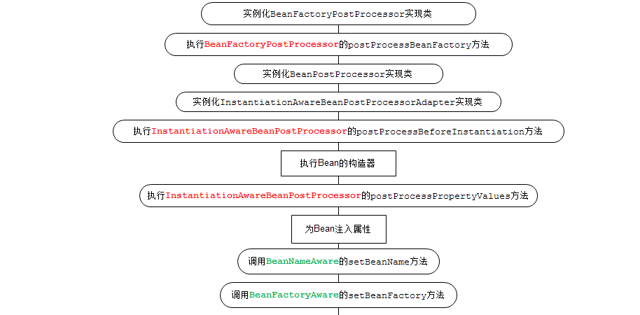

@Bean注解的实现原理

1. spring在扫描到配置类(加了@Configuration注解的类)，会获取到所有的注解方法，获取到其中加了@Bean注解的方法，并将对应的方法存到集合中（BeanAnnotationHelper类）
2. 在完成@ComponentScan注解的解析之后，遍历第一步中的集合，一次获取到beanMethod
3. 对每个beanMethod，声明一个ConfigurationClassBeanDefinition类型的beanDefinition对象，然后根据@Bean的配置，设置beanDefinition的属性信息
4. 最后将beanName和beanDefinition对象存入到beanDefinitionMap中

# IOC

**无侵入容器**：在设计上，Spring的IoC容器是一个高度可扩展的无侵入容器。所谓无侵入，是指应用程序的组件无需实现Spring的特定接口，或者说，组件根本不知道自己在Spring的容器中运行。这种无侵入的设计有以下好处：

1. 应用程序组件既可以在Spring的IoC容器中运行，也可以自己编写代码自行组装配置；
2. 测试的时候并不依赖Spring容器，可单独进行测试，大大提高了开发效率。

## ApplicationContext

```java
//加载配置文件创建IOC容器
ApplicationContext context = new ClassPathXmlApplicationContext("application.xml");
```

获得了`ApplicationContext`的实例，就获得了IoC容器的引用。从`ApplicationContext`中我们可以根据Bean的ID获取Bean，但更多的时候我们根据Bean的类型获取Bean的引用：

```java
UserService userService = context.getBean(UserService.class);
```

Spring还提供另一种IoC容器叫`BeanFactory`，使用方式和`ApplicationContext`类似：

```java
BeanFactory factory = new XmlBeanFactory(new ClassPathResource("application.xml"));
MailService mailService = factory.getBean(MailService.class);
```

** `BeanFactory`和`ApplicationContext`的区别在于:** `BeanFactory`的实现是按需创建，即第一次获取Bean时才创建这个Bean，而`ApplicationContext`会一次性创建所有的Bean。**实际上，`ApplicationContext`接口是从`BeanFactory`接口继承而来的，并且，`ApplicationContext`提供了一些额外的功能，包括国际化支持、事件和通知机制等。**

--------------

<font color=red>**基于注解的配置：**</font>

```java
//启动类
@Configuration
@ComponentScan //自动扫描当前类所在的包及子包，所有标注为@Component的Bean自动创建出来，并根据@Autowired进行装配。
public class AppConfig {
    public static void main(String[] args) {
        ApplicationContext context = new AnnotationConfigApplicationContext(AppConfig.class);
        UserService userService = context.getBean(UserService.class);
        User user = userService.login("bob@example.com", "password");
        System.out.println(user.getName());
    }
}
```

---------------------------

<font color=red>**Bean 的作用域：**</font>

对于Spring容器来说，当我们把一个Bean标记为`@Component`后，它就会自动为我们创建一个单例（Singleton），即容器初始化时创建Bean，容器关闭前销毁Bean。在容器运行期间，我们调用`getBean(Class)`获取到的Bean总是同一个实例。

> 单例Bean的线程安全问题：将单例Bean内需要变化的成员变量定义为ThreadLocal 的实例
>
> **spring为什么默认使用单例：**
>
> spring在获取bean时会首先判断是单例的还是原型的，如果是单例的会尝试在缓存（Map）中获取，获取不到在创建。
>
> 优点：1.减少创建实例的开销，2.减少GC的开销，3.加快获取实例。
>
> 缺点：线程不安全，原型也不是绝对安全，他可能依赖于单例实例。

还有一种Bean，我们每次调用`getBean(Class)`，容器都返回一个新的实例，这种Bean称为Prototype（原型），它的生命周期显然和Singleton不同。声明一个Prototype的Bean时，需要添加一个额外的`@Scope`注解：

```java
@Component
@Scope(ConfigurableBeanFactory.SCOPE_PROTOTYPE) // @Scope("prototype")
public class MailSession {
    ...
}
```

--------------------------

**List注入：**将相同类型的对象封装成一个List注入，可以使用@Order()来表示顺序性。参考https://www.liaoxuefeng.com/wiki/1252599548343744/1308043627200545

--------------------------------

**可选注入**：默认情况下，当我们标记了一个`@Autowired`后，Spring如果没有找到对应类型的Bean，它会抛出`NoSuchBeanDefinitionException`异常。可以给`@Autowired`增加一个`required = false`的参数：

```java
@Component
public class MailService {
    @Autowired(required = false)
    ZoneId zoneId = ZoneId.systemDefault();
    ...
}
```

这个参数告诉Spring容器，如果找到一个类型为`ZoneId`的Bean，就注入，如果找不到，就忽略。

---------------------------------------

**创建第三方Bean**:

如果一个Bean不在我们自己的package管理之内, 我们自己在`@Configuration`类中编写一个Java方法创建并返回它，注意给方法标记一个`@Bean`注解：Spring对标记为`@Bean`的方法只调用一次，因此返回的Bean仍然是单例。

```java
@Configuration
@ComponentScan
public class AppConfig {
    // 创建一个Bean:
    @Bean
    ZoneId createZoneId() {
        return ZoneId.of("Z");
    }
}
```

-------------------------------------------

**初始化和销毁**：一个Bean在注入必要的依赖后，需要进行初始化（监听消息等）。在容器关闭时，有时候还需要清理资源（关闭连接池等）。我们通常会定义一个`init()`方法进行初始化，定义一个`shutdown()`方法进行清理

```yml
<dependency>
    <groupId>javax.annotation</groupId>
    <artifactId>javax.annotation-api</artifactId>
    <version>1.3.2</version>
</dependency>
```

在Bean的初始化和清理方法上标记`@PostConstruct`和`@PreDestroy`：

```java
@Component
public class MailService {
    @Autowired(required = false)
    ZoneId zoneId = ZoneId.systemDefault();

    @PostConstruct
    public void init() {
        System.out.println("Init mail service with zoneId = " + this.zoneId);
    }

    @PreDestroy
    public void shutdown() {
        System.out.println("Shutdown mail service");
    }
}
```

Spring容器会对上述Bean做如下初始化流程：

- 调用构造方法创建`MailService`实例；
- 根据`@Autowired`进行注入；
- 调用标记有`@PostConstruct`的`init()`方法进行初始化。

而销毁时，容器会首先调用标记有`@PreDestroy`的`shutdown()`方法。

Spring只根据Annotation查找*无参数*方法，对方法名不作要求。

****************

**使用别名**：默认情况下，对一种类型的Bean，容器只创建一个实例。但有些时候，我们需要对一种类型的Bean创建多个实例。例如，同时连接多个数据库，就必须创建多个`DataSource`实例。

如果我们在`@Configuration`类中创建了多个同类型的Bean：可以用`@Bean("name")`指定别名，也可以用`@Bean`+`@Qualifier("name")`指定别名。

```java
@Configuration
@ComponentScan
public class AppConfig {
    @Bean("z")
    ZoneId createZoneOfZ() {
        return ZoneId.of("Z");
    }

    @Bean
    @Qualifier("utc8")
    ZoneId createZoneOfUTC8() {
        return ZoneId.of("UTC+08:00");
    }
}

//注入
@Component
public class MailService {
	@Autowired(required = false)
	@Qualifier("z") // 指定注入名称为"z"的ZoneId
	ZoneId zoneId = ZoneId.systemDefault();
    ...
}
```

---------------------------

## BeanFactory 和 FactoryBean

> 请不要混淆BeanFactory 和 FactoryBean。

**FactoryBean**: Spring中FactoryBean最为典型的一个应用就是用来创建AOP的代理对象, 不仅如此，而且对理解Mybatis核心源码也非常有帮助！

-------------------

**BeanFactory **

BeanFactory，以Factory结尾，表示它是一个工厂(接口)， 它负责生产和管理bean的一个工厂。在Spring中，BeanFactory是工厂的顶层接口，也是IOC容器的核心接口，因此BeanFactory中定义了**管理Bean的通用方法**，如 **getBean** 和 **containsBean** 等，它的职责包括：实例化、定位、配置应用程序中的对象及建立这些对象间的依赖。BeanFactory只是个接口，并不是IOC容器的具体实现，所以Spring容器给出了很多种实现，如 **DefaultListableBeanFactory**、**XmlBeanFactory**、**ApplicationContext**等，其中XmlBeanFactory就是常用的一个，该实现将以XML方式描述组成应用的对象及对象间的依赖关系。

使用场景：

1、从Ioc容器中获取Bean(byName or byType)
2、检索Ioc容器中是否包含指定的Bean
3、判断Bean是否为单例

-------------------------------------

**FactoryBean**

首先FactoryBean是一个Bean，但又不仅仅是一个Bean，这样听起来矛盾，但为啥又这样说呢？其实在Spring中，所有的Bean都是由BeanFactory（也就是IOC容器）来进行管理的。但对FactoryBean而言，<font color=red>**这个FactoryBean不是简单的Bean，而是一个能生产或者修饰对象生成的工厂Bean,它的实现与设计模式中的工厂模式和修饰器模式类似**</font>

为什么要有FactoryBean：

一般情况下，Spring通过反射机制利用的class属性指定实现类实例化Bean。至于为什么会有FactoryBean？原因有两个：

1. 在某些情况下，实例化Bean过程比较复杂，如果按照传统的方式，则需要在中提供大量的配置信息。配置方式的灵活性是受限的，这时采用编码的方式可能会得到一个简单的方案。Spring为此提供了一个`org.springframework.bean.factory.FactoryBean`的工厂类接口，**用户可以通过实现该接口定制实例化Bean的逻辑**。FactoryBean接口对于Spring框架来说占用重要的地位，Spring自身就提供了70多个FactoryBean的实现。它们隐藏了实例化一些复杂Bean的细节，给上层应用带来了便利。
2. 由于第三方库不能直接注册到spring容器，于是可以实现`org.springframework.bean.factory.FactoryBean`接口，然后给出自己对象的实例化代码即可。

源码

```java
public interface FactoryBean<T> {
	//从工厂中获取bean【这个方法是FactoryBean的核心】
	@Nullable
	T getObject() throws Exception;
	
	//获取Bean工厂创建的对象的类型【注意这个方法主要作用是：该方法返回的类型是在ioc容器中getbean所匹配的类型】
	@Nullable
	Class<?> getObjectType();
	
	//Bean工厂创建的对象是否是单例模式
	default boolean isSingleton() {
		return true;
	}
}
```

**getobject ()方法会返回该FactoryBean “生产” 的对象实例,我们需要实现该方法以给出自己的对象实例化逻辑;**

FactoryBean表现的是一个工厂的职责。<font color=red> **即一个Bean A如果实现了FactoryBean接口，那么A就变成了一个工厂，根据A的名称获取到的实际上是工厂调用getObject()返回的对象，而不是A本身，如果要获取工厂A自身的实例，那么需要在名称前面加上'&'符号。**</font> 通俗点表达就是

>getObject(' name ')返回工厂中的实例
>getObject(' &name ')返回工厂本身的实例

**使用场景：**

1.FactoryBean在Spring中最为典型的一个应用就是用来创建AOP的代理对象。AOP实际上是Spring在运行时创建了一个代理对象，也就是说这个对象，是我们在运行时创建的，而不是一开始就定义好的，这很符合工厂方法模式。更形象地说，AOP代理对象通过Java的反射机制，在运行时创建了一个代理对象，在代理对象的目标方法中根据业务要求织入了相应的方法。这个对象在Spring中就是——**ProxyFactoryBean**。

FactoryBean为我们实例化Bean提供了一个更为灵活的方式，我们可以通过FactoryBean创建出更为复杂的Bean实例。

2.Mybatis中的**SqlSessionFactoryBean**

3.阿里开源的分布式服务框架 **Dubbo**中的Consumer 也使用到了FactoryBean。

4.**Hibernate**中的**SessionFactoryBean**。这里就不再概述。

参考：https://www.cnblogs.com/yichunguo/p/13922189.html

## Bean的生命周期




1. **实例化bean**

对于BeanFactory容器，当客户向容器请求一个尚未初始化的bean时，或初始化bean的时候需要注入另
一个尚未初始化的依赖时，容器就会调用createBean进行实例化。
对于ApplicationContext容器，当容器启动结束后，通过获取BeanDefinition对象中的信息，实例化所
有的bean。

2. **设置对象属性（依赖注入）**

实例化后的对象被封装在BeanWrapper对象中，紧接着，Spring根据BeanDefinition中的信息 以及 通过BeanWrapper提供的设置属性的接口完成属性设置与依赖注入。

3. **处理Aware接口**

Spring会检测该对象是否实现了xxxAware接口，通过Aware类型的接口，可以让我们拿到Spring容器的一些资源：

①如果这个Bean实现了**BeanNameAware**接口，会调用它实现的setBeanName(String beanId)方法，传入Bean的名字；

②如果这个Bean实现了**BeanClassLoaderAware**接口，调用setBeanClassLoader()方法，传入ClassLoader对象的实例。

③如果这个Bean实现了**BeanFactoryAware**接口，会调用它实现的setBeanFactory()方法，传递的是Spring工厂自身。

④如果这个Bean实现了**ApplicationContextAware**接口，会调用setApplicationContext(ApplicationContext)方法，传入Spring上下文；

4. **BeanPostProcessor前置处理**

如果想对Bean进行一些自定义的前置处理，那么可以让Bean实现了BeanPostProcessor接口，那将会调用postProcessBeforeInitialization(Object obj, String s)方法。

5. **InitializingBean**

如果Bean实现了InitializingBean接口，执行afterPropertiesSet()方法。

6. **init-method**

如果Bean在Spring配置文件中配置了 init-method 属性，则会自动调用其配置的初始化方法。

7. **BeanPostProcessor后置处理**

如果这个Bean实现了BeanPostProcessor接口，将会调用postProcessAfterInitialization(Object obj, String s)方法；由于这个方法是在Bean初始化结束时调用的，**所以可以被应用于内存或缓存技术**；

8. **DisposableBean**

当Bean不再需要时，会经过清理阶段，如果Bean实现了DisposableBean这个接口，会调用其实现的destroy()方法；

9. **destroy-method**

最后，如果这个Bean的Spring配置中配置了destroy-method属性，会自动调用其配置的销毁方法。

## Bean的注入方式

1. set方法注入

2. 构造器注入

3. 静态工厂注入：静态工厂注入就是我们编写一个静态的工厂方法，这个工厂方法会返回一个我们需要的值，然后在配置文件中，我们指定使用这个工厂方法创建bean。

```xml
< bean id = "car5" class = "com.modle.CarFactory" factory-method = "createGScar" ></ bean >
```


4. 实例工厂注入：静态工厂调用工厂方法不需要先创建工厂类的对象，因为静态方法可以直接通过类调用，所以在上面的配置文件中，并没有声明工厂类的bean。但是，实例工厂，需要有一个实例对象，才能调用它的工厂方法

```xml
< bean id = "car3" factory-bean = "carFactory" factory-method = "createCar" ></ bean > 
```

# AOP

如何把切面织入到核心逻辑中？这正是AOP需要解决的问题。换句话说，如果客户端获得了`BookService`的引用，当调用`bookService.createBook()`时，如何对调用方法进行拦截，并在拦截前后进行安全检查、日志、事务等处理，就相当于完成了所有业务功能。

在Java平台上，对于AOP的织入，有3种方式：

1. 编译期：在编译时，由编译器把切面调用编译进字节码，这种方式需要定义新的关键字并扩展编译器，AspectJ就扩展了Java编译器，使用关键字aspect来实现织入；
2. 类加载器：在目标类被装载到JVM时，通过一个特殊的类加载器，对目标类的字节码重新“增强”；
3. 运行期：目标对象和切面都是普通Java类，通过JVM的动态代理功能或者第三方库实现运行期动态织入。

最简单的方式是第三种，Spring的AOP实现就是基于JVM的动态代理。由于JVM的动态代理要求必须实现接口，如果一个普通类没有业务接口，就需要通过[CGLIB](https://github.com/cglib/cglib)或者[Javassist](https://www.javassist.org/)这些第三方库实现。

在AOP编程中，我们经常会遇到下面的概念：

- Aspect：切面，即一个横跨多个核心逻辑的功能，或者称之为系统关注点；
- Joinpoint：连接点，即定义在应用程序流程的何处插入切面的执行；
- Pointcut：切入点，即一组连接点的集合；
- Advice：增强，指特定连接点上执行的动作；
- Introduction：引介，指为一个已有的Java对象动态地增加新的接口；
- Weaving：织入，指将切面整合到程序的执行流程中；
- Interceptor：拦截器，是一种实现增强的方式；
- Target Object：目标对象，即真正执行业务的核心逻辑对象；
- AOP Proxy：AOP代理，是客户端持有的增强后的对象引用。

比如实现一个LoggingAspect：

导入依赖：

```xml
<dependency>
    <groupId>org.springframework</groupId>
    <artifactId>spring-aspects</artifactId>
    <version>${spring.version}</version>
</dependency>
```

定义LoggingAspect：

```java
@Aspect
@Component
public class LoggingAspect {
    // 在执行UserService的每个方法前执行:
    @Before("execution(public * com.itranswarp.learnjava.service.UserService.*(..))")
    public void doAccessCheck() {
        System.err.println("[Before] do access check...");
    }

    // 在执行MailService的每个方法前后执行:
    @Around("execution(public * com.itranswarp.learnjava.service.MailService.*(..))")
    public Object doLogging(ProceedingJoinPoint pjp) throws Throwable {
        System.err.println("[Around] start " + pjp.getSignature());
        Object retVal = pjp.proceed();
        System.err.println("[Around] done " + pjp.getSignature());
        return retVal;
    }
}
```

紧接着，我们需要给`@Configuration`类加上一个`@EnableAspectJAutoProxy`注解：

```java
@Configuration
@ComponentScan
@EnableAspectJAutoProxy
public class AppConfig {
    ...
}
```

**Spring的IoC容器看到这个注解，就会自动查找带有`@Aspect`的Bean，然后根据每个方法的`@Before`、`@Around`等注解把AOP注入到特定的Bean中。**

**拦截器类型：**

顾名思义，拦截器有以下类型：

- @Before：这种拦截器先执行拦截代码，再执行目标代码。如果拦截器抛异常，那么目标代码就不执行了；
- @After：这种拦截器先执行目标代码，再执行拦截器代码。无论目标代码是否抛异常，拦截器代码都会执行；
- @AfterReturning：和@After不同的是，只有当目标代码正常返回时，才执行拦截器代码；
- @AfterThrowing：和@After不同的是，只有当目标代码抛出了异常时，才执行拦截器代码；
- @Around：能完全控制目标代码是否执行，并可以在执行前后、抛异常后执行任意拦截代码，可以说是包含了上面所有功能。

**使用AOP时，被装配的Bean最好自己能清清楚楚地知道自己被安排了。例如，Spring提供的`@Transactional`就是一个非常好的例子。如果我们自己写的Bean希望在一个数据库事务中被调用，就标注上`@Transactional`**

例如**实现一个性能监控的逻辑：**

```java
//定义一个注解
@Target(METHOD)
@Retention(RUNTIME)
public @interface MetricTime {
    String value();
}

//使用到该注解的地方就被代理
@Aspect
@Component
public class MetricAspect {
    @Around("@annotation(metricTime)")
    public Object metric(ProceedingJoinPoint joinPoint, MetricTime metricTime) throws Throwable {
        String name = metricTime.value();
        long start = System.currentTimeMillis();
        try {
            return joinPoint.proceed();
        } finally {
            long t = System.currentTimeMillis() - start;
            // 写入日志或发送至JMX:
            System.err.println("[Metrics] " + name + ": " + t + "ms");
        }
    }
}

//使用注解
@Component
public class UserService {
    // 监控register()方法性能:
    @MetricTime("register")
    public User register(String email, String password, String name) {
        ...
    }
    ...
}
```

注意`metric()`方法标注了`@Around("@annotation(metricTime)")`，它的意思是，符合条件的目标方法是带有`@MetricTime`注解的方法，因为`metric()`方法参数类型是`MetricTime`（注意参数名是`metricTime`不是`MetricTime`），我们通过它获取性能监控的名称。

AOP的坑：

```java
public class UserService {
    public final ZoneId zoneId = ZoneId.systemDefault();
    public UserService() {
    }
}
```

Spring通过CGLIB动态创建的`UserService$$EnhancerBySpringCGLIB`代理类，它的构造方法中，并未调用`super()`，因此，从父类继承的成员变量，包括`final`类型的成员变量，统统都没有初始化。自动加`super()`的功能是Java编译器实现的，它发现你没加，就自动给加上，发现你加错了，就报编译错误。但实际上，如果直接构造字节码，一个类的构造方法中，不一定非要调用`super()`。Spring使用CGLIB构造的Proxy类，是直接生成字节码，并没有源码-编译-字节码这个步骤，因此：

Spring通过CGLIB创建的代理类，不会初始化代理类自身继承的任何成员变量，包括final类型的成员变量！

解决方法：

```java
@Component
public class MailService {
    @Autowired
    UserService userService;

    public String sendMail() {
        // 不要直接访问UserService的字段:
        ZoneId zoneId = userService.getZoneId();
        ...
    }
}
```

因此，正确使用AOP，我们需要一个避坑指南：

1. 访问被注入的Bean时，总是调用方法而非直接访问字段；
2. 编写Bean时，如果可能会被代理，就不要编写`public final`方法。

<font color=red>**重磅：为什么 JDK 动态代理一定是代理接口类！**</font>

`java.lang.reflect.Proxy` 类中有一个内部类 `ProxyClassFactory`。该内部类有如下一个方法：

```java
public Class<?> apply(ClassLoader loader, Class<?>[] interfaces) {}
```

在该方法中调用了 `sun.misc.ProxyGenerator` 类的如下方法：

```java
public static byte[] generateProxyClass(final String var0, Class<?>[] var1, int var2){}

byte[] proxyClassFile = ProxyGenerator.generateProxyClass(proxyName, interfaces, accessFlags);
```

这条代码就是为目标类在内存中生成一个代理类，可以看到返回的类型是 `byte[]`。所以，现在要做的就是利用该语句为 `UserService` 生成一个代理对象，并将二进制数据生成为一个 `class` 文件！我们只需要利用反编译工具查看一个该代码即可一幕了然了。

**生成的代理类继承了Proxy类， 由于JAVA中是单继承多实现的一个机制，所以 JDK 无法利用继承来为目标对象生产代理对象**

**JDK动态代理和CGLIB动态代理优缺点对比**：

|       | 优点                                                         | 缺点                                                         |
| ----- | ------------------------------------------------------------ | ------------------------------------------------------------ |
| JDK   | 1.Java本身支持，不用担心依赖问题，随着版本稳定升级；2.代码实现简单； | 1.目标类必须实现某个接口2.代理的方法必须都声明在接口中3.执行速度性能相对cglib较低； |
| CGLIB | 1.代理的类无需实现接口；2.执行速度相对JDK动态代理较高；      | 1.字节码库需要进行更新以保证在新版java上能运行；2.动态创建代理对象的代价相对JDK动态代理较高；1.代理的对象不能是final关键字修饰的 |

扩展内容：

1. Spring 5.x 中 AOP 默认依旧使用 JDK 动态代理。
2. SpringBoot 2.x 开始，为了解决使用 JDK 动态代理可能导致的类型转化异常而默认使用 CGLIB。
3. 在 SpringBoot 2.x 中，如果需要默认使用 JDK 动态代理可以通过配置项`spring.aop.proxy-target-class=false`来进行修改，`proxyTargetClass`配置已无效。


# JDBC

