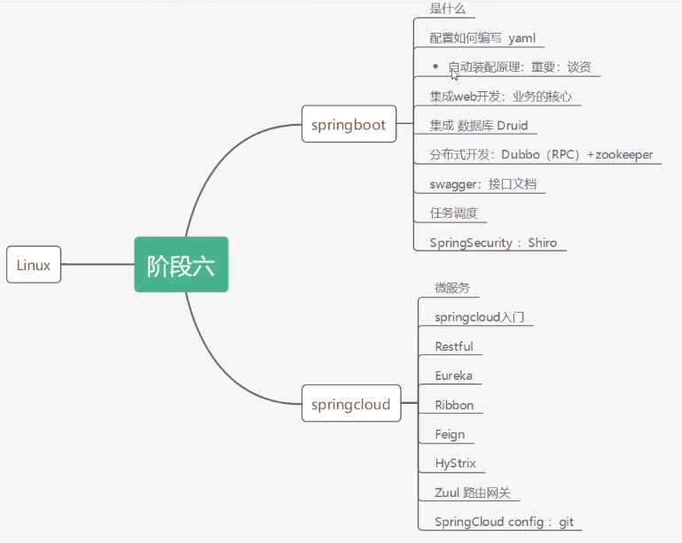
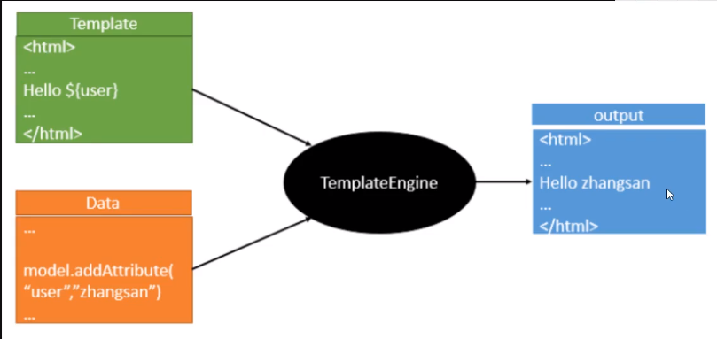
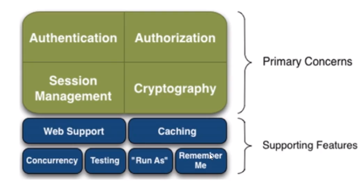
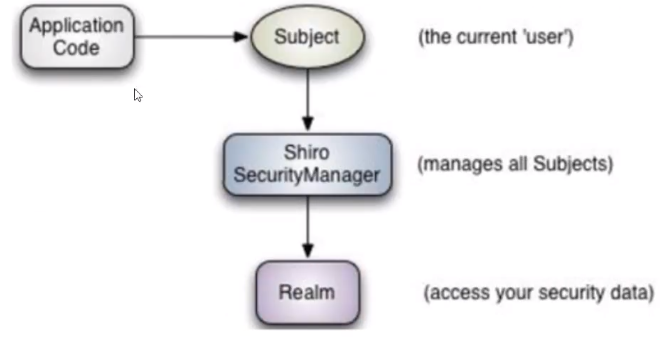
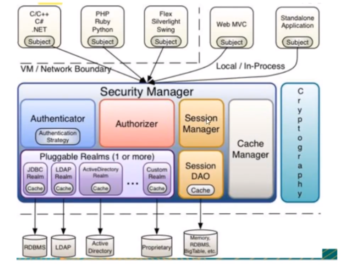
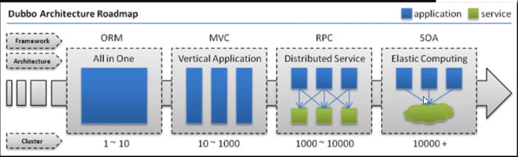
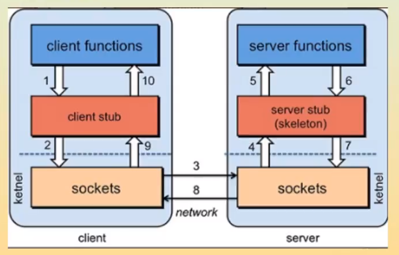
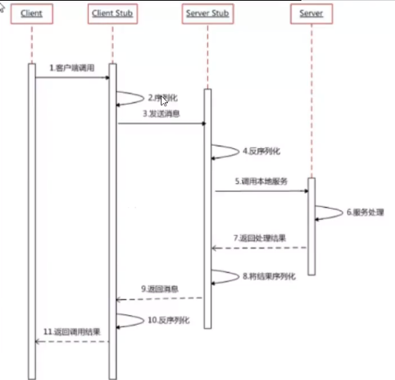
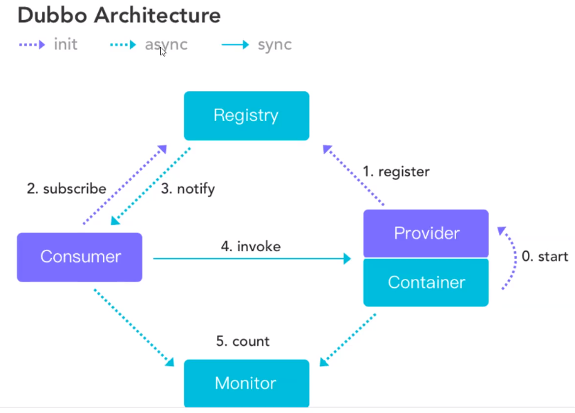

# 微服务阶段

**Spring**：Spring是为了解决企业级应用开发的复杂性而创建的，简化开发。

为了降低Java开发的复杂性，Spring采用了以下4种关键策略:
1、基于POJO的轻量级和最小侵入性编程;
2、通过IOC，依赖注入(DI)和面向接口实现松耦合;
3、基于切面(AOP）和惯例进行声明式编程;
4、通过切面和模版减少样式代码;

Spring在简化：SpringBoot-jar：内嵌tomcat



# **SpringBoot原理：**

**pom.xml**

```xml
spring-boot-dependencies: 核心依赖在父工程中
添加依赖时不需要指定版本，
```

**启动器**

```
<dependency>
    <groupId>org.springframework.boot</groupId>
    <artifactId>spring-boot-starter</artifactId>
</dependency>
```

- 启动器: 说白了就是Springboot的启动场景;
- 比如spring-boot-starter-web，他就会帮我们自动导入web环境所有的依赖!
- springboot会将所有的功能场景，都变成一个个的启动器，启动器将所有的依赖都封装在了父工程中。
- 我们要使用什么功能，就只需要找到对应的启动器就可以了```starter```

**主程序**

```java
//本身是一个Spring的组件
@SpringBootApplication
public class SpringbootdemoApplication {

    public static void main(String[] args) {
        SpringApplication.run(SpringbootdemoApplication.class, args);
    }

}
```

- 注解

	```java
	@SpringBootApplication: 标识是一个SpringBoot的启动类
	  1.@SpringBootConfiguration：SpringBoot的配置
	  		@Configuration：spring配置类
	  			@Component：说明是一个spring组件
	  2.@EnableAutoConfiguration：自动配置
	  		@AutoConfigurationPackage：自动配置包
	  			@Import({Registrar.class})：注册@ComponentScan扫描到的包
	  		@Import({AutoConfigurationImportSelector.class})：自动导入包的核心
	    		AutoConfigurationImportSelector：自动导入选择器，选择了什么东西？
	  				getAutoConfigurationEntry()获得自动配置的实体
	  				getCandidateConfigurations()获取候选的配置
		  				protected Class<?> getSpringFactoriesLoaderFactoryClass() {
	  	      		return EnableAutoConfiguration.class;
	    				}
						loadFactoryNames(Class<?> factoryType, @Nullable 			ClassLoader classLoader)获取所有的加载配置
	          loadSpringFactories(ClassLoader classLoader)
	            项目资源：classLoader.getResources
	          	 while(var6.hasNext())循环遍历所有的自动配置，然后封装为properties。
	             @ConditionalOnXXX：如果里面条件的都满足才会生效
	  3.@ComponentScan：扫描主程序同级的包
	```

	结论: springboot所有自动配置都是在启动的时候扫描并加载: `spring.factories`所有的自动配置类都在这里面，但是不一定生效，要判断条件是否成立，只要导入了对应的start，就有对应的启动器了，有了启动器，我们自动装配就会生效，然后就配置成功!

1.springboot在启动的时候，从类路径下/META-INF/ spring.factories获取指定的值;

⒉将这些自动配置的类导入容器，自动配置就会生效，帮我进行自动配置!

3.以前我们需要自动配置的东西，现在springboot帮我们做了!

4.整合javaEE，解决方案和自动配置的东西都在spring-boot-autoconfigure-2.2.0.RELEASE.jar这个包下

5.它会把所有需要导入的组件，以类名的方式返回，这些组件就会被添加到容器;

6.容器中也会存在非常多的xxxAutoConfiguration的文件(@Bean)，就是这些类给容器中导入了这个场景需要的所有组件;并自动配置，@Configuration , JavaConfig!

7.有了自动配置类，免去了我们手动编写配置文件的工作!

- run

1.推断应用的类型是普通的项目还是Web项目

2.查找并加载所有可用初始化器，设置到initializers属性中

3.找出所有的应用程序监听器，设置到listeners属性中

4.推断并设置main方法的定义类，找到运行的主类

**配置文件**

SpringBoot自动装备`XXXAutoConfiguration`, 该类从`XXXProperties`中取默认值，`XXXProperties`和配置文件绑定（`@ConfigurationProperties`），可以在配置文件中修改默认值使用自定义配置。

**自动装配的原理：**

精髓:
1)、SpringBoot启动会加载大量的自动配置类
2)、我们看我们需要的功能有没有在SpringBoot默认写好的自动配置类当中;
3)、我们再来看这个自动配置类中到底配置了哪些组件;(只要我们要用的组件存在在其中，我们就不需要再手动配置了)
4)、给容器中自动配置类添加组件的时候，会从properties类中获取某些属性。我们只需要在配置文件中指定这些属性的值即可;

**xxxxAutoConfigurartion: 自动配置类; 给容器中添加组件**

**xxxxProperties: 封装配置文件中相关属性;**

```
yml文件中可以通过debug：true查看哪些自动配置类生效哪些没有生效
```

# SpringBoot Web 开发

自动装配

springboot到底配置了什么？能不能更改，能修改哪些东西？能不能扩展？

- `xxxxAutoConfiguration`:向spring容器中自动配置组件，通过`@ConditionalOnXXXXX`条件判断组件是否被屏蔽

- `xxxxProperties`:自动配置类，装配配置文件中自定义的一些内容

## 静态资源

```java
//WebMvcAutoConfiguration类下的addResourceHandlers管理静态资源
public void addResourceHandlers(ResourceHandlerRegistry registry) {
            if (!this.resourceProperties.isAddMappings()) {
                logger.debug("Default resource handling disabled");
            } else {
                this.addResourceHandler(registry, "/webjars/**", "classpath:/META-INF/resources/webjars/");
                this.addResourceHandler(registry, this.mvcProperties.getStaticPathPattern(), (registration) -> {
                    registration.addResourceLocations(this.resourceProperties.getStaticLocations());
                    if (this.servletContext != null) {
                        ServletContextResource resource = new ServletContextResource(this.servletContext, "/");
                        registration.addResourceLocations(new Resource[]{resource});
                    }

                });
            }
        }
```

在SpringBoot中，可以通过以下方式访问到静态资源

- webjars 访问方式：`localhost:8080/webjars `
- public, static, /**, resources  访问方式：`localhost:8080/`

优先级：resources>static>public

## 定制首页

```java
//WebMvcAutoConfiguration类下的getIndexHtml管理首页，可访问resources>static>public目录下的index.html页面
private Resource getIndexHtml(Resource location) {
   try {
       Resource resource = location.createRelative("index.html");
       if (resource.exists() && resource.getURL() != null) {
            return resource;
       }
       } catch (Exception var3) {
       }
       return null;
}
```

**tempLates目录下的所有页面，只能通过controller来跳转! 这个需要模板引华的支持!**

## 模板引擎



模板引擎的作用就是我们来写一个页面模板，比如有些值呢，是动态的，我们写一些表达式。而这些值，从哪来呢，我们来组装一些数据，我们把及些数据找到。然后把这个模板和这个数据交给我们模板引擎，模板引擎按照我们这个数据帮你把这个表达式解析、填充到我们指定的位置，然后把这个数据最终生成一个我们想要的内容给我们写出去，这就是模板引擎，不管是jsp还是其他模板引擎，都是这个思想。只不过呢，就是说不同模板引擎之间，他们可能这个语法有点不一样。SpringBoot给我们推荐的Thymeleaf模板引擎，这模板引擎呢，是一个高级语言的模板引擎，他的这个语法更简单。而且呢，功能更强大。

```html
<!--所有的html元素索都可以被thymeleaf替换接管: th:元素名-->
<div th:text="${msg}"></div>
<h3 th:each="user:${users}" th:text="${user}"></h3> <!--建议使用这个-->
<!--<h3 th:each="user:${users}">[[${user}]]</h3>-->
```

## 扩展装配MVC

```java
//扩展springmvc
@Configuration
public class MvcConfig implements WebMvcConfigurer {

}
```

在springboot中存在很多`xxxConfiguration`, 如果看到了这个东西就表示扩展了内容，

注意不能标注：`@EnableWebMvc`，这个东西导入了一个类`DelegatingWebMvcConfiguration`:从容器中获取所有的webmvcconfig

自研自动配置：写两个东西：**xxxxAutoConfigurartion**，**xxxxProperties**  

# Spring Security

简介

Spring Security，这是一种基于 **Spring AOP 和 Servlet 过滤器**的安全框架。它提供全面的安全性解决方案，同时在 **Web 请求级**和**方法调用级**处理身份确认和授权。

Spring Security是针对Spring项目的安全框架,也是Spring Boot底层安全模块默认的技术选型，他可以实现强大的Web安全控制，对于安全控制，我们仅需要引入spring boot-starter-security模块,进行少量的配置,即可实现强大的安全管理!

记住几个类: 

- WebSecurityConfigurerAdapter: 自定义Security策略

- AuthenticationManagerBuilder: 自定义认证策略

- @EnableWebSecurity: 开启WebSecurity模式 ，@Enablexxx 开启某个功能

Spring Security的两个主要目标是“认证(Authentication)”和“授权”(Authorization)(访问控制) .

这个概念是通用的，而不是只在Spring Security中存在

**基本原理**

Spring Security本质就是一条过滤器链（很多个过滤器）

- FilterSecurityInterceptor :是一个**方法级的权限**过滤器，基本位于过滤链的最底部

- ExceptionTranslationFilter :是个异常过滤器,用来处理在认证授权过程中抛出的异常。

- UsernamePasswordAuthenticationFilter :对/login的POST请求做拦截,校验表单中用户名,密码。

**1.认证（验证用户名和密码）**

- 第一种方式：通过配置文件设置

	```yml
	spring:
	  security:
	    user:
	      name: xiaowu
	      password: 123456
	```

- 第二种方式：通过配置类

	```java
	@EnableWebSecurity
	public class SecurityConfig extends WebSecurityConfigurerAdapter {
	    //认证
	    @Override
	    protected void configure(AuthenticationManagerBuilder auth) throws Exception {
	        BCryptPasswordEncoder psdEncoder = new BCryptPasswordEncoder();
	        String password = psdEncoder.encode("123");
	        auth.inMemoryAuthentication().passwordEncoder(psdEncoder)
	                .withUser("xiaowu").password(password).roles("admin","user")
	                .and()
	                .withUser("xiaohe").password(password).roles("user");
	    }
	}
	```

- 第三种方式：自定义配置类

	```java
	@Service("userService")
	public class UserService implements UserDetailsService {
	    @Override
	    public UserDetails loadUserByUsername(String s) throws UsernameNotFoundException {
	      //这里只是一个demo,实际上需要通过前端表单传过来的s进行数据库查询，然后将用户的信息填充到User里面。
	        List<GrantedAuthority> auths = AuthorityUtils.commaSeparatedStringToAuthorityList("admin");
	        return new User("xiaotan",new BCryptPasswordEncoder().encode("123"),auths);
	    }
	}
	
	@EnableWebSecurity
	public class SecurityConfig extends WebSecurityConfigurerAdapter {
	    //认证 查数据库版本
	
	    @Autowired
	    private UserDetailsService userService;
	
	    @Override
	    protected void configure(AuthenticationManagerBuilder auth) throws Exception {
	        auth.userDetailsService(userService).passwordEncoder(new BCryptPasswordEncoder());
	    }
	}
	```

	

**2.授权**

```java
@EnableWebSecurity
public class SecurityConfig extends WebSecurityConfigurerAdapter {
	@Override
    protected void configure(HttpSecurity http) throws Exception {
        //首页所有人可以访问
        http.formLogin()
                .loginPage("/login.html")  //登录页面设置
                .loginProcessingUrl("/tologin") //登录访问的路径
                .defaultSuccessUrl("/index").permitAll()  //登录成功之后要跳转到的路径
                .and().authorizeRequests()
                    .antMatchers("/","/tologin","/css/**","fonts/**","/images/**","/js/**","/lib/**").permitAll()  //设置哪些路径不需要认证就能直接访问
                .anyRequest().authenticated()
                .and().csrf().disable(); //关闭csrf防护
    }
}
```

hasAuthority方法：如果当前的主体具有指定的权限,则返回true,否则返回false.

```java
.antMatchers("/admins/**").hasAuthority("admins")//只有admins权限的的用户可以访问/admins请求下的所有请求
.antMatchers("/members/**").hasAnyAuthority("admins,member");
```

hasRole方法：与上面相同

## 认证授权注解使用

```java
1. @EnableGlobalMethodSecurity(securedEnabled = true) //开启注解支持（放在启动类或配置类上）
2. 在Controller类的地址上写@Secured({"ROLE_admins"})完成授权
  @RequestMapping("/admins/adlist")
  @Secured({"ROLE_admins"})
  public String admin_list(){
      return "admin/admin-list";
  }
3. 在Controller类的地址上写@PreAuthorize("hasAnyAuthority('admins','members')")完成授权，在方法之前校验
  @RequestMapping("/members/welcome")
  @PreAuthorize("hasAnyAuthority('admins','members')")
  public String welcome1(){
     return "member/welcome1";
  }
4. 在Controller类的地址上写@PostAuthorize("hasAnyAuthority('admins','members')")完成授权，在方法之后校验
  @RequestMapping("/members/welcome")
  @PostAuthorize("hasAnyAuthority('admins','members')")
  public String welcome1(){
      return "member/welcome1";
  }
5. @PreFilter(value = "filterObject.id%2==0")对传入的参数进行过滤，例如，将ID为偶数的传入，为奇数的过滤掉
6. @PostFilter("filterObject.username=='admins'")对返回参数进行过滤，如果用户名为admins才返回
```

## CSRF

跨站请求伪造（Cross-site request forgery）, Spring Security CSRF会针对PATCH，POST，PUT和DELETE方法进行防护。

原理：认证成功后，会生成一个token并存到session和cookie中，下次请求会携带这个token，然后通过CsrfFilter进行拦截

# Shiro

## 1 什么是shiro

1. Apache Shiro是一个Java的安全(权限)框架。
2. Shiro可以非常容易的开发出足够好的应用，其不仅可以用在JavaSE环境，也可以用在JavaEE环境。
3.  Shiro可以完成，认证，授权，加密，会话管理，Web集成，缓存等。
4. 下载地址: http://shiro.apache.org

## 2 功能



- Authentication:身份认证、登录，验证用户是不是拥有相应的身份;

- Authorization:授权，即权限验证，验证某个已认证的用户是否拥有某个权限，即判断用户能否进行什么操作，如:验证某个用户是否拥有某个角色，或者细粒度的验证某个用户对某个资源是否具有某个权限!

- Session Manager:会话管理，即用户登录后就是第一次会话，在没有退出之前，它的所有信息都在会话中;会话可以是普通的JavaSE环境，也可以是Web环境;

- Cryptography:加密，保护数据的安全性，如密码加密存储到数据库中，而不是明文存储;

	----------------------------------------------------------------------------------------------------------------------------------------------------------------------

- Web Support: Web支持，可以非常容易的集成到Web环境;

- Caching:缓存，比如用户登录后，其用户信息，拥有的角色、权限不必每次去查，这样可以提高效率

- Concurrency: Shiro支持多线程应用的并发验证，即，如在一个线程中开启另一个线程，能把权限自动的传播过去

- Testing:提供测试支持;

- Run As:允许一个用户假装为另一个用户(如果他们允许)的身份进行访问;

- Remember Me:记住我，这个是非常常见的功能，即一次登录后，下次再来的话不用登录了

## 3 shiro架构（外部）



- subject: 应用代码直接交互的对象是Subject，也就是说Shiro的对外API核心就是Subject，Subject代表了当前的用户，这个用户不一定是一个具体的人，与当前应用交互的任何东西都是Subject，如网络爬虫，机器人等，**与Subject的所有交互都会委托给SecurityManager; Subject其实是一个门面，SecurityManageer才是实际的执行者**
- SecurityManager: 安全管理器，即所有与安全有关的操作都会与SercurityManager交互，并且**它管理着所有的Subject**，可以看出它是Shiro的核心，**它负责与Shiro的其他组件进行交互**，它相当于SpringMVC的DispatcherServlet的角色
- **Realm**: Shiro从Realm获取安全数据(如用户，角色，权限)，就是说SecurityManager要验证用户身份，那么它需要从Realm 获取相应的用户进行比较，来确定用户的身份是否合法;也需要从Realm得到用户相应的角色、权限，进行验证用户的操作是否能够进行，可以把Realm看成DataSource; **当应用程序向 Shiro 提供了 账号和密码之后， Shiro 就会问 Realm 这个账号密码是否对， 如果对的话，其所对应的用户拥有哪些角色，哪些权限。** 其实就是个中介。 Realm 得到了 Shiro 给的用户和密码后，有可能去找 ini 文件，也可以去找数据库

## **Shiro认证过程：**

我们了解到实际进行权限信息验证的是我们的 Realm，Shiro 框架内部默认提供了两种实现，一种是查询`.ini`文件的`IniRealm`，另一种是查询数据库的`JdbcRealm`


流程详解：

1. 首先调用 Subject.login(token) 进行登录，其会自动委托给 Security Manager，调用之前必须通过 SecurityUtils.setSecurityManager() 设置；
2. SecurityManager 负责真正的身份验证逻辑；它会委托给 Authenticator 进行身份验证；
3. Authenticator 才是真正的身份验证者，Shiro API 中核心的身份认证入口点，此处可以自定义插入自己的实现；
4. Authenticator 可能会委托给相应的 AuthenticationStrategy 进行多 Realm 身份验证，默认 ModularRealmAuthenticator 会调用 AuthenticationStrategy 进行多 Realm 身份验证；
5. Authenticator 会把相应的 token 传入 Realm，从 Realm 获取身份验证信息，如果没有返回 / 抛出异常表示身份验证失败了。此处可以配置多个 Realm，将按照相应的顺序及策略进行访问。

### Realm


- **org.apache.shiro.realm.text.IniRealm**：[users] 部分指定用户名 / 密码及其角色；[roles] 部分指定角色即权限信息；
- **org.apache.shiro.realm.text.PropertiesRealm**： user.username=password,role1,role2 指定用户名 / 密码及其角色；role.role1=permission1,permission2 指定角色及权限信息；
- **org.apache.shiro.realm.jdbc.JdbcRealm**：通过 sql 查询相应的信息，如 “select password from users where username = ?” 获取用户密码，“select password, password_salt from users where username = ?” 获取用户密码及盐；“select role_name from user_roles where username = ?” 获取用户角色；“select permission from roles_permissions where role_name = ?” 获取角色对应的权限信息；也可以调用相应的 api 进行自定义 sql；

**认证完成后返回一个封装了用户名和密码的AuthenticationInfo对象**

### **Authenticator 及 AuthenticationStrategy**

Authenticator 的职责是验证用户帐号，是 Shiro API 中身份验证核心的入口点, 如果验证成功，将返回 AuthenticationInfo 验证信息；此信息中包含了身份及凭证；如果验证失败将抛出相应的AuthenticationException 实现。SecurityManager 接口继承了 Authenticator，另外还有一个 ModularRealmAuthenticator 实现，其委托给多个 Realm 进行验证，验证规则通过 AuthenticationStrategy 接口指定，默认提供的实现：

- **FirstSuccessfulStrategy**：只要有一个 Realm 验证成功即可，只返回第一个 Realm 身份验证成功的认证信息，其他的忽略；
- **AtLeastOneSuccessfulStrategy**：只要有一个 Realm 验证成功即可，和 FirstSuccessfulStrategy 不同，返回所有 Realm 身份验证成功的认证信息；
- **AllSuccessfulStrategy**：所有 Realm 验证成功才算成功，且返回所有 Realm 身份验证成功的认证信息，如果有一个失败就失败了。

**注：**ModularRealmAuthenticator 默认使用 AtLeastOneSuccessfulStrategy 策略。

## **Shiro授权过程：**

授权，也叫访问控制，即在应用中控制谁能访问哪些资源（如访问页面/编辑数据/页面操作等）。在授权中需了解的几个关键对象：主体（Subject）、资源（Resource）、权限（Permission）、角色（Role）。

> **RBAC 是当下权限系统的设计基础，同时有两种解释：**
>
> - Role-Based Access Control，基于角色的访问控制 即，你要能够删除产品，那么当前用户就必须拥有**产品经理**这个角色
> - Resource-Based Access Control，基于资源的访问控制 即，你要能够删除产品，那么当前用户就必须拥有**删除产品**这样权限

- **主体**主体，即访问应用的用户，在 Shiro 中使用 Subject 代表该用户。用户只有授权后才允许访问相应的资源。

- **资源**在应用中用户可以访问的任何东西，比如访问 JSP 页面、查看/编辑某些数据、访问某个业务方法、打印文本等等都是资源。用户只要授权后才能访问。
- **权限**安全策略中的原子授权单位，通过权限我们可以表示在应用中用户有没有操作某个资源的权力。即权限表示在应用中用户能不能访问某个资源，如： 访问用户列表页面查看/新增/修改/删除用户数据（即很多时候都是 CRUD（增查改删）式权限控制）打印文档等等。、
- **角色**角色代表了操作集合，可以理解为权限的集合，一般情况下我们会赋予用户角色而不是权限，即这样用户可以拥有一组权限，赋予权限时比较方便。典型的如：项目经理、技术总监、CTO、开发工程师等都是角色，不同的角色拥有一组不同的权限。


1、首先调用Subject.isPermitted*/hasRole*接口，其会委托给SecurityManager，而SecurityManager接着会委托给Authorizer；

2、Authorizer是真正的授权者，如果我们调用如isPermitted(“user:view”)，其首先会通过PermissionResolver把字符串转换成相应的Permission实例

3、在进行授权之前，其会调用相应的Realm获取Subject相应的角色/权限用于匹配传入的角色/权限；

4、Authorizer会判断Realm的角色/权限是否和传入的匹配，如果有多个Realm，会委托给ModularRealmAuthorizer进行循环判断，如果匹配如isPermitted*/hasRole*会返回true，否则返回false表示授权失败。

## 4 shiro架构（内部）




## 5 快速开始

```java
Subject currentUser = SecurityUtils.getSubject();//拿到subject对象
Session session = currentUser.getSession();//获得当前对象的session
if (!currentUser.isAuthenticated()) //判断当前用户是否被认证
currentUser.getPrincipal()//获得当前用户的认证
currentUser.hasRole("schwartz")//是否拥有某个角色
currentUser.isPermitted("lightsaber:wield")//当前用户是否拥有某个权限
currentUser.logout();//注销
```

# Swagger

## 简介

- 号称世界上最流行的API框架

- RestFul API文档在线自动生成工具
- 直接运行，可以在线测试API接口
- 支持多种语言

# 异步任务

```java
//1. 在启动类上开启异步任务
@SpringBootApplication
@EnableAsync
public class SpringSecurityApplication {

    public static void main(String[] args) {
        SpringApplication.run(SpringSecurityApplication.class, args);
    }

}
//2.在请求的方法上添加异步注解
 @RequestMapping("/login")
 @Async
 public String login(String username, String password){
     //获取当前用户
     Subject subject = SecurityUtils.getSubject();

     //封装用户的登录数据
     UsernamePasswordToken token = new UsernamePasswordToken(username, password);
     try {
         subject.login(token);
            return "index";
        }catch (UnknownAccountException e){
            return "login";
        }catch (IncorrectCredentialsException e){
            return "login";
        }catch (Exception e){
            return "login";
        }
    }
```

# 定时任务

```java
TaskExecutor  //任务执行
TaskScheduler //任务调度
  
@EnableScheduling //开始定时功能 

//cron表达式，在约定的时间执行
    //秒 分 时 日 月 周几
    @Scheduled(cron = "0 * * * * 0-7")
    public void times(){
        System.out.println("12131");
    }
```

# Redis

在SpringBoot2.x之后，原来使用的jedis被替换为了lettuce

jedis :采用的直连，多个线程操作的话，是不安全的，如果想要避免不安全的，使用jedis pool连接池!更像BIO模式

lettuce :采用netty，实例可以再多个线程中进行共享，不存在线程不安全的情况!可以减少线程数据了，更像NIO模式

# 分布式 Dubbo



## RPC

RPC【Remote Procedure Call】是指**远程过程调用**，是一种**进程间通信方式**，他是一种技术的思想，而不是规范。它允许程序调用另一个地址空间〈通常是共享网络的另一台机器上)的过程或函数，而不用程序员显式编码这个远程调用的细节。即程序员无论是调用本地的还是远程的函数，本质上编写的调用代码基本相同。**核心模块：通讯、序列化**





## Dubbo

Apache Dubbo 是一款高性能、轻量级的开源Java RPC框架，它提供了三大核心能力:**面向接口的远程方法调用**，**智能容错**和**负载均衡**，以及**服务自动注册和发现。**



- 服务提供者(Provider)∶暴露服务的服务提供方，服务提供者在启动时，向注册中心注册自己提供的服务。
- 服务消费者（Consumer）:调用远程服务的服务消费方，服务消费者在启动时，向注册中心订阅自己所需的服务，服务消费者，从提供者地址列表中，基于软负载均衡算法，选一台提供者进行调用，如果调用失败，再选另一台调用。
- 注册中心(Registry): 注册中心返回服务提供者地址列表给消费者，如果有变更，注册中心将基于长连接推送变更数据给消费者
- 监控中心(Monitor): 服务消费者和提供者，在内存中累计调用次数和调用时间，定时每分钟发送一次统计数据到监控中心

## zookeeper

就是一个注册中心，其他注册中心：Nacos（阿里巴巴的）、Radis注册中心、

