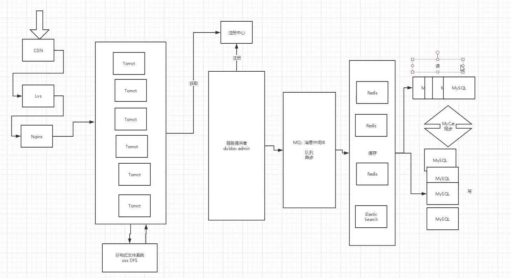
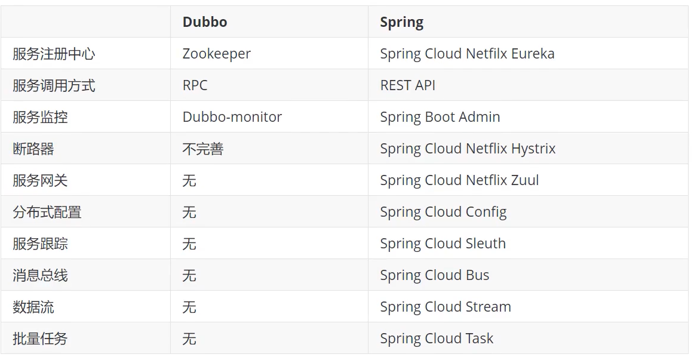

微服务架构4个核心问题：

1. 服务很多，客户端怎么访问？
2. 这么多服务，服务之间怎么通信？
3. 这么多服务，如何治理
4. 服务挂了怎么办

解决方案：

1. Spring Cloud NetFlix 一站式解决所有的问题

	客户端访问：api网关，zuul组件

	通信：Feign(基于HTTP通信)

	治理：Euraka,

	挂了：熔断机制(Hystrix)

2. Apache Dubbo Zookeeper

	客户端访问：没有

	通信：Dubbo基于RPC

	治理：Zookeeper

	挂了：没有

3. Spring Cloud alibaba 

**万变不离其中**

1. **访问问题：API **
2. **通信问题：HTTP,RPC**
3. **服务治理问题：注册与发现**
4. **服务挂了的问题：熔断机制**

# 分布式三大原则

​		CAP原则又称CAP定理，指的是在一个[分布式系统](https://baike.baidu.com/item/分布式系统/4905336)中， Consistency（一致性）、 Availability（可用性）、Partition tolerance（分区容错性），三者不可得兼。

- 一致性（C）：在[分布式系统](https://baike.baidu.com/item/分布式系统/4905336)中的所有数据备份，在同一时刻是否同样的值。（等同于所有节点访问同一份最新的数据副本）
- 可用性（A）：保证每个请求不管成功或者失败都有响应。
- 分区容忍性（P）：**系统中任意信息的丢失或失败不会影响系统的继续运作。**

​       CAP原则的精髓就是要么AP，要么CP，要么AC，但是不存在CAP。如果在某个分布式系统中数据无副本， 那么系统必然满足强一致性条件， 因为只有独一数据，不会出现数据不一致的情况，此时C和P两要素具备

> 一个分布式系统里面，节点组成的网络本来应该是连通的。然而可能因为一些故障，使得有些节点之间不连通了，整个网络就分成了几块区域。数据就散布在了这些不连通的区域中。这就叫分区。
>
> 当你一个数据项只在一个节点中保存，那么分区出现后，和这个节点不连通的部分就访问不到这个数据了。这时分区就是无法容忍的。
>
> 提高分区容忍性的办法就是一个数据项复制到多个节点上，那么出现分区之后，这一数据项就可能分布到各个区里。容忍性就提高了。
>
> 然而，要把数据复制到多个节点，就会带来一致性的问题，就是多个节点上面的数据可能是不一致的。要保证一致，每次写操作就都要等待全部节点写成功，而这等待又会带来可用性的问题。
>
> 总的来说就是，数据存在的节点越多，分区容忍性越高，但要复制更新的数据就越多，一致性就越难保证。为了保证一致性，更新所有节点数据所需要的时间就越长，可用性就会降低。

# 1、常见面试题

1.1、什么是微服务?

但通常而言，微服务架构是一种架构模式，或者说是一种架构风格，它提倡将单一的应用程序划分成一组小的服务，每个服务运行在其独立的自己的进程内，服务之间互相协调，互相配置，为用户提供最终价值。服务之间采用轻量级的通信机制互相沟通，每个服务都围绕着具体的业务进行构建，并且能够被独立的部署到生产环境中，另外，应尽量避免统一的，集中式的服务管理机制，对具体的一个服务而言，应根据业务上下文，选择合适的语言，工具对其进行构建，可以有一个非常轻量级的集中式管理来协调这些服务，可以使用不同的语言来编写服务，也可以使用不同的数据存储;

**通俗版本：**

微服务化的核心就是将传统的一站式应用，根据业务拆分成一个一个的服务，彻底地去耦合，每一个微服务提供单个业务功能的服务，一个服务做一件事情，从技术角度看就是一种小而独立的处理过程，类似进程的概念，能够自行单独启动或销毁，拥有自己独立的数据库。

1.2、微服务之间是如何独立通讯的?

1.3、SpringCloud和 Dubbo有哪些区别?

​	1.分布式+服务治理Dubbo

​	

1.4、SpringBoot和SpringCloud，请你谈谈对他们的理解

- SpringBoot专注于快速方便的开发单个个体微服务。
- SpringCloud是关注全局的微服务协调整理治理框架，它将SpringBoot开发的一个个单体微服务整合并管理起来，为各个微服务之间提供: 配置管理，服务发现，断路器，路由，微代理，事件总线，全局锁，决策竞选，分布式会话等等集成服务。
- SpringBoot可以离开SpringCloud独立使用，开发项目，但是SpringCloud离不开SpringBoot，属于依赖关系
- SpringBoot专注于快速、方便的开发单个个体微服务，SpringCloud关注全局的服务治理框架

1.5、什么是服务熔断?什么是服务降级

1.6、微服务的优缺点是分别是什么?说下你在项目开发中遇到的坑

1.7、你所知道的微服务技术栈有哪些?请列举一二

| 微服务条目                               | 落地技术                                                     |
| ---------------------------------------- | ------------------------------------------------------------ |
| 服务开发                                 | SpringBoot,Spring,SpringMVC                                  |
| 服务配置与管理                           | Netflix公司的Archaius、阿里的Diamond等                       |
| 服务注册与发现                           | Eureka、Consul、Zookeeper等                                  |
| 服务调用                                 | Rest、RPC、gRPC                                              |
| 服务熔断器                               | Hystrix、Envoy等                                             |
| 负载均衡                                 | Ribbon、Nginx等                                              |
| 服务接口调用（客户端调用服务的简化工具） | Feign等                                                      |
| 消息队列                                 | Kafka、RabbitMQ、ActiveMQ等                                  |
| 服务配置中心管理                         | SpringCloudConfig、Chef等                                    |
| 服务路由(API网关)                        | zuul等                                                       |
| 服务监控                                 | Zabbix、Nagios、Metrics、Specatator等                        |
| 全链路追踪                               | Zipkin、Brave、Dapper等                                      |
| 服务部署                                 | Docker、OpenStack、Kubernetes等                              |
| 数据流操作开发包                         | SpringCloud Stream(封装与Redis,Rabbit，Kafka等发送接收消息） |
| 事件消息总线                             | SpringCloud Bus                                              |

1.8、eureka和zookeeper都可以提供服务注册与发现的功能，请说说两个的区别?

当向注册中心查询服务列表时，我们**可以容忍注册中心返回的是几分钟以前的注册信息，但不能接受服务直接down掉不可用**。也就是说，服务注册功能对可用性的要求要高于一致性。

**zookeeper保证的是CP（一致性，容错性）**
	但是zk会出现这样一种情况，当master节点因为网络故障与其他节点失去联系时，剩余节点会重新进行leader选举。问题在于，选举leader的时间太长，30~120s，且选举期间整个zk集群都是不可用的，这就导致在选举期间注册服务瘫痪。在云部署的环境下，因为网络问题使得zk集群失去master节点是较大概率会发生的事件，虽然服务最终能够恢复，但是漫长的选举时间导致的注册长期不可用是不能容忍的。

**Eureka保证的是AP（可用性，容错性）**
Eureka看明白了这一点，因此在设计时就优先保证可用性。Eureka各个节点都是平等的，几个节点挂掉不会影响正常节点的工作，剩余的节点依然可以提供注册和查询服务。而Eureka的客户端在向某个Eureka注册时，如果发现连接失败，则会自动切换至其他节点，只要有一台Eureka还在，就能保住注册服务的可用性，只不过查到的信息可能不是最新的，除此之外，Eureka还有一种**自我保护机制**，如果在15分钟内超过85%的节点都没有正常的心跳，那么Eureka就认为客户端与注册中心出现了网络故障，此时会出现以下几种情况:
	1.Eureka不再从注册列表中移除因为长时间没收到心跳而应该过期的服务

​	2.Eureka仍然能够接受新服务的注册和查询请求，但是不会被同步到其他节点上(即保证当前节点依然可用)

​	3.当网络稳定时，当前实例新的注册信息会被同步到其他节点中

**因此，Eureka可以很好的应对因网络故障导致部分节点失去联系的情况，而不会像zookeeper那样使整个注册服务瘫痪**

# 2 Euraka 

- Netflix在设计Eureka时，遵循的就是AP原则
- Eureka是Netflix的一个子模块，也是核心模块之一。Eureka是一个基于REST的服务，用于定位服务，以实现云端中间层服务发现和故障转移，服务注册与发现对于微服务来说是非常重要的，有了服务发现与注册，只需要使用服务的标识符，就可以访问到服务，而不需要修改服务调用的配置文件了，功能类似于Dubbo的注册中心，比如Zookeeper;
- Eureka的基本架构
	- SpringCloud封装了NetFlix公司开发的Eureka模块来实现服务注册和发现(对比Zookeeper)
	- Eureka采用了C-S的架构设计，EurekaServer作为服务注册功能的服务器，他是服务注册中心
	- 而系统中的其他微服务。使用Eureka的客户端连接到EurekaServer并维持心跳连接。这样系统的维护人员就可以通过EurekaServer来监控系统中各个微服务是否正常运行，SpringCloud的一些其他模块（比如Zuul)就可以通过EurekaServer来发现系统中的其他微服务，并执行相关的逻辑;

- CAP原则：只能满足其中两个
	- C(Consistency)强一致性
	- A(Availability)可用性
	- P(Partition tolerance)分区容错性
	- 著名的CAP理论指出，一个分布式系统不可能同时满足C（一致性)、A (可用性)、P(容错性)。**由于分区容错性P在分布式系统中是必须要保证的**，因此我们只能在A和C之间进行权衡。

# 3 ribbon

- Spring Cloud Ribbon是基于Netflix Ribbon实现的一套**客户端负载均衡**的工具。
- 简单的说，Ribbon是Netflix发布的开源项目，主要功能是提供客户端的软件负载均衡算法，将NetFlix的中间层服务连接在一起。Ribbon的客户端组件提供一系列完整的配置项如: 连接超时、重试等等。简单的说，就是在配置文件中列出LoadBalancer(简称LB: 负载均衡）后面所有的机器，Ribbon会自动的帮助你基于某种规则(如**简单轮询，随机连接**等等）去连接这些机器。我们也很容易使用Ribbon实现自定义的负载均衡算法!

- LB，即负载均衡(Load Balance)，在微服务或分布式集群中经常用的一种应用。
- 负载均衡简单的说就是**将用户的请求平摊的分配到多个服务上**，从而达到系统的HA（高可用)。
- 常见的负载均衡软件有Nginx，Lvs等等
- dubbo、SpringCloud中均给我们提供了负载均衡，SpringCloud的负载均衡算法可以自定义
- 负载均衡简单分类:
	- 集中式LB：即在服务的消费方和提供方之间使用独立的LB设施，如Nginx（反向代理服务器），由该设施负责把访问请求通过某种策略转发至服务的提供方!
	- 进程式LB：**将LB逻辑集成到消费方**，消费方从服务注册中心获知有哪些地址可用，然后自己再从这些地址中选出一个合适的服务器。**Ribbon就属于进程内LB**，它只是一个类库，集成于消费方进程，消费方通过它来获取到服务提供方的地址!

# 4. Feign 

- feign是声明式的web service客户端，它让微服务之间的调用变得更简单了，类似controller调用service。SpringCloud集成了Ribbon和Eureka，可在使用Feign时提供负载均衡的http客户端。
	只需要创建一个接口，然后添加注解即可!

- feign，主要是社区，大家都习惯面向接口编程。这个是很多开发人员的规范。调用微服务访问两种方法

	1.微服务名字【ribbon】

	2.接口和注解【feign 】

- Feign旨在使编写Java Http客户端变得更容易
- 前面在使用Ribbon + RestTemplate时，利用RestTemplate对Http请求的封装处理，形成了一套模板化的调用方法。但是在实际开发中，**由于对服务依赖的调用可能不止一处，往往一个接口会被多处调用，所以通常都会针对每个微服务自行封装一些客户端类来包装这些依赖服务的调用**。所以，Feign在此基础上做了进一步封装，由他来帮助我们定义和实现依赖服务接口的定义，在Feign的实现下，我们只需要创建一个接口并使用注解的方式来配置它(类似于以前Dao接口上标注Mapper注解，现在是一个微服务接口上面标注一个Feign注解即可。)即可完成对服务提供方的接口绑定，简化了使用Spring Cloud Ribbon时，自动封装服务调用客户端的开发量。
- 利用Ribbon维护了MicroServiceCloud-Dept的服务列表信息，并且通过轮询实现了客户端的负载均衡，而与Ribbon不同的是，通过Feign只需要定义服务绑定接口且以声明式的方法，优雅而且简单的实现了服务调用。

# 5. Hystrix

- Hystrix是一个用于处理分布式系统的延迟和容错的开源库，在分布式系统里，许多依赖不可避免的会调用失败，比如超时，异常等，Hystrix能够保证在一个依赖出问题的情况下，不会导致整体服务失败，避免级联故障，以提高分布式系统的弹性。
- “断路器"本身是一种开关装置，当某个服务单元发生故障之后，通过断路器的故障监控（类似熔断保险丝)，向调用方返回一个服务预期的可处理的备选响应(FallBack)，而不是长时间的等待或者抛出调用方法无法处理的异常，这样就可以保证了服务调用方的线程不会被长时间，不必要的占用，从而避免了故障在分布式系统中的蔓延，乃至雪崩
- 作用：
	- 服务降级
	- 服务熔断