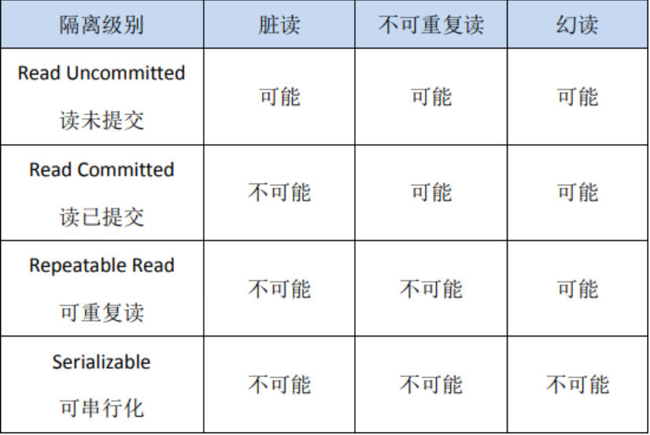
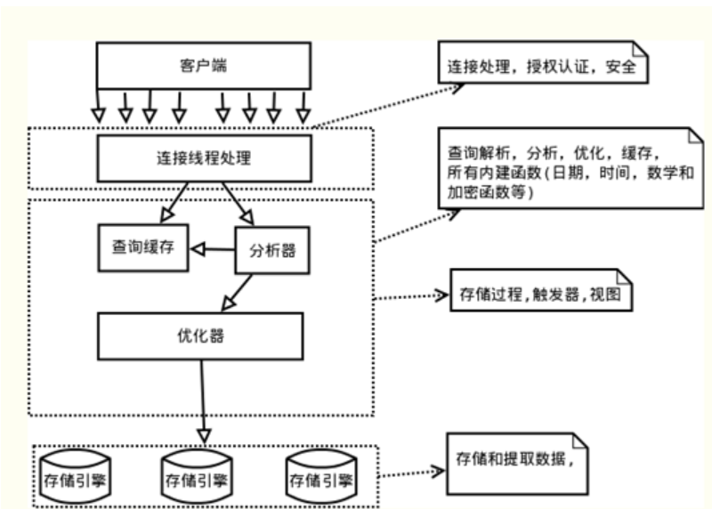
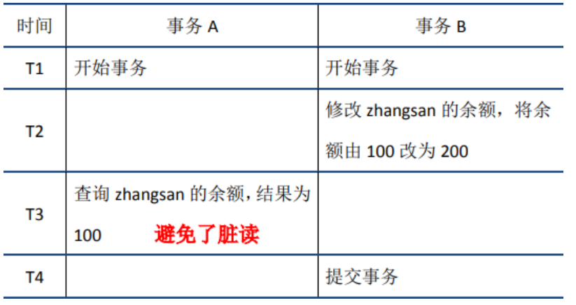
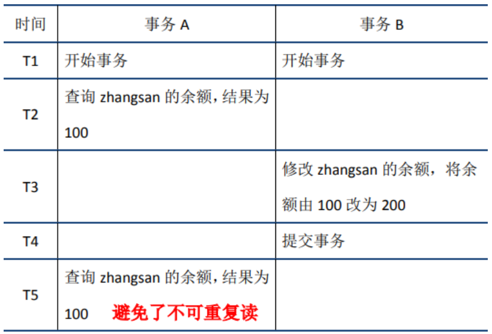
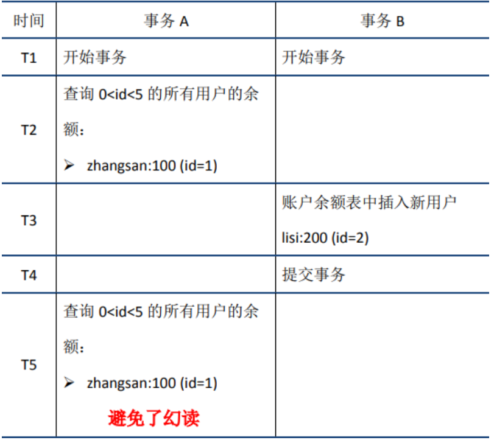
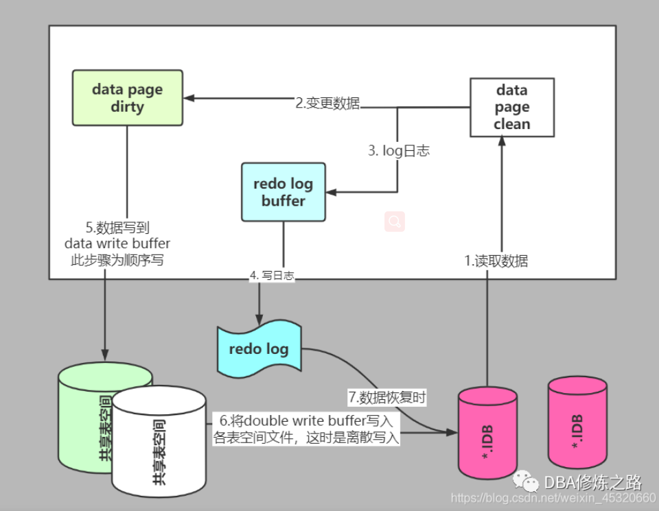
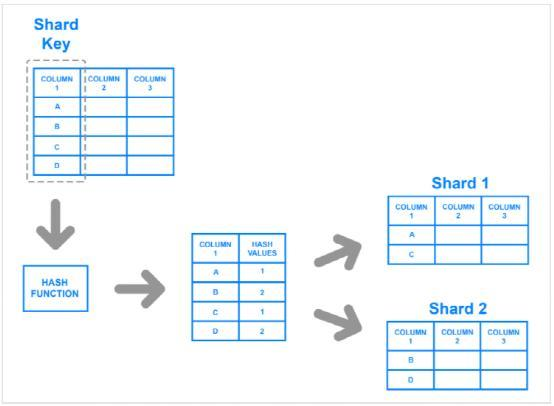
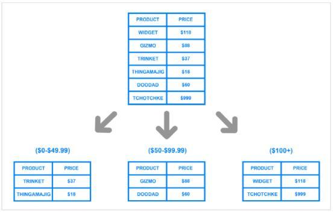
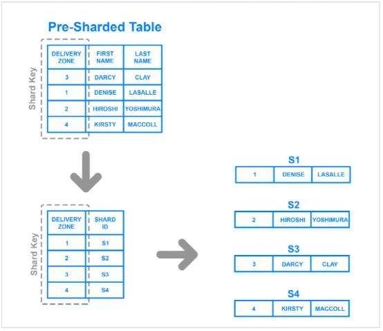

# 1 基本命令

```sql
mysql -uroot -pwp19970426  --连接数据库

show databases; -- 查询所有的数据库
use cqupt; -- 切换数据库，use 数据库名
show tables;  -- 查看所有的表
describe user; -- 显示user表的信息
create database student; -- 创建一个数据库
exit; -- 退出连接
SHOW CREATE DATABASE `school` -- 查看创建数据库的语句
SHOW CREATE TABLE `student` -- 查看`student`数据表的定义语句
DESC `student` -- 显示表的结构
-- 单行注释
/*
多行注释
*/
```

数据库xxx语言 CRUD增删改查 

DDL 定义

DML 操作

DQL 查询

DCL 控制


# 2. 操作数据库

数据库>数据库表>数据库表中的数据

```sql
CREATE DATABASE IF NOT EXISTS westos;  -- 穿件数据库

DROP DATABASE IF EXISTS westos;  -- 删除数据库

-- 如果表名或数据数据库名是一个特殊字符，需要加上``（tab上面，esc下面）
use `cqupt`;  -- 使用数据库

SHOW DATABASES;  -- 显示所有数据库
```

## 2.2 数据库的列类型

> 数值

- tinyint   十分小的数，1个字节
- smallint   较小的数    2个字节
- mediumint  中等大小的数据   3个字节
- **int   标准整数                   4个字节**
- bigint   较大的整数     8个字节 
- float   浮点数     4个字节
- double   浮点数   8个字节
- decimal   字符串形式的浮点数   金融计算时 一般使用decimal 

>字符串

- char   字符串固定大小的    0~255
- **varchar  可变字符串   0~65535   常用的string**
- tinytext  微型文本  2^8-1
- **text  文本串      2^16-1**

>时间日期

java.util.Date

- data      YYYY-MM-DD 日期格式
- time          HH:mm:ss 时间格式
- **datetime     YYYY-MM-DD  HH:mm:ss  常用的时间格式**
- **timestamp   时间戳   1970.1.1到现在的毫秒数  **
- year   年份

> null

## 2.3 数据库的字段属性（重点）

Unsigned: 无符号整数，该列不能声明为负数。

zerofill: 0填充 不足位数使用0填充  int(3)   5---->005  最大显示宽度

自增：一般设置主键为自增

非空：NULL / NOT NULL

默认：如果不指定该列的值会使用默认值

**每一个表都必须存在以下五个字段 表示一个记录存在的意义**

```sql
id -- 主键
`version` -- 乐观锁
is_delete -- 伪删除
gmt_create -- 创建时间
gmt_create -- 修改时间
```

## 2.4创建数据库表

```sql
/*
注意点：使用英文的()，表名和字段名尽量用``括起来
AUTO_INCREMENT自增
字符串使用单引号括起来
所有语句后面加英文, 最后一个不加
PRIMARY KEY(`s_id`)主键
*/
CREATE TABLE IF NOT EXISTS `student`(
	`s_id` INT(4) NOT NULL AUTO_INCREMENT COMMENT '学号',
	`s_name` VARCHAR(30) NOT NULL DEFAULT '匿名' COMMENT '姓名',
	`s_pwd` VARCHAR(20) NOT NULL DEFAULT '123456' COMMENT '密码',
	`s_gender` VARCHAR(2) NOT NULL DEFAULT '男' COMMENT '性别',
	`s_birthday` DATETIME DEFAULT NULL COMMENT '出生日期',
	`s_address` VARCHAR(100) DEFAULT NULL COMMENT '家庭住址',
	`s_email` VARCHAR(50) DEFAULT NULL COMMENT '邮箱',
	PRIMARY KEY(`s_id`)
)ENGINE=INNODB DEFAULT CHARSET=utf8
```

格式

```sql
CREATE TABLE [IF NOT EXISTS] `表名`(
	`字段名` 列类型 [属性(2.3节那些东西)] [索引] [注释],
  `字段名` 列类型 [属性(2.3节那些东西)] [索引] [注释],
  ................
  `字段名` 列类型 [属性(2.3节那些东西)] [索引] [注释],
  PRIMARY KEY(`字段名`)
)[表类型][字符集设置][注释]
```

## **数据库引擎**

- INNODB  默认使用
- MYISAM  早些年使用的

|              | MYISAM | INNODB                 |
| ------------ | ------ | ---------------------- |
| 事务支持     | 不支持 | 支持                   |
| 数据行锁     | 不支持 | 支持                   |
| 外键约束     | 不支持 | 支持                   |
| 全文索引     | 支持   | 不支持                 |
| 表空间的大小 | 较小   | 较大，约为MYISAM的两倍 |

常规使用操作：

- MYISAM  节约空间，速度较快
- INNODB  安全性高，事务处理，多表多用户操作

> 在物理空间存在的位置

所有的数据库文件都存在data目录下，

本质还是文件的存储

MYSQL引擎在物理文件上的区别

- InnoDB 
	- *.frm
	- *.ibd


- MYISAM  对应文件
	- *.frm  ----表结构文件
	- *.MYD  -----数据文件
	- *.MYI   ----索引文件


> 设置数据库的字符集编码

```sql
CHARSET=utf8
```

不设置的话，会是mysql默认的字符集编码~（不支持中文）

或者在my.ini设置默认的字符集编码 ```character-set-server=utf8```

## 2.5 修改和删除表

> 修改

```sql
ALTER TABLE `teacher` RENAME AS `teacher1` -- 修改表名

ALTER TABLE `teacher1` ADD `age` INT(11) -- 增加列

ALTER TABLE `teacher1` MODIFY `age` VARCHAR(11) -- 修改约束

ALTER TABLE `teacher1` CHANGE `age` `age1` INT(11) -- 重命名字段

ALTER TABLE `teacher1` DROP `age1` -- 删除字段
```

> 删除

```sql
DROP TABLE IF EXISTS `teacher1`  -- 删除表 创建和删除操作尽量加上判断语句
```

# 3.MySQL数据管理

## 3.1 外键（了解）

数据库级别的外键，不建议使用，避免数据库过多造成困扰

**最佳实践：**

- 数据库就是单纯的表，只用来存数据，只有行和列
- 使用程序去实现级联操作

## 3.2 DML 语言（全部记得）

- INSERT

```sql
INSERT INTO `表名` (`字段1`,`字段2`,`...`,`字段n`)  VALUES ('值1','值2','...','值n')

/*
插入多个值
*/
INSERT INTO `表名` (`字段1`,`字段2`,`...`,`字段n`)  VALUES 
('值1','值2','...','值n'),
('值1','值2','...','值n'),
----
('值1','值2','...','值n')
```

- UPDATE

```sql
UPDATE `表名` SET `字段1`='值1' WHERE `字段2`='值2'

/*
修改多个属性
*/
UPDATE `表名` SET `字段1`='值1',`字段3`='值3' WHERE `字段2`='值2'
```

| 操作符           | 含义       | 范围 | 结果 |
| ---------------- | ---------- | ---- | ---- |
| =                | 等于       |      |      |
| <>或!=           | 不等于     |      |      |
| >                |            |      |      |
| <                |            |      |      |
| <=               |            |      |      |
| >=               |            |      |      |
| BETWEEN...AND... | 在某个范围 |      |      |
| AND              |            |      |      |
| OR               |            |      |      |

- DELETE

```sql
DELETE FROM `表名` WHERE `字段2`=`值2`  -- 删除指定数据

TRUNCATE TABLE `表名` -- 清空表中的数据

/*
TRUNCATE和DELETE区别
相同点：都删除数据
不同点：TRUNCATE会使自增列重新计数
			TRUNCATE不会影响事务
*/
```

**DELETE 删除问题，重启数据库现象：**

- InnoDB  自增列会从1开始，
- MyISAM  继续从上一个自增量开始

# 4.DQL查询数据

## 4.1 DQL

（data Query language：数据库查询语言）

## 4.2 查询所有

```sql
-- 查询全部的学生
SELECT * FROM `student`
-- 查询指定字段
SELECT `s_id`,`s_name` FROM `student`
-- 给结果起一个别名 AS 可以给字段起别名，也可以给表起别名
SELECT `s_id` AS '学号',`s_name` AS '姓名' FROM `student`
-- 函数Concat(a,b)
SELECT CONCAT('姓名：',`s_name`) AS '新名字' FROM `student`
-- 去重查询 DISTINCT
SELECT DISTINCT `s_id` FROM `result` 

SELECT VERSION()  -- 查询系统版本（函数）
SELECT 100*3-1 AS '计算结果'  -- 用来计算 （表达式）
SELECT @@auto_increment_increment -- 查询自增步长 （变量）

-- 学员考试成绩加一分
SELECT `s_id`,`s_score`+1 AS '提分后' FROM `result`
```

```sql
SELECT 表达式 FROM 表
```

## 4.3 WHERE 条件语句

作用：检索数据中符合条件的值 WHERE返回布尔值（true/false）

> 逻辑运算符: 

| 运算符         | 语法                     | 描述                     |
| -------------- | ------------------------ | ------------------------ |
| and    &&      | a and b         a&&b     | a为真且b为真，结果为真   |
| or        \|\| | a or b            a\|\|b | a和b其中一个为真，则为真 |
| not       !    | not a               !a   |                          |

> 模糊查询

| 运算符                         | 语法                                          | 描述                      |
| ------------------------------ | --------------------------------------------- | ------------------------- |
| IS NULL                        | a IS NULL                                     | 操作符为NULL 结果为真     |
| IS NOT NULL                    | a IS NOT NULL                                 | 操作符不为NULL 结果为真   |
| BETWEEN                        | a BETWEEN b AND c                             | 如果a在b和c之间，结果为真 |
| **LIKE**                       | a LIKE b   “%”匹配任意个字符，“_”匹配一个字符 |                           |
| **IN**(需要具体的一个和多个值) | a IN ()                                       | a为括号内的一个值，则为真 |

```sql
-- 查询姓刘的学生
SELECT * FROM `student` WHERE `s_name` LIKE '刘%'
-- 查询姓刘的学生，且名字只有两个字的
SELECT * FROM `student` WHERE `s_name` LIKE '刘_'
-- 查询名字中间有嘉字的同学
SELECT * FROM `student` WHERE `s_name` LIKE '%嘉%' 

-- 查询学号为1001,1002,1003的学员 (IN需要具体的一个值或多个值)
SELECT * FROM `student` WHERE `s_id` IN (1001,1002,1003)

-- 查询地址为空的学生
SELECT * FROM `student` WHERE `address`='' OR `address` IS NULL
-- 查询有出生日期的同学
SELECT * FROM `student` WHERE `birthday` IS NOT NULL

```

## 4.4 联表查询

> join 关键字
>
> join on（条件判断） 连接查询
>
> where 等值查询

```sql
-- 查询参加了考试的同学(学号，姓名，科目编号，分数)学生表student 成绩表result 科目表course
SELECT `s`.`s_id`,`s_name`,`c_id`,`score` 
FROM `stuent` AS `s` INNER JOIN `result` AS `r`
ON `S`.`s_id`=`r`.`s_id`

-- 会返回右表中所有的值，即使左表中没有匹配项
SELECT `s`.`s_id`,`s_name`,`c_id`,`score` 
FROM `stuent` AS `s` RIGHT JOIN `result` AS `r`
ON `S`.`s_id`=`r`.`s_id`

-- 会返回左表中所有的值，即使右表中没有匹配项  （查询缺考的同学）
SELECT `s`.`s_id`,`s_name`,`c_id`,`score` 
FROM `stuent` AS `s` LEFT JOIN `result` AS `r`
ON `s`.`s_id`=`r`.`s_id`
WHERE `score` IS NULL

-- 查询参加了考试的同学信息，（学号，姓名，科目名，分数）
SELECT `s`.`s_id`,`s_name`,`c_name`,`score` 
FROM `stuent` AS `s` RIGHT JOIN `result` AS `r`
ON `s`.`s_id`=`r`.`s_id`
INNER JOIN `course` AS `c`
ON `c`.`c_id`=`r`.`c_id`
```

> 自连接

自己的表和自己的表连接，**核心：一张表拆为两张表**

## 4.5 分页和排序

```sql
-- 查询参加了 ‘数据结构’ 考试的同学信息，并按成绩降序排列，（学号，姓名，科目名，分数）
SELECT `s`.`s_id`,`s_name`,`c_name`,`score` 
FROM `stuent` AS `s` RIGHT JOIN `result` AS `r`
ON `s`.`s_id`=`r`.`s_id`
INNER JOIN `course` AS `c`
ON `c`.`c_id`=`r`.`c_id`
WHERE `c_name`='数据结构'
ORDER BY `score` DESC
-- ASC升序 DESC降序

-- 分页，如100W条数据，减少数据库压力，瀑布流
-- 分页，每页只显示5条数据
-- 语法：limit 起始值，页面大小
SELECT `s`.`s_id`,`s_name`,`c_name`,`score` 
FROM `stuent` AS `s` RIGHT JOIN `result` AS `r`
ON `s`.`s_id`=`r`.`s_id`
INNER JOIN `course` AS `c`
ON `c`.`c_id`=`r`.`c_id`
WHERE `c_name`='数据结构'
ORDER BY `score` DESC
LIMIT 5,5 
-- 第一页 LIMIT 0,5  (1-1)*5
-- 第二页 LIMIT 5,5   (2-1)*5
-- 第三页 LIMIT 10,5   (3-1)*5
-- -----
-- 第N页 LIMIT 10,5    (n-1)*pagesize


-- 查询 ‘JAVA’ 课程成绩排名前十，并且分数大于80的学生（学号，姓名，课程名称，分数）
SELECT `s`.`s_id`,`s_name`,`c_name`,`score` 
FROM `stuent` AS `s` RIGHT JOIN `result` AS `r`
ON `s`.`s_id`=`r`.`s_id`
INNER JOIN `course` AS `c`
ON `c`.`c_id`=`r`.`c_id`
WHERE `c_name`='JAVA' AND `score`>=80
ORDER BY `score` DESC
LIMIT 0,10 
```

## 4.6 子查询

本质：在where语句中

```sql
-- 查询 ‘数据结构’ 的所有考试结果，（学号，科目名，成绩）
SELECT `s_id`,`c_id`,`score` 
FROM `result`
WHERE `c_id`=(
  SELECT `c_id` 
  FROM `course` 
  WHERE `c_name`='数据结构'
)
ORDER BY `score` DESC
LIMIT 0,10

-- 查询分数不小于80分的学生学号和姓名
SELECT DISTINCT s.`s_id`,`s_name` 
FROM `student` s
WHERE `s_id`=(
  SELECT `s_id` 
  FROM `result` 
  WHERE `score`>=80
)

```

# 5.MySQL函数

## 5.1 常用函数

``` sql
SELECT ABS(-1)
SELECT CEILING(9.4)
SELECT FLOOR(9.4)
SELECT SIGN(-10)
SELECT RAND()

SELECT CHAR_LENGTH('........')
SELECT CONCAT('WO','AI','NIMEN')
SELECT INSERT('WOAINI',3,2,'CHAOJIAI')
SELECT LOWER()
SELECT UPPER()
SELECT INSTR()-- 返回第一次出现的子串索引

-- 将姓‘周’的学生改为姓‘邹’
SELECT REPLACE(`s_name`,'周','邹') FROM `student`
WHERE `s_name` LIKE '周%'

```


## 5.2 聚合函数

| 函数  | 描述 |
| ----- | ---- |
| COUNT | 计数 |
| SUM   |      |
| MAX   |      |
| MIN   |      |

```sql
SELECT COUNT(`s_address`) FROM `student`  -- COUNT(列名)  会忽略掉所有的null值
SELECT COUNT(*) FROM `student` -- COUNT(*)  不会忽略掉所有的null值
SELECT COUNT(1) FROM `student` -- COUNT(1)  不会忽略掉所有的null值
-- 当列名为主键时，COUNT(列名)比COUNT(1)快  否则  COUNT(1)比COUNT(列名)快

-- 查询不同课程的平均分，最高分，最低分 平均分大于80分
SELECT `c_name`,AVG(`score`) AS `平均分`,MAX(`score`),MIN(`score`)
FROM `result` r
INNER JOIN `course` c
ON r.`c_id`=c.`c_id`
GROUP BY `c_name`
HAVING `平均分`>80
```

## 5.3 数据库级别MD5加密

什么是MD5？

主要增强算法复杂度和不可逆性

MD5不可逆，相同值经过MD5加密后的值是一样的

```sql
CREATE TABLE IF NOT EXISTS `student`(
	`s_id` INT(4) NOT NULL AUTO_INCREMENT COMMENT '学号',
	`s_name` VARCHAR(30) NOT NULL DEFAULT '匿名' COMMENT '姓名',
	`s_pwd` VARCHAR(20) NOT NULL DEFAULT '123456' COMMENT '密码',
	PRIMARY KEY(`s_id`)
)ENGINE=INNODB DEFAULT CHARSET=utf8

-- 明文密码
INSERT INTO `student` (`s_name`,`s_pwd`)  VALUES ('小李','123456'),('小wanG','123456')

-- 加密
UPDATE `student` SET `s_pwd`=MD5(`s_pwd`) WHERE `s_id`=1
UPDATE `student` SET `s_pwd`=MD5(`s_pwd`)

-- 插入时加密
INSERT INTO `student` (`s_name`,`s_pwd`)  VALUES ('小吴',MD5('123456'))

-- 如何校验，将用户传递进来的密码，进行MD5加密，然后比较加密后的值
```

# 日志

MySQL的日志有很多种，如二进制日志、错误日志、查询日志、慢查询日志等，此外InnoDB存储引擎还提供了两种事务日志：redo log(重做日志)和undo log(回滚日志)。**其中redo log用于保证事务持久性；undo log则是事务原子性和隔离性实现的基础。**

## undo log

`undo log`有两个作用：提供回滚和多个行版本控制（`MVCC`）。

在数据修改的时候，不仅记录了`redo log`，还记录了相对应的`undo log`，如果因为某些原因导致事务失败或回滚了，可以借助该`undo log`进行回滚。

`undo log`和`redo log`记录物理日志不一样，它是逻辑日志。可以认为当`delete`一条记录时，`undo log`中会记录一条对应的`insert`记录，反之亦然，当`update`一条记录时，它记录一条对应相反的`update`记录。

当执行`rollback`时，就可以从`undo log`中的逻辑记录读取到相应的内容并进行回滚。在应用进行版本控制的时候，也是通过`undo log`来实现的：当读取的某一行被其他事务锁定时，它可以从`undo log`中分析出该行记录以前的数据是什么，从而提供该行版本信息，让用户实现非锁定一致性读取。

`undo log`是采用段（`segment`）的方式来记录的，每个`undo`操作在记录的时候占用一个`undo log segment`。

另外，`undo log`也会产生`redo log`，因为`undo log`也要实现持久性保护。

## redo log

​		InnoDB作为MySQL的存储引擎，数据是存放在磁盘中的，但如果每次读写数据都需要磁盘IO，效率会很低。为此，InnoDB提供了缓存(Buffer Pool)，Buffer Pool中包含了磁盘中部分数据页的映射，作为访问数据库的缓冲：当从数据库读取数据时，会首先从Buffer Pool中读取，如果Buffer Pool中没有，则从磁盘读取后放入Buffer Pool；当向数据库写入数据时，会首先写入Buffer Pool，Buffer Pool中修改的数据会定期刷新到磁盘中（这一过程称为刷脏）。

​		Buffer Pool的使用大大提高了读写数据的效率，但是也带了新的问题：如果MySQL宕机，而此时Buffer Pool中修改的数据还没有刷新到磁盘，就会导致数据的丢失，事务的持久性无法保证。

​		于是，redo log被引入来解决这个问题：当数据修改时，除了修改Buffer Pool中的数据，还会在redo log记录这次操作；当事务提交时，会调用fsync接口对redo log进行刷盘。如果MySQL宕机，重启时可以读取redo log中的数据，对数据库进行恢复。**redo log采用的是WAL（Write-ahead logging，预写式日志），所有修改先写入日志，再更新到Buffer Pool，保证了数据不会因MySQL宕机而丢失，从而满足了持久性要求。**

​		**既然redo log也需要在事务提交时将日志写入磁盘，为什么它比直接将Buffer Pool中修改的数据写入磁盘(即刷脏)要快呢？主要有以下两方面的原因：**

（1）**刷脏是随机IO，因为每次修改的数据位置随机，但写redo log是追加操作，属于顺序IO。**

（2）**刷脏是以数据页（Page）为单位的，MySQL默认页大小是16KB，一个Page上一个小修改都要整页写入；而redo log中只包含真正需要写入的部分，无效IO大大减少。**

**redo log与binlog**

​	(1) 作用不同：redo log是用于crash recovery的，保证MySQL宕机也不会影响持久性；binlog是用于point-in-time recovery的，保证服务器可以基于时间点恢复数据，此外binlog还用于主从复制。

 （2）层次不同：redo log是InnoDB存储引擎实现的，而binlog是MySQL的服务器层(可以参考文章前面对MySQL逻辑架构的介绍)实现的，同时支持InnoDB和其他存储引擎。

 （3）内容不同：redo log是物理日志，内容基于磁盘的Page；binlog的内容是二进制的，根据binlog_format参数的不同，可能基于sql语句、基于数据本身或者二者的混合。

 （4）写入时机不同：binlog在事务提交时写入；redo log的写入时机相对多元：

- 前面曾提到：当事务提交时会调用fsync对redo log进行刷盘；这是默认情况下的策略，修改innodb_flush_log_at_trx_commit参数可以改变该策略，但事务的持久性将无法保证。
- 除了事务提交时，还有其他刷盘时机：如master thread每秒刷盘一次redo log等，这样的好处是不一定要等到commit时刷盘，commit速度大大加快。

-----------------------------------------------------------------------

**binlog的方式主要包括三种模式**

mysql复制主要有三种方式：基于SQL语句的复制(statement-based replication, SBR)，基于行 的复制(row-based replication, RBR)，混合模式复制(mixed-based replication, MBR)。对应 的，binlog的格式也有三种：STATEMENT，ROW，MIXED。

① STATEMENT模式（SBR） 每一条会修改数据的sql语句会记录到binlog中。**优点是**并不需要记录每一条sql语句和每一行的数据变化，减少了binlog日志量，节约IO，提高性能。**缺点**是在某些情况下会导致master-slave 中的数据不一致( 如sleep()函数， last_insert_id()，以及user-defined functions(udf)等会出现 问题)

② ROW模式（RBR） 不记录每条sql语句的上下文信息，**仅需记录哪条数据被修改了，修改成什么样了**。而且不会出现某些特定情况下的存储过程、或function、或trigger的调用和触发无法被正确复制的问题。**缺点是**会产生大量的日志，尤其是alter table的时候会让日志暴涨。

③ MIXED模式（MBR） 以上两种模式的混合使用，一般的复制使用STATEMENT模式保存binlog，对于STATEMENT 模式无法复制的操作使用ROW模式保存binlog，MySQL会根据执行的SQL语句选择日志保存方式。


# 6. 事务

要么都成功，要么都失败

> 事务原则：ACID，原子性，一致性，隔离性，持久性

## **原子性（Atomicity）**:

**定义：**原子性是指一个事务是一个不可分割的工作单位，其中的操作要么都做，要么都不做；如果事务中一个sql语句执行失败，则已执行的语句也必须回滚，数据库退回到事务前的状态。

**实现原理：undo log**：

InnoDB实现回滚，靠的是undo log：当事务对数据库进行修改时，InnoDB会生成对应的undo log；如果事务执行失败或调用了rollback，导致事务需要回滚，便可以利用undo log中的信息将数据回滚到修改之前的样子。

## 一致性（Consistency）:

**定义：**一致性是指事务执行结束后，**数据库的完整性约束没有被破坏，事务执行的前后都是合法的数据状态。**数据库的完整性约束包括但不限于：实体完整性（如行的主键存在且唯一）、列完整性（如字段的类型、大小、长度要符合要求）、外键约束、**用户自定义完整性**（**如转账前后，两个账户余额的和应该不变**）。

## 隔离性（Isolation）:

**定义：** **与原子性、持久性侧重于研究事务本身不同，隔离性研究的是不同事务之间的相互影响。** 隔离性是指，事务内部的操作与其他事务是隔离的，并发执行的各个事务之间不能互相干扰。**严格的隔离性，对应了事务隔离级别中的Serializable** (可串行化)，但实际应用中出于性能方面的考虑很少会使用可串行化。

**实现原理：**

隔离性追求的是并发情形下事务之间互不干扰。简单起见，我们主要考虑最简单的读操作和写操作(加锁读等特殊读操作会特殊说明)，那么隔离性的探讨，主要可以分为两个方面：

- (一个事务)写操作对(另一个事务)写操作的影响：锁机制保证隔离性
- (一个事务)写操作对(另一个事务)读操作的影响：MVCC保证隔离性

**锁机制：**事务在修改数据之前，需要先获得相应的锁；获得锁之后，事务便可以修改数据；该事务操作期间，这部分数据是锁定的，其他事务如果需要修改数据，需要等待当前事务提交或回滚后释放锁。

写操作对读操作的影响：

### <font color=red>**隔离导致的一些问题：脏读、不可重复读和幻读**</font>

（1）脏读：当前事务(A)中可以读到其他事务(B)未提交的数据（脏数据），这种现象是脏读。

（2）不可重复读：在事务A中先后两次读取同一个数据，两次读取的结果不一样，这种现象称为不可重复读。**脏读与不可重复读的区别在于：前者读到的是其他事务未提交的数据，后者读到的是其他事务已提交的数据。**

（3）幻读：在事务A中按照某个条件先后两次查询数据库，两次查询结果的条数不同，这种现象称为幻读。不可重复读与幻读的区别可以通俗的理解为：前者是数据变了，后者是数据的行数变了。

### <font color=red>**事务隔离级别**</font>



## 持久性（Durability）:

**定义：** 持久性是指事务一旦提交，它对数据库的改变就应该是永久性的。接下来的其他操作或故障不应该对其有任何影响。

**实现原理：redo log**




如上图所示，MySQL服务器逻辑架构从上往下可以分为三层：

（1）第一层：处理客户端连接、授权认证等。

（2）第二层：服务器层，负责查询语句的解析、优化、缓存以及内置函数的实现、存储过程等。

（3）第三层：存储引擎，负责MySQL中数据的存储和提取。**MySQL中服务器层不管理事务，事务是由存储引擎实现的。**MySQL支持事务的存储引擎有InnoDB、NDB Cluster等，其中InnoDB的使用最为广泛；其他存储引擎不支持事务，如MyIsam、Memory等。

```sql
-- MySQL是默认开启事务自动提交
SET autocommit = 0 -- 关闭事务自动提交
 -- 手动处理事务
 -- 事务开启
 START TRANSACTION   -- 标记一个事务的开始，从这个之后的sql都在同一个事务内
 INSERT XX
 INSERT XX
 -- 提交：持久化（成功！）
COMMIT
-- 回滚，回到原来的样子（失败）
ROLLBACK
SET autocommit = 1 -- 开启事务自动提交（默认）

-- 了解
SAVEPOINT 保存点名  -- 设置一个事务的保存点
ROLLBACK TO SAVEPOINT 保存点名 -- 回滚到指定保存点
RELEASE SAVEPOINT 保存点名  -- 撤销保存点
```

> 模拟场景

```sql
-- 转账
CREATE DATABASE `shop` CHARACTER SET utf8 COLLATE utf8_general_ci
USE shop

CREATE TABLE `account`(
	`id` INT(3) NOT NULL AUTO_INCREMENT,
  `name` VARCHAR(30) NOT NULL,
  `money` DECIMAL(9,2) NOT NULL,
  PRIMARY KEY (`id`)
)ENGINE=INNODB DEFAULT CHARSET=utf8

INSERT INTO `account` (`name`,`money`) 
VALUES ('A',2000.00),('B',20000.00)

-- 模拟转账
SET autocommit = 0
START TRANSACTION

UPDATE `account` SET `money`=`money`+500 WHERE `name`='A'  
UPDATE `account` SET `money`=`money`-500 WHERE `name`='B'  

COMMIT -- 提交事务
ROLLBACK -- 回滚

SET autocommit = 1
```

# 7 索引

索引是帮助MySQL高效获取数据的**数据结构**

## 7.1 索引的分类

- 主键索引（PRIMARY KEY ）
	- 唯一的标识，主键不可重复，只能有一个列作为主键索引
- 唯一索引（UNIQUE KEY）
	- 避免重复的列出现，唯一索引可以重复，多个列都可以标识为唯一索引
- 常规索引（KEY / INDEX）
	- 默认的，INDEX KEY关键字来设置
- 全文索引（FULLTEXT）
	- 在特定的数据库引擎下才有，如MYISAM 

```sql
-- 显示所有的索引信息
SHOW INDEX FROM `student`
-- 增加一个全文索引，
-- 索引名命名规则约定：id_表名_列名
-- 创建索引公式1：ALTER TABLE 表 ADD FULLTEXT INDEX 索引名 (列名)
ALTER TABLE `student`.`student` ADD FULLTEXT INDEX `id_student_sname` (`s_name`)

-- 创建索引公式2：CREATE INDEX 索引名 ON 表(列名)
CREATE INDEX `id_student_name` ON `student`(`s_name`)

-- EXPLAIN 分析sql执行情况
EXPLAIN SELECT * FROM `student`

EXPLAIN SELECT * FROM `student` WHERE MATCH(`id_student_name`) AGAINST('刘')
```

-----------------

**Explain 关键字解析：**

explain和SQL语句一起使用的时候，MySQL将显示来自优化器的相关语句执行计划的信息，包括表的读取顺序、数据读取操作的操作类型、那些索引可以被使用、那些索引会被实际使用、表之间的引用、每张表大概需要读取多少行记录等等。通过这些我们能分析SQL语句的结构和性能瓶颈，从而优化我们的SQL语句。

```shell
select_typemysql> explain select * from student where id < 10;
+----+-------------+---------+------------+-------+---------------+---------+---------+------+------+----------+-------------+
| id | select_type | table   | partitions | type  | possible_keys | key     | key_len | ref  | rows | filtered | Extra       |
+----+-------------+---------+------------+-------+---------------+---------+---------+------+------+----------+-------------+
|  1 | SIMPLE      | student | NULL       | range | PRIMARY       | PRIMARY | 4       | NULL |    9 |   100.00 | Using where |
+----+-------------+---------+------------+-------+---------------+---------+---------+------+------+----------+-------------+
1 row in set, 1 warning (0.24 sec)
```

- ID: select查询序列号，包含一组数字，表示查询中执行select子句或者操作表的顺序
	- id相同，执行顺序由上至下
	- id不同，如果是子查询，id的序号会递增，id的值越大被执行的优先级越高
	- id相同和不相同都存在，如果id相同可以认为是一组，同一组id执行顺序由上至下，不同组之间，id值越大被执行的优先级越高
- select_type：查询的类型，主要用来区别普通查询，联合查询，子查询等复杂查询
	- SIMPLE：简单的select查询，查询中不包含子查询或者UNION
	- PRIMARY：查询中若包含任何复杂的子部分，最外层的查询则被标记为PRIMARY
	- SUBQUERY：在select或者where列表中包含了子查询
	- DERIVED：在from列表中包含的子查询会被标记为DERICED(衍生)，Mysql会递归地执行这些子查询，然后把结果放到临时表
	- UNION：若第二个select语句出现在UNION之后，则被标记为UNION。若UNION包含在from子句的子查询中，外层select则被标记为DERIVED
	- UNION RESULT：从union表获取结果的select
- <font color=red>**type**</font>: 访问类型排序，显示查询使用了何种类型，从最好到最差依次是：system>const>eq_ref>ref>range>index>ALL
	- system: 表只有一行记录，这是const类型的特例，这个平时很少出现
	- const: 表最多有一个匹配行，它将在查询开始时被读取。因为仅有一行记录匹配，所以这行的列值可被优化器剩余部分认为是常数。const表很快，因为它们只读取一次！
	- eq_ref: 驱动表和关联表中的每行进行组合并且仅有一行记录。这是除了system 和 const 类型之外, 这是最好的联接类型。当连接使用索引的所有部分时, 索引是主键或唯一非 NULL 索引时, 将使用该值
	- ref: 非唯一性索引扫描，返回符合某个索引值的所有记录，可能会有多条记录匹配
	- range: 使用一个索引来检索给定范围的行，这种范围索引扫描比全表扫描效率要高
	- index: 使用覆盖索引
	- all: 全表扫描(full table scan)

.....

相关地址：https://blog.csdn.net/u012180773/article/details/104138550

## 7.2 索引原则

- 索引不是越多越好，
- 不要对经常变动的表加索引
- 小数据量的表不要加索引
- 索引一般加在常用的查询的字段上。

> 索引的数据结构

Hash 类型索引

B+tree: InnoDB的默认数据结构

参考阅读：http://blog.codinglabs.org/articles/theory-of-mysql-index.html

MySQL 分配给B+数的一个节点大小为16KB，1170个索引

- 聚集索引：叶节点包含了完整的数据记录 InnoDB(主键索引)
- 非聚集索引：InnoDB(非主键索引)， MYISAM  引擎

**InnoDB 必须建立一个主键索引，并且==推荐使用整型自增索引（因为才查找过程中存在很多比大小的操作）==（少用UUID（通用唯一识别码，Universally Unique Identifier）当主键）。如果不建立主键索引，底层会查找一列全都不重复的列，将该列当做主键索引维护一颗B+数，如果没有这样的列，则会维护一个隐藏列，将这个隐藏列作为主键索引**

## 7.3 联合索引

索引最左前缀原理：按照建立索引的顺序，依次满足顺序性，例如下图：优先满足name字段的顺序，其次满足age字段的顺序

**要使用联合索引进行查找必须遵循最左前缀原理**：如果跳过了某一个字段，则无法使用索引。如下图，只有第一条会用到索引


# 8. 权限管理

## 8.1 用户管理

```sql
-- 用户表 mysql.user
-- 命令不全，
-- 创建用户: CREATE USER 用户名 IDENTIFIED BY '密码'
CREATE USER 'xiaowu' IDENTIFIED BY '123456'

-- 修改密码（修改当前用户密码）
SET PASSWORD='1111111'
-- 修改密码（修改指定用户密码）（这个语句有问题，自行百度）
SET PASSWORD FOR xiaowu = PASSWORD('1111111')

-- 重命名
RENAME USER xiaowu TO xiaowu1

-- 用户授权 ALL PRIVILEGES授权所有，除了给别人授权的权限
GRANT ALL PRIVILEGES ON *.* TO xiaowu1

-- 查看权限
SHOW GRANTS FOR xiaowu1

-- 撤销权限 *.*表示在全部库全部表
REVOKE ALL PRIVILEGES ON *.* FROM xiaowu1

-- 删除用户
DROP USER xiaowu1
```

# 9 备份数据库

```sql
-- cmd命令行导出 
-- mysqldump -h主机名 -u用户名 -p密码 数据库名 表1 >存储位置/文件名.sql
mysqldump -hlocalhost -uroot -pwp19970426 cqupt `user` >D:/a.sql

-- mysqldump -h主机名 -u用户名 -p密码 数据库名 表1 表1 >存储位置/文件名.sql
mysqldump -hlocalhost -uroot -pwp19970426 cqupt `user` `book` >D:/a.sql

-- mysqldump -h主机名 -u用户名 -p密码 数据库名 >存储位置/文件名.sql
mysqldump -hlocalhost -uroot -pwp19970426 cqupt >D:/a.sql

-- 导入
-- 登录的情况下，切换到指定数据库
SOURCE D:/a.sql
-- 未登陆的情况下
mysql -u用户名 -p密码 数据库名 <D:/a.sql
```

## 9.1 数据库设计

糟糕的数据库设计：

- 数据冗余，浪费空间
- 数据库插入和删除都会麻烦，异常【屏蔽使用物理外键】
- 程序的性能差

良好 数据库设计：

- 节省内存空间
- 保存数据库的完整性
- 方便我们开发系统

## 9.2 三大范式

为什么需要数据规范化？

- 信息重复
- 更新异常
- 插入异常
	- 无法正常显示信息
- 删除异常
	- 丢失有效信息

> 三大范式

候选码：能唯一标识关系中元组的一个属性或属性集

主码：从多个候选码中选择一个作为查询，插入或删除元组的操作变量，被选用的候选码称为主关系码（主键，主码）

- 主属性（Prime Attribute）：包含在主码中的各个属性称为主属性
- 非主属性（Non-Prime Attribute）：不包含在任何候选码中的属性称为非主属性（或非码属性）
- 全码：所有属性的组合是关系的候选码
- 超码：包含候选码的属性集合

完全依赖：候选码可以唯一确定一条记录

**第一范式（1NF）:**

 要求数据库表的每一列都是不可再分的单元

**第二范式（2NF）：**

在1NF范式基础上，非码属性必须完全依赖于候选码（在1NF基础上消除非主属性对主码的部分函数依赖）

第二范式需要确保数据库表中的每一列都和主键相关，而不能只和主键的某一部分相关。

**第三范式（3NF）：**

在2NF的基础上，任何非主属性不依赖于其他的非主属性（在2NF基础上消除传递依赖）

第三范式需要确保数据表中的每一列数据都和主键直接相关，而不能间接相关

**规范和性能**

阿里规定：关联查询的表不得超过三张表

- 考虑商业化的需求和目标，（成本，用户体验）数据库的性能更加重要
- 规范和性能抉择的问题的时候，需要适当考虑一下规范性
- 故意给某些表增加一些冗余的字段（从多表查询变为单表查询）
- 估计增加一些计算列（从大数据量降低为小数据量的查询：索引）

# 10 JDBC

## 10.1 数据库驱动

由数据库厂商提供，

## 10.2 JDBC

SUN公司为了简化开发人员的（对数据库的统一）操作，提供了一个（Java操作数据库的）规范，俗称JDBC

这些规范的实现由具体的厂商实现，对于开发人员来说，我们只需要掌握JDBC接口的操作即可

## 10.3 第一个JDBC程序

```java
package com.heaven;


import java.sql.*;

//第一个JDBC程序
public class JdbcFirstDemo {
    public static void main(String[] args) throws ClassNotFoundException, SQLException {
        //1.加载驱动  固定写法
        Class.forName("com.mysql.cj.jdbc.Driver");

        //2.用户信息和url
        String url="jdbc:mysql://localhost:3306/cqupt?useUnicode=true&characterEncoding=utf8&userSSL=false&serverTimezone=Asia/Shanghai";
        String username="root";
        String password="wp19970426";

        //3.连接成功，返回数据库对象 Connection的对象表示数据库
        Connection connection = DriverManager.getConnection(url, username, password);

        //4.执行SQL的对象 Statement
        Statement statement = connection.createStatement();

        //5.用执行SQL对象执行SQL 查看返回的结果
        String sql = "SELECT * FROM `user`";
        ResultSet resultSet = statement.executeQuery(sql);

        while(resultSet.next()){
            System.out.println("id="+ resultSet.getObject("u_id"));
            System.out.println("name="+ resultSet.getObject("u_name"));
        }

        //6.关闭连接
        resultSet.close();
        statement.close();
        connection.close();
    }
}
```

## 10.4 JDBC对象分析

> DriverManager

```java
//1.加载驱动  固定写法
Class.forName("com.mysql.cj.jdbc.Driver");

//connection代表数据库，可以做一些数据库要做的事
Connection connection = DriverManager.getConnection(url, username, password);
//事务提交，回滚，设置自动提交
connection.setAutoCommit(false);
connection.commit();
connection.rollback();
```

> URL

```java
String url="jdbc:mysql://localhost:3306/cqupt?useUnicode=true&characterEncoding=utf8&userSSL=false&serverTimezone=Asia/Shanghai";

//mysql  --- 端口3306
// 协议://主机地址:端口号/数据库名?参数1&参数2&参数3

//oracle  --- 端口1521
// jdbc:oracle:thin:@localhost:1521:sid
```

> Statement 执行SQL的类，执行SQL的对象

```java
//执行查询操作，返回ResultSet        
statement.executeQuery();
//执行任何SQL
statement.execute();
//更新、插入、删除。返回一个受影响的行数        
statement.executeUpdate();
```

>ResultSet 查询的结果集

```java
  resultSet.getObject();
  resultSet.getString();
  resultSet.getInt();
  resultSet.next();
```

> 释放资源

```
resultSet.close();
statement.close();
connection.close();
```

## 10.5 JDBC 工具类

```properties
driver=com.mysql.cj.jdbc.Driver
url=jdbc:mysql://localhost:3306/cqupt?useUnicode=true&characterEncoding=utf8&userSSL=false&serverTimezone=Asia/Shanghai
username=root
password=wp19970426
```

```java
package com.heaven.util;

import java.io.InputStream;
import java.sql.*;
import java.util.Properties;

public class JdbcUtil {
    private static String driver=null;
    private static String url=null;
    private static String username=null;
    private static String password=null;

    static {
        InputStream in = JdbcUtil.class.getClassLoader().getResourceAsStream("jdbc.properties");
        Properties properties = new Properties();
        try {
            properties.load(in);
            driver=properties.getProperty("driver");
            url=properties.getProperty("url");
            username=properties.getProperty("username");
            password=properties.getProperty("password");

            //驱动加载
            Class.forName(driver);

        } catch (Exception e) {
            e.printStackTrace();
        }
    }

    public static Connection getConnection() throws SQLException {
        return DriverManager.getConnection(url,username,password);
    }

    public static void release(Connection connection, Statement statement, ResultSet resultSet){
        if(resultSet!=null){
            try {
                resultSet.close();
            } catch (SQLException throwables) {
                throwables.printStackTrace();
            }
        }
        if(statement!=null){
            try {
                statement.close();
            } catch (SQLException throwables) {
                throwables.printStackTrace();
            }
        }
        if(connection!=null){
            try {
                connection.close();
            } catch (SQLException throwables) {
                throwables.printStackTrace();
            }
        }
    }
}
```

```java
package com.heaven;

import com.heaven.util.JdbcUtil;

import javax.xml.transform.Result;
import java.sql.Connection;
import java.sql.ResultSet;
import java.sql.SQLException;
import java.sql.Statement;

public class JdbcSecondDemo {
    public static void main(String[] args) {
        Connection connection=null;
        Statement statement=null;
        ResultSet resultSet=null;
        try {
            connection = JdbcUtil.getConnection();
            statement=connection.createStatement();
            String sql = "SELECT * FROM `user`";
            resultSet = statement.executeQuery(sql);
            while(resultSet.next()){
                System.out.println("id="+ resultSet.getObject("u_id"));
                System.out.println("name="+ resultSet.getObject("u_name"));
            }
        } catch (SQLException throwables) {
            throwables.printStackTrace();
        }finally {
            JdbcUtil.release(connection,statement,resultSet);
        }
    }
}
```


## 10.6 SQL注入 

java 中防止SQL注入的对象PreparedStatement，PreparedStatement是Statement的子类

```java
package com.heaven;

import com.heaven.util.JdbcUtil;

import java.sql.*;

public class JdbcThirdDemo {
    public static void main(String[] args) {
        Connection connection=null;
        PreparedStatement preparedStatement=null;
        ResultSet resultSet=null;

        try {
            connection = JdbcUtil.getConnection();

            //使用?占位符代替参数
            String sql ="INSERT INTO `user` (`u_name`,`u_psd`) VALUES (?,?)";
            preparedStatement=connection.prepareStatement(sql); //预编译SQL,先不执行

            //手动给参数赋值
            preparedStatement.setString(1,"xiaotan");
            preparedStatement.setString(2,"123456");

            int i = preparedStatement.executeUpdate();
            if (i>0){
                System.out.println("SUCCESS");
            }

        } catch (SQLException throwables) {
            throwables.printStackTrace();
        }finally {
            JdbcUtil.release(connection,preparedStatement,resultSet);
        }
    }
}

```

## 10.7 事务

```java
package com.heaven;

import com.heaven.util.JdbcUtil;

import java.sql.Connection;
import java.sql.PreparedStatement;
import java.sql.ResultSet;
import java.sql.SQLException;

public class JdbcTransaction {
    public static void main(String[] args) {
        Connection connection=null;
        PreparedStatement preparedStatement=null;
        ResultSet resultSet=null;

        try {
            connection= JdbcUtil.getConnection();

            //关闭数据库的自动提交，自动会开启事务
            connection.setAutoCommit(false); //开启事务
            String sql1="update books set b_counts=b_counts-1 where b_name='Java'";
            preparedStatement=connection.prepareStatement(sql1);
            preparedStatement.executeUpdate();

            // int x=1/0;  //模拟事务失败

            String sql2="update books set b_counts=b_counts+1 where b_name='MySQL'";
            preparedStatement=connection.prepareStatement(sql2);
            preparedStatement.executeUpdate();

            //业务完毕提交事务
            connection.commit();
            System.out.println("SUCCESS");


        } catch (Exception throwables) {
            try {
                connection.rollback();
                System.out.println("事务回滚");
            } catch (SQLException e) {
                e.printStackTrace();
            }
            throwables.printStackTrace();
        }finally {
            JdbcUtil.release(connection,preparedStatement,resultSet);
        }
    }
}

```

## 10.8 数据库连接池

数据库连接-->执行完毕-->释放

连接-->释放  十分浪费资源

**池化技术：准备一些预先的资源，使用预先准备好的资源**

常用连接数10个

最小连接数10个

最大连接数15个  业务最高承载上线

等待超时：100ms

**编写连接池，实现一个接口`DataSource`**

> 开源数据源实现

DBCP：

C3P0：流行

Druid: 阿里巴巴

spring boot  默认集成的一个数据源叫HikariCP号称比Druid更快

使用了这些数据库连接池之后，就不用在编写数据库连接的代码了

> DPCP

```properties
#连接设置 这里的名字是DBCP默认定义的
driverClassName=com.mysql.cj.jdbc.Driver
url=jdbc:mysql://localhost:3306/cqupt?useUnicode=true&characterEncoding=utf8&userSSL=false&serverTimezone=Asia/Shanghai
username=root
password=wp19970426

# 初始化连接
initialSize=10

#最大连接数量
maxActive=50

#最大空闲连接
maxIdle=20

#最小空闲连接
minIdle=5

#超时等待时间以毫秒为单位 6000毫秒
maxWait=6000

#JDBC驱动建立连接是福袋的连接属性，属性格式[属性名=property]
#注意："user"与
connectionProperties=useUnicode=true;characterEncoding=utf8

#指定由连接池所创建的链接的自动提交状态
defaultAutoCommit=true

#driver default指定由连接池所创建的链接的只读状态
defaultReadOnly=

#driver default指定由连接池所创建的连接的事务级别
defaultTransactionIsolation=READ_UNCOMMITTED
```


```java
package com.heaven.util;

import org.apache.commons.dbcp.BasicDataSourceFactory;

import javax.sql.DataSource;
import java.io.InputStream;
import java.sql.*;
import java.util.Properties;

public class DbcpUtil {

    private static DataSource dataSource=null;
    static {
        InputStream in = DbcpUtil.class.getClassLoader().getResourceAsStream("dbcp.properties");
        Properties properties = new Properties();
        try {
            properties.load(in);

            //创建数据源  工厂模式-->创建
            dataSource = BasicDataSourceFactory.createDataSource(properties);

        } catch (Exception e) {
            e.printStackTrace();
        }
    }

    public static Connection getConnection() throws SQLException {
        //从数据源中获取连接
        return dataSource.getConnection();
    }

    public static void release(Connection connection, Statement statement, ResultSet resultSet){
        if(resultSet!=null){
            try {
                resultSet.close();
            } catch (SQLException throwables) {
                throwables.printStackTrace();
            }
        }
        if(statement!=null){
            try {
                statement.close();
            } catch (SQLException throwables) {
                throwables.printStackTrace();
            }
        }
        if(connection!=null){
            try {
                connection.close();
            } catch (SQLException throwables) {
                throwables.printStackTrace();
            }
        }
    }
}

```

> C3P0

```xml
<?xml version="1.0" encoding="utf-8" ?>
<c3p0-config>

    <!--
    c3p0的缺省配置
    如果在代码中“ComboPooledDataSource ds=new ComboPooledDataSource();” 使用c3p0的缺省配置
    -->
    <default-config>
        <property name="driverClass">com.mysql.cj.jdbc.Driver</property>
        <property name="jdbcUrl">jdbc:mysql://localhost:3306/cqupt?useUnicode=true&amp;characterEncoding=utf8&amp;userSSL=false&amp;serverTimezone=Asia/Shanghai</property>
        <property name="user">root</property>
        <property name="password">wp19970426</property>

        <!--c3p0连接池的私有属性-->
        <property name="maxPoolSize">20</property>
        <property name="minPoolSize">5</property>
        <property name="initialPoolSize">10</property>
        <property name="acquireIncrement">5</property>
    </default-config>
    <!--
    c3p0的缺省配置
    如果在代码中“ComboPooledDataSource ds=new ComboPooledDataSource("MySQL");” 使用name为MySQL的配置
    -->
    <name-config name="MySQL">
        <property name="driverClass">com.mysql.cj.jdbc.Driver</property>
        <property name="jdbcUrl">jdbc:mysql://localhost:3306/cqupt?useUnicode=true&amp;characterEncoding=utf8&amp;userSSL=false&amp;serverTimezone=Asia/Shanghai</property>
        <property name="user">root</property>
        <property name="password">wp19970426</property>

        <!--c3p0连接池的私有属性-->
        <property name="maxPoolSize">20</property>
        <property name="minPoolSize">5</property>
        <property name="initialPoolSize">10</property>
        <property name="acquireIncrement">5</property>

    </name-config>
</c3p0-config>
```

```java
package com.heaven.util;

import com.mchange.v2.c3p0.ComboPooledDataSource;

import javax.sql.DataSource;
import java.sql.Connection;
import java.sql.ResultSet;
import java.sql.SQLException;
import java.sql.Statement;


public class C3p0Util {
    private static DataSource dataSource=null;
    static {
        //配置文件的写法
        dataSource=new ComboPooledDataSource("MySQL");
    }

    public static Connection getConnection() throws SQLException {
        //从数据源中获取连接
        return dataSource.getConnection();
    }

    public static void release(Connection connection, Statement statement, ResultSet resultSet){
        if(resultSet!=null){
            try {
                resultSet.close();
            } catch (SQLException throwables) {
                throwables.printStackTrace();
            }
        }
        if(statement!=null){
            try {
                statement.close();
            } catch (SQLException throwables) {
                throwables.printStackTrace();
            }
        }
        if(connection!=null){
            try {
                connection.close();
            } catch (SQLException throwables) {
                throwables.printStackTrace();
            }
        }
    }
}

```


# 12 数据库执行过程

- MySQL主要分为Server层和引擎层，Server层主要包括连接器、查询缓存、分析器、优化器、执行器，同时还有一个日志模块(binlog)，这个日志模块所有执行引擎都可以共用,redolog只有InnoDB有。
- 引擎层是插件式的，目前主要包括，MyISAM,InnoDB,Memory 等。
- SQL等执行过程分为两类，一类对于查询等过程如下:权限校验---》查询缓存---》分析器---》优化器---》权限校验---》执行器---》引擎
- 对于更新等语句执行流程如下:分析器----》权限校验----》执行器---》引擎---redo logprepare---》 binlog---》redo log commit

为了维护 MySQL 服务器，经常需要在 MySQL 数据库中进行日志操作：

- UNDO 日志：复制事务执行前的数据，用于在事务发生异常时回滚数据。
- REDO 日志：记录在事务执行中，每条对数据进行更新的操作，当事务提交时，该内容将被刷新到磁盘。

默认设置下，每条 SQL 语句就是一个事务，即执行 SQL 语句后自动提交。为了达到将几个操作做为一个整体的目的，需要使用 BEGIN 或 START TRANSACTION 开启一个事务，或者禁止当前会话的自动提交。

# 13 MVCC

RR解决脏读、不可重复读、幻读等问题，使用的是MVCC：MVCC全称Multi-Version Concurrency Control，即多版本的并发控制协议。**MVCC最大的优点是读不加锁，因此读写不冲突，并发性能好。**InnoDB实现MVCC，多个版本的数据可以共存，主要基于以下技术及数据结构：

​	1）**隐藏列**：InnoDB中每行数据都有隐藏列，隐藏列中包含了本行数据的**事务id**、**指向undo log的指针**等。

​	2）**基于undo log的版本链**：前面说到每行数据的隐藏列中包含了指向undo log的指针，而每条undo log也会指向更早版本的undo log，从而形成一条版本链。

​	3）**ReadView**：通过隐藏列和版本链，MySQL可以将数据恢复到指定版本；但是具体要恢复到哪个版本，则需要根据ReadView来确定。所谓**ReadView，是指事务（记做事务A）在某一时刻给整个事务系统（trx_sys）打快照**，之后再进行读操作时，会将读取到的数据中的事务id与trx_sys快照比较，从而判断数据对该ReadView是否可见，即对事务A是否可见。

> RR隔离级别：开启事务后的第一个select之前创建ReadView
>
> RC隔离级别：开启事务后每条select之前都会创建ReadView

trx_sys中的主要内容，以及判断可见性的方法如下：

- low_limit_id：表示生成ReadView时系统中应该分配给下一个事务的id。如果数据的事务id大于等于low_limit_id，则对该ReadView不可见。
- up_limit_id：表示生成ReadView时当前系统中活跃的读写事务中最小的事务id。如果数据的事务id小于up_limit_id，则对该ReadView可见。
- rw_trx_ids：表示生成ReadView时当前系统中活跃的读写事务的事务id列表。如果数据的事务id在low_limit_id和up_limit_id之间，则需要判断事务id是否在rw_trx_ids中：如果在，说明生成ReadView时事务仍在活跃中，因此数据对ReadView不可见；如果不在，说明生成ReadView时事务已经提交了，因此数据对ReadView可见。

## 举例说明：

1）脏读



​	当事务A在T3时刻读取zhangsan的余额前，会生成ReadView，**由于此时事务B没有提交仍然活跃，因此其事务id一定在ReadView的rw_trx_ids中**，因此根据前面介绍的规则，事务B的修改对ReadView不可见。接下来，事务A根据指针指向的undo log查询上一版本的数据，得到zhangsan的余额为100。这样事务A就避免了脏读。

2）不可重复读



​		当事务A在T2时刻读取zhangsan的余额前，会生成ReadView。**此时事务B分两种情况讨论，一种是如图中所示，事务已经开始但没有提交，此时其事务id在ReadView的rw_trx_ids中；一种是事务B还没有开始，此时其事务id大于等于ReadView的low_limit_id。**无论是哪种情况，根据前面介绍的规则，事务B的修改对ReadView都不可见。当事务A在T5时刻再次读取zhangsan的余额时，会根据T2时刻生成的ReadView对数据的可见性进行判断，从而判断出事务B的修改不可见；因此事务A根据指针指向的undo log查询上一版本的数据，得到zhangsan的余额为100，从而避免了不可重复读。

3）幻读



​		当事务A在T2时刻读取0<id<5的用户余额前，会生成ReadView。此时事务B分两种情况讨论，一种是如图中所示，事务已经开始但没有提交，此时其事务id在ReadView的rw_trx_ids中；一种是事务B还没有开始，此时其事务id大于等于ReadView的low_limit_id。无论是哪种情况，根据前面介绍的规则，事务B的修改对ReadView都不可见。

**快照读：**一种是非加锁读，也称作快照读、一致性读，使用普通的select语句，这种情况下使用MVCC避免了脏读、不可重复读、幻读，保证了隔离性。

```sql
# 简单的select操作，属于快照读，不加锁
select * from table where ?;
```

**当前读：**当前读，读取的是记录的最新版本，并且，当前读返回的记录，都会加上锁，保证其他事务不会再并发修改这条记录。

```sql
# 特殊的读操作，插入/更新/删除操作，属于当前读，需要加锁。
select * from table where ? lock in share mode;
select * from table where ? for update;
insert into table values (…);
update table set ? where ?;
delete from table where ?;
```

# Innodb引擎4大特性

**插入缓冲**：Insert Buffer 只对于非聚集索引（非唯一）的插入和更新有效，对于每一次的插入不是写到索引页中，而是先判断插入的非聚集索引页是否在缓冲池中，如果在则直接插入；若不在，则先放到Insert Buffer 中，再按照一定的频率进行合并操作，再写回disk。这样通常能将多个插入合并到一个操作中，目的还是减少了随机IO带来性能损耗。

**双写机制**：在InnoDB将BP中的Dirty Page刷（flush）到磁盘上时，首先会将（memcpy函数）Page刷到InnoDB tablespace的一个区域中，我们称该区域为Double write Buffer。在向Double write Buffer写入成功后，第二步、再将数据分别刷到一个共享空间和真正应该存在的位置。**所以当操作系统或者数据库进程在数据页写磁盘的过程中崩溃，Innodb可以在doublewrite缓存中找到数据页的备份而用来执行crash恢复。 ** **数据页写入到doublewrite缓存的动作所需要的IO消耗要小于写入到数据文件的消耗，因为此写入操作会以一次大的连续块的方式写入**



**自适应哈希**：Adaptive Hash index属性使得InnoDB更像是内存数据库。Innodb存储引擎会监控对表上**二级索引**的查找，如果发现某二级索引被频繁访问，二级索引成为热数据，建立哈希索引可以带来速度的提升。经常访问的二级索引数据会自动被生成到hash索引里面去(最近连续被访问三次的数据)，自适应哈希索引通过缓冲池的B+树构造而来，因此建立的速度很快。

**预读**：InnoDB使用两种预读算法来提高I/O性能：线性预读(linear read-ahead)和随机预读(randomread-ahead) 为了区分这两种预读的方式，我们可以把线性预读放到以extent为单位，而随机预读放到以extent中的page为单位。线性预读着眼于将下一个extent提前读取到buffer pool中，而随机预读着眼于将当前extent中的剩余的page提前读取到buffer pool中。

参考链接：https://blog.csdn.net/weixin_39625468/article/details/113401792

# 数据库分片

分片（Sharding）是一种与水平切分（horizontal partitioning）相关的数据库架构模式——将一个表里面的行，分成多个不同的表的做法（称为分区）。每个区都具有相同的模式和列，但每个表有完全不同的行。同样，每个分区中保存的数据都是唯一的，并且与其他分区中保存的数据无关。

**优点：**

促进水平扩展

加速查询响应的时间

减少宕机（outage）的影响，使应用程序更稳定可靠

**缺点**：

分片最终会变得不平衡

一旦对数据库进行了分片，就很难将其恢复到未分片的架构

不是每个数据库引擎本身都支持分片

## 分片的方式

**基于键的分片**



为了确保数据记录以正确的方式被放置在正确的分片中，哈希函数中输入的值都应该来自同一列。此列称为分片键。简单来说，分片键与主键类似，因为它们都是列，用于为各个行建立唯一标识符。一般来说，分片键应该是静态的，这意味着它不应包含可能随时间变化的值。**优点：**这种策略的主要吸引力在于，它可以用于均匀分布数据，从而防止热点。此外，由于它以算法方式分配数据，因此无需维护所有数据所在位置的映射，而其他策略（如范围或基于目录的分片）必须维护数据位置的映射。**缺点：**在添加服务器时，每个服务器都需要一个相应的哈希值，并且许多现有条目（如果不是全部）都需要重新映射到新的正确哈希值，然后迁移到相应的服务器。

**基于范围的分片**



基于范围的分片（Range based sharding），基于给定值的范围进行数据分片。**优点：**它实现起来相对简单，每个分片都包含一组不同的数据，应用程序代码只读取数据所属的范围，并将其写入相应的分片。**缺点：**基于范围的分片并不能预防数据不均匀分布的现象，而有可能会出现前面提到的数据热点现象。

**基于目录的分片**



要实现基于目录的分片，必须创建并维护一个查找表，该查找表使用分片键来跟踪哪个分片包含哪些数据。简而言之，查找表是一个表，其中包含有关可以找到特定数据的静态信息集。

# 读写分离有哪些解决方案？

- **方案一：使用mysql-proxy代理**

**优点：**直接实现读写分离和负载均衡，不用修改代码，master和slave用一样的帐号，mysql官方不建议
实际生产中使用

**缺点：**降低性能， 不支持事务

- **方案二：使用AbstractRoutingDataSource+aop+annotation在dao层决定数据源。**

如果采用了mybatis， 可以将读写分离放在ORM层，比如mybatis可以通过mybatis plugin拦截sql语句，所有的insert/update/delete都访问master库，所有的select 都访问salve库，这样对于dao层都是透明。plugin实现时可以通过注解或者分析语句是读写方法来选定主从库。不过这样依然有一个问题，** 也就是不支持事务**， 所以我们还需要重写一下
DataSourceTransactionManager， 将read-only的事务扔进读库， 其余的有读有写的扔进写库。

- **方案三：使用AbstractRoutingDataSource+aop+annotation在service层决定数据源**

可以支持事务，缺点：类内部方法通过this.xx()方式相互调用时，aop不会进行拦截，需进行特殊处理

# 索引下推

### 1. 定义

- 索引下推（index condition pushdown ）简称ICP，在Mysql5.6的版本上推出，用于优化查询。
- 在不使用ICP的情况下，在使用非主键索引（又叫普通索引或者二级索引）进行查询时，**存储引擎通过索引检索到数据，然后返回给MySQL服务器，服务器然后判断数据是否符合条件 。**
- 在使用ICP的情况下，如果存在某些被索引的列的判断条件时，**MySQL服务器将这一部分判断条件传递给存储引擎，然后由存储引擎通过判断索引是否符合MySQL服务器传递的条件，只有当索引符合条件时才会将数据检索出来返回给MySQL服务器 。**
- 索引条件下推优化可以减少存储引擎查询基础表的次数，也可以减少MySQL服务器从存储引擎接收数据的次数。

### 2.适用场景

- 当需要整表扫描，e.g.:range,ref,eq_ref....
- 适用InnoDB引擎和MyISAM引擎查询（5.6版本不适用分区查询，5.7版本可以用于分区表查询）。
- InnoDB引擎仅仅适用二级索引。（原因InnoDB聚簇索引将整行数据读到InnoDB缓冲区）。
- 子查询条件不能下推。触发条件不能下推，调用存储过程条件不能下推。

### 3.小示例

- 当我们创建一个用户表(userinfo),其中有字段：id,name,age,addr。我们将name,age建立联合索引。

  ```mysql
  当我们执行：select * from userinfo where name like "ming%" and age=20;
  ```

- 对于MySQL5.6之前：我们在索引内部首先通过name进行查找，在联合索引name,age树形查询结果可能存在多个，然后再拿着id值去回表查询，整个过程需要回表多次。


- 对于MySQL5.6之后：我们是在索引内部就判断age是否等于20，对于不等于20跳过。因此在联合索引name,age索引树只匹配一个记录，此时拿着这个id去主键索引树种回表查询全部数据，整个过程就回一次表。

  


- 当Extra值为：Using index condition.表示使用索引下推。

- 通过索引下推对于非主键索引进行优化，可有效减少回表次数，从而提高效率。

- 关闭索引下推命令

  ```
  set optimizer_switch='index_condition_pushdown=off';
  ```
