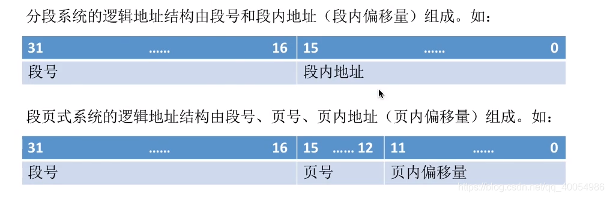
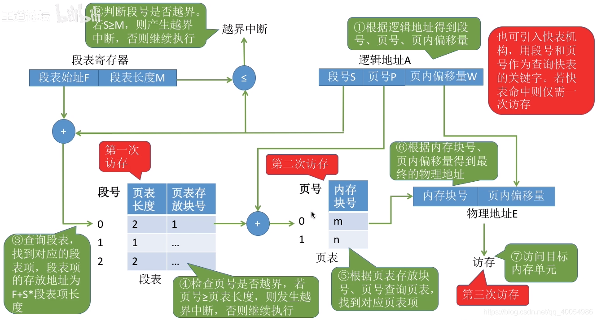

#  1 内存基础知识

## 1.1 存储单元
- 按字节编址的计算机，每个存储单元大小为1字节，即8个二进制位。
- 按字编址的计算机，每个存储单元大小根据计算机的位数确定。

## 1.2 逻辑地址 vs 物理地址
- 逻辑地址（相对地址）：每个程序段的地址都是从0开始编号的地址。
- 物理地址（绝对地址）：实际内存中的真实地址编号。

**逻辑地址到物理地址的映射需要装入程序需要解决的问题。**

**装入的三种方式**
1. **绝对装入**：**在编译时，如果知道程序将放到内存中的哪个位置，编译程序将产生绝对地址的目标代码**。装入程序按照装入模块中的地址，将程序和数据装入内存。

2. **静态重定位**：由又称**可重定位装入**。编译、链接后的装入模块的地址都是从0开始的，指令中使用的地址、数据存放的地址都是**相对于起始地址而言的逻辑地址**。可根据内存的当前情况，将装入模块装入到内存适当的位置。装入时对地址进行“重定位”，将逻辑地址转化为物理地址（地址变换是在装入时一次性完成的）

3. **动态重定位**：又称**动态运行时装入**。编译、链接后的装入模块的地址都是从0开始的。**装入程序把装入模块装入内存后，并不会立即把逻辑地址转化为物理地址，而是把地址转换推迟到程序真正要执行时才进行**。因此装入内存后所有的地址依然是逻辑地址，这种方式需要一个**重定位寄存器**的支持。

优点：
1. 可将程序分配到不连续的存储区，
5. 在程序运行前只需要装入他的部分代码即可投入运行，然后在程序运行期间，根据需要动态申请分配内存，
6. 便于程序段的共享，可以向用户提供一个比存储空间大得多的地址空间。

**链接的三种方式**
1. **静态链接**：在程序运行之前，先将各目标模块及他们所需要的库函数连接成一个完整的可执行文件（装入模块），之后不再拆开。

8. **装入时动态链接**：将各目标模块装入内存时，边装入边链接的方式。

9. **运行时动态链接**：在程序执行中需要该目标模块时， 才对它进行链接。其优点是便于修改和更新，便于实现对目标模块的共享。

# 2 内存管理的概念
内存管理需要做些什么事？
1. 操作系统负责 ***内存空间的分配与回收***

2. 操作系统需要提供某种技术从逻辑上 ***对内存空间进行扩充。***

3. 操作系统需要提供地址转换功能，负责程序的 ***逻辑地址*** 与 ***物理地址*** 的转换

4. 操作系统需要提供 ***内存保护*** 功能。保证各进程在各自存储空间内运行，互不干扰。

- 方法一：在CPU中 ***设置一对上、下限寄存器*** ，存放进程的上下限地址。进程的指令要访问某个地址时，CPU检查是否越界。

- 方法二：采用 ***重定位寄存器***（又称 ***基址寄存器***）和 ***界地址寄存器***（又称 ***限长寄存器***）进行越界检查。重定位寄存器中存放的是进程的 ***起始物理地址***。界地址寄存器中存放的是进程的 ***最大逻辑地址***。

# 3 覆盖和与交换
## 3.1 覆盖
**覆盖技术**：用来 ***解决程序大小超过物理内存总和*** 的问题。
**基本思想**：将程序分为多个段（多个模块）。常用的段常驻在内存，不常用的段在需要时调入内存。内存中分为一个“固定区”和若干个“覆盖区”。需要常驻内存的段放在“固定区”中，调入后不再调出（除非运行结束）。

**缺点**：程序的调用结构必须由程序员显性声明，操作系统完成自动覆盖。对用户不透明，增加了用户编程负担。覆盖技术只用于早期的操作系统中。

## 3.2 交换
**交换技术**：又称**对换技术**。内存空间紧张时，系统将内存中某些进程暂时换出外存，把外存中某些已具备运行条件的进程换入内存（进程在内存与磁盘间动态调度）。**换出时，进程被换出到外存，对应的PCB保留在内存中并插入 *挂起* 队列。** 进程被换出后必须要记录进程存在外存的什么位置，这个信息由PCB 保存。

**挂起**：被换出的进程称为挂起（suspend）态，挂起态由分为 **就绪挂起**，**阻塞挂起**。从而引入7状态模型，具体参考[操作系统--2. 进程与线程](https://blog.csdn.net/qq_40054986/article/details/115918513?spm=1001.2014.3001.5501)

# 4 内存空间的分配与回收
先来两个基本概念:
**内部碎片**：分配给某进程的内存区域中，如果有些部分没有用上，则该部分为内部碎片。
**外部碎片**： 内存中的某些空闲分区由于太小，难以利用，则该部分为外部碎片。

## 4.1 连续分配管理方式
### 4.1.1 单一连续分配
**单一连续分配**：内存被分为系统区和用户区。系统区通常位于内存的低地址部分，用于存放操作系统相关数据；用户区用于存放用户进程相关数据。内存中只能有一道用户进程，用户程序独占整个用户区空间。

### 4.1.2 固定分区分配
**固定分区分配**：将整个用户空间划分为**若干固定大小（分区大小相等、分区大小不相等）的分区**，在每个分区中只装入一道作业。最早可运行多道程序的内存管理方式。

操作系统需要建立一个数据结构--分区说明表，来实现各个分区的分配与回收。每个表项对应一个分区，通常按分区大小排列。每个表项包括对应分区的大小、起始地址，状态（是否分配）。

**优点**：实现简单，无外部碎片
**缺点**：a.当用户程序太大时，可能所有分区都不能满足需求，此时不得不采用覆盖技术来解决，这会降低性能。b.会产生内部碎片，内存利用率低。

### 4.1.3 动态分区分配
**动态分区分配**：又称可变分区分配。这种分配方式不会预先划分内存分区，而是在进程装入内存时，根据进程的大小动态地建立分区，并使分区的大小正好适合进程的需要。
动态分区分配的3个问题：
1. 系统要用什么样的数据结构记录内存的使用情况。

2. 当很多个空闲分区都能满足时，应该选择哪个分区进行分配。

**首次适应算法**：每次从低地址开始查找，找到第一个能满足大小的空闲分区。空闲分区表（链）按起始地址从低到高排列。
**最佳适应算法**：由于动态分区分配是一种连续分配方式，为各进程分配的空间必须是连续的一整片空间区域。因此为了保证当“大进程”到来是能有连续的大片空间，可以尽可能多的留下大片的空闲去，即，**优先使用更小的空闲区**。空闲分区表（链）按容量递增次序排序。每次分配内存时使用最先满足内存大小的空闲分区。**缺点**：每次都选最小的分区进行分配，会留下越来越多的、很小的、难以利用的内存块。会产生很多外部碎片。
**最坏适应算法**：在每次分配时，优先使用最大的空闲分区。空闲分区表（链)按容量递减次序排序。**缺点**：大进程后到达的情况下，可能没有分区分配给他。
**邻近适应算法**：由于首次适应算法每次都是从低地址开始查找，这样会增加查找开销，为了解决这个问题，邻近适应算法会从上一次分配后的地址开始查找。

4. 如何进行分区的分配与回收操作。
   - 分配：
   情况一：
   
   情况二：
   

   - 回收：
   情况一：
   
    情况二
   

情况三：

情况四：

**动态分区分配没有内部碎片，但是会有外部碎片**

## 4.2 非连续分配管理方式
### 4.2.1 基本分页存储管理
**基本分页存储**：a. 把**内存**分为一个个大小相等的小分区（比如：每个分区4KB），每个分区就是一个“**页框**”，或称“**页帧**”、“**内存块**”、“**物理块**”。每个页框有一个编号，即“**页框号**”（或者“**页帧号**”、“**内存块号**”、“**物理块号**”），页框号从0开始。b. 用户**进程的地址空间**也分为**与页框大小相等**的一个个区域，称为“**页**”或“**页面**”。每个页面也有一个编号，即“**页号**”，页号从0开始。进程的每一个页面放入一个页框中。

**分页模型中实现逻辑地址到物理地址的映射（4步）**

1. 算出逻辑地址对应的**页号**：**页号**=逻辑地址/页面长度（向下取整）（**为了方便计算页号，操作系统一般会将页面大小设置为2的整数幂**）

2. 知道该页号对应页面在**内存中的起始地址**
为了能知道进程的每个页面在内存中存放的位置，操作系统要为**每个进程建立一张页表**。

3. 算出逻辑地址在页面内的“偏移量”：**页内偏移量**=逻辑地址%页面长度
4. 物理地址=页面起始地址+页内偏移量。

#### 基本地址变换机构 
通常会在系统中设置一个页表寄存器（PTR），存放**页表在内存中的起始地址F**和**页表长度M**。进程未执行时，页表的起始地址和页表长度**放在进程控制块（PCB）** 中，当进程被调度时，操作系统内核会把他们放到页表寄存器中。***页面大小是2的整数幂***。
例子：设页面大小为L，逻辑地址A到物理地址E的变换过程：
①计算页号P和页内偏移量W。
②比较页号P和**页表长度**M，若P $\geqslant$ M 产生越界中断。
③找到对应的块号b，页表项（块号）地址=页表起始地址F + 页号P * **页表项长度**
④计算 物理地址E=块号b * 页面大小L+页内偏移量W。（操作系统具体操作中只需要使用二进制拼接的方式）

> 页表长度：这个页表中总共有几个页表项，即几个页。
> 页表项长度：每个页表项占多大的存储空间。
> 页面大小：一个页面占多大的存储空间。

**整个过程需要两次访问内存操作：第一次访问：查页表找对应的块号，第二次访问：访问目标内存单元。**

#### 具有块表的地址变换机构 
**局部性原理**：
- 时间局部性：如果执行了程序中的某条指令，那么不久后这条指令很有可能再次执行；如果某个数据被访问过，不久之后该数据很可能再次被访问。（因为程序中存在大量循环）。
- 空间局部性：一旦程序访问了某个存储单元，在不久之后，其附近的存储单元也很有可能被访问。（因为很多数据在内存中都是连续存放的）

> 基本地址变换机构中，每次访问一个逻辑地址，都需要查询内存中的页表项（块号）。由于局部性原理，可能连续很多次查到的都是同一个页表项。能否利用这个特性减少访问页表项的次数呢？

**快表**：又称**联想寄存器（TLB）**，是一种访问速度比内存快很多的高速缓冲存储器，用来存放当前访问的若干页表项，以加速地址变换过程。与此对应，内存中的页表常称为**慢表**。
①计算页号P和页内偏移量W。
②比较页号P和**页表长度**M，若P $\geqslant$ M 产生越界中断。
③在块表中查询对应的页号P，若在块表中找到页号P（块表命中）则跳到第⑤步，否则在内存中查找，即进入第④步。
④若没有找到，则在内存中查找对应的块号b，找到之后将其存入块表中，若块表满了则需要按照一定的替换算法替换页表项，页表项（块号）地址=页表起始地址F + 页号P * **页表项长度**
⑤计算 物理地址E=块号b * 页面大小L+页内偏移量W。（操作系统具体操作中只需要使用二进制拼接的方式）

> 因为局部性原理，一般来说块表的命中率可以达到90%以上。

#### 两级页表
**单级页表的缺陷**：
- 根据页号查询页表的方法，**所有的页表项需要连续存放**，因此需要给进程分配连续的页框来存储页表项，当页表长度很长时，**即一个进程需要较大的连续空间来存储页表**，就失去了离散存储的优势。
- 根据局部性原理可知，很多时候，**进程在一段时间内只需要访问某几个页面就可以正常运行了，因此没必要让整个页表常驻内存**。

**两级页表**：针对第一个问题，可以将页表进行分组，使每个内存块刚好可以放入一个分组，另外，要为离散分配的页表再建立一张页表，称为**页目录表**、或称**外层页表、顶层页表**。

针对第二个问题：

> 若采用多级页表机制，各级页表的大小不能超过一个页面。

### 4.2.2 基本分段存储管理
**进程的地址空间**：按照程序自身的逻辑关系划分为若干个段，每个段都有一个段名（在低级语言中，程序员使用段名来编程），每段从0开始编址。
**内存分配机制**：以段为单位进行分配，每个段在内存中占据连续空间，但各段之间可以不相邻。

分段系统的逻辑地址结构由段号（段名）和段内地址（段内偏移量）组成。段号的位数决定了每个进程最多可以分几个段，段内地址位数决定了每个段的最大长度是多少。

**段表**：程序分为多个段，各段离散地装入内存，为了保证程序能正常运行，就必须能从物理内存中找到各个逻辑段的存放位置。为此，需要为每个进程建立一张段映射表，简称**段表**。

> 1. 每个段对应一个段表项，其中记录了该段在内存中的**起始地址**（**基址**）和**段的长度**。
> 2. 各段表项的长度相同，段号可以隐含，不占内存。

寻址过程：
 

**分段、分页管理的对比：**
- **页是信息的物理单位**。分页的主要目的是为了实现离散分配，提高内存利用率。分页仅仅是系统管理上的需要，完全是系统行为，对用户是不可见的。
- **段是信息的逻辑单位**。分段的主要目的是更好的满足用户需求。一个段通常包含着一组属于一个逻辑模块的信息。分段对用户是可见的，用户编程时需要显式的给出段名。
- 页的大小固定，又系统决定。段的长度不固定，又用户编写的程序决定。
- 分页的用户进程地址空间是一维的，程序员只需要给出一个记忆符即可表示一个地址
- 分段的用户进程地址空间是二维的，程序员在标识一个地址时，既要给出段名，也要给出段内地址。

- 分段比分页**更容易实现信息的共享和保护**。

### 4.2.3 基本段页式存储管理
**分页和分段的优缺点分析**
<table>
	<tr>
		<td>
		</td>
		<td>
			优点
		</td>
		<td>
			缺点
		</td>
	</tr>
	<tr>
		<td>
			分页管理
		</td>
		<td>
			内存空间利用率高， **不会产生外部碎片**  ，只会有少量的内部碎片
		</td>
		<td>
			不方便按照逻辑模块实现信息的共享和保护
		</td>
	</tr>
	<tr>
		<td>
			分段管理
		</td>
		<td>
			很方便按照逻辑模块实现信息的共享和保护
		</td>
		<td>
			如果段长过大，为其分配很大的连续空间会很不方便。另外，段式管理 **会产生外部碎片** 。
		</td>
	</tr>
</table>

**段页是存储结构**：分段+分页=段页式管理

段号的位数决定了每个进程最多可以分几个段
页号位数决定了每个段最大有多少页
页内偏移量决定了页面大小，内存块大小是多少。

**段表、页表**
一个进程对应一个段表，每个段表项对应一个页表，一个进程对应多个页表

**逻辑地址到物理地址的转换**

# 5 虚拟内存
**虚拟内存**：
a. 基于**局部性原理**，在程序装入时，可以将程序中很快会用到的部分装入内存，暂时用不到的部分驻留在外存。
b. 在程序执行过程中，当所访问的信息不在内存时，又操作系统负责将所需信息从外存调入内存。
c. 若空间不够，由操作系统负责将内存中暂时不用的信息换出到外存。
d. 操作系统管理下，在用户看来似乎有一个比实际内存大得多的内存。 
**虚拟内存三大特征**：
a. 多次性： 无需在作业运行时一次性全部装入内存，允许被分为多次调入内存。
b. 对换性：在作业运行时无需一直常驻内存。
c. 虚拟性：从逻辑上扩充内存容量。

虚拟内存技术需要建立在离散分配的内存管理的方式基础上：
a. 请求分页存储管理
b. 请求分段存储管理
c. 请求段页式存储管理

## 5.1 请求分页存储管理
**请求分页**存储管理与**基本分页**存储管理的主要区别:
a. 在程序执行过程中，当所**访问的信息不在内存时，由操作系统负责将所需信息从外存调入内存，然后继续执行程序**。调页。
b. 若内存空间不够，由操作系统负责将内存中暂时用不到的信息换出到外存。换页。

**页表机制**：
与基本分页管理相比，请求分页管理中，为了实现“请求调页”，操作系统需要知道每个页面是否已经调入内存;如果还没调入，那么也需要知道该页面在外存中存放的位置。

**缺页中断机构**：
在请求分页系统中，**每当要访问的页面不在内存时，便产生一个缺页中断**，然后由操作系统的缺页中断处理程序处理中断。此时**缺页的进程阻塞**，放入阻塞队列，调页**完成后再将其唤醒**，放回就绪队列。

a. 如果内存中**有空闲块**，则为进程分配一个空闲块，将所缺页面装入该块，并修改页表中相应的页表项。
b. 如果内存中**没有空闲块**，则由**页面置换算法**选择一个页面淘汰，**若该页面在内存期间被修改过，则要将其写回外存。未修改过的页面不用写回外存**。

**缺页中断**是因为当前执行的指令想要访问的目标页面未调入内存而产生的，因此属于**内中断**

一条指令在执行期间，可能产生**多次缺页中断**。(如: copy A to B，即将逻辑地址A中的数据复制到逻辑地址B，而A、B属于不同的页面，则有可能产生两次中断)
**注意:缺页时未必发生页面置换。若还有可用的空闲内存块，就不用进行页面置换。**

**地址变换机构:**

## 5.2 页面置换算法

- **最佳置换算法**（OPT，Optimal):每次选择**淘汰的页面**将是**以后永不使用**，或者**在最长时间内不再被访问的页面**，这样可以保证最低的缺页率。
- **先进先出置换算法**(FIFO）:每次选择**淘汰的页面**是**最早进入内存的页面**。**实现方法**：把调入内存的页面根据调入的先后顺序排成一个队列，**需要换出页面时选择队头页面**即可。**队列的最大长度取决于系统为进程分配了多少个内存块**。
> Belady异常――当为进程分配的物理块数增大时，缺页次数不减反增的异常现象。只有FIFO算法会产生Belady异常。另外，FIFO算法虽然实现简单，但是该算法与进程实际运行时的规律不适应，因为先进入的页面也有可能最经常被访问。因此，算法性能差。
- **最近最久未使用置换算法**（LRU，least recently used)：每次淘汰的页面是**最近最久未使用的页面**。**实现方法**：赋予每个页面对应的页表项中，用**访问字段记录该页面自上次被访问以来所经历的时间t**。当需要淘汰一个页面时，选择现有页面中t值最大的，即最近最久未使用的页面。
- **时钟置换算法**：是一种性能和开销较均衡的算法，又称**CLOCK算法**，或**最近未用算法**（NRU，NotRecently Used)

**简单的CLOCK算法**实现方法:为每个页面设置一个**访问位**，再将内存中的页面都通过链接指针**链接成一个循环队列**。当某页被访问时，其访问位置为1。当需要淘汰一个页面时，只需检查页的访问位。如果是0，就选择该页换出;如果是1，则将它置为0，暂不换出，继续检查下一个页面，若第一轮扫描中所有页面都是1，则将这些页面的访问位依次置为0后，再进行第二轮扫描（第二轮扫描中一定会有访问位为0的页面，因此**简单的CLOCK 算法**选择一个淘汰页面**最多会经过两轮扫描**)

## 5.3 页面分配策略
**驻留集**：指请求分页存储管理中给进程分配的物理块的集合。在采用了虚拟存储技术的系统中，驻留集大小一般小于进程的总大小。**若驻留集太小，会导致缺页频繁**，系统要花大量的时间来处理缺页，实际用于进程推进的时间很少; **驻留集太大，又会导致多道程序并发度下降，资源利用率降低**。所以应该选择一个合适的驻留集大小。

**驻留集应该如何分配**：
**固定分配**：操作系统为每个进程分配一组固定数目的物理块，在进程运行期间不再改变。即，**驻留集大小不变**
**可变分配**：先为每个进程分配一定数目的物理块，在进程运行期间，可根据情况做适当的增加或减少。即，**驻留集大小可变**

**页面置换范围**：
**局部置换**：发生缺页时只能选进程自己的物理块进行置换。
**全局置换**：可以将操作系统保留的空闲物理块分配给缺页进程，也可以将别的进程持有的物理块置换到外存，再分配给缺页进程。

**固定分配局部置换**：系统为每个进程分配一定数量的物理块，在整个运行期间都不改变。若进程在运行中发生缺页，则只能从该进程在内存中的页面中选出一页换出，然后再调入需要的页面。**这种策略的缺点是**：很难在刚开始就确定应为每个进程分配多少个物理块才算合理。(采用这种策略的系统可以根据进程大小、优先级、或是根据程序员给出的参数来确定为一个进程分配的内存块数)

**可变分配全局置换**：刚开始会为每个进程分配一定数量的物理块。**操作系统会保持一个空闲物理块队列**。当某进程发生缺页时，从空闲物理块中取出一块分配给该进程; 若已无空闲物理块，则可选择一个**未锁定**的页面换出外存，再将该物理块分配给缺页的进程。采用这种策略时，**只要某进程发生缺页，都将获得新的物理块，仅当空闲物理块用完时，系统才选择一个未锁定的页面调出**。被选择调出的页可能是系统中任何一个进程中的页，因此这个**被选中的进程拥有的物理块会减少，缺页率会增加。**

**可变分配局部置换**：刚开始会为每个进程分配一定数量的物理块。当某进程发生缺页时，只允许从该进程自己的物理块中选出一个进行换出外存。**如果进程在运行中频繁地缺页，系统会为该进程多分配几个物理块，直至该进程缺页率趋势适当程度**;**反之，如果进程在运行中缺页率特别低，则可适当减少分配给该进程的物理块**。

**何时调入页面？**
1．预调页策略：根据局部性原理，一次调入若干个相邻的页面可能比一次调入一个页面更高效。但如
果提前调入的页面中大多数都没被访问过，则又是低效的。因此可以预测不久之后可能访问到的页面，将它们预先调入内存，但目前预测成功率只有50%左右。故这种策略**主要用于进程的首次调入，由程序员指出应该先调入哪些部分**。.
2．请求调页策略：进程**在运行期间发现缺页时才将所缺页面调入内存**。由这种策略调入的页面一定会被访问到，但由于每次只能调入一页，而每次调页都要磁盘I/o操作，因此I/o开销较大。

**从何处调入页面？**
1. 系统拥有足够的对换区空间：页面的调入、调出都是在**内存**与**对换区**之间进行，这样可以保证页面的调入、调出速度很快。**在进程运行前，需将进程相关的数据从文件区复制到对换区。**

2. 系统缺少足够的对换区空间：凡是**不会被修改**的数据都直接从文件区调入，由于这些页面不会被修改，因此换出时不必写回磁盘，下次需要时再从文件区调入即可。**对于可能被修改的部分，换出时需写回磁盘对换区**，下次需要时再从对换区调入。

3. UNIX方式：运行之前进程有关的数据全部放在文件区，故未使用过的页面，都可从文件区调入。若被使用过的页面需要换出，则写回对换区，下次需要时从对换区调入。

该文档总结自：[王道考研](https://www.bilibili.com/video/BV1YE411D7nH?p=48&spm_id_from=pageDriver)