<font color=blue>**并发**</font>：两个或多个事件在同一**时间间隔**之内同时发生
<font color=blue>**并行**</font>：两个或多个事件在同一**时刻**同时发生

# 进程
<font color=blue>**顺序进程**</font>，简称**进程**，是操作系统设计者们用于描述**并行**的一种概念模型。计算机上所有可运行的软件，通常也包括操作系统，被组织成若干**顺序进程**。**一个进程就是一个正在执行程序的实例**，包括程序计数器，寄存器和变量的当前值。
一个进程是某种类型的一个活动，有程序、输入、输出以及状态。单个处理器可以被若干进程共享，它使用某种调度算法决定何时停止一个进程的工作，并转而为另一个进程提供服务。**值得注意的是，一个程序运行两次，则算作两个进程**。

[进程和线程的区别（操作系统级别解析）](https://blog.csdn.net/pange1991/article/details/84770181)

## 进程创建
有4中主要的事件可以导致<font color=red>**进程创建**</font>：
1. <font color=green>系统初始化。</font>
启动操作系统时，通常会创建若干个进程。其中有些是**前台进程**，也就是同用户交互并且替他们完成工作的那些进程。其他的是**后台进程**，例如，接收邮件的进程，监听HTTP请求的进程。停留在后台处理诸如电子邮件，Web页面，新闻，打印之类活动的进程称为**守护进程（daemon）**。
2. <font color=green>执行了正在运行的进行所调用的**进程创建系统调用**。</font>
一个正在运行的进程经常发出系统调用，以便创建一个或多个进程协助其工作。
3. <font color=green>用户请求创建一个新进程。</font>
在交互系统中，键入一个命令或点击一个图标就可以启动一个程序。
4. <font color=green>一个批处理作业的初始化。</font>
仅在大型机的批处理系统中应用。当用户提交批处理作业，若系统认为有资源可以运行另一个作业时，就创建一个新进程，并运行其输入队列的下一个作业。

从技术上来看，在所有这些情形中，**新进程都是由于一个 <font color=green>已存在的进程</font>执行了一个用于创建进程的系统调用而创建的**。<font color=green>**这个进程**</font>可以是 1.一个运行的用户进程，2.一个由鼠标或键盘启动的系统进程，3.一个批处理管理进程。这个进程做的工作是执行一个创建新进程的系统调用，这个系统调用通知操作系统创建一个新进程，并且直接或间接地指定在新进程中运行的程序。
**UNIX中**，只有一个系统调用能创建新进程：fork。这个系统调用会创建一个与调用进程相同的副本。两个进程拥有相同的存储映像，同样的环境字符串和同样的打开文件。通常新进程执行execve或一个类似的系统调用，以修改齐存储映像并运行一个新程序。**为什么UNIX要分两步创建进程？**
**Windows中**，一个Win32函数调用CreateProcess既处理进程创建，也负责吧正确的程序装入新进程。
## 进程终止
有4中主要的事件可以导致<font color=red>**进程终止**</font>：
1.  <font color=green>正常退出（自愿的）</font>
2.  <font color=green>出错退出（自愿的）</font>
3.  <font color=green>严重错误（非自愿）</font>
4.  <font color=green>被其他进程杀死（非自愿）</font>
## <font color=red>进程的状态</font>
<font color=red>**进程的五种状态：**</font>
1. <font color=green>**创建状态（New）**</font>：进程正在被创建，尚未到达就绪状态
2. <font color=green>**就绪状态（Ready）**</font>：进程已处于准备运行状态，即进程获得了除了处理器之外的⼀切所需资源，⼀旦得到处理器资源(处理器分配的时间⽚)即可运⾏。
3. <font color=green>**运行状态（Running）**</font>：进程正在处理器上运行（单核CPU下任意时刻只有一个进程处于运行状态）。
4. <font color=green>**阻塞状态（waiting）**</font>：又称等待状态，进程因为正在等待某⼀事件⽽暂停运⾏，如等待某资源可⽤或等待 IO 操作完成。即使处理器空闲，该进程也不能运⾏。**进程只能自己阻塞自己，因为只有进程自身才能知道何时需要等待某种时间的发生。**
5. <font color=green>**结束状态（terminated）**</font>:进程正在从系统中消失。可能是进程正常结束或其他原因中断退出运⾏。
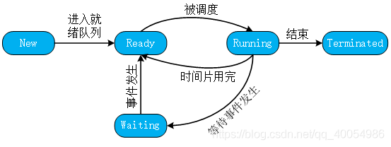

我们知道只有在内存中的程序才会被处理器调用执行, 故所有等待被执行的程序都要首先被放入内存, 但内存是有限的, 有可能会出现不能调入所有待执行程序的情况,  即所有进程都在等待I/O事件(即都是”阻塞”状态), 此时处理器空闲了, 却不能处理未进入内存的待执行程序。
针对上面这个问题, 可以通过不断增加内存大小来解决. 但还是有问题, 内存价格与大小是指数相关的, 不能一味增加大小. 因此操作系统引入了 **挂起(交换)的概念, 即内存已满时, 操作系统会将内存中等待I/O的进程(即”阻塞”状态)移动到硬盘中, 并从硬盘中调入新的"就绪"进程。** 换出的进程被放置在挂起队列中, 由此引申出了七状态模型：
6. <font color=green>**阻塞挂起状态**</font>：进程在外存并等待某事件的出现。
7. <font color=green>**就绪挂起状态**</font>：进程在外存，但要进入内存，即可运行。
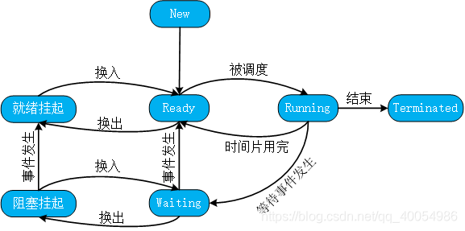

参考：
[1. 操作系统（三）—进程管理 ](https://zhuanlan.zhihu.com/p/88017448)
[2. 操作系统」进程状态模型](https://www.huaweicloud.com/articles/8ba1add5bd9f408942b3f2f1d63ee7ca.html)

## 进程的实现（进程控制块 PCB）
为实现进程模型，操作系统维护这一张表格（一个结构数组），即进程表（process table）。每个进程占用一个**进程表项**（有的这些进程表项为<font color=green>**进程控制块（Process Control Block） PCB**）</font>。**PCB是用来描述进程的数据结构。操作系统为每一个进程维护一个PCB，用来保存与该进程相关的各种状态信息。**  包括程序计数器，堆栈指针，内存分配情况，所打开的文件状态，账号和调度信息，以及其他在进程中由运行态转换到就绪态或阻塞态时必须保存的信息，从而保证该进程下一次能再次启动。
下图展示了典型的PCB中的一些字段：
| 进程管理        | 存储管理   | 文件管理   |
| --------------- | ---------- | ---------- |
| 寄存器          | 正文段指针 | 根目录     |
| 程序计数器      | 数据段指针 | 工作目录   |
| 程序状态字      | 堆栈段指针 | 文件描述符 |
| 堆栈指针        |            | 用户ID     |
| 进程状态        |            | 组ID       |
| 优先级          |            |            |
| 调度参数        |            |            |
| 进程ID          |            |            |
| 父进程          |            |            |
| 进程组          |            |            |
| 信号            |            |            |
| 进程开始时间    |            |            |
| 使用的CPU时间   |            |            |
| 子进程的CPU时间 |            |            |
| 下次报警时间    |            |            |

 **PCB的组织方式**
 1. <font color=green>**线性表方式**</font>：不论进程的状态如何，将所有的PCB连续地存放在内存的系统区。这种方式适用于系统中进程数目不多的情况。
 2. <font color=green>**索引表**</font>：同一状态的进程归入一个index表，多个状态对应多个不同的index表。如就绪索引表，阻塞索引表。
 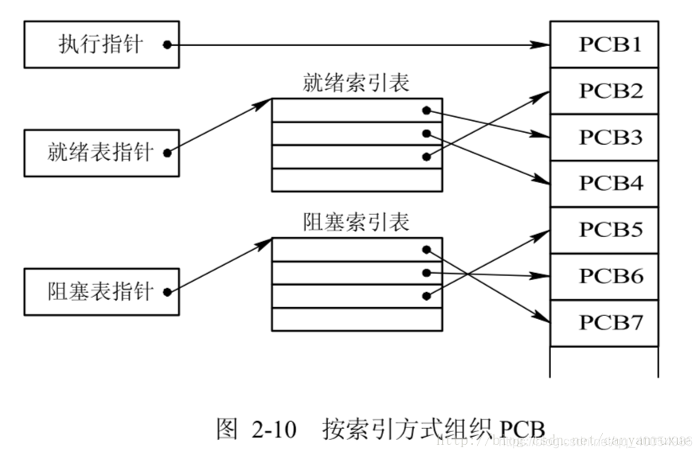
 4. <font color=green>**链表**</font>：同一状态的进程其PCB成一链表，多个状态对应多个不同的链表。从而形成就绪队列、阻塞队列、运行队列等。
 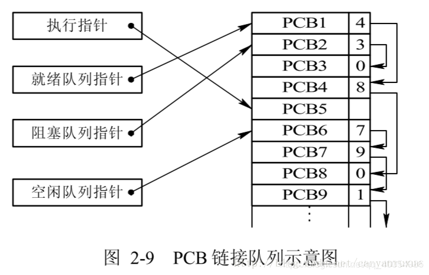

注：一般会选择链表，因为可能面临进程创建，销毁等调度导致进程状态发生变化，所以链表能够更加灵活的插入和删除。

**中断**

<font color=green>**中断**</font>是引起进程调度的一个重要原因。
中断发生后操作系统最底层的工作步骤：

> 1. 硬件压入堆栈程序计数器等。（速度很快，暂存）
> 2. 硬件从中断向量装入新的程序计数器。
> 3. 汇编语言过程保存寄存器值。（将第一步的数据保存）
> 4. 汇编语言过程设置新的堆栈。
> 5. C中断服务例程运行（典型地读和缓冲输入）。
> 6. 调度程序决定下一个将运行的进程。
> 7. C过程返回至汇编代码
> 8. 汇编语言过程开始运行新的当前进程。

**CPU利用率：**
假设一个进程等待I/O操作的时间与其停留在内存中时间的比为$p$。当内存中同时由$n$个进程时，则所有$n$个进程都在等在I/O（此时CPU空转）的概率为$p^n$。
$$
CPU利用率=1-p^n
$$

参考：
[1. 操作系统（三）—进程管理](https://zhuanlan.zhihu.com/p/88017448)
[2. 进程控制块及其作用、组织方式](https://blog.csdn.net/canyanruxue/article/details/78439934)

# 线程
<font color=red>**进程**是资源管理的基本单位，**线程**是调度的基本单位，一个进程中的线程是共享资源的。</font>
传统操作系统中，每个进程有一个**地址空间**和一个**控制线程**。

# <font color=red>进程间通信（IPC）</font>
<font color=blue>**进程间通信**</font>（Inter Process Communication,IPC）主要讨论三个问题：
1. 一个进程如何将信息传递给另一个。
2. 确保两个或多个进程在关键活动中不会出现交叉，例如，购票系统两个进程同时争抢最后一张票。
3. 顺序问题，例如，进程A修改值，进程B打印值，则进程B需要等待进程A修改完成后再打印。

<font color=blue>**竞争条件**</font>，**指两个或多个进程读写共享数据时，其结果取决于进程运行的精确顺序**。例如，进程A修改数据但未写入成功时，由于时间片用完，CPU切换到进程B，进程B读取到进程A修改之前的数据。另一种情况是进程A的时间片在写完数据后才用完，则进程B就能读取到正确的结果。这种进程B的读取结果取决于进程执行的精确顺序。
<font color=blue>**临界区**</font>，或临界区域，是那些对共享内存进行访问的**程序片段**。

每个进程的用户地址空间都是独立的，一般而言是不能互相访问的，但内核空间是每个进程都共享的，所以进程之间要通信必须通过内核。

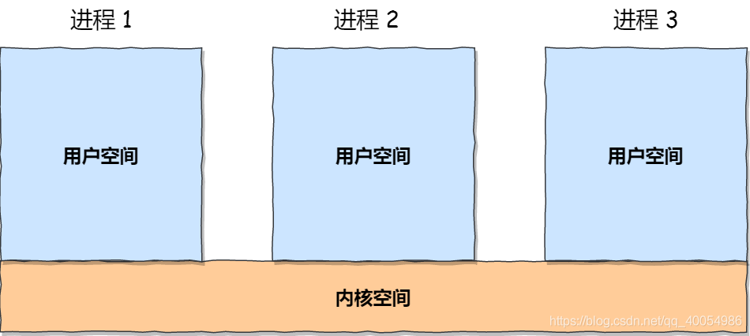
## <font color=red>进程通信的7种方式：</font>
### <font color=blue>1. 管道/匿名管道(pipe)</font>
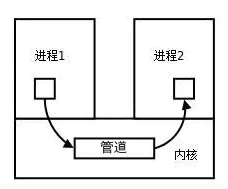

- **管道的性质：**
  - 管道的实质是一个**内核缓冲区**，进程以先进先出的方式从缓冲区存取数据，**写入的内容每次都添加在管道缓冲区的末尾，并且每次都是从缓冲区的头部读出数据。**
  - 单独构成一种独立的文件系统：**管道对于管道两端的进程而言，就是一个文件**，但它不是普通的文件，它不属于某种文件系统，而是自立门户，单独构成一种文件系统，**并且只存在与内存中。**
  - 该缓冲区可以看做是一个循环队列，读和写的位置都是自动增长的，不能随意改变，**一个数据只能被读一次，读出来以后在缓冲区就不复存在了**。
  - 当缓冲区读空或者写满时，有一定的规则控制相应的读进程或者写进程进入等待队列，当空的缓冲区有新数据写入或者满的缓冲区有数据读出来时，就唤醒等待队列中的进程继续读写。

- **管道的局限：**
  - 管道是半双工的，数据只能向一个方向流动；需要双方通信时，需要建立起两个管道。
  - **只能用于父子进程或者兄弟进程之间(具有亲缘关系的进程);** 为什么？ 请参考：[1. 进程间通信](https://www.cnblogs.com/xiaolincoding/p/13402297.html) 管道创建的原理。涉及到UNIX创建进程的方法相关内容。
  - 管道的缓冲区是有限的（管道制存在于内存中，在管道创建时，为缓冲区分配一个页面大小）；
  - 管道所传送的是无格式字节流，这就要求管道的读出方和写入方必须事先约定好数据的格式，比如多少字节算作一个消息（或命令、或记录）等等；
  - 管道这种通信方式效率低，不适合进程间频繁地交换数据。

 - **管道的优点：**
   - 简单，我们很容易得知管道里的数据已经被另一个进程读取了。

**那管道如何创建呢，背后原理是什么？参考 1. [进程间通信](https://www.cnblogs.com/xiaolincoding/p/13402297.html)**
### <font color=blue>2. 有名管道(FIFO)</font>
**有名管道(FIFO)克服了匿名管道只能用于亲缘关系的进程中的缺点。** 有名管道不同于匿名管道之处在于它提供了一个路径名与之关联，**以有名管道的文件形式存在于文件系统中**，这样，即使与有名管道的创建进程不存在亲缘关系的进程，只要可以访问该路径，就能够彼此通过有名管道相互通信，因此，通过有名管道不相关的进程也能交换数据。**有名管道的名字存在于文件系统中，内容存放在内存中。**

> **匿名管道和有名管道总结：**
> （1）管道是特殊类型的文件，在满足先入先出的原则条件下可以进行读写，但不能进行定位读写。
> （2）匿名管道是单向的，只能在有亲缘关系的进程间通信；有名管道以磁盘文件的方式存在，可以实现本机任意两个进程通信。
> （3）**无名管道阻塞问题：** 无名管道无需显示打开，创建时直接返回文件描述符，在读写时需要确定对方的存在，否则将退出。如果当前进程向无名管道的一端写数据，必须确定另一端有某一进程。如果写入无名管道的数据超过其最大值，写操作将阻塞，如果管道中没有数据，读操作将阻塞，如果管道发现另一端断开，将自动退出。
> （4）**有名管道阻塞问题：** 有名管道在打开时需要确实对方的存在，否则将阻塞。即以读方式打开某管道，在此之前必须一个进程以写方式打开管道，否则阻塞。此外，可以以读写（O_RDWR）模式打开有名管道，即当前进程读，当前进程写，不会阻塞。

### <font color=blue>3. 消息(Message)队列</font>
- **消息队列的性质（特点）：**
  -  消息队列是存放在内核中的消息链表，每个消息队列由消息队列标识符表示。
  - 与管道（无名管道：只存在于内存中的文件；命名管道：存在于实际的磁盘介质或者文件系统）不同的是消息队列存放在内核中，只有在内核重启(即，操作系统重启)或者显示地删除一个消息队列时，该消息队列才会被真正的删除。
  - 另外与管道不同的是，消息队列在某个进程往一个队列写入消息之前，并不需要另外某个进程在该队列上等待消息的到达。
  - 目前主要有两种类型的消息队列：POSIX消息队列以及System V消息队列，System V消息队列目前被大量使用。System V消息队列是随内核持续的，只有在内核重起或者人工删除时，该消息队列才会被删除。
  - 消息队列可以实现消息的**随机查询**（<font color=red>消息队列是消息链表，怎么进行随机查询呢？请知道的小伙伴解答一下</font>）,消息不一定要以先进先出的次序读取,也可以按消息的类型读取.比FIFO更有优势。
- **消息队列的缺点：**
  - **消息队列不适合比较大数据的传输**，因为在内核中每个消息体都有一个最大长度的限制，同时所有队列所包含的全部消息体的总长度也是有上限。
  - **消息队列通信过程中，存在用户态与内核态之间的数据拷贝开销**，因为进程写入数据到内核中的消息队列时，会发生从用户态拷贝数据到内核态的过程，同理另一进程读取内核中的消息数据时，会发生从内核态拷贝数据到用户态的过程。

### <font color=blue>4. 共享内存（share memory）</font>
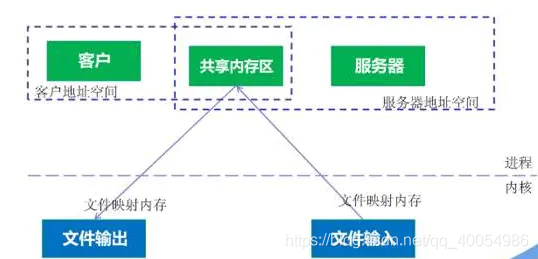

- **共享内存特点**
  - 使得多个进程可以可以直接读写同一块内存空间，是最快的可用IPC形式。现代操作系统，对于内存管理，采用的是虚拟内存技术，共享内存的机制，就是拿出一块虚拟地址空间来，映射到相同的物理内存中。
  - 为了在多个进程间交换信息，**内核专门留出了一块内存区**，**可以由需要访问的进程将其映射到自己的私有地址空间**。进程就可以直接读写这一块内存而不需要进行数据的拷贝，从而大大提高效率。
- **共享内存缺点**
  - 由于多个进程共享一段内存，因此需要依靠某种同步机制（如信号量）来达到进程间的同步及互斥。
### <font color=blue>5. 信号量（semaphore）</font>
**信号量其实是一个整型的计数器，用于多进程对共享数据的访问，实现进程间的同步与互斥，而不是用于缓存进程间通信的数据。**
信号量表示资源的数量，控制信号量的方式有两种操作：
<font color=blue>**P操作**</font>：这个操作会把信号量减去 -1，相减后如果信号量 < 0，则表明无资源可用，进程需阻塞等待。相减后如果信号量 >= 0，则表明还有资源可使用，进程可正常继续执行。
<font color=blue>**V操作**</font>：这个操作会把信号量加上 1，相加后如果信号量 <= 0，则表明当前有阻塞中的进程，于是会将该进程唤醒运行；相加后如果信号量 > 0，则表明当前没有阻塞中的进程；
**P 操作是用在进入共享资源之前，V 操作是用在离开共享资源之后，这两个操作是必须成对出现的。**

Examp1 两个进程 **<font color=blue>互斥</font>访问共享内存**，初始化信号量为`1`。
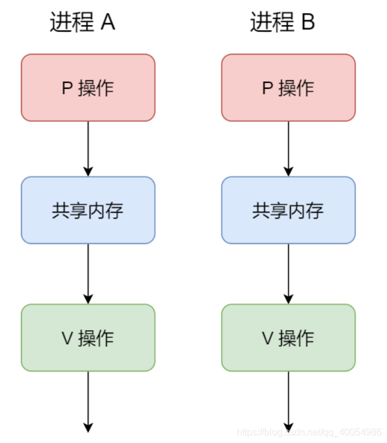

Examp2 两个进程 **<font color=blue>同步</font>访问共享内存**，初始化信号量为`0`。
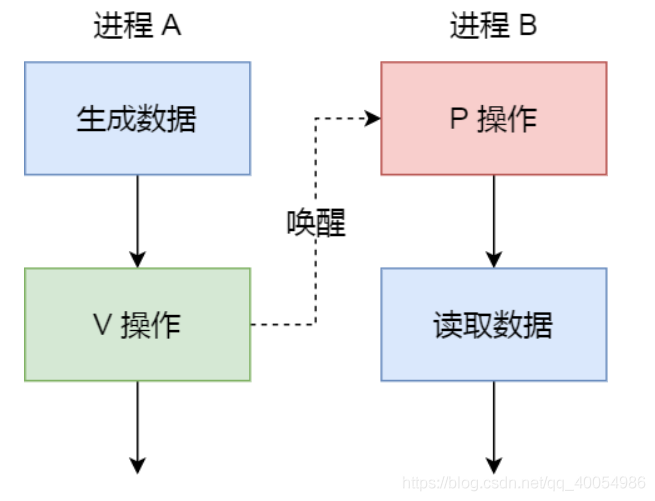
Linux环境中，有三种类型：**Posix（可移植性操作系统接口）有名信号量（使用Posix IPC名字标识）、Posix基于内存的信号量（存放在共享内存区中）、System V信号量（在内核中维护)。**

### <font color=blue>6. 信号（Signal）</font>
- **信号的特性**：
  - 信号是Linux系统中用于进程间互相通信或者操作的一种机制，信号可以在任何时候发给某一进程，而无需知道该进程的状态。
  - 如果该进程当前并未处于执行状态，则该信号就有内核保存起来，直到该进程回复执行并传递给它为止。
  - 如果一个信号被进程设置为阻塞，则该信号的传递被延迟，直到其阻塞被取消是才被传递给进程。
  - 信号是软件层次上对中断机制的一种模拟，信号是进程间通信机制中唯一的**异步通信机制**。
  - 信号可以在用户空间进程和内核之间直接交互，内核可以利用信号来通知用户空间的进程发生了哪些系统事件。

> **Linux系统中常用信号：**
> （1）**SIGHUP**：用户从终端注销，所有已启动进程都将收到该进程。系统缺省状态下对该信号的处理是终止进程。
> （2）**SIGINT**：程序终止信号。程序运行过程中，按`Ctrl+C`键将产生该信号。
> （3）**SIGQUIT**：程序退出信号。程序运行过程中，按`Ctrl+\\`键将产生该信号。
> （4）**SIGBUS和SIGSEGV**：进程访问非法地址。
> （5）**SIGFPE**：运算中出现致命错误，如除零操作、数据溢出等。
> （6）**SIGKILL**：用户终止进程执行信号。`shell`下执行`kill -9`发送该信号。
> （7）**SIGTERM**：结束进程信号。`shell`下执行`kill 进程pid`发送该信号。
> （8）**SIGALRM**：定时器信号。
> （9）**SIGCLD**：子进程退出信号。如果其父进程没有忽略该信号也没有处理该信号，则子进程退出后将形成僵尸进程。

**信号事件主要有两个来源：**
- 硬件来源：用户按键输入`Ctrl+C`退出、硬件异常如无效的存储访问等。
- 软件终止：终止进程信号、其他进程调用kill函数、软件异常产生信号。

**信号生命周期和处理流程**
（1）信号被某个进程产生，并设置此信号传递的对象（一般为对应进程的pid(进程ID)），然后传递给操作系统；
（2）操作系统根据接收进程的设置（是否阻塞）而选择性的发送给接收者，如果接收者阻塞该信号（且该信号是可以阻塞的），操作系统将暂时保留该信号，而不传递，直到该进程解除了对此信号的阻塞（如果对应进程已经退出，则丢弃此信号），如果对应进程没有阻塞，操作系统将传递此信号。
（3）目的进程接收到此信号后，将根据当前进程对此信号设置的预处理方式，暂时终止当前代码的执行，保护上下文（主要包括临时寄存器数据，当前程序位置以及当前CPU的状态）、转而执行中断服务程序，执行完成后在回复到中断的位置。当然，对于抢占式内核，在中断返回时还将引发新的调度。
### <font color=blue>7. 套接字(socket) </font>
Socket又称之为“套接字”，是系统提供的用于网络通信的方法。它的实质并不是一种协议，没有规定计算机应当怎么样传递消息，只是给程序员提供了一个发送消息的接口，程序员使用这个接口提供的方法，发送与接收消息。Socket描述了一个IP、端口对。知道对方的IP以及PORT就可以给对方发送消息，再由服务器端来处理发送的这些消息。所以，Socket一定包含了通信的双方。
**端口号** ：每一个基于TCP/IP网络通讯的程序(进程)都被赋予了唯一的端口和端口号，端口是一个信息缓冲区，用于保留Socket中的输入/输出信息，端口号是一个16位无符号整数，范围是0-65535，以区别主机上的每一个程序（端口号就像房屋中的房间号），低于256的端口号保留给标准应用程序，比如pop3的端口号就是110，每一个套接字都组合进了IP地址、端口，这样形成的整体就可以区别每一个套接字。
套接字是一种通信机制，凭借这种机制，客户/服务器（即要进行通信的进程）系统的开发工作既可以在本地单机上进行，也可以跨网络进行。
套接字是支持TCP/IP的网络通信的**基本操作单元**，可以看做是不同主机之间的进程进行双向通信的端点，简单的说就是通信的两方的一种约定，用套接字中的**相关函数**（connect，bind，listen，accept）来完成通信过程。

<font color=blue>**套接字属性**</font>
套接字系统调用：
```
int socket(int domain, int type, int protocal)
```

套接字的特性由3个属性确定，它们分别是：domain 、type 、protocal ：
- **domain **：它指定套接字通信中使用的网络介质，**比如 AF_INET 用于 IPV4、AF_INET6 用于 IPV6、AF_LOCAL/AF_UNIX 用于本机，AF_UNIX，表示UNIX文件系统，它就是文件输入/输出，而它的地址就是文件名。** 当客户使用套接字进行跨网络的连接时，它就需要用到**服务器计算机的IP地址和端口来指定一台联网机器上的某个特定服务**，所以在使用socket作为通信的终点，服务器应用程序必须在开始通信之前绑定一个端口，服务器在指定的端口等待客户的连接。
- **type** ：参数用来指定通信特性。比如 SOCK_STREAM 表示的是字节流，对应 TCP、SOCK_DGRAM 表示的是数据报，对应 UDP、SOCK_RAW 表示的是原始套接字；
  - **流套接字**：在域中通过TCP/IP连接实现，同时也是AF_UNIX中常用的套接字类型。流套接字提供的是一个有序、可靠、双向字节流的连接，因此发送的数据可以确保不会丢失、重复或乱序到达，而且它还有一定的出错后重新发送的机制。
  - **数据报套接字**：它不需要建立连接和维持一个连接，它们在域中通常是通过UDP/IP协议实现的。它对可以发送的数据的长度有限制，数据报作为一个单独的网络消息被传输,它可能会丢失、复制或错乱到达，UDP不是一个可靠的协议，但是它的速度比较高，因为它并一需要总是要建立和维持一个连接。
  - **原始套接字**：原始套接字允许对较低层次的协议直接访问，比如IP、 ICMP协议，它常用于检验新的协议实现，或者访问现有服务中配置的新设备，因为RAW SOCKET可以自如地控制Windows下的多种协议，能够对网络底层的传输机制进行控制，所以可以应用原始套接字来操纵网络层和传输层应用。比如，我们可以通过RAW SOCKET来接收发向本机的ICMP、IGMP协议包，或者接收TCP/IP栈不能够处理的IP包，也可以用来发送一些自定包头或自定协议的IP包。网络监听技术很大程度上依赖于SOCKET_RAW。

- **protocal**：protocal 参数原本是用来指定通信协议的，但现在基本废弃。因为协议已经通过前面两个参数指定完成，protocol 目前一般写成 0 即可；

> 原始套接字与标准套接字的区别在于：
> 原始套接字可以读写内核没有处理的IP数据包，而流套接字只能读取TCP协议的数据，数据报套接字只能读取UDP协议的数据。因此，如果要访问其他协议发送数据必须使用原始套接字。

<font color=blue>**针对 TCP 协议通信的 socket 编程模型**</font>
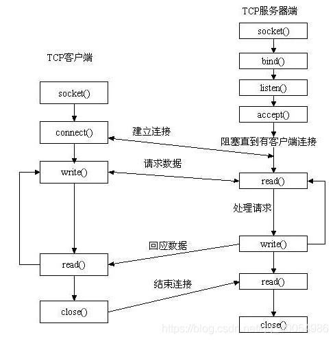

- <font color=red>服务端</font>和<font color=blue>客户端</font>初始化 `socket`，得到文件描述符；
- <font color=red>服务端</font>调用 `bind`，将一个本地协议地址绑定在 IP 地址和端口上;
- <font color=red>服务端</font>调用 `listen`，进行监听；
- <font color=red>服务端</font>调用 `accept`，等待客户端连接；
- <font color=blue>客户端</font>调用 `connect`，向<font color=red>服务端</font>的地址和端口发起连接请求；
- <font color=red>服务端</font> `accept` 返回用于传输的 socket 的文件描述符；
- <font color=blue>客户端</font>调用 `write` 写入数据；<font color=red>服务端</font>调用 `read` 读取数据；
- <font color=blue>客户端</font>断开连接时，会调用 `close`，那么<font color=red>服务端</font> `read` 读取数据的时候，就会读取到了 `EOF`，待处理完数据后，<font color=red>服务端</font>调用 `close`，表示连接关闭。

服务端调用 accept 时，连接成功了会返回一个已完成连接的 socket，后续用来传输数据。所以，**监听的 socket 和真正用来传送数据的 socket，是「两个」 socket，一个叫作监听 socket，一个叫作已完成连接 socket**。

<font color=blue>**针对 UDP 协议通信的 socket 编程模型**</font>
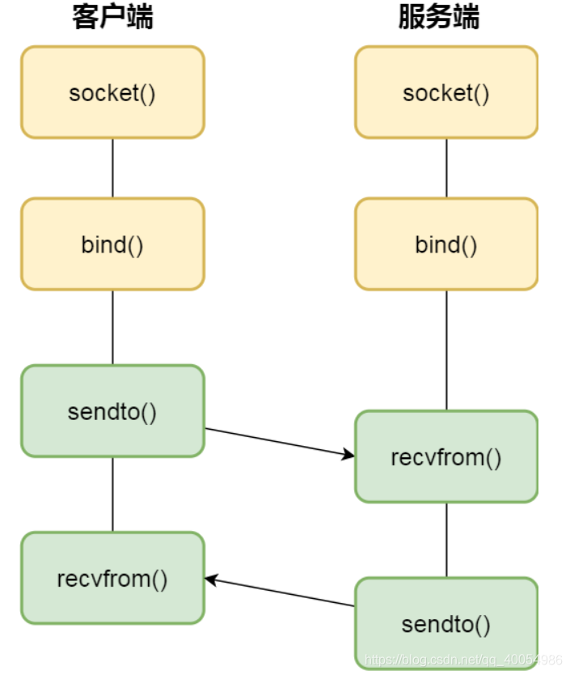

对于 UDP 来说，不需要要维护连接，那么也就没有所谓的发送方和接收方，甚至都不存在客户端和服务端的概念，只要有一个 socket 多台机器就可以任意通信，因此每一个 UDP 的 socket 都需要 bind。每次通信时，调用 sendto 和 recvfrom，都要传入目标主机的 IP 地址和端口。

<font color=blue>**针对本地进程间通信的 socket 编程模型**</font>
本地 socket 被用于在同一台主机上进程间通信的场景：
- 本地 socket 的编程接口和 IPv4 、IPv6 套接字编程接口是一致的，可以支持**字节流**和**数据报**两种协议；
- 本地 socket 的实现效率大大高于 IPv4 和 IPv6 的字节流、数据报 socket 实现；

对于本地**字节流** socket，其 socket 类型是 AF_LOCAL 和 SOCK_STREAM。
对于本地**数据报** socket，其 socket 类型是 AF_LOCAL 和 SOCK_DGRAM。

本地字节流 socket 和 本地数据报 socket 在 bind 的时候，不像 TCP 和 UDP 要绑定 IP 地址和端口，而是**绑定一个本地文件**，这也就是它们之间的最大区别。


参考：
[1. 进程间通信](https://www.cnblogs.com/xiaolincoding/p/13402297.html)
[2. 进程间通信IPC (InterProcess Communication)](https://www.jianshu.com/p/c1015f5ffa74)
# <font color=red>进程调度</font>
调度算法分类：批处理系统的调度算法，交互式系统的调度算法，实时系统调度算法。
调度的基本准则：
- 所有系统
  - 公平--给每个进程公平的CPU份额
  - 策略强制执行--看到所宣布的策略执行
  - 平衡--保持系统的所有部分都在忙碌
- 批处理系统
  - 吞吐量--每小时最大作业数
  - 周转时间--从提交到终止间的最小时间
  - CPU利用率--保持CPU始终忙碌
- 交互式系统
  - 响应时间--快速响应请求
  - 均衡性--满足用户的期望
- 实时系统
  - 满足截止时间--避免丢失数据
  - 可预测性--在多媒体系统中避免品质降低

<font color=red>**进程调度算法**：</font> 
1. **先到先服务(FCFS)调度算法** : 从就绪队列中选择⼀个最先进⼊该队列的进程为之分配资源，使它⽴即执⾏并⼀直执⾏到完成或发⽣某事件⽽被阻塞放弃占⽤ CPU 时再重新调度。
2. **短作业优先(SJF)的调度算法** : 从就绪队列中选出⼀个估计运⾏时间最短的进程为之分配资源，使它⽴即执⾏并⼀直执⾏到完成或发⽣某事件⽽被阻塞放弃占⽤ CPU 时再重新调度。
3. **时间⽚轮转调度算法**: 时间⽚轮转调度是⼀种最古⽼，最简单，最公平且使⽤最⼴的算法，⼜称 RR(Round robin)调度。每个进程被分配⼀个时间段，称作它的时间⽚，即该进程允许运⾏的时间。
4. **多级反馈队列调度算法** ：前⾯介绍的⼏种进程调度的算法都有⼀定的局限性。如**短进程优先的调度算法，仅照顾了短进程⽽忽略了⻓进程**。多级反馈队列调度算法既能使⾼优先级的作业得到响应⼜能使短作业（进程）迅速完成。，因⽽它是⽬前**被公认的⼀种较好的进程调度算法**，UNIX 操作系统采取的便是这种调度算法。
5. **优先级调度**： 为每个流程分配优先级，⾸先执⾏具有最⾼优先级的进程，依此类推。具有相同优先级的进程以 FCFS ⽅式执⾏。可以根据内存要求，时间要求或任何其他资源要求来确定优先级。