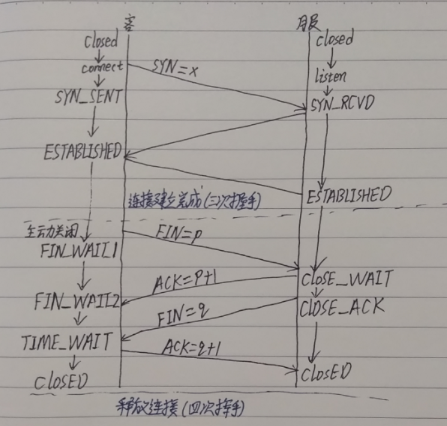

# TCP/IP

https://xzchsia.github.io/2020/08/31/tcp-seq-ack/

**第一次握手：**客户端发送一个TCP的SYN标志位置1的包指明客户打算连接的服务器的端口，以及初始序号X,保存在包头的序列号(Sequence Number)字段里。

**第二次握手：**服务器发回确认包(ACK)应答。即SYN标志位和ACK标志位均为1同时，将确认序号(Acknowledgement Number)设置为客户的ISN（初始化序列号）加1以. 即X+1。

**第三次握手：**客户端再次发送确认包(ACK) SYN标志位为0,ACK标志位为1. 并且把服务器发来ACK的序号字段+1,放在确定字段中发送给对方.并且在数据段放写客户端ISN的（X+1）

## 拥塞控制：

https://zhuanlan.zhihu.com/p/144273871

## TCP连接的状态

**为什么释放连接需要TIME_WAIT？**

**为了TCP打算执行必要的工作以彻底终止某个连接两个方向上的数据流（即全双工关闭），那么他必须要正确处理连接终止四个分节中任何一个分节丢失的情况处于TIME_WAIT这个状态时，此套接字上的绑定了资源，将在2MSL（最大报文生存时间）内不可再使用。选择2MSL这个时间是为了避免出现上一次连接中被动关闭端重复发送的数据包。**

假设ip1:port1和ip2:port2 之间有一个TCP连接。我们关闭了这个链接，过一段时间后在相同IP和端口之间建立了另一个连接。TCP必须防止来自之前那个连接的老的重复分组在新连接上出现。为了做到这一点，TCP将不复用处于TIME_WAIT状态的连接。2MSL的时间足以让某个方向上的分组存活MSL秒后被丢弃，另一个方向上的应答也最多存活MSL秒后被丢弃。

## HTTPs

**一、关于加密的基本概念**

明文
HTTP协议是明文传输的，明文就是未被加密过的原始数据。

密钥
通常是一个字符串或数字，进行加密/解密算法时使用。公钥和私钥都是密钥，只不过一般公钥是对外开放的，加密时使用；私钥是不公开的，解密时使用。

非对称加密算法（公钥加密）
有RSA、DSA/DSS、Elgamal、Rabin、D-H、ECC等。在客户端与服务器相互验证的过程中用的就是非对称加密算法
RSA密码体制就是公钥密码体制，RSA的一对公钥和私钥都可以用来加密和解密。
比如公钥加密后只能由私钥解密；私钥加密后只能由公钥解密。且一方加密的内容只能由对方进行解密。

对称加密算法（私钥加密）
有AES、DES、3DES、TDEA、Blowfish、RC4、RC5、IDEA等。加密使用的密钥和解密使用的密钥是同一个密钥。由于加密算法是公开的，若要保证安全性，密钥不能对外公开。通常用来加密消息体。

HASH算法
有MD5，SHA1，SHA256。用来确认信息没有被篡改。主要用来生成签名，签名是加在信息后面的，可以证明信息没有被修改过。一般对信息先做hash计算得到一个hash值，然后用私钥加密（这个加密一般是非对称加密）作为一个签名和信息一起发送。接收方收到信息后重新计算信息的hash值，且和信息所附带的hash值解密后进行对比。如果一样则认为没有被修改，反之则认为修改过，不做处理。可能有一种情况，黑客修改了信息并把hash值也改了，从而让他们相匹配。所以hash值一般都是加密后（生成签名）再和信息一起发送，确保hash值不会被修改。

数字证书
主要包含证书发布机构，证书有效期，公钥，证书所有者，签名使用的算法，指纹以及指纹算法。数字证书可以保证里面的公钥一定是证书持有者的。

将明文通过Hash算法加密生成摘要，再将消息体摘要用私钥加密后就是签名了。当下一级证书或客户端需要时就返回这个整体。数字签名主要作用就是配合Hash算法保证信息没有被篡改。当https验证通过后，一般会改用对称加密方式通信，因为RSA公钥体制比较耗性能。所以数字签名只存在于验证阶段。

证书链
证书是分级的，证书链由多个证书一级一级组成，拿到上级证书的公钥才能解密本级证书。只有最底层的证书是自签名的，自己颁发给自己。

**二、HTTPS验证过程**

1）客户端发起一个http请求，告诉服务器自己支持哪些hash算法。

2）服务端把自己的信息以数字证书的形式返回给客户端（证书内容有密钥公钥，网站地址，证书颁发机构，失效日期等）。证书中有一个公钥来加密信息，私钥由服务器持有。

3）验证证书的合法性

客户端收到服务器的响应后会先验证证书的合法性（证书中包含的地址与正在访问的地址是否一致，证书是否过期）。

4）生成随机密码（RSA签名）

如果验证通过，或用户接受了不受信任的证书，浏览器就会生成一个随机的对称密钥（session key）并用公钥加密，让服务端用私钥解密，解密后就用这个对称密钥进行传输了，并且能够说明服务端确实是私钥的持有者。

5）生成对称加密算法

验证完服务端身份后，客户端生成一个对称加密的算法和对应密钥，以公钥加密之后发送给服务端。此时被黑客截获也没用，因为只有服务端的私钥才可以对其进行解密。之后客户端与服务端可以用这个对称加密算法来加密和解密通信内容了。

## HTTP3.0

基于UDP的HTTP协议, QUIC

**重大改进：**

1. 基于UDP协议的改进版本QUIC协议的HTTP

2. 0RTT，首次连接时需要1RTT进行密钥交换

3. 前项安全：前向安全指的是密钥泄漏也不会让之前加密的数据被泄漏，影响的只有当前，对之前的数据无影响。

4. 前项纠错：也叫前向纠错码Forward Error Correction 简称FEC，是增加数据通讯可信度的方法，在单向通讯信道中，一旦错误被发现，其接收器将无权再请求传输。QUIC每发送一组数据就对这组数据进行异或运算，并将结果作为一个FEC包发送出去，接收方收到这一组数据后根据数据包和FEC包即可进行校验和纠错。

5. **确认可靠性：**

	https://www.sohu.com/a/456258632_100093134

	

	- **Flags**: 用于表示 Connection ID 长度、Packet Number 长度等信息；
	- **Connection ID**：客户端随机选择的最大长度为 64 位的无符号整数。但是，长度可以协商；
	- **QUIC Version**：QUIC 协议的版本号，32 位的可选字段。如果 Public Flag & FLAG_VERSION != 0，这个字段必填。客户端设置 Public Flag 中的 Bit0 为 1，并且填写期望的版本号。如果客户端期望的版本号服务端不支持，服务端设置 Public Flag 中的 Bit0 为 1，并且在该字段中列出服务端支持的协议版本（0 或者多个），并且该字段后不能有任何报文；
	- **Packet Number**：长度取决于 Public Flag 中 Bit4 及 Bit5 两位的值，最大长度 6 字节。发送端在每个普通报文中设置 Packet Number。发送端发送的第一个包的序列号是 1，随后的数据包中的序列号的都大于前一个包中的序列号；
	- **Stream ID**：用于标识当前数据流属于哪个资源请求；
	- **Offset**：标识当前数据包在当前 Stream ID 中的字节偏移量。

	QUIC 同样是一个可靠的协议，它使用 Packet Number 代替了 TCP 的 Sequence Number，并且每个 Packet Number 都严格递增，也就是说就算 Packet N 丢失了，重传的 Packet N 的 Packet Number 已经不是 N，而是一个比 N 大的值，比如 Packet N+M。

	QUIC 使用的 Packet Number 单调递增的设计，可以让数据包不再像 TCP 那样必须有序确认，QUIC 支持乱序确认，当数据包 Packet N 丢失后，只要有新的已接收数据包确认，当前窗口就会继续向右滑动。待发送端获知数据包 Packet N 丢失后，会将需要重传的数据包放到待发送队列，重新编号比如数据包 Packet N+M 后重新发送给接收端，对重传数据包的处理跟发送新的数据包类似，这样就不会因为丢包重传将当前窗口阻塞在原地，从而解决了队头阻塞问题。那么，既然重传数据包的 Packet N+M 与丢失数据包的 Packet N 编号并不一致，我们怎么确定这两个数据包的内容一样呢？

	QUIC 使用 Stream ID 来标识当前数据流属于哪个资源请求，这同时也是数据包多路复用传输到接收端后能正常组装的依据。重传的数据包 Packet N+M 和丢失的数据包 Packet N 单靠 Stream ID 的比对一致仍然不能判断两个数据包内容一致，还需要再新增一个字段 Stream Offset，标识当前数据包在当前 Stream ID 中的字节偏移量。

# TCP和UDP的区别

1. 连接性：TCP是面向连接的协议，在收发数据前必须和对方建立可靠的连接，建立连接的3次握手、断开连接的4次挥手，为数据传输打下可靠基础;UDP是一个面向无连接的协议，数据传输前，源端和终端不建立连接，发送端尽可能快的将数据扔到网络上，接收端从消息队列中读取消息段。
2. 可靠性：TCP提供可靠交付的服务，传输过程中采用许多方法保证在连接上提供可靠的传输服务，如编号与确认、流量控制、计时器等，确保数据无差错，不丢失，不重复且按序到达;UDP使用尽可能最大努力交付，但不保证可靠交付。
3. 报文首部：TCP报文首部有20个字节，额外开销大;UDP报文首部只有8个字节，标题短，开销小。

4. **TCP协议面向字节流，将应用层报文看成一串无结构的字节流，分解为多个TCP报文段传输后，在目的站重新装配;UDP协议面向报文，不拆分应用层报文，只保留报文边界，一次发送一个报文，接收方去除报文首部后，原封不动将报文交给上层应用。**
5. 吞吐量控制：TCP拥塞控制、流量控制、重传机制、滑动窗口等机制保证传输质量;UDP没有。
6. 双工性：TCP只能点对点全双工通信;UDP支持一对一、一对多、多对一和多堆垛的交互通信。

# IO/NIO

# Redis/Netty

