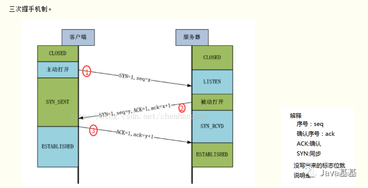

# 五层网络架构

OSI的七层协议体系结构概念清楚，理论完整，但较为复杂不实用。TCP/IP体系结构则不同，他已经得到了广泛的应用，他只包含四层体系结构，但从实质上讲他只有上三层，因为最下层网络接口层没有什么特别的新内容，与一般的通信链路在功能上没有很大的差别。即综合OSI与TCP/IP的优点，采用一种只有五层协议的体系结构

## 各层的作用

1. 应用层：简而言之，应用层协议的内容就是我们程序直接面对的，要使用的数据，也是整个网络传输要传递的内容。如何理解协议呢？协议其实就是一种规范，人与人交流需要语言互通，计算机的应用进程也一样，要遵守交互的规则。对于不同的网络应用需要遵守不同的应用层协议。如万维网的HTTP协议，电子邮件的SMTP协议，文件传送的FTP协议等等。我们将应用层交互的数据称为报文。

2. 运输层：是为两个主机中进程之间的通信提供**通用的数据传输服务**。接收到应用层进程的报文后，**加装此进程的端口等信息**，封装成报文段。每一个应用程序都对应一个端口号，就像门牌号一样。运输层是通用的是指他不针对于某个应用，而是多种应用可以使用同一个运输层服务也称为复用，即同时服务于多个应用。在接受信息时将数据再分发给各个应用，也称为分用。运输层主要使用两种协议TCP和UDP。

3. 网络层：负责为**不同分组网络上的主机提供通信服务**，是主机与主机之间的通信。运输层将数据加装进程端口等信息后封装为报文段交给网络层，**网络层将报文段加装网络号与主机号等信息封装为IP数据报**，简称数据报。

  > **IP协议**
  > 与IP配合使用的协议还有其他三个协议，
  > 地址解析协议ARP
  > 网际控制报文协议ICMP
  > 网际组管理协议IGMP

4. 数据链路层：两台主机的数据传输，总是在一段一段的链路上进行的，这就需要专门的链路层协议。数据链路层将网络层交下来的IP数据报加装控制信息，组装成数据帧。这样接收端就可以根据控制信息了解到应该从哪里开始读取到哪里结束。再提取出数据部分，上交自己网络层。

  > 三个基本问题
  > 1）封装成帧：在IP数据报前后添加首部和尾部，转发给物理层。
  > 2）透明传输：解决数据中可能存在控制字符而导致接收端丢失数据的情况，解决办法一般为字符填充，即在数据中的控制字符前加上转义字符ESC。
  > 3）差错检测：通过循环冗余检验来检测传输过程中产生的差错，如比特差错。
  >
  > 两种协议
  > 1）PPP协议：计算机与ISP进行通信时使用的数据链路层协议。
  > 2）CSMA/CD协议：普通局域网内部使用，一台计算机发送数据时，所有数据都能检测到这个数据。

  数据封装完成：

  

5. 在上述的个协议层中已经完成了数据的封装处理，物理层就是用来将这些数据转为二进制真实的发送到目的地去。传输单位为比特。
   **网络设备**：中继器和集线器。

# TCP

https://xzchsia.github.io/2020/08/31/tcp-seq-ack/

## 三次握手

**第一次握手：** 

客户端向服务器发出连接请求报文，这时报文首部中的同部位SYN=1，同时随机生成初始序列号 seq=x

此时，TCP客户端进程进入了 SYN-SENT（同步已发送状态）状态。TCP规定，SYN报文段（SYN=1的报文段）不能携带数据，但需要消耗掉一个序号。

这个三次握手中的开始。表示客户端想要和服务端建立连接。

**第二次握手：**

 TCP服务器收到请求报文后，如果同意连接，则发出确认报文。确认报文中应该 ACK=1，SYN=1，确认号是ack=x+1，同时也要为自己随机初始化一个序列号 seq=y

此时，TCP服务器进程进入了SYN-RCVD（同步收到）状态。这个报文也不能携带数据，但是同样要消耗一个序号。这个报文带有SYN(建立连接)和ACK(确认)标志，询问客户端是否准备好。

**第三次握手：**

TCP客户进程收到确认后，还要向服务器给出确认。确认报文的ACK=1，ack=y+1，此时，TCP连接建立，客户端进入ESTABLISHED（已建立连接）状态。

TCP规定，ACK报文段可以携带数据，但是如果不携带数据则不消耗序号。这里客户端表示我已经准备好。

> 为什么是三次握手
>
> **举例：已失效的连接请求报文段。**
>
> client发送了第一个连接的请求报文，但是由于网络不好，这个请求没有立即到达服务端，而是在某个网络节点中滞留了，直到某个时间才到达server
>
> 本来这已经是一个失效的报文，但是server端接收到这个请求报文后，还是会想client发出确认的报文，表示同意连接。
>
> 假如不采用三次握手，那么只要server发出确认，新的建立就连接了，但其实这个请求是失效的请求，client是不会理睬server的确认信息，也不会向服务端发送确认的请求
>
> 但是server认为新的连接已经建立起来了，并一直等待client发来数据，这样，server的很多资源就没白白浪费掉了

**重磅**

三次握手连接阶段，最后一次ACK包丢失会进入什么样的一个状态

**Server 端**

第三次的ACK在网络中丢失，那么Server 端该TCP连接的状态为SYN_RECV,并且会根据 TCP的超时重传机制，会等待3秒、6秒、12秒后重新发送SYN+ACK包，以便Client重新发送ACK包。

而Server重发SYN+ACK包的次数，可以通过设置/proc/sys/net/ipv4/tcp_synack_retries修改，默认值为5.

如果重发指定次数之后，仍然未收到 client 的ACK应答，那么一段时间后，Server自动关闭这个连接。

**Client 端**

在linux c 中，client 一般是通过 connect() 函数来连接服务器的，而connect()是在 TCP的三次握手的第二次握手完成后就成功返回值。也就是说 client 在接收到 SYN+ACK包，它的TCP连接状态就为 established （已连接），表示该连接已经建立。那么如果 第三次握手中的ACK包丢失的情况下，Client 向 server端发送数据，Server端将以 RST包（强制关闭连接包）响应，方能感知到Server的错误。

## 数据传输过程

**1）** 主机A初始seq为1200,滑动窗体为100,向主机B传递数据的过程。

**2）** 假设主机B在完全成功接收数据的基础上,那么主机B为了确认这一点，向主机A发送 ACK 包，并将 Ack 号设置为 1301。因此按如下的公式确认 Ack 号：

`Ack号 = Seq号 + 传递的字节数 + 1`（这是在完全接受成功的情况下）

**3）** 主机A获得B传来的ack(1301)后,开始发送seq为1301,滑动窗体为100的数据。……

与三次握手协议相同，最后加 1 是为了告诉对方要传递的 Seq 号。上面说了，主机B完全成功接收A发来的数据才是这样的,如果存在丢包该如何。

## 四次挥手

**第一次挥手**

TCP发送一个FIN(结束)，用来关闭客户到服务端的连接。客户端进程发出连接释放报文，并且停止发送数据。

释放数据报文首部，FIN=1，其序列号为seq=u（等于前面已经传送过来的数据的最后一个字节的序号加1），此时，客户端进入FIN-WAIT-1（终止等待1）状态。TCP规定，FIN报文段即使不携带数据，也要消耗一个序号。

**第二次挥手**

服务端收到这个FIN，他发回一个ACK(确认)，确认收到序号为收到序号+1，和SYN一样，一个FIN将占用一个序号。

服务器收到连接释放报文，发出确认报文，ACK=1，ack=u+1，并且带上自己的序列号seq=v，此时，服务端就进入了CLOSE-WAIT（关闭等待）状态。

TCP服务器通知高层的应用进程，客户端向服务器的方向释放了，这时候处于半关闭状态，即客户端已经没有数据要发送了，但是服务器若发送数据，客户端依然要接受。

这个状态还要持续一段时间，也就是整个CLOSE-WAIT状态持续的时间。

客户端收到服务器的确认请求后，此时，客户端就进入FIN-WAIT-2（终止等待2）状态，等待服务器发送连接释放报文（在这之前还需要接受服务器发送的最后的数据）。

**第三次挥手**

服务端发送一个FIN(结束)到客户端，服务端关闭客户端的连接。

服务器将最后的数据发送完毕后，就向客户端发送连接释放报文，FIN=1，ack=u+1，由于在半关闭状态，服务器很可能又发送了一些数据

假定此时的序列号为seq=w，此时，服务器就进入了LAST-ACK（最后确认）状态，等待客户端的确认。

**第四次挥手**

客户端发送ACK(确认)报文确认，并将确认的序号+1，这样关闭完成。

客户端收到服务器的连接释放报文后，必须发出确认，ACK=1，ack=w+1，而自己的序列号是seq=u+1，此时，客户端就进入了TIME-WAIT（时间等待）状态。

注意此时TCP连接还没有释放，必须经过2∗∗MSL（最长报文段寿命）的时间后，当客户端撤销相应的TCB后，才进入CLOSED状态。

服务器只要收到了客户端发出的确认，立即进入CLOSED状态。同样，撤销TCB后，就结束了这次的TCP连接。可以看到，服务器结束TCP连接的时间要比客户端早一些。

> 思考：那么为什么是4次挥手呢？
>
> **为了确保数据能够完成传输。**
>
> 关闭连接时，当收到对方的FIN报文通知时，它仅仅表示对方没有数据发送给你了；但未必你所有的数据都全部发送给对方了
>
> 所以你未必会马上关闭SOCKET,也即你可能还需要发送一些数据给对方之后，再发送FIN报文给对方来表示你同意现在可以关闭连接了，所以它这里的ACK报文和FIN报文多数情况下都是分开发送的。
>
> 可能有人会有疑问，**tcp我握手的时候为何ACK(确认)和SYN(建立连接)是一起发送。挥手的时候为什么是分开的时候发送呢？**
>
> 因为当Server端收到Client端的SYN连接请求报文后，可以直接发送SYN+ACK报文。其中ACK报文是用来应答的，SYN报文是用来同步的。
>
> 但是关闭连接时，当Server端收到FIN报文时，很可能并不会立即关闭 SOCKET，所以只能先回复一个ACK报文，告诉Client端，"你发的FIN报文我收到了"。只有等到我Server端所有的报文都发送完了，我才能发送FIN报文，因此不能一起发送。故需要四步挥手。
>
> 思考:客户端突然挂掉了怎么办？
>
> 正常连接时，客户端突然挂掉了，如果没有措施处理这种情况，那么就会出现客户端和服务器端出现长时期的空闲。
>
> 解决办法是在服务器端设置保活计时器，每当服务器收到客户端的消息，就将计时器复位。超时时间通常设置为2小时。
>
> 若服务器超过2小时没收到客户的信息，他就发送探测报文段。若发送了10个探测报文段，每一个相隔75秒，还没有响应就认为客户端出了故障，因而终止该连接。

## 拥塞控制：

https://zhuanlan.zhihu.com/p/144273871

## TCP连接的状态

**为什么释放连接需要TIME_WAIT？**

**为了TCP打算执行必要的工作以彻底终止某个连接两个方向上的数据流（即全双工关闭），那么他必须要正确处理连接终止四个分节中任何一个分节丢失的情况处于TIME_WAIT这个状态时，此套接字上的绑定了资源，将在2MSL（最大报文生存时间）内不可再使用。选择2MSL这个时间是为了避免出现上一次连接中被动关闭端重复发送的数据包。**

MSL: 报文段最大生存时间MSL.它是任何报文段被丢弃前网络内的最长时间。
TTL: IP对IP 数据报生存时间限制,255秒,所以MSL一般＝TTL = 255 秒
A发出ACK,等待ACK到达对方的超时时间MSL，等待FIN的超时重传,也是MSL,所以如果2MSL时间内没有收到FIN，说明对方安全收到FIN。

假设ip1:port1和ip2:port2 之间有一个TCP连接。我们关闭了这个链接，过一段时间后在相同IP和端口之间建立了另一个连接。TCP必须防止来自之前那个连接的老的重复分组在新连接上出现。为了做到这一点，TCP将不复用处于TIME_WAIT状态的连接。2MSL的时间足以让某个方向上的分组存活MSL秒后被丢弃，另一个方向上的应答也最多存活MSL秒后被丢弃。

## HTTPs

**一、关于加密的基本概念**

明文
HTTP协议是明文传输的，明文就是未被加密过的原始数据。

密钥
通常是一个字符串或数字，进行加密/解密算法时使用。公钥和私钥都是密钥，只不过一般公钥是对外开放的，加密时使用；私钥是不公开的，解密时使用。

非对称加密算法（公钥加密）
有RSA、DSA/DSS、Elgamal、Rabin、D-H、ECC等。在客户端与服务器相互验证的过程中用的就是非对称加密算法
RSA密码体制就是公钥密码体制，RSA的一对公钥和私钥都可以用来加密和解密。
比如公钥加密后只能由私钥解密；私钥加密后只能由公钥解密。且一方加密的内容只能由对方进行解密。

对称加密算法（私钥加密）
有AES、DES、3DES、TDEA、Blowfish、RC4、RC5、IDEA等。加密使用的密钥和解密使用的密钥是同一个密钥。由于加密算法是公开的，若要保证安全性，密钥不能对外公开。通常用来加密消息体。

HASH算法
有MD5，SHA1，SHA256。用来确认信息没有被篡改。主要用来生成签名，签名是加在信息后面的，可以证明信息没有被修改过。一般对信息先做hash计算得到一个hash值，然后用私钥加密（这个加密一般是非对称加密）作为一个签名和信息一起发送。接收方收到信息后重新计算信息的hash值，且和信息所附带的hash值解密后进行对比。如果一样则认为没有被修改，反之则认为修改过，不做处理。可能有一种情况，黑客修改了信息并把hash值也改了，从而让他们相匹配。所以hash值一般都是加密后（生成签名）再和信息一起发送，确保hash值不会被修改。

数字证书
主要包含证书发布机构，证书有效期，公钥，证书所有者，签名使用的算法，指纹以及指纹算法。数字证书可以保证里面的公钥一定是证书持有者的。

将明文通过Hash算法加密生成摘要，再将消息体摘要用私钥加密后就是签名了。当下一级证书或客户端需要时就返回这个整体。数字签名主要作用就是配合Hash算法保证信息没有被篡改。当https验证通过后，一般会改用对称加密方式通信，因为RSA公钥体制比较耗性能。所以数字签名只存在于验证阶段。

证书链
证书是分级的，证书链由多个证书一级一级组成，拿到上级证书的公钥才能解密本级证书。只有最底层的证书是自签名的，自己颁发给自己。

**二、HTTPS验证过程**

1）客户端发起一个http请求，告诉服务器自己支持哪些hash算法。

2）服务端把自己的信息以数字证书的形式返回给客户端（证书内容有密钥公钥，网站地址，证书颁发机构，失效日期等）。证书中有一个公钥来加密信息，私钥由服务器持有。

3）验证证书的合法性

客户端收到服务器的响应后会先验证证书的合法性（证书中包含的地址与正在访问的地址是否一致，证书是否过期）。

4）生成随机密码（RSA签名）

如果验证通过，或用户接受了不受信任的证书，浏览器就会生成一个随机的对称密钥（session key）并用公钥加密，让服务端用私钥解密，解密后就用这个对称密钥进行传输了，并且能够说明服务端确实是私钥的持有者。

5）生成对称加密算法

验证完服务端身份后，客户端生成一个对称加密的算法和对应密钥，以公钥加密之后发送给服务端。此时被黑客截获也没用，因为只有服务端的私钥才可以对其进行解密。之后客户端与服务端可以用这个对称加密算法来加密和解密通信内容了。

## HTTP3.0

基于UDP的HTTP协议, QUIC

**重大改进：**

1. 基于UDP协议的改进版本QUIC协议的HTTP

2. 0RTT，首次连接时需要1RTT进行密钥交换

3. 前项安全：前向安全指的是密钥泄漏也不会让之前加密的数据被泄漏，影响的只有当前，对之前的数据无影响。

4. 前项纠错：也叫前向纠错码Forward Error Correction 简称FEC，是增加数据通讯可信度的方法，在单向通讯信道中，一旦错误被发现，其接收器将无权再请求传输。QUIC每发送一组数据就对这组数据进行异或运算，并将结果作为一个FEC包发送出去，接收方收到这一组数据后根据数据包和FEC包即可进行校验和纠错。

5. **确认可靠性：**

	https://www.sohu.com/a/456258632_100093134

	

	- **Flags**: 用于表示 Connection ID 长度、Packet Number 长度等信息；
	- **Connection ID**：客户端随机选择的最大长度为 64 位的无符号整数。但是，长度可以协商；
	- **QUIC Version**：QUIC 协议的版本号，32 位的可选字段。如果 Public Flag & FLAG_VERSION != 0，这个字段必填。客户端设置 Public Flag 中的 Bit0 为 1，并且填写期望的版本号。如果客户端期望的版本号服务端不支持，服务端设置 Public Flag 中的 Bit0 为 1，并且在该字段中列出服务端支持的协议版本（0 或者多个），并且该字段后不能有任何报文；
	- **Packet Number**：长度取决于 Public Flag 中 Bit4 及 Bit5 两位的值，最大长度 6 字节。发送端在每个普通报文中设置 Packet Number。发送端发送的第一个包的序列号是 1，随后的数据包中的序列号的都大于前一个包中的序列号；
	- **Stream ID**：用于标识当前数据流属于哪个资源请求；
	- **Offset**：标识当前数据包在当前 Stream ID 中的字节偏移量。

	QUIC 同样是一个可靠的协议，它使用 Packet Number 代替了 TCP 的 Sequence Number，并且每个 Packet Number 都严格递增，也就是说就算 Packet N 丢失了，重传的 Packet N 的 Packet Number 已经不是 N，而是一个比 N 大的值，比如 Packet N+M。

	QUIC 使用的 Packet Number 单调递增的设计，可以让数据包不再像 TCP 那样必须有序确认，QUIC 支持乱序确认，当数据包 Packet N 丢失后，只要有新的已接收数据包确认，当前窗口就会继续向右滑动。待发送端获知数据包 Packet N 丢失后，会将需要重传的数据包放到待发送队列，重新编号比如数据包 Packet N+M 后重新发送给接收端，对重传数据包的处理跟发送新的数据包类似，这样就不会因为丢包重传将当前窗口阻塞在原地，从而解决了队头阻塞问题。那么，既然重传数据包的 Packet N+M 与丢失数据包的 Packet N 编号并不一致，我们怎么确定这两个数据包的内容一样呢？

	QUIC 使用 Stream ID 来标识当前数据流属于哪个资源请求，这同时也是数据包多路复用传输到接收端后能正常组装的依据。重传的数据包 Packet N+M 和丢失的数据包 Packet N 单靠 Stream ID 的比对一致仍然不能判断两个数据包内容一致，还需要再新增一个字段 Stream Offset，标识当前数据包在当前 Stream ID 中的字节偏移量。
	
	更详细的参考链接：https://zhuanlan.zhihu.com/p/143464334

# TCP和UDP的区别

1. 连接性：TCP是面向连接的协议，在收发数据前必须和对方建立可靠的连接，建立连接的3次握手、断开连接的4次挥手，为数据传输打下可靠基础;UDP是一个面向无连接的协议，数据传输前，源端和终端不建立连接，发送端尽可能快的将数据扔到网络上，接收端从消息队列中读取消息段。
2. 可靠性：TCP提供可靠交付的服务，传输过程中采用许多方法保证在连接上提供可靠的传输服务，如编号与确认、流量控制、计时器等，确保数据无差错，不丢失，不重复且按序到达;UDP使用尽可能最大努力交付，但不保证可靠交付。
3. 报文首部：TCP报文首部有20个字节，额外开销大;UDP报文首部只有8个字节，标题短，开销小。

4. **TCP协议面向字节流，将应用层报文看成一串无结构的字节流，分解为多个TCP报文段传输后，在目的站重新装配;UDP协议面向报文，不拆分应用层报文，只保留报文边界，一次发送一个报文，接收方去除报文首部后，原封不动将报文交给上层应用。**
5. 吞吐量控制：TCP拥塞控制、流量控制、重传机制、滑动窗口等机制保证传输质量;UDP没有。
6. 双工性：TCP只能点对点全双工通信;UDP支持一对一、一对多、多对一和多堆垛的交互通信。

# IP

## ARP

ARP只在局域网内有效。你根本不需要知道局域网外目的主机的MAC地址...你需要知道的是下一跳的MAC地址，比如在你的这种情况下就是局域网网关的MAC地址...所以你发出报文的元组信息是

源MAC=你自己的MAC 目的MAC=网关MAC 源IP=你自己IP 目的IP=百度服务器IP

只有在你不知道网关的MAC时，才会用ARP去请求网关的MAC。

当最后一跳的路由器到百度服务器时，路由器会发ARP包，获得百度服务器的MAC地址。

**Mac地址表：**

在交换机中有一张记录着局域网主机MAC地址与交换机接口的对应关系的表，交换机就是根据这张表负责将数据帧传输到指定的主机上的。**工作原理：**交换机在接收到数据帧以后，首先、会记录数据帧中的源MAC地址和对应的接口到MAC表中，接着、会检查自己的MAC表中是否有数据帧中目标MAC地址的信息，如果有则会根据MAC表中记录的对应接口将数据帧发送出去(也就是单播)，如果没有，则会将该数据帧从非接受接口发送出去(也就是广播)。

**ARP缓存**：

交换机是通过MAC地址通信的，但是我们是如何获得目标主机的MAC地址呢？这时我们就需要使用ARP协议了，在每台主机中都有一张ARP表，它记录着主机的IP地址和MAC地址的对应关系。

ARP协议：ARP协议是工作在网络层的协议，它负责将IP地址解析为MAC地址。

详细讲解ARP的工作原理。

1) 如果主机A想发送数据给主机B，主机A首先会检查自己的ARP缓存表，查看是否有主机B的IP地址和MAC地址的对应关系，如果有，则会将主机B的MAC地址作为源MAC地址封装到数据帧中。如果没有，主机A则会发送一个ARP请求信息，请求的目标IP地址是主机B的IP地址，目标MAC地址是MAC地址的广播帧(即FF-FF-FF-FF-FF-FF)，源IP地址和MAC地址是主机A的IP地址和MAC地址。

2) 当交换机接受到此数据帧之后，发现此数据帧是广播帧，因此，会将此数据帧从非接收的所有接口发送出去。

3. 当主机B接受到此数据帧后，会校对IP地址是否是自己的，并将主机A的IP地址和MAC地址的对应关系记录到自己的ARP缓存表中，同时会发送一个ARP应答，其中包括自己的MAC地址。

4. 主机A在收到这个回应的数据帧之后，在自己的ARP缓存表中记录主机B的IP地址和MAC地址的对应关系。而此时交换机已经学习到了主机A和主机B的MAC地址了。

**路由表：**

路由器负责不同网络之间的通信，它是当今网络中的重要设备，可以说没有路由器就没有当今的互联网。在路由器中也有一张表，这张表叫路由表，记录着到不同网段的信息。路由表中的信息分为直连路由和非直连路由。

直连路由：是直接连接在路由器接口的网段，由路由器自动生成。

非直连路由：就是不是直接连接在路由器接口上的网段，此记录需要手动添加或者是使用动态路由。

路由表中记录的条目有的需要手动添加(称为静态路由)，有的动态获取的(称为动态路由)。直连路由属于静态路由。

路由器是工作在网络层的，在网络层可以识别逻辑地址。当路由器的某个接口收到一个包时，路由器会读取包中相应的目标的逻辑地址的网络部分，然后在路由表中进行查找。如果在路由表中找到目标地址的路由条目，则把包转发到路由器的相应接口，如果在路由表中没有找到目标地址的路由条目，那么，如果路由配置默认路由，就使用默认路由的配置转发到路由器的相应接口；如果没有配置默认路由，则将该包丢弃，并返回不可到达的信息。这就是数据路由的过程。

1. HostA在网络层将来自上层的报文封装成IP数据包，其中源IP地址为自己，目标IP地址是HostB，HostA会用本机配置的24位子网掩码与目标地址进行“与”运算，得出目标地址与本机不是同一网段，因此发送HostB的数据包需要经过网关路由A的转发。

2. HostA通过ARP请求获取网关路由A的E0口的MAC地址，并在链路层将路由器E0接口的MAC地址封装成目标MAC地址，源MAC地址是自己。

3. 路由器A从E0可接收到数据帧，把数据链路层的封装去掉，并检查路由表中是否有目标IP地址网段(即192.168.2.2的网段)相匹配的的项，根据路由表中记录到192.168.2.0网段的数据请发送给下一跳地址10.1.1.2，因此数据在路由器A的E1口重新封装，此时，源MAC地址是路由器A的E1接口的MAC地址，封装的目标MAC地址则是路由器2的E1接口的MAC地址。

4. 路由B从E1口接收到数据帧，同样会把数据链路层的封装去掉，对目标IP地址进行检测，并与路由表进行匹配，此时发现目标地址的网段正好是自己E0口的直连网段，路由器B通过ARP广播，获知HostB的MAC地址，此时数据包在路由器B的E0接口再次封装，源MAC地址是路由器B的E0接口的MAC地址，目标MAC地址是HostB的MAC地址。封装完成后直接从路由器的E0接口发送给HostB。

5. 此时HostB才会收到来自HostA发送的数据。

## ICMP

