# HTTP相关知识学习整理
学生党为了工作不断努力，为了今后复习方便特意将知识点整理在一起，同时也为各位同学提供一点方便。**注：该文档为学习整理文档，每个部分均给出对应的原文链接**
# HTTP的历史
早在 HTTP 建立之初，主要就是为了将超文本标记语言(HTML)文档从Web服务器传送到客户端的浏览器。也是说对于前端来说，我们所写的HTML页面将要放在我们的 web 服务器上，用户端通过浏览器访问url地址来获取网页的显示内容，但是到了 WEB2.0 以来，我们的页面变得复杂，不仅仅单纯的是一些简单的文字和图片，同时我们的 HTML 页面有了 CSS，Javascript，来丰富我们的页面展示，当 ajax 的出现，我们又多了一种向服务器端获取数据的方法，这些其实都是基于 HTTP 协议的。同样到了移动互联网时代，我们页面可以跑在手机端浏览器里面，但是和 PC 相比，手机端的网络情况更加复杂，这使得我们开始了不得不对 HTTP 进行深入理解并不断优化过程中。
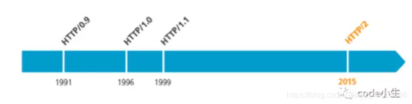

## HTTP的基本优化
影响一个 HTTP 网络请求的因素主要有两个：**带宽和延迟**。
- **带宽**：如果说我们还停留在拨号上网的阶段，带宽可能会成为一个比较严重影响请求的问题，但是现在网络基础建设已经使得带宽得到极大的提升，我们不再会担心由带宽而影响网速，那么就只剩下延迟了。
- **延迟**：
  *  浏览器阻塞（HOL blocking）：浏览器会因为一些原因阻塞请求。浏览器对于同一个域名，同时只能有 4 个连接（这个根据浏览器内核不同可能会有所差异），超过浏览器最大连接数限制，后续请求就会被阻塞。
  * DNS 查询（DNS Lookup）：浏览器需要知道目标服务器的 IP 才能建立连接。将域名解析为 IP 的这个系统就是 DNS。这个通常可以利用DNS缓存结果来达到减少这个时间的目的。
  * 建立连接（Initial connection）：HTTP 是基于 TCP 协议的，浏览器最快也要在第三次握手时才能捎带 HTTP 请求报文，达到真正的建立连接，但是这些连接无法复用会导致每次请求都经历三次握手和慢启动。三次握手在高延迟的场景下影响较明显，慢启动则对文件类大请求影响较大。
## <font color=red>HTTP1.0和HTTP1.1的区别</font>
HTTP1.0最早在网页中使用是在1996年，那个时候只是使用一些较为简单的网页上和网络请求上，而HTTP1.1则在1999年才开始广泛应用于现在的各大浏览器网络请求中，同时HTTP1.1也是当前使用最为广泛的HTTP协议。 主要区别主要体现在：
1. **缓存处理**，在HTTP1.0中主要使用header里的If-Modified-Since,Expires来做为缓存判断的标准，**HTTP1.1则引入了更多的缓存控制策略**例如Entity tag，If-Unmodified-Since, If-Match, If-None-Match等更多可供选择的缓存头来控制缓存策略。
2. **带宽优化及网络连接的使用**，HTTP1.0中，存在一些浪费带宽的现象，例如客户端只是需要某个对象的一部分，而服务器却将整个对象送过来了，并且不支持断点续传功能，**HTTP1.1则在请求头引入了range头域，它允许只请求资源的某个部分**，即返回码是206（Partial Content），这样就方便了开发者自由的选择以便于充分利用带宽和连接。
3. **错误通知的管理**，在HTTP1.1中新增了24个错误状态响应码，如409（Conflict）表示请求的资源与资源的当前状态发生冲突；410（Gone）表示服务器上的某个资源被永久性的删除。
4. **Host头处理**，在HTTP1.0中认为每台服务器都绑定一个唯一的IP地址，因此，请求消息中的URL并没有传递主机名（hostname）。但随着虚拟主机技术的发展，在一台物理服务器上可以存在多个虚拟主机（Multi-homed Web Servers），并且它们共享一个IP地址。HTTP1.1的请求消息和响应消息都应支持Host头域，且请求消息中如果没有Host头域会报告一个错误（400 Bad Request）。
5. **长连接**，HTTP 1.1支持长连接（PersistentConnection）和请求的流水线（Pipelining）处理，在一个TCP连接上可以传送多个HTTP请求和响应，减少了建立和关闭连接的消耗和延迟，在**HTTP1.1中默认开启Connection： keep-alive**，一定程度上弥补了HTTP1.0每次请求都要创建连接的缺点。

## <font color=red>HTTPS和HTTP的一些区别</font>
- HTTPS协议需要到CA申请证书，一般免费证书很少，需要交费。
- **HTTP协议运行在TCP之上，所有传输的内容都是明文，HTTPS运行在SSL/TLS之上，SSL/TLS运行在TCP之上，所有传输的内容都经过加密的**。
- HTTP和HTTPS使用的是完全不同的连接方式，用的端口也不一样，前者是80，后者是443。
- HTTPS可以有效的防止运营商劫持，解决了防劫持的一个大问题。
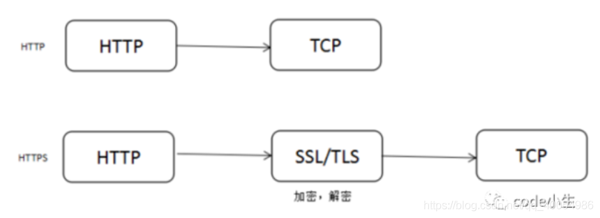
## SPDY：HTTP1.x的优化
2012年google如一声惊雷提出了SPDY的方案，优化了HTTP1.X的请求延迟，解决了HTTP1.X的安全性，具体如下：
  1. **降低延迟**，针对HTTP高延迟的问题，SPDY优雅的采取了多路复用（multiplexing）。**多路复用通过多个请求stream共享一个tcp连接的方式，解决了HOL blocking的问题，降低了延迟同时提高了带宽的利用率**。
  2. **请求优先级**（request prioritization）。多路复用带来一个新的问题是，在连接共享的基础之上有可能会导致关键请求被阻塞。**SPDY允许给每个request设置优先级，这样重要的请求就会优先得到响应**。比如浏览器加载首页，首页的html内容应该优先展示，之后才是各种静态资源文件，脚本文件等加载，这样可以保证用户能第一时间看到网页内容。
  3. **header压缩**。前面提到HTTP1.x的header很多时候都是重复多余的。选择合适的压缩算法可以减小包的大小和数量。
  4. 基于HTTPS的加密协议传输，大大提高了传输数据的可靠性。
  5. **服务端推送**（server push），采用了SPDY的网页，例如我的网页有一个sytle.css的请求，在客户端收到sytle.css数据的同时，服务端会将sytle.js的文件推送给客户端，当客户端再次尝试获取sytle.js时就可以直接从缓存中获取到，不用再发请求了。SPDY构成图：
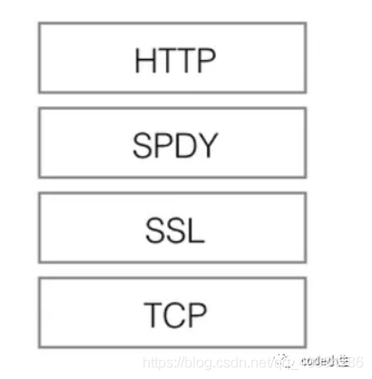
SPDY位于HTTP之下，TCP和SSL之上，这样可以轻松兼容老版本的HTTP协议(将HTTP1.x的内容封装成一种新的frame格式)，同时可以使用已有的SSL功能。

## HTTP2.0：SPDY的升级版
HTTP2.0可以说是SPDY的升级版（其实原本也是基于SPDY设计的），但是，HTTP2.0 跟 SPDY 仍有不同的地方，如下：
**HTTP2.0和SPDY的区别**：
  1. HTTP2.0 支持明文 HTTP 传输，而 SPDY 强制使用 HTTPS
  2. HTTP2.0 消息头的压缩算法采用 HPACK [http://http2.github.io/http2-spec/compression.html](http://http2.github.io/http2-spec/compression.html)，而非 SPDY 采用的 DEFLATE [http://zh.wikipedia.org/wiki/DEFLATE](http://zh.wikipedia.org/wiki/DEFLATE)

## <font color=red>HTTP2.0和HTTP1.X相比的新特性</font>
- **新的二进制格式**（Binary Format），HTTP1.x的解析是基于文本。基于文本协议的格式解析存在天然缺陷，文本的表现形式有多样性，要做到健壮性考虑的场景必然很多，二进制则不同，只认0和1的组合。基于这种考虑HTTP2.0的协议解析决定采用二进制格式，实现方便且健壮。
- **多路复用**（MultiPlexing），即连接共享，即每一个request都是是用作连接共享机制的。一个request对应一个id，这样一个连接上可以有多个request，每个连接的request可以随机的混杂在一起，接收方可以根据request的 id将request再归属到各自不同的服务端请求里面。
- **header压缩**，如上文中所言，对前面提到过HTTP1.x的header带有大量信息，而且每次都要重复发送，HTTP2.0使用encoder来减少需要传输的header大小，通讯双方各自cache一份header fields表，既避免了重复header的传输，又减小了需要传输的大小。
- **服务端推送**（server push），同SPDY一样，HTTP2.0也具有server push功能。

## HTTP2.0的升级改造
- 前文说了HTTP2.0其实可以支持非HTTPS的，但是现在主流的浏览器像chrome，firefox表示还是只支持基于 TLS 部署的HTTP2.0协议，所以要想升级成HTTP2.0还是先升级HTTPS为好。
- 当你的网站已经升级HTTPS之后，那么升级HTTP2.0就简单很多，如果你使用NGINX，只要在配置文件中启动相应的协议就可以了，可以参考NGINX白皮书，NGINX配置HTTP2.0官方指南 [https://www.nginx.com/blog/nginx-1-9-5/](https://www.nginx.com/blog/nginx-1-9-5/)。
- 使用了HTTP2.0那么，原本的HTTP1.x怎么办，这个问题其实不用担心，HTTP2.0完全兼容HTTP1.x的语义，对于不支持HTTP2.0的浏览器，NGINX会自动向下兼容的。

## HTTP的请求方式

1. OPTIONS: 返回服务器针对特定资源所支持的HTTP请求方法，也可以利用向web服务器发送'*'的请求来测试服务器的功能性

2. HEAD: 向服务器索与GET请求相一致的响应，只不过响应体将不会被返回。这一方法可以再不必传输整个响应内容的情况下，就可以获取包含在响应小消息头中的元信息。

3. GET: 向特定的资源发出请求。注意：GET方法不应当被用于产生“副作用”的操作中，例如在Web Application中，其中一个原因是GET可能会被网络蜘蛛等随意访问。Loadrunner中对应get请求函数：web_link和web_url

4. POST: 向指定资源提交数据进行处理请求（例如提交表单或者上传文件）。数据被包含在请求体中。POST请求可能会导致新的资源的建立和/或已有资源的修改。 Loadrunner中对应POST请求函数：web_submit_data,web_submit_form

5. PUT: 向指定资源位置上传其最新内容

6. DELETE: 请求服务器删除Request-URL所标识的资源

7. TRACE: 回显服务器收到的请求，主要用于测试或诊断

8. CONNECT: HTTP/1.1协议中预留给能够将连接改为管道方式的代理服务器。

> 注意：
>
> 1）方法名称是区分大小写的，当某个请求所针对的资源不支持对应的请求方法的时候，服务器应当返回状态码405（Mothod Not Allowed）；当服务器不认识或者不支持对应的请求方法时，应返回状态码501（Not Implemented）。
>
> 2）HTTP服务器至少应该实现GET和HEAD/POST方法，其他方法都是可选的，此外除上述方法，特定的HTTP服务器支持扩展自定义的方法。

## 附
### <font color=red>HTTP2.0的多路复用和HTTP1.X中的长连接复用有什么区别？</font>
- HTTP/1.* 一次请求-响应，建立一个连接，用完关闭；每一个请求都要建立一个连接；
- HTTP/1.1 Pipeling解决方式为，若干个请求排队串行化单线程处理，后面的请求等待前面请求的返回才能获得执行机会，一旦有某请求超时等，后续请求只能被阻塞，毫无办法，也就是人们常说的线头阻塞；
- HTTP/2多个请求可同时在一个连接上并行执行。某个请求任务耗时严重，不会影响到其它连接的正常执行；
具体如图：
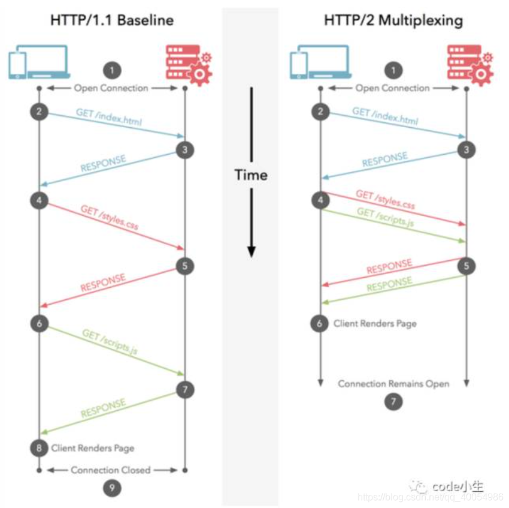
### <font color=red>服务器推送到底是什么？</font>
服务端推送能把客户端所需要的资源伴随着index.html一起发送到客户端，省去了客户端重复请求的步骤。正因为没有发起请求，建立连接等操作，所以静态资源通过服务端推送的方式可以极大地提升速度。具体如下：
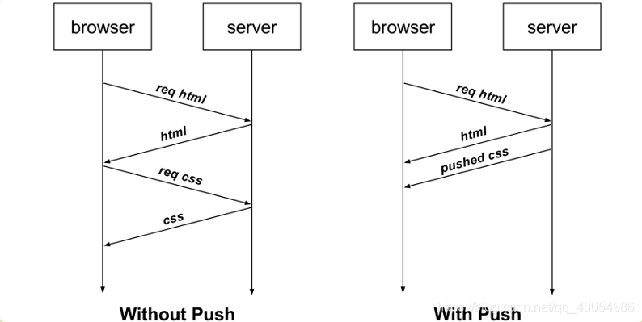

### 为什么需要头部压缩？
假定一个页面有100个资源需要加载（这个数量对于今天的Web而言还是挺保守的）, 而每一次请求都有1kb的消息头（这同样也并不少见，因为Cookie和引用等东西的存在）, 则至少需要多消耗100kb来获取这些消息头。HTTP2.0可以维护一个字典，差量更新HTTP头部，大大降低因头部传输产生的流量。具体参考：HTTP/2 头部压缩技术介绍
### <font color=red>HTTP2.0多路复用有多好？</font>
HTTP 性能优化的关键并不在于高带宽，而是低延迟。TCP 连接会随着时间进行自我「调谐」，起初会限制连接的最大速度，如果数据成功传输，会随着时间的推移提高传输的速度。这种调谐则被称为 TCP 慢启动（参考TCP拥塞控制知识点）。由于这种原因，让原本就具有突发性和短时性的 HTTP 连接变的十分低效。
HTTP/2 通过让所有数据流共用同一个连接，可以更有效地使用 TCP 连接，让高带宽也能真正的服务于 HTTP 的性能提升。
## 参考
原文链接：HTTP1.0、HTTP1.1 和 HTTP2.0 的区别[https://mp.weixin.qq.com/s/GICbiyJpINrHZ41u_4zT-A?](https://mp.weixin.qq.com/s/GICbiyJpINrHZ41u_4zT-A?)
# Cookie
## cookie是什么
Cookie是指某些网站为了辨别用户身份而储存在用户本地终端上的**文本文件**（**不加密的Cookie以明文形式保存**）。Cookie 按在客户端中的存储位置，可分为**内存 Cookie** 和**硬盘 Cookie**。**内存 Cookie** 由浏览器维护，保存在内存中，浏览器关闭即消失，存在时间短暂。**硬盘 Cookie** 保存在硬盘里，有过期时间，除非用户手动清理或到了过期时间，硬盘 Cookie 不会清除，存在时间较长。所以，按存在时间，可分为非持久 Cookie 和持久 Cookie。

在JavaScript中可以通过 document.cookie 来读取或设置这些信息。由于 cookie 多用在客户端和服务端之间进行通信，所以除了JavaScript以外，服务端的语言（如PHP）也可以存取 cookie。
## <font color=red>cookie的用途</font>
**因为 HTTP 协议是无状态的，即服务器不知道用户上一次做了什么，这严重阻碍了交互式 Web 应用程序的实现。**
例如，当你浏览某个网站的时候，由web服务器存储在你的机器硬盘上的一个**小的文本文件**。它其中记录了你的用户名、密码、浏览的网页、停留的时间等等信息。当你再次来到这个网站时，web服务器会先看看有没有它上次留下来的cookie。如果有的话，会读取cookie中的内容，来判断使用者，并送出相应的网页内容，比如在页面显示欢迎你的标语，或者让你不用输入ID、密码就直接登录等等。
当客户端要发送http请求时，浏览器会先检查下是否有对应的cookie。有的话，则自动地添加在request header中的cookie字段。注意，每一次的http请求时，如果有cookie，浏览器都会自动带上cookie发送给服务端。那么把什么数据放到cookie中就很重要了，因为很多数据并不是每次请求都需要发给服务端，毕竟会增加网络开销，浪费带宽。所以对于那设置“每次请求都要携带的信息（最典型的就是身份认证信息）”就特别适合放在cookie中，其他类型的数据就不适合了。

简单的说：
1. cookie是以小的文本文件形式（即纯文本），完全存在于客户端；cookie保存了登录的凭证，有了它，只需要在下次请求时带着cookie发送，就不必再重新输入用户名、密码等重新登录了。
2. 是设计用来在服务端和客户端进行信息传递的；
3. Cookie是HTTP头的一部分

## <font color=red>Cookie格式</font>
Cookie中保存的信息都是文本信息，**在客户端和服务器端交互过程中，cookie信息被附加在HTTP消息头中传递**，cookie的信息由键/值对组成。下面是一个HTTP头中cookie的例子：
```
"key=name; expires=Sat, 08 Sep 2018 02:26:00 GMT; domain=ppsc.sankuai.com; path=/; secure; HttpOnly"
```
- Expires、Max Age属性

  Expires选项用来设置“cookie 什么时间内有效”。Expires其实是cookie失效日期，Expires必须是 GMT 格式的时间（可以通过 new Date().toGMTString()或者 new Date().toUTCString() 来获得）。如expires=Sat, 08 Sep 2018 02:26:00 GMT表示cookie将在2018年9月8日2:26分之后失效。对于失效的cookie浏览器会清空。**如果没有设置该选项，这样的cookie称为会话cookie。它存在内存中，当会话结束，也就是浏览器关闭时，cookie消失**。
> Expires是 http/1.0协议中的选项，在http/1.1协议中Expires已经由 Max age 选项代替，两者的作用都是限制cookie 的有效时间。Expires的值是一个时间点（cookie失效时刻= Expires），而Max age的值是一个以秒为单位时间段（cookie失效时刻= 创建时刻+ Max age）。 另外， Max age的默认值是 -1(即有效期为 session )； Max age有三种可能值：负数、0、正数。负数：有效期session；0：删除cookie；正数：有效期为创建时刻+ Max age
- Domain和Path
  Domain 属性定义可访问该cookie的域名，对一些大的网站，如果希望cookie可以在子网站中共享，可以使用该属性。例如设置Domain为 .bigsite.com ,则sub1.bigsite.com和sub2.bigsite.com都可以访问已保存在客户端的cookie，这时还需要将Path设置为/。
  Path 属性定义网站上可以访问cookie的页面的路径，缺省状态下Path为产生cookie时的路径，此时cookie可以被该路径以及其子路径下的页面访问；可以将Path设置为/，使cookie可以被网站下所有页面访问。
- Secure 属性
  Secure 值定义cookie的安全性，当该值为true时必须是HTTPS状态下cookie才从客户端附加在HTTP消息中发送到服务端，在HTTP时cookie是不发送的；Secure为false时则可在HTTP状态下传递cookie，Secure缺省为false。
-  httpOnly
   这个选项用来设置cookie是否能通过 js 去访问。默认情况下，cookie不会带httpOnly选项(即为空)，所以默认情况下，客户端是可以通过js代码去访问（包括读取、修改、删除等）这个cookie的。**当cookie带httpOnly选项时，客户端则无法通过js代码去访问（包括读取、修改、删除等）这个cookie**。

## <font color=red>Cookie的创建</font>
1. **Cookie可以在服务器端创建**，然后cookie信息附加在HTTP消息头中传到客户端，如果cookie定义了有效期，则本保存在客户端本地磁盘。
2. 创建cookie时如果不指定生存有效时间，则cookie只在浏览器关闭前有效，cookie会在服务器端和客户端传输，但是不会保存在客户机的磁盘上，打开新的浏览器将不能获得原先创建的cookie信息。
3. Cookie信息保存在本地时会保存到当前登录用户专门目录下，保存的cookie文件名中会包含创建cookie所在页面网站的域名，当浏览器再次连接该网站时，会从本机cookie存放目录下选出该网站的有效cookie，将保存在其中的信息附加在HTTP消息头中发送到服务器端，服务器端程序就可根据上次保存在cookie的信息为访问客户提供“记忆”或个性化服务。
4. Cookie除了可以在服务器端创建外，也可以在**客户端的浏览器中用客户端脚本(如javascript)创建**。客户端创建的cookie的性质和服务器端创建的cookie一样，可以保存在本地，也可以被传送到服务器端被服务器程序读取。

## <font color=red>Cookie的一些基本知识</font>
1. **cookie 是有大小限制的**，大多数浏览器支持最大为 4096 字节的 Cookie(具体会有所差异;如果 cookie 字符串的长度超过最大限制，则该属性将返回空字符串。

2. 由于 **cookie 最终都是以文件形式存放在客户端计算机**中，所以查看和修改 cookie 都是很方便的，这就是为什么常说 cookie 不能存放重要信息的原因。

3. 每个 cookie 的格式都是这样的：cookieName = Vaue；名称和值都必须是合法的标示符。

4. **cookie 是存在 有效期的**。在默认情况下，一个 cookie 的生命周期就是在浏览器关闭的时候结束。如果想要 cookie 能在浏览器关掉之后还可以使用，就必须要为该 cookie 设置有效期，也就是 cookie 的失效日期。

5. alert(typeof document.cookie)结果是 string.

6. cookie 有域和路径这个概念。**域就是domain的概念**，因为浏览器是个注意安全的环境，所以不同的域之间是不能互相访问 cookie 的(当然可以通过特殊设置的达到 cookie 跨域访问)。**路径就是routing的概念**，一个网页所创建的 cookie 只能被与这个网页在同一目录或子目录下得所有网页访问，而不能被其他目录下得网页访问。

7. 其实创建cookie的方式和定义变量的方式有些相似，都需要使用 cookie 名称和 cookie 值。同个网站可以创建多个 cookie ，而多个 cookie 可以存放在同一个cookie 文件中。

8. cookie 存在两种类型：①:你浏览的当前网站本身设置的 cookie ②来自在网页上嵌入广告或图片等其他域来源的 第三方 cookie (网站可通过使用这些 cookie 跟踪你的使用信息)

9. cookie 有两种清除方式：①:通过浏览器工具清除 cookie (有第三方的工具，浏览器自身也有这种功能) ②通过设置 cookie 的有效期来清除 cookie.注：删除 cookie 有时可能导致某些网页无法正常运行。

10. 浏览器可以通过设置来接受和拒绝访问 cookie。出于功能和性能的原因考虑，建议尽量降低 cookie 的使用数量，并且要尽量使用小 cookie。

## Session 
Session即会话，指一种持续性的、双向的连接。Session与Cookie在本质上没有区别，都是针对HTTP协议的局限性而提出的一种保持客户端和服务器间保持会话连接状态的机制。Session也是一个通用的标准，但在不同的语言中实现有所不同。针对Web网站来说，Session指用户在浏览某个网站时，从进入网站到浏览器关闭这段时间内的会话。由此可知，Session实际上是一个特定的时间概念。

使用Session可以在网站的上下文不同页面间传递变量、用户身份认证、程序状态记录等。常见的形式就是配合Cookie使用，实现保存用户登录状态功能。

Session是通过sessionID判断客户端用户的，即Session文件的文件名。sessionID实际上是在客户端和服务端之间通过HTTP Request 和 HTTP Response传来传去。sessionID按照一定的算法生成，必须包含在 HTTP Request 里面，保证唯一性和随机性，以确保Session的安全。如果没有设置 Session 的生成周期， sessionID存储在内存中，关闭浏览器后该ID自动注销；重新请求该页面，会重新注册一个sessionID。如果客户端没有禁用Cookie，Cookie在启动Session回话的时候扮演的是存储sessionID 和 Session 生存期的角色。

**假设客户端禁用Cookie，可以通过URL或者隐藏表单传递sessionID**；

Session以文件的形式存放在本地硬盘的一个目录中，当比较多时，磁盘读取文件就会比较慢，因此把Session分目录存放。

对于访问量大的站点，用默认的Session存储方式并不适合，较优的方法是用Data Base存取Session。在大流量的网站中，Session入库存在效率不高、占据数据库connection资源等问题。针对这种情况，可以使用Memcached、Redis等Key-Value数据存储方案实现高并发、大流量的Session存储。

## <font color=red>session与cookie的区别</font>
1. session 在服务器端，cookie 在客户端（浏览器）

2. session 存在在服务器的一个文件里（默认），不是内存

3. session 的运行依赖 session id，而 session id 是存在 cookie 中的，也就是说，如果 浏览器禁用了 cookie ，同时 session 也会失效（当然也可以在 url 中传递）

4. session 可以放在 文件，数据库，或内存中都可以。

5. 用户验证这种场合一般会用 session，因此，维持一个会话的核心就是客户端的唯一标识，即 session id

<font color=red>**总结**：</font>

Session是在服务端保存的一个数据结构，用来跟踪用户的状态，这个数据可以保存在集群、数据库、文件中；

Cookie是客户端保存用户信息的一种机制，用来记录用户的一些信息，也是实现Session的一种方式。

##  <font color=red>Cookie与Session问答</font>
1. Cookie运行在客户端，Session运行在服务端，对吗？
A：不完全正确。Cookie是运行在客户端，有客户端进行管理；Session虽然是运行在服务器端，但是sessionID作为一个Cookie是存储在客户端的。

2. 浏览器禁止Cookie，Cookie就不能用了，但Session不会受浏览器影响，对吗？
A：错。浏览器禁止Cookie，Cookie确实不能用了，Session会受浏览器端的影响。很简单的实验，在登录一个网站后，清空浏览器的Cookie和隐私数据，单机后台的连接，就会因为丢失Cookie而退出。当然，有办法通过URL传递Session。

3. 浏览器关闭后，Cookie和Session都消失了，对吗？
A：错。存储在内存中的Cookie确实会随着浏览器的关闭而消失，但存储在硬盘上的不会。更顽固的是Flash Cookie，不过现在很多系统优化软件和新版浏览器都已经支持删除Flash Cookie。百度采用了这样的技术记忆用户：Session在浏览器关闭后也不会消失，除非正常退出，代码中使用了显示的unset删除Session。否则Session可能被回收，也有可能永远残留在系统中。

4. Session 比 Cookie 更安全吗？ 不应该大量使用Cookie吗？
A：错误。Cookie确实可能存在一些不安全因素，但和JavaScript一样，即使突破前端验证，还有后端保障安全。一切都还要看设计，尤其是涉及提权的时候，特别需要注意。通常情况下，Cookie和Session是绑定的，获得Cookie就相当于获得了Session，客户端把劫持的Cookie原封不动地传给服务器，服务器收到后，原封不动地验证Session，若Session存在，就实现了Cookie和Session的绑定过程。因此，不存在Session比Cookie更安全这种说法。如果说不安全，也是由于代码不安全，错误地把用作身份验证的Cookie作为权限验证来使用。

5. Session是创建在服务器上的，应该少用Session而多用Cookie，对吗？
A：错。Cookie可以提高用户体验，但会加大网络之间的数据传输量，应尽量在Cookie中仅保存必要的数据。

6. 如果把别人机器上的Cookie文件复制到我的电脑上（假设使用相同的浏览器），是不是能够登录别人的帐号呢？如何防范？
A：是的。这属于Cookie劫持的一种做法。要避免这种情况，需要在Cookie中针对IP、UA等加上特殊的校验信息，然后和服务器端进行比对。

7. 在IE浏览器下登录某网站，换成Firefox浏览器是否仍然是未登录状态？使用IE登录了腾讯网站后，为什么使用Firefox能保持登录状态？
A：不同浏览器使用不同的Cookie管理机制，无法实现公用Cookie。如果使用IE登录腾讯网站，使用Firefox也能登录，这是由于在安装腾讯QQ软件时，你的电脑上同时安装了针对这两个浏览器的插件，可以识别本地已登录QQ号码进而自动登录。本质上，不属于共用Cookie的范畴。
## 参考
1. 维基百科[https://zh.wikipedia.org/wiki/Cookie](https://zh.wikipedia.org/wiki/Cookie)
2. [https://zhuanlan.zhihu.com/p/52091630](https://zhuanlan.zhihu.com/p/52091630)
3. [https://mp.weixin.qq.com/s/NXrH7R8y2Dqxs9Ekm0u33w?](https://mp.weixin.qq.com/s/NXrH7R8y2Dqxs9Ekm0u33w?)

# 从URL到页面加载发生了什么
## <font color=red>访问网页总过程</font>
1. 输入URL
2. 经过缓存机制
3. DNS解析
4. TCP连接
5. 发送HTTP请求
6. 接受响应，判断状态码，选择处理方式
7. 解码
8. 渲染
9. 连接结束
### <font color = blue> 1. 输入URL</font>
URL包含6个要素：协议，域名，端口，路径，参数，片段，格式如下
```
[协议名]://[用户名]:[密码]@[主机名]:[端口]/[路径]?[查询参数]#[片段ID]
```

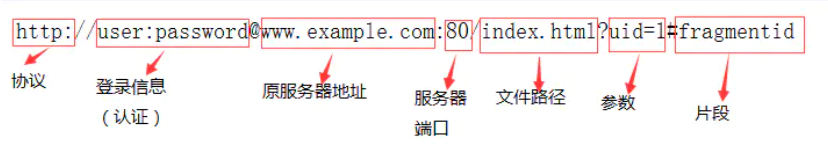
1. 协议：指定传输协议，如： http、https、ftp等
2. 登录信息：可选，指指用户名和密码作为从服务器端获取资源时必要的登录信息（身份认证）。
3. 服务器地址：可以是域名www.jianshu.com，也可以是ip:192.168.1.10
4. 服务器端口：可选，指定服务器连接的网络端口。，若省略则使用该协议的默认端口。
5. 文件路径：指定服务器上的路径来定位指定的资源。
6. 参数：可选，用于给动态网页（如使用CGI、ISAPI、PHP/JSP/ASP/ASP.NET等技术制作的网页）传递参数，可有多个参数，用“&”符号隔开，每个参数的名和值用“=”符号隔开。
7. 片段：可选，片段用于指定网络资源中的片断。html页面中片段则是描点。例如一个网页中有多个名词解释，可使用片段可直接定位到某一名词解释（描点的位置）。

- URI(Uniform Resource Identifier) 是**统⼀资源标志符**，可以唯⼀标识⼀个资源
- URL(Uniform Resource Location) 是**统⼀资源定位符**，可以提供该资源的路径。它是⼀种具体的 URI，即 URL 可以⽤来标识⼀个资源，⽽且还指明了如何 locate 这个资源。
- URN(Uniform Resource Name) 是**统一资源名称** 定义某事物的身份。

URI的作⽤像身份证号⼀样，URL的作⽤更像家庭住址⼀样，URN如同一个人的名字。URL是⼀种具体的URI，它不仅唯⼀标识资源，⽽且还提供了定位该资源的信息
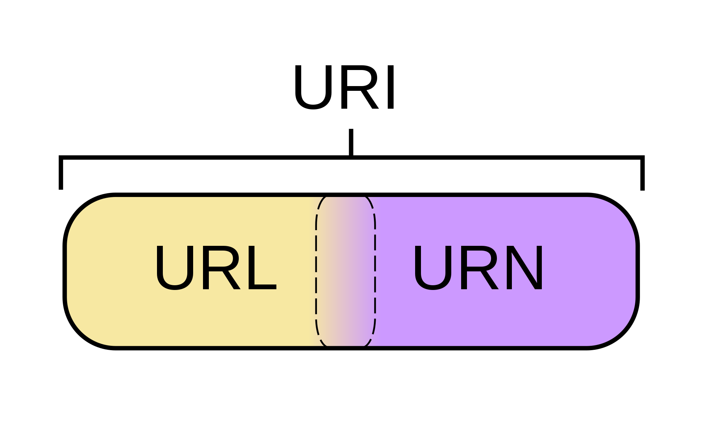
### <font color = blue> 2. 经过缓存机制</font>
缓存分为**强缓存**和**协商缓存**，缓存判断步骤：
1. 浏览器发送请求前，根据请求头的expires和cache-control判断是否命中（包括是否过期）**强缓存策略**，如果命中，直接从缓存获取资源，并不会发送请求。如果没有命中，则进入下一步。
2.  没有命中强缓存规则，浏览器会发送请求，根据请求头的last-modified和etag判断是否命中**协商缓存**，如果命中，直接从缓存获取资源。如果没有命中，则进入下一步。 
3.  如果前两步都没有命中，则直接从服务端获取资源。
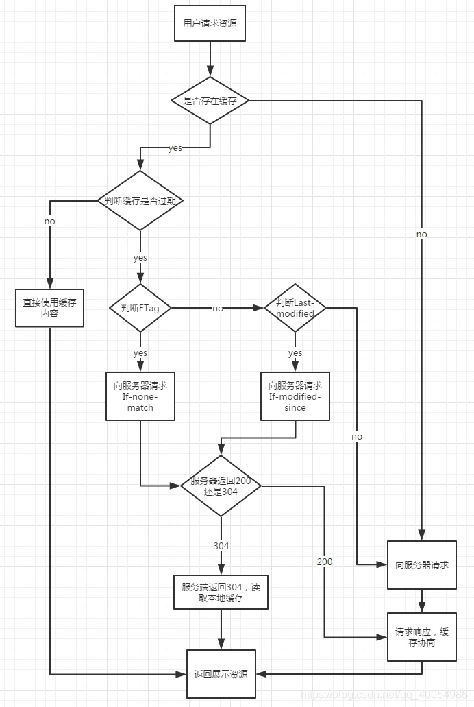

<font size=5 color=grean>**2.1 强缓存原理**</font>

强缓存不会向服务器发送请求，直接从缓存中读取资源。控制强缓存的字段分别是Expires 和Cache-Control，其中Cache-Control优先级比Expires高。

Expires的值为服务端返回的到期时间，即下一次请求时，请求时间小于服务端返回的到期时间，直接使用缓存数据。不过Expires 是HTTP 1.0的东西，现在默认浏览器均默认使用HTTP 1.1，所以它的作用基本忽略。另一个问题是，到期时间是由服务端生成的，但是客户端时间可能跟服务端时间有误差，这就会导致缓存命中的误差。**所以HTTP 1.1 的版本，使用Cache-Control替代**。

Cache-Control 是最重要的规则。常见的取值有**private、public、no-cache、max-age，no-store**，默认为private。
**private**:             客户端可以缓存
**public**:              客户端和代理服务器都可缓存（前端的同学，可以认为public和private是一样的）
**max-age=xxx**:   缓存的内容将在 xxx 秒后失效
**no-cache**:          需要使用协商缓存来验证缓存数据（后面介绍）
**no-store**:           所有内容都不会缓存，强制缓存，协商缓存都不会触发

强缓存的情况分三种：
- 第一次请求，不存在缓存结果和缓存标识，直接向服务器请求
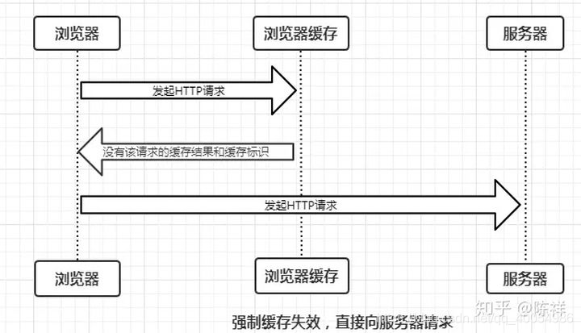
- 存在缓存标识和缓存结果，但是已经失效，向服务器发送请求，询问缓存是否真的失效了
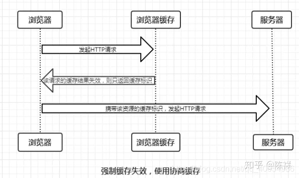
- 存在该缓存结果和缓存标识，且该结果尚未失效，强制缓存生效，直接返回该结果
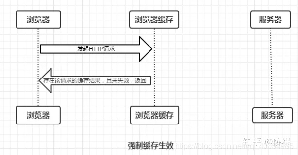

<font size=5 color=grean>**2.2 协商缓存原理**</font>

协商缓存就是强制缓存失效后，浏览器携带缓存标识向服务器发起请求，由服务器根据缓存标识决定是否使用缓存。协商缓存有两种缓存标识：**Last-Modified (Response Header) /  If-Modified-Since(Request Header)**、**Etag(Response Header)  /  If-None-Match(Request Header)(优先级更高)** 。
- **Last-Modified (Response Header) /  If-Modified-Since(Request Header)**
服务器在响应请求时，告诉浏览器资源的最后修改时间。
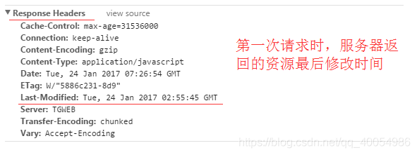
再次请求服务器时，通过If-Modified-Since字段通知服务器上次请求时，服务器返回的资源最后修改时间。服务器收到请求后发现有头If-Modified-Since 则与被请求资源的最后修改时间进行比对。**若资源的最后修改时间大于If-Modified-Since，说明资源又被改动过，则响应整片资源内容，返回状态码200；若资源的最后修改时间小于或等于If-Modified-Since，说明资源无新修改，则响应HTTP 304，告知浏览器继续使用所保存的cache**。
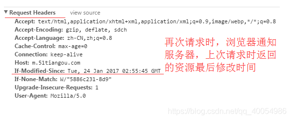
last-modified依赖的是保存的绝对时间，还是会出现误差的情况：
1. 保存的时间是以秒为单位的，1秒内多次修改是无法捕捉到的；
2. 各机器读取到的时间不一致，就有出现误差的可能性。为了改善这个问题，提出了使用etag

- **Etag(Response Header)  /  If-None-Match(Request Header)(优先级高于前一对)** 
服务器响应请求时，告诉浏览器当前资源在服务器的唯一标识（生成规则由服务器决定）。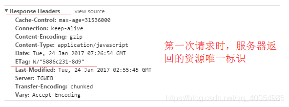
再次请求服务器时，通过If-None-Match字段通知服务器客户段缓存数据的唯一标识。
服务器收到请求后发现有头If-None-Match 则与被请求资源的唯一标识进行比对，
不同，说明资源又被改动过，则响应整片资源内容，返回状态码200；相同，说明资源无新修改，则响应HTTP 304，告知浏览器继续使用所保存的cache。
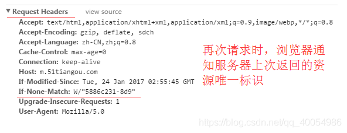
二者对比：
 - 精确度上：Etag要优于Last-Modified。
 - 优先级上：服务器校验优先考虑Etag。 
 - 性能上：Etag要逊于Last-Modified

**协商缓存存在两种情况**：
- 协商缓存生效，返回304和Not Modified
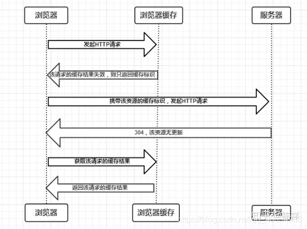
- 协商缓存失效，返回200和请求结果
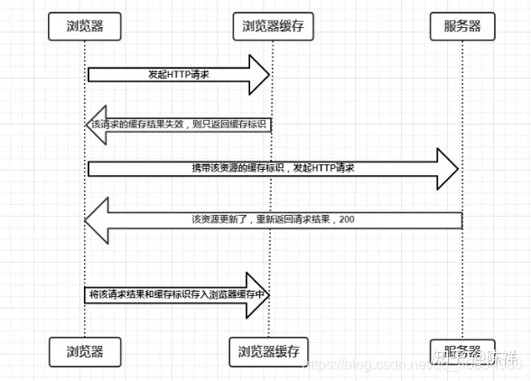

<font size=5 color=grean>**2.3 用户行为对缓存机制的影响**</font>

- 打开网页，地址栏输入地址： 查找 disk cache 中是否有匹配。如有则使用；如没有则发送网络请求。
- 普通刷新 (F5)：因为 TAB 并没有关闭，因此 memory cache 是可用的，会被优先使用(如果匹配的话)。其次才是 disk cache。
- 强制刷新 (Ctrl + F5)：浏览器不使用缓存，因此发送的请求头部均带有 Cache-control:no-cache(为了兼容，还带了 Pragma:no-cache),服务器直接返回 200 和最新内容。

### <font color = blue> 3. DNS解析</font>
(该部分只包含一些最基本的内容，更详细的DNS相关内容自行百度，我觉得这点找工作就够用了)
DNS数据库是域名和IP地址相互映射的一个分布式数据库，DNS协议用来将域名转换为IP地址，DNS最常用的版本是BIND(Berkeley Internet Name Domain)——伯克利Internet域名服务器。

<font size=5 color=grean> 3.1 DNS 解析过程：</font>

- 客户端client发起查询请求www.baidu.com，客户机首先查询自己的缓存了有没有，然后在查看自己的hosts文件，如果没有，把请求提交给local DNS。
- local DNS接受到请求后，首先检查本地缓存中，有没有客户请求的地址，如果有就直接将缓存中的结果相应给客户，否则就开始**迭代查询**,去找根服务器root DNS
- 根服务器root DNS接收到local DNS的请求并查找自己的区域文件记录，发现没有www.baidu.com的记录，但是我这里有.com的记录，我把.com以下的解析都授权给.com了， 然后将.com的地址回应给local DNS
- local DNS收到根root DNS的返回结果后，就知道了.com的地址，并且这不是client所需要的结果，所以local DNS再去找.com
- .com接收到local DNS的请求后查询自己的区域文件记录。发现他这里也没有www.baidu.com的记录，但是有baidu.com的记录，并且已经将解析权限授权给了baidu.com，然后将baidu.com的地址回应给local DNS
- local DNS收到.com的回应，发现依然不是最终clent需求的的结果，于是乎local DNS再去找baidu.com
- baidu.com接收到local DNS的请求后，查询自己的区域文件记录，自己这里就有local DNS所要的答案，于是就将结果回应给localDNS
- local DNS收到baidu.com的结果后，发现这就是clent请求的地址，于是local DNS现将结果缓存一份然后就将最终结果通知clent
- client收到最终结果后就可以顺利的访问到www.baidu.com了
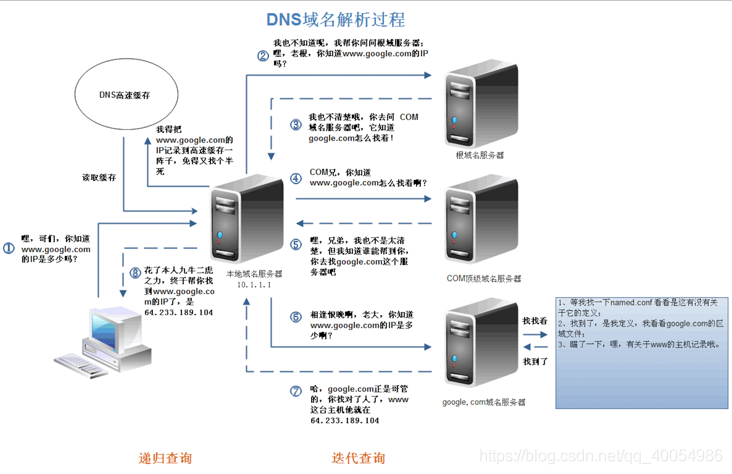

<font size=5 color=grean> 3.2 DNS 即使用UDP又使用TCP：</font>

DNS同时占用UDP和TCP端口53是公认的，这种单个应用协议同时使用两种传输协议的情况在TCP/IP栈也算是个另类。

**为什么既使用TCP又使用UDP?**
1. **TCP与UDP传送字节的长度限制**。UDP报文的最大长度为512字节，而TCP则允许报文长度超过512字节。当DNS查询超过512字节时，协议的TC标志出现删除标志，这时则使用TCP发送。通常传统的UDP报文一般不会大于512字节。（**长度超过512字节时使用TCP发送**）
2. **区域传送时使用TCP**。辅助域名服务器会定时(一般是3小时)向主域名服务器进行查询以便了解数据是否有变动。如有变动，则会执行一次区域传送，进行数据同步。区域传送将使用TCP而不是UDP，因为数据同步传送的数据量比一个请求和应答的数据量要多得多。TCP是一种可靠的连接，保证了数据的准确性。

**域名解析时使用UDP协议**
客户端向DNS服务器查询域名，一般返回的内容都不超过512字节，用UDP传输即可。不用经过TCP三次握手，这样DNS服务器负载更低，响应更快。

虽然从理论上说，客户端也可以指定向DNS服务器查询的时候使用TCP，但事实上，很多DNS服务器进行配置的时候，仅支持UDP查询包。

<font size=5 color=grean> 3.3 DNS缓存：</font>

DNS存在着多级缓存，从离浏览器的距离排序的话，有以下几种: 浏览器缓存，系统缓存，路由器缓存，IPS服务器缓存，根域名服务器缓存，顶级域名服务器缓存，主域名服务器缓存。

<font size=5 color=grean> 3.4 DNS负载均衡：</font>

负载均衡技术能够平衡服务器集群中所有的服务器和请求应用之间的通信负载，根据实时响应时间进行判断，将任务交由负载最轻的服务器来处理，以实现真正的智能通信管理和最佳的服务器群性能，从而使网站始终保持运行和保证其可访问性。

DNS负载均衡技术的实现原理是在DNS服务器中为同一个主机名配置多个IP地址，在应答DNS查询时，DNS服务器对每个查询将以DNS文件中主机记录的IP地址按顺序返回不同的解析结果，将客户端的访问引导到不同的机器上去，使得不同的客户端访问不同的服务器，从而达到负载均衡的目的。

通俗来讲：如果每次都一样是否说明你请求的资源都位于同一台机器上面，那么这台机器需要多高的性能和储存才能满足亿万请求呢？其实真实的互联网世界背后存在成千上百台服务器，大型的网站甚至更多。但是在用户的眼中，它需要的只是处理他的请求，哪台机器处理请求并不重要。DNS可以返回一个合适的机器的IP给用户，例如可以根据每台机器的负载量，该机器离用户地理位置的距离等等，这种过程就是DNS负载均衡，又叫做DNS重定向。

**优点：**
1. 技术实现比较灵活、方便，简单易行，成本低，适用于大多数TCP/IP应用。不需要网络专家来对之进行设定，或在出现问题时对之进行维护。
2. 对于Web应用来说，不需要对代码作任何的修改。事实上，Web应用本身并不会意识到负载均衡配置，即使在它面前。
3. Web服务器可以位于互联网的任意位置上。

**缺点：**
4. 不能够按照Web服务器的处理能力分配负载。DNS负载均衡采用的是**简单的轮循负载算法**，不能区分服务器之间的差异，不能反映服务器的当前运行状态。所以**DNS服务器将Http请求平均地分配到后台的Web服务器上，而不考虑每个Web服务器当前的负载情况**。**如果后台的Web服务器的配置和处理能力不同，最慢的 Web服务器将成为系统的瓶颈，处理能力强的服务器不能充分发挥作用**。不能做到为性能较好的服务器多分配请求，甚至会出现客户请求集中在某一台服务器上的情况。
5. 不支持高可靠性，DNS负载均衡技术没有考虑容错。如果**后台的某台Web服务器出现故障，DNS服务器仍然会把DNS 请求分配到这台故障服务器上，导致不能响应客户端**。
6. 可能会造成额外的网络问题。为了使本DNS服务器和其他DNS服务器及时交互，保证DNS数据及时更新，使地址能随机分配，一般都要将DNS的刷新时间设置的较小，但太小将会使DNS流量大增造成额外的网络问题。
7. 一旦某个服务器出现故障，即使及时修改了DNS设置，还是要等待足够的时间(刷新时间)才能发挥作用，在此期间，保存了故障服务器地址的客户计算机将不能正常访问服务器。

### <font color = blue> 4. TCP连接</font>
三次握手，HTTP握手以及HTTPS握手，参考[图解SSL/TLS协议](http://www.ruanyifeng.com/blog/2014/09/illustration-ssl.html)
### <font color = blue> 5. 发送HTTP请求</font>
发送HTTP请求的过程就是构建HTTP请求报文并通过TCP协议发送到服务器指定端口(HTTP协议80/8080, HTTPS协议443)。HTTP请求报文是由三部分组成: **请求行, 请求报头和请求正文**。
- **请求行**：`GET index.html HTTP/1.1`
	常用的请求有：GET, POST, PUT, DELETE, OPTIONS, HEAD。
	GET和POST的区别：[都2019年了，还问GET和POST的区别](https://zhuanlan.zhihu.com/p/57361216)

	**GET 和 POST 方法没有实质区别，只是报文格式不同**，GET 和 POST 只是 HTTP 协议中两种请求方式，而 HTTP 协议是基于 TCP/IP 的应用层协议，无论 GET 还是 POST，用的都是同一个传输层协议，所以在传输上，没有区别。
	报文格式上，**不带参数时，最大区别就是第一行方法名不同**
	- POST方法请求报文第一行是这样的 `POST /uri HTTP/1.1 \r\n`
	- GET方法请求报文第一行是这样的 `GET /uri HTTP/1.1 \r\n`
	
	**带参数时，在约定中，GET方法的参数应该放在url中，POST方法的参数应该放在body中**。
	例如，参数是name=qiming.c, age=22。
	
	- GET 方法简约版报文是这样的
		```
		GET /index.php?name=qiming.c&age=22 HTTP/1.1
		Host: localhost
		```
	- POST 方法简约版报文是这样的
		```
		POST /index.php HTTP/1.1
		Host: localhost
		Content-Type: application/x-www-form-urlencoded
		
		name=qiming.c&age=22
		```

> 一些常见的问题：
> 1. GET 方法参数写法是固定的吗？
> 在约定中，我们的参数是写在 ? 后面，用 & 分割。我们知道，解析报文的过程是通过获取 TCP 数据，用正则等工具从数据中获取 Header 和 Body，从而提取参数。也就是说，我们可以自己约定参数的写法，只要服务端能够解释出来就行，一种比较流行的写法是 http://www.example.com/user/name/chengqm/age/22。
> 2. POST 方法比 GET 方法安全？
> 按照网上大部分文章的解释，POST 比 GET 安全，因为数据在地址栏上不可见。然而，从传输的角度来说，他们都是不安全的，因为 HTTP 在网络上是明文传输的，只要在网络节点上捉包，就能完整地获取数据报文。要想安全传输，就只有加密，也就是 HTTPS。
> 3. GET 方法的长度限制是怎么回事？
> 在网上看到很多关于两者区别的文章都有这一条，提到浏览器地址栏输入的参数是有限的。首先说明一点，HTTP 协议没有 Body 和 URL 的长度限制，对 URL 限制的大多是浏览器和服务器的原因。浏览器原因就不说了，服务器是因为处理长 URL 要消耗比较多的资源，为了性能和安全（防止恶意构造长 URL 来攻击）考虑，会给 URL 长度加限制。
> 4. POST 方法会产生两个TCP数据包？
> 有些文章中提到，post 会将 header 和 body 分开发送，先发送 header，服务端返回 100 状态码再发送 body。HTTP 协议中没有明确说明 POST 会产生两个 TCP 数据包，而且实际测试(Chrome)发现，header 和 body 不会分开发送。所以，header 和 body 分开发送是部分浏览器或框架的请求方法，不属于 post 必然行为。

- **请求报头**：请求报头允许客户端向服务器传递请求的附加信息和客户端自身的信息。
常用请求报头：Accept, Accept-Charset, Accept-Encoding, Accept-Language, Content-Type, Authorization, Cookie, User-Agent等。
- **请求正文**：当使用POST, PUT等方法时，通常需要客户端向服务器传递数据。这些数据就储存在请求正文中。在请求包头中有一些与请求正文相关的信息，例如: 现在的Web应用通常采用Rest架构，请求的数据格式一般为json。这时就需要设置Content-Type: application/json。

### <font color = blue> 6. 接受响应，判断状态码选择处理方式</font>
HTTP响应报文也是由三部分组成: **状态码, 响应报头和响应报文**。
- **状态码**：状态码是由3位数组成，第一个数字定义了响应的类别，且有五种可能取值。
  - 1XX：表示通知信息，请求收到了或正在处理
  - 2XX：表示成功
    - 200 OK：表示从客户端发送给服务器的请求被正常处理并返回；
    - 204 No Content：表示客户端发送给服务器的请求得到了成功处理，但在返回的响应报文中不含实体的主体部分（没有资源可以返回）；
    - 206 Patial Content：表示客户端进行了范围请求，并且服务器成功执行了这部分的GET请求，响应报文中包含由Content-Range指定范围的实体内容。
  - 3XX：表示重定向，如要完成请求还必须采取进一步行动
  	- 301 Moved Permanently：永久性重定向，表示请求的资源被分配了新的URL，之后应使用更改的URL**；
  	- 302 Found：临时性重定向，表示请求的资源被分配了新的URL，希望本次访问使用新的URL；
  	- <font color=red>**301与302的区别：前者是永久移动，后者是临时移动（之后可能还会更改URL）**
  	- 303 See Other：表示请求的资源被分配了新的URL，应使用GET方法定向获取请求的资源；
  	-  <font color=red>**302与303的区别：后者明确表示客户端应当采用GET方式获取资源**
  	- 304 Not Modified（**协商缓存命中后的返回代码**）：表示客户端发送附带条件（是指采用GET方法的请求报文中包含if-Match、If-Modified-Since、If-None-Match、If-Range、If-Unmodified-Since中任一首部）的请求时，服务器端允许访问资源，但是请求未满足条件的情况下返回改状态码；
  	- 307 Temporary Redirect：临时重定向，与303有着相同的含义，307会遵照浏览器标准不会从POST变成GET；（不同浏览器可能会出现不同的情况）
  - 4XX：表示客户端差错，如请求中错误的语法。
  	- 400 Bad Request：表示请求报文中存在语法错误
  	- 401 Unauthorized：未经许可，需要通过HTTP认证；
  	- 403 Forbidden：服务器拒绝该次访问（访问权限出现问题）
  	- 404 Not Found：表示服务器上无法找到请求的资源，除此之外，也可以在服务器拒绝请求但不想给拒绝原因时使用；
  - 5XX：服务端内部错误
  	- 500 Inter Server Error：表示服务器在执行请求时发生了错误，也有可能是web应用存在的bug或某些临时的错误时；
  	-  503 Server Unavailable：表示服务器暂时处于超负载或正在进行停机维护，无法处理请求；
- **响应报头**
常见的响应报头字段有: Server, Connection...。
- **响应报文**
服务器返回给浏览器的文本信息，通常HTML, CSS, JS, 图片等文件就放在这一部分。
### <font color = blue> 7. 渲染</font>
需要更深入了解的前端同学可以参考：[浏览器的工作原理：新式网络浏览器幕后揭秘](https://www.html5rocks.com/zh/tutorials/internals/howbrowserswork/)
浏览器是一个边解析边渲染的过程。首先浏览器解析HTML文件构建DOM树，然后解析CSS文件构建渲染树，等到渲染树构建完成后，浏览器开始布局渲染树并将其绘制到屏幕上。这个过程比较复杂，涉及到两个概念: reflow(回流)和repain(重绘)。DOM节点中的各个元素都是以盒模型的形式存在，这些都需要浏览器去计算其位置和大小等，这个过程称为reflow;当盒模型的位置,大小以及其他属性，如颜色,字体,等确定下来之后，浏览器便开始绘制内容，这个过程称为repain。页面在首次加载时必然会经历reflow和repain。reflow和repain过程是非常消耗性能的，尤其是在移动设备上，它会破坏用户体验，有时会造成页面卡顿。所以我们应该尽可能少的减少reflow和repain。下图对应的就是WebKit渲染的过程。
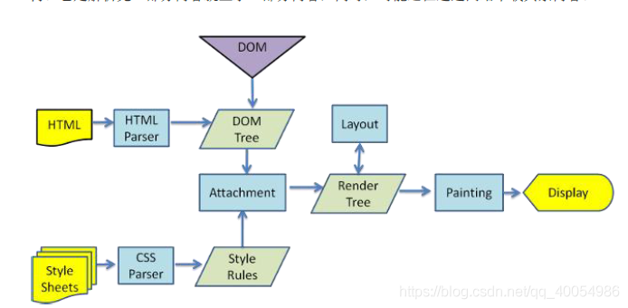
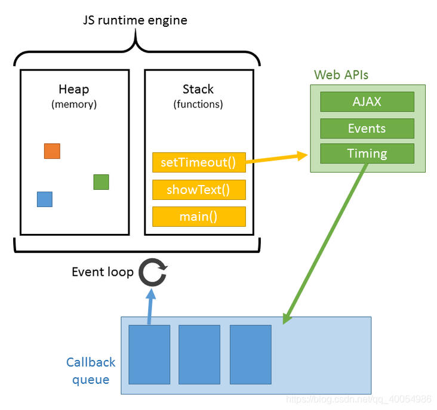

JS的解析是由浏览器中的JS解析引擎完成的。JS是单线程运行，也就是说，在同一个时间内只能做一件事，所有的任务都需要排队，前一个任务结束，后一个任务才能开始。但是又存在某些任务比较耗时，如IO读写等，所以需要一种机制可以先执行排在后面的任务，这就是：同步任务(synchronous)和异步任务(asynchronous)。JS的执行机制就可以看做是一个主线程加上一个任务队列(task queue)。同步任务就是放在主线程上执行的任务，异步任务是放在任务队列中的任务。所有的同步任务在主线程上执行，形成一个执行栈;异步任务有了运行结果就会在任务队列中放置一个事件；脚本运行时先依次运行执行栈，然后会从任务队列里提取事件，运行任务队列中的任务，这个过程是不断重复的，所以又叫做事件循环(Event loop)。

浏览器在解析过程中，如果遇到请求外部资源时，如图像,iconfont,JS等。浏览器将重复1-6过程下载该资源。请求过程是异步的，并不会影响HTML文档进行加载，但是当文档加载过程中遇到JS文件，HTML文档会挂起渲染过程，不仅要等到文档中JS文件加载完毕还要等待解析执行完毕，才会继续HTML的渲染过程。原因是因为JS有可能修改DOM结构，这就意味着JS执行完成前，后续所有资源的下载是没有必要的，这就是JS阻塞后续资源下载的根本原因。CSS文件的加载不影响JS文件的加载，但是却影响JS文件的执行。JS代码执行前浏览器必须保证CSS文件已经下载并加载完毕。
### <font color = blue> 8. 连接结束</font>
四次挥手断开连接
## <font color=red>打开一个网页会使用到哪些协议</font>
<table>	
	<tr>
		<td>过程</td>
		<td>使用的协议</td>
	</tr>
	<tr>
		<td>
		浏览器向web服务器发送一个HTTP请求	</td>
		<td rowspan="4" align="left">
		1. TCP：与服务器建立TCP连接 。<br>
		2. IP：建立TCP协议时，需要发送数据，发送数据在网络层使用IP协议。<br>
		3. OPSF：IP数据包在路由器之间，路由选择使用OPSF协议。<br>
		4. ARP：路由器在与服务器通信时，需要将IP地址转换为MAC地址，需要使用ARP协议。<br>
		5. HTTP：在TCP建立完成后，使用HTTP协议访问网页。
		</td>
	</tr>
	<tr>
		<td>服务器处理请求</td>
	</tr>
	<tr>
		<td>服务器返回一个HTML响应</td>
	</tr>
	<tr>
		<td>浏览器渲染HTML</td>
	</tr>
</table>

## 参考
1. [URI、 URL 和 URN 的区别](https://www.jianshu.com/p/09ac6fc0f8cb)
2. [彻底搞懂浏览器缓存机制](https://www.jiqizhixin.com/articles/2020-07-24-12)
3. [彻底弄懂HTTP缓存机制与原理](https://www.cnblogs.com/chenqf/p/6386163.html)
4. [浏览器缓存看这一篇就够了](https://zhuanlan.zhihu.com/p/60950750)
5. [前端经典面试题: 从输入URL到页面加载发生了什么？](https://segmentfault.com/a/1190000006879700)
6. [从输入 URL 到页面加载完成的过程中都发生了什么事情？](https://www.jianshu.com/p/71cf7f69eca8)
7. [DNS详解](https://www.huaweicloud.com/articles/4504e90ef4f0a4178f22b59281cc3056.html)
8. [干货：DNS何时使用TCP协议，何时使用UDP协议？](http://www.jiangmen.gov.cn/bmpd/jmszwfwsjglj/ztzl/wlxxaq/xxjs/content/post_1858223.html)
# 声明
该文档总结了HTTP相关的一些知识点，大部分内容来自已有博客同时给出了对应原文的连接。归纳在一起主要方便自己今后复习使用，如有侵权请立即联系删除。若有错误也请各位不吝赐教以免误人子弟。