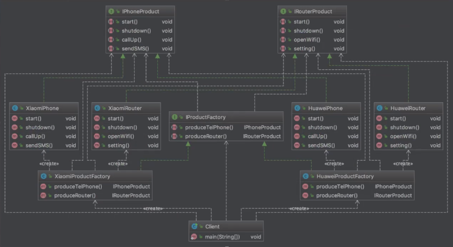

# 1. 设计模式简介

## 1.1  设计模式的目的

1)代码重用性(即:相同功能的代码，不用多次编写)

2)可读性(即:编程规范性，便于其他程序员的阅读和理解)

3)可扩展性(即:当需要增加新的功能时，非常的方便，称为可维护

4)可靠性(即:当我们增加新的功能后，对原来的功能没有影响)

5)使程序呈现**高内聚**，**低耦合**的特性


## 1.2  设计模式的七大原则

1) 单一职责原则

​	对类来说，即一个类只负责一项职责

2) 接口隔离原则

​	客户端不应该依赖它不需要的接口，即一个类对另一个类的依赖应该建立在最小的接口上。如果一个类没有完全用到这个接口的所有方法，则说明违背了接口隔离原则，需要拆接口

3) 依赖倒转原则

​	高层模块不应该依赖底层模块，应该依赖其抽象。总的讲：面向接口编程，抽象的东西稳定些。**依赖关系传递**的三种方式：接口传递，构造方法传递，setter方式传递

4) 里氏替换原则

​	**子类中尽量不要重写父类的方法。**里氏替换原则告诉我们，继承实际上让两个类**耦合性**增强了，在适当的情况下，可以通过聚合，组合，依赖来解决问题.

5) 开闭原则ocp

​	一个软件实体，如类，模块和函数应该对扩展开放，对修改关闭，用抽象构建框架，用实现扩展细节。**使用接口和抽象类**

6) 迪米特法则

​	直接的朋友: 每个对象都会与其他对象有耦合关系，只要两个对象之间有耦合关系,我们就说这两个对象之间是朋友关系。耦合的方式很多，依赖，关联，组合，聚合等。其中，我们**称出现成员变量，方法参数，方法返回值中的类为直接的朋友**，而出现在局部变量中的类不是直接的朋友。也就是说，陌生的类最好不要以局部变量的形式出现在类的内部。

​	只包含**直接朋友**的耦合关系

7) 合成复用原则

​	原则是尽量使用合成/聚合的方式，而不是使用继承

# 2. UML类图


类之间的关系：**依赖、泛化（继承）、实现、关联、聚合、组合**

**依赖**：只要是在类中用到了对方（无论在哪里出现），那么他们就存在依赖关系。

```java
//出现以下任何一种情况都可以说IDCard和Person类有依赖关系
public class IDCard{
  
}
public class Person{
  IDCard idCard; //1. 成员变量
  public void function1(IDCard idCar){ //2. 参数的方式
    
  }
  public IDCard getIDCard(){ //3. 方法返回类型
    
  }
  public void function2(){ 
     IDCard idCard=new IDCard();//4. 在类的方法中使用到了
  }
}
```

**泛化关系**：继承关系，是一种依赖关系的特例

```java
public class Person{}
public class Student extends Person{
  
}
```

**实现**：类实现了接口，是一种依赖关系的特例

```java
public interface Person{

}
public class Student implements Person{
  
}
```

**关联**：关联具有导航性，即双向或单项的关系，

```java
//单向一对一关系
public class IDCard{
  
}
public class Person{
  IDCard idCard; 
}
//双向一对一关系
public class IDCard{
  Person person;
}
public class Person{
  IDCard idCard; 
}
```

**聚合**：表示整体和部分的关系，整体和部分可以分开，具有导航型和多重性，即A类聚合B类，A类聚合一个或多个B的实例

```java
public class Mouse{}//鼠标
  
public class Monitor{}//显示器

public class Computer{//电脑
  Mouse mouse;
  Monitor monitor;
  
  public void setMouse(Mouse mouse){
    mouse=mouse
  }
  public void setMonitor(Monitor monitor){
    monitor=monitor
  }
}
```

**组合**：不可分离的对象，称为组合关系

```java
public class Mouse{}//鼠标
  
public class Monitor{}//显示器

public class Computer{//电脑
  Mouse mouse=new Mouse();
  Monitor monitor=new Mouse();
}
```

# 3. 设计模式

## 3.1 创建型模式（5种）

创建型模式关注点是如何创建对象，其核心思想是要把对象的创建和使用相分离，这样使得两者能相对独立地变换。

### 3.1.1 <font color=red>单例模式</font>

<font color=red>注意：你写的单例模式能避免通过反射和反序列化创建新对象吗</font>

1）单例模式保证了系统内存中该类只存在一个对象，节省了系统资源，对于一些需要频繁创建销毁的对象，使用单例模式可以提亮系统性能
2) 当想实例化一个单例类的时候，必须要记住使用相应的获取对象的方法，而不是使用new
3) 单例模式使用的场景: 需要频繁的进行创建和销毁的对象、创建对象时耗时过多或耗费资源过多(即:重量级对象)，但又经常用到的对象、工具类对象、频繁访问数据库或文件的对象(比如数据源、session工厂等)

- **饿汉式单例**是指在单例类加载的时候就初始化一个对象，不管之后的程序会不会用到。因为显得迫不及待，感觉很饿，所以叫**饿汉式单例**。
- **懒汉式单例**类似**懒加载**，只有程序第一次用到的时候，才开始实例化，所以叫**懒汉式单例**。

1.<font color=red>**饿汉式**</font>

```java
//饿汉式(静态变量)
class Singleton1{
    // 1. 构造器私有化，外部能new
    private Singleton1(){

    }

    //2.本类内部创建对象实例
    private final static Singleton1 instance=new Singleton1();

    //3.提供一个公共的静态方法，返回对象实例
    public static Singleton1 getInstance(){
        return instance;
    }
}
//饿汉式(静态代码块)
class Singleton2{
    // 1. 构造器私有化，外部能new
    private Singleton2(){
    }

    //2.本类内部创建对象实例
    private static Singleton2 instance;

    //在静态代码块中创建单例对象
    static{
        instance=new Singleton2();
    }

    //3.提供一个公共的静态方法，返回对象实例
    public static Singleton2 getInstance(){
        return instance;
    }
}
```

优缺点说明:
1) 优点: 这种写法比较简单，就是在类装载的时候就完成实例化。避免了线程同步问题。
2) 缺点: 在类装载的时候就完成实例化，没有达到Lazy Loading的效果。如果从始至终从未使用过这个实例，则会造成内存的浪费
3) 这种方式基于classloder机制避免了多线程的同步问题，不过，instance在类装载时就实例化，在单例模式中大多数都是调用getlnstance方法，但是导致类装载的原因有很多种，因此不能确定有其他的方式（或者其他的静态方法）导致类装载，这时候初始化instance就没有达到lazy loading的效果
4)结论: 这种单例模式可用，可能造成内存浪费

3.<font color=red>**懒汉式（线程安全）**</font>

```java
//线程安全
class Singleton3{
    private static Singleton3 instance;
    private Singleton3(){
    }
    //提供一个静态的公有方法，当使用到该方法时，才去创建instance
    public static synchronized Singleton3 getInstance(){
        if (instance==null){
            instance=new Singleton3();
        }
        return instance;
    }
}
```

优缺点说明:
1) 解决了线程不安全问题
2) 效率太低了，每个线程在想获得类的实例时候，执行getlnstance()方法都要进行同步。而其实这个方法只执行一次实例化代码就够了，后面的想获得该类实例，直接return就行了。方法进行同步效率太低
3) 结论: 在实际开发中，不推荐使用这种方式

4.<font color=red>**懒汉式（线程安全,双重检查）（面试官最愿意看到的手撸版本）**</font>

```java
//双重检查实现线程安全解决了 线程安全和效率问题
class Singleton4{
    private static volatile Singleton4 instance;
    private Singleton4(){
         //防止反射创建对象
        if (instance!=null){
            throw new RuntimeException("已存在实例");
        }
    }
    //提供一个静态的公有方法，当使用到该方法时，才去创建instance
    public static Singleton4 getInstance(){
        if (instance==null){
            synchronized (Singleton4.class){
                if (instance==null){
                    instance=new Singleton4();
                }
            }
        }
        return instance;
    }
}
//实现了序列化，需要避免反序列化创建对象，重写readResolve()
class Singleton implements Serializable {
    private static volatile Singleton instance;
    private Singleton(){
        //防止反射创建对象
        if (instance!=null){
            throw new RuntimeException("已存在实例");
        }
    }
    //提供一个静态的公有方法，当使用到该方法时，才去创建instance
    public static Singleton getInstance(){
        if (instance==null){
            synchronized (Singleton.class){
                if (instance==null){
                    instance=new Singleton();
                }
            }
        }
        return instance;
    }
    //可以不实现序列化接口，如果非得实现序列化接口，可以重写反序列化方法readResolve()，反序列化时直接返回相关单例对象。
    public Object readResolve() throws ObjectStreamException {
        return instance;
    }
}
```

涉及到了JVM、多线程、锁、volatile、序列化、反射等知识点。

5.<font color=red>**懒汉式（静态内部类）（超级推荐）**</font>

```java
//静态内部类
class Singleton5{
    private static volatile Singleton5 instance;
    
    private Singleton5(){
				//防止反射创建对象
        if (instance!=null){
            throw new RuntimeException("已存在实例");
        }
    }

    //静态内部类	，该类中有一个静态属性Singleton 外部类加载不会导致静态类加载 
    private static class SingletonInstance{
        private static final Singleton5 INSTANCE=new Singleton5();
    }

    public static Singleton5 getInstance(){
        return SingletonInstance.INSTANCE;
    }
}
```

优缺点说明:
1) 这种方式采用了类装载的机制来保证初始化实例时只有一个线程。

2）静态内部类方式在Singleton类被装载时并不会立即实嬴化，而是在需要实例化时，调用getInstance方法，才会装载SingletonInstance类，从而完成Singleton的实例化。

3) 类的静态属性只会在第一次加载类的时候初始化，所以在这里，JVM帮助我们保证了线程的安全性，在类进行初始化时，别的线程是无法进入的。

4) 优点: 避免了线程不安全，利用静态内部类特点实现延迟加载，效率高

6.<font color=red>**枚举（超级推荐）（优雅的解决了反序列化和反射问题）**</font>

```java
public class SingletonTest04 {
    public static void main(String[] args) {
        Singleton6 instance = Singleton6.INSTANCE;
        instance.method();
    }
}
enum Singleton6{
    INSTANCE;
    public void method(){
        System.out.println("优雅");
    }
}
```

优缺点说明:
1) 这借助JDK1.5中添加的枚举来实现单例模式。不仅能避免多线程同步问题，而且**还能防止反序列化重新创建新的对象**。

2) 这种方式是Effective Java作者JoshBloch提倡的方式

3）通过反编译的结果我们也可以看出，枚举类创建对象也是在静态代码块中完成的，也就是类加载阶段。所以说**枚举类型实现的单例模式应该属于饿汉式单例。**

扩展：

> #### 1. Java中的线程安全
>
> - Java线程安全：狭义地认为是多线程之间共享数据的访问。
> - Java语言中各种操作共享的数据有5种类型：不可变、绝对线程安全、相对线程安全、线程兼容、线程独立
>
> ① **不可变（Immutable）** 的对象**一定是线程安全的**，不需要再采取任何的线程安全保障措施。
>
> 常见的不可变类型
>
> 1. `final`关键字修饰的基本数据类型
> 2. 枚举类型、`String`类型
> 3. 常见的包装类型：`Short`、`Integer`、`Long`、`Float`、`Double`、`Byte`、`Character`等
> 4. 大数据类型：`BigInteger`、`BigDecimal`
>
> 


### 3.1.2 抽象工厂模式

定义︰抽象工厂（工厂的工厂）模式提供了一个创建一系列相关或者相互依赖对象的接口，无需指定它们具体的类（抽象工厂规定了工厂可以生产的产品）

适用场景:

- 客户端（应用层)不依赖于产品类实例如何被创建、实现等细节
- 强调一系列相关的产品对象(属于同一产品族）一起使用创建对象需要大量的重复代码
- 提供一个产品类的库，所有的产品以同样的接口出现，从而使得客户端不依赖于具体的实现

优点:

- 具体产品在应用层的代码隔离，无需关心创建的细节
- 将一个系列的产品统一到一起创建

缺点:

- 规定了所有可能被创建的产品集合，产品簇中扩展新的产品困难;
- 增加了系统的抽象性和理解难度




```java
//1.两个产品接口
//手机产品接口
public interface IphoneProduct {
    void start();
    void shutdown();
}
//路由器产品接口
public interface IRouterProduct {
    void openWiFi();
}

//2.具体的产品实现产品接口
public class XiaoMiPhone implements IphoneProduct{
    @Override
    public void start() {
        System.out.println("打开小米手机");
    }
    @Override
    public void shutdown() {
        System.out.println("关闭小米手机");
    }
}
public class HuaWeiPhone implements IphoneProduct{
    @Override
    public void start() {
        System.out.println("打开华为手机");
    }

    @Override
    public void shutdown() {
        System.out.println("关闭华为手机");
    }
}
public class XiaoMiRouter implements IRouterProduct{
    @Override
    public void openWiFi() {
        System.out.println("小米打开WIFI");
    }
}
public class HuaWeiRouter implements IRouterProduct{
    @Override
    public void openWiFi() {
        System.out.println("华为打开WIFI");
    }
}

//3.抽象工厂创建所有的产品
//抽象产品工厂
public interface ProductFactory {
		//生产手机
    IphoneProduct phoneProduct();
    //生产路由器
  	IRouterProduct routerProduct();
}

//4.具体的工厂
//小米工厂
public class XiaoMiFactory implements ProductFactory{
    @Override
    public IphoneProduct phoneProduct() {
        return new XiaoMiPhone();
    }

    @Override
    public IRouterProduct routerProduct() {
        return new XiaoMiRouter();
    }
}
//华为工厂
public class HuaWeiFactory implements ProductFactory{
    @Override
    public IphoneProduct phoneProduct() {
        return new HuaWeiPhone();
    }
    @Override
    public IRouterProduct routerProduct() {
        return new HuaWeiRouter();
    }
}
```


### 3.1.3 原型模式

原型模式，即Prototype，是指创建新对象的时候，根据现有的一个原型来创建。

```java
// 原型:
String[] original = { "Apple", "Pear", "Banana" };
// 新对象:
String[] copy = Arrays.copyOf(original, original.length);


```

对于普通类，我们如何实现原型拷贝？Java的`Object`提供了一个`clone()`方法，它的意图就是复制一个新的对象出来，我们需要实现一个`Cloneable`接口来标识一个对象是“可复制”的：

```java
public class Student implements Cloneable {
    private int id;
    private String name;
    private int score;

    // 复制新对象并返回:
    public Object clone() {
        Student std = new Student();
        std.id = this.id;
        std.name = this.name;
        std.score = this.score;
        return std;
    }
}
```

原型模式应用不是很广泛，因为很多实例会持有类似文件、Socket这样的资源，而这些资源是无法复制给另一个对象共享的，只有存储简单类型的“值”对象可以复制。

### 3.1.4 建造者模式

当我们使用Builder的时候，一般来说，是因为创建这个对象的步骤比较多，每个步骤都需要一个零部件，最终组合成一个完整的对象。使用Builder模式时，适用于创建的对象比较复杂，最好一步一步创建出“零件”，最后再装配起来。

### 3.1.5 <font color=red>工厂模式</font>

**允许创建产品的代码独立地变换，而不会影响到调用方。**

<font color=red>**简单工厂模式（静态工厂模式）**</font>

基本介绍
1) 简单工厂模式是属于创建型模式，是工厂模式的一种。**简单工厂模式是由一个工厂对象决定创建出哪一种产品类的实例。**简单工厂模式是工厂模式家族中最简单实用的模式
2) 简单工厂模式: 定义了一个创建对象的类，由这个类来**封装实例化对象的行为**(代码)
3) 在软件开发中，当我们会用到大量的创建某种、某类或者某批对象时，就会使用到工厂模式.


```java
public interface Car {
    void name();
}

public class Tesla implements Car{
    @Override
    public void name() {
        System.out.println("特斯拉");
    }
}

public class WuLing implements Car{
    @Override
    public void name() {
        System.out.println("五菱宏光");
    }
}

public class CarFactory {
    public static Car getCar(String car){
        if(car.equals("五菱宏光")){
            return new WuLing();
        }else if(car.equals("特斯拉")){
            return new Tesla();
        }
        return null;
    }
}

public class Customer {
    public static void main(String[] args) {
        Car car1 = CarFactory.getCar("五菱宏光");
        Car car2 = CarFactory.getCar("特斯拉");
    }
}
```

<font color=red>**工厂方法模式（工厂方法模式）**</font>

工厂方法是指定义工厂接口和产品接口


```java
public interface Car {
    void name();
}

//工厂方法模式
public interface CarFactory {
    Car getCar();
}

public class Tesla implements Car{
    @Override
    public void name() {
        System.out.println("特斯拉");
    }
}

public class TeslaFactory implements CarFactory{
    @Override
    public Car getCar() {
        return new Tesla();
    }
}

public class WuLing implements Car{
    @Override
    public void name() {
        System.out.println("五菱宏光");
    }
}

public class WuLingFactory implements CarFactory{
    @Override
    public Car getCar() {
        return new WuLing();
    }
}

public class Customer {
    public static void main(String[] args) {
        Car car1 = new WuLingFactory().getCar();
        Car car2 = new TeslaFactory().getCar();

        car1.name();
        car2.name();
    }
}
```

<font color=red>**抽象工厂模式**</font>

抽象工厂模式是为了让创建工厂和一组产品与使用相分离，并可以随时切换到另一个工厂以及另一组产品

抽象工厂模式实现的关键点是定义工厂接口和产品接口

## 3.2 结构性模式（7种）

结构型模式主要涉及如何组合各种对象以便获得更好、更灵活的结构。虽然面向对象的继承机制提供了最基本的子类扩展父类的功能，但结构型模式不仅仅简单地使用继承，而更多地通过组合与运行期的动态组合来实现更灵活的功能。

### 3.2.1 适配器模式


```java
//要被适配的类
public class Net {
    public void request(){
        System.out.println("上网");
    }
}

public class UsbAdapter implements Usb{
  //引用待转换的接口,比如callable
    private Net net;

    public UsbAdapter(Net net) {
        this.net = net;
    }

    @Override
    public void handleRequset() {
        net.request();
    }
}

//接口转换器的接口实现
public interface Usb {
    void handleRequset();
}

//客户端类：向上网插不上网线
public class Computer{
    public void net(Usb usb){
        //上网的具体实现，找一个转接头
        adapter.handleRequset();
    }

    public static void main(String[] args) {
        Computer computer = new Computer(); //电脑
        Net net = new Net();  //网线
        UsbAdapter adapter = new UsbAdapter(net);  //转接器

        computer.net(adapter);

    }
}
```

编写一个Adapter的步骤如下：

1. 实现目标接口，如`Runnable`；
2. 内部持有一个待转换接口的引用，如：通过字段持有`Callable`接口；
3. 在目标接口的实现方法内部，调用待转换接口的方法。

### 3.2.2 桥接模式

桥接模式就是为了避免直接继承带来的子类爆炸。

```java
//品牌
public interface Brand {
    void info();
}
public class Apple implements Brand{
    @Override
    public void info() {
        System.out.println("Apple");
    }
}
public class lenovo implements Brand {
    @Override
    public void info() {
        System.out.println("联想");
    }
}

//产品
public abstract class Computer {

    //组合，品牌，桥
    protected Brand brand;

    public Computer(Brand brand) {
        this.brand = brand;
    }

    public void info(){
        brand.info();
    }
}

//具体的产品
class Desktop extends Computer{

    public Desktop(Brand brand) {
        super(brand);
    }

    @Override
    public void info() {
        super.info();
        System.out.println("台式机");
    }
}
class Laptop extends Computer{

    public Laptop(Brand brand) {
        super(brand);
    }

    @Override
    public void info() {
        super.info();
        System.out.println("笔记本");
    }
}


public class DemoTest {
    public static void main(String[] args) {
        Computer computer = new Laptop(new Apple());
        computer.info();

        Desktop desktop = new Desktop(new lenovo());
        desktop.info();
    }
}
```


### 3.2.3 <font color=red>装饰模式</font>

*动态地给一个对象添加一些额外的职责。就增加功能来说，相比生成子类更为灵活。*装饰器（Decorator）模式，是一种在**运行期动态**给某个对象的实例增加功能的方法。Decorator模式有什么好处？它实际上把核心功能和附加功能给分开了。

### 3.2.4 组合模式

*将对象组合成树形结构以表示“部分-整体”的层次结构，使得用户对单个对象和组合对象的使用具有一致性*

### 3.2.5 外观模式

*为子系统中的一组接口提供一个一致的界面。Facade模式定义了一个高层接口，这个接口使得这一子系统更加容易使用。*

Facade模式是为了给客户端提供一个统一入口，并对外屏蔽内部子系统的调用细节。

### 3.2.6 享元模式

*运用共享技术有效地支持大量细粒度的对象*。享元（Flyweight）的核心思想很简单：如果一个对象实例一经创建就不可变，那么反复创建相同的实例就没有必要，直接向调用方返回一个共享的实例就行，这样即节省内存，又可以减少创建对象的过程，提高运行速度。

在实际应用中，享元模式主要应用于缓存，即客户端如果重复请求某些对象，不必每次查询数据库或者读取文件，而是直接返回内存中缓存的数据。

享元模式的设计思想是尽量复用已创建的对象，常用于工厂方法内部的优化。

### 3.2.7 <font color=red>代理模式</font>

**动态代理**

动态代理的代理类是动态生成的，不是我们自己写好的

动态代理分为两大类：基于接口的动态代理，基于类的动态代理

- 基于接口：JDK动态代理 Proxy(类，代理)， InvocationHandler(接口，调用处理程序)
- 基于类：cglib
- java字节码实现: javassist 

```java
//处理方法，用这个类自动生成代理类
public class ProxyInvocationHandler implements InvocationHandler {

    //被代理的接口
    private Object target;

    public void setTarget(Object target) {
        this.target = target;
    }

    //生成得到代理对象
    public Object getProxy(){
     
        return Proxy.newProxyInstance(this.getClass().getClassLoader(),
                target.getClass().getInterfaces(),this);
    }

    //处理代理实例，并返回结果
    @Override
    public Object invoke(Object proxy, Method method, Object[] args) throws Throwable {
        //动态代理的本质就是使用反射机制实现
        log(method.getName());
        Object result= method.invoke(target,args);
        return result;
    }
  
    public void log(String msg){
        System.out.println("[Debug] 使用了"+ msg +"方法");
    }
}

public class Client {
    public static void main(String[] args) {
        //真实角色
        UserServiceImpl userService=new UserServiceImpl();

        //代理处理对象
        ProxyInvocationHandler pih= new ProxyInvocationHandler();
        //设置要代理的对象
        pih.setTarget(userService);
      
        //动态生成代理类
        UserService proxy = (UserService) pih.getProxy();

        proxy.delete();
    }
}
```

**与装饰器模式的区别**：

举个例子说明两者不同之处，代理和装饰其实从另一个角度更容易去理解两个模式的区别：**代理更多的是强调对对象的访问控制**，比如说，访问A对象的查询功能时，访问B对象的更新功能时，访问C对象的删除功能时，都需要判断对象是否登陆，那么我需要将判断用户是否登陆的功能抽提出来，并对A对象、B对象和C对象进行代理，使访问它们时都需要去判断用户是否登陆，简单地说就是**将某个控制访问权限应用到多个对象上**；而**装饰器更多的强调给对象加强功能**，比如说要给只会唱歌的A对象添加跳舞功能，添加说唱功能等，简单地说就是将多个功能附加在一个对象上。

所以，**代理模式注重的是对对象的某一功能的流程把控和辅助**，它可以控制对象做某些事，重心是为了借用对象的功能完成某一流程，而非对象功能如何。而**装饰模式注重的是对对象功能的扩展，**不关心外界如何调用，只注重对对象功能加强，装饰后还是对象本身。 


## 3.3 行为型模式（11种）

### 3.3.1 <font color=red>观察者模式</font>

*定义对象间的一种一对多的依赖关系，当一个对象的状态发生改变时，所有依赖于它的对象都得到通知并被自动更新。*

观察者模式（Observer）又称发布-订阅模式（Publish-Subscribe：Pub/Sub）。它是一种通知机制，让发送通知的一方（被观察方）和接收通知的一方（观察者）能彼此分离，互不影响。

### 3.3.2 责任链模式

*使多个对象都有机会处理请求，从而避免请求的发送者和接收者之间的耦合关系。将这些对象连成一条链，并沿着这条链传递该请求，直到有一个对象处理它为止。*

### 3.3.3 命令模式

*将一个请求封装为一个对象，从而使你可用不同的请求对客户进行参数化，对请求排队或记录请求日志，以及支持可撤销的操作。*

